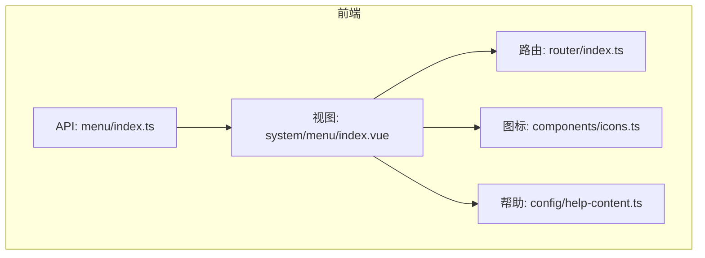
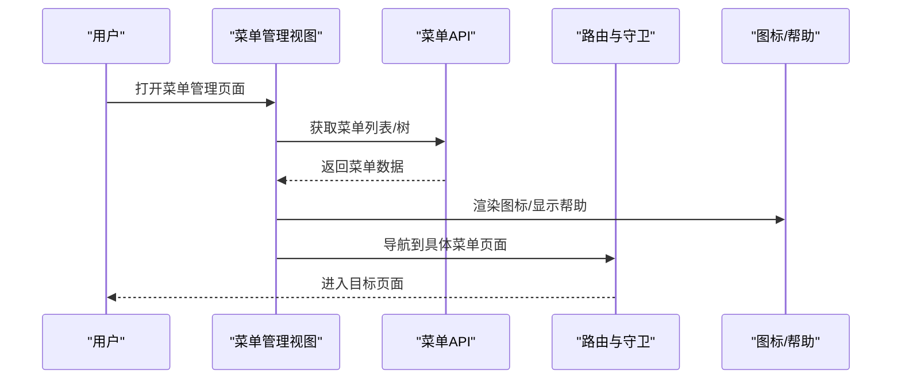
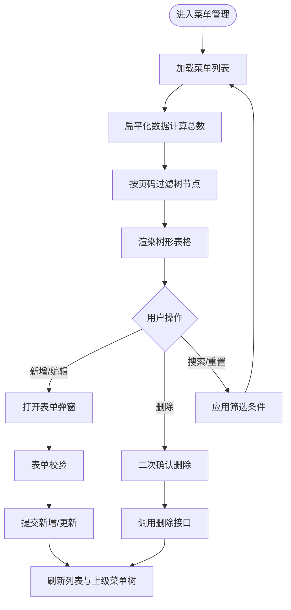
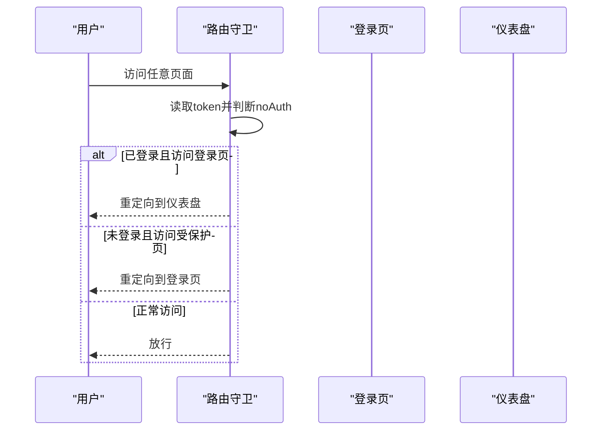
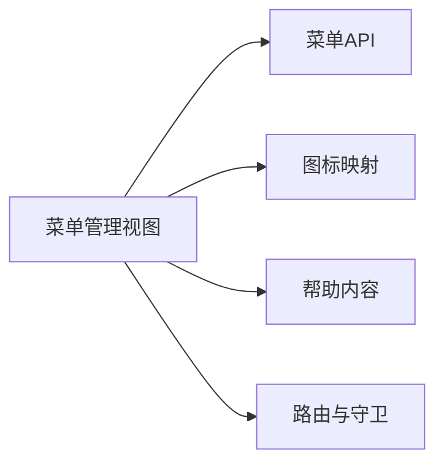
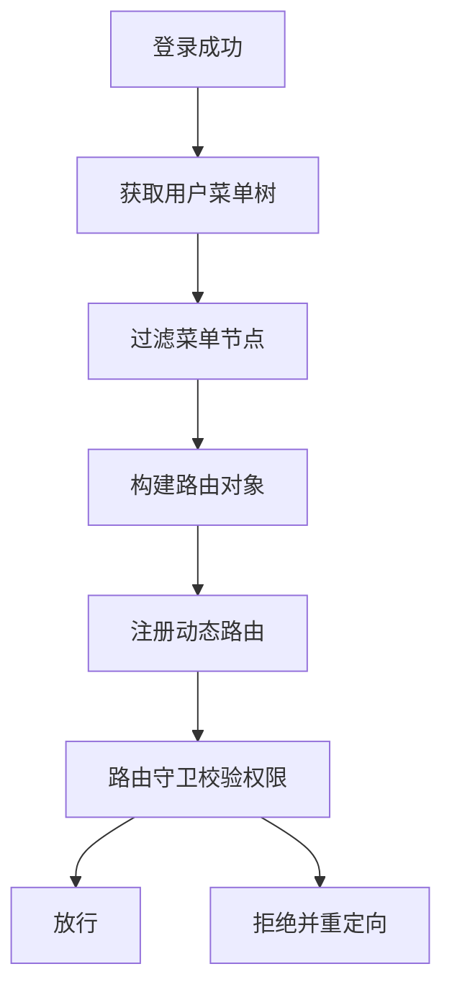

# 菜单管理

<cite>
**本文引用的文件**   
- [class_record_admin_front/src/api/menu/index.ts](file://class_record_admin_front/src/api/menu/index.ts)
- [class_record_admin_front/src/views/system/menu/index.vue](file://class_record_admin_front/src/views/system/menu/index.vue)
- [class_record_admin_front/src/router/index.ts](file://class_record_admin_front/src/router/index.ts)
- [class_record_admin_front/src/components/icons.ts](file://class_record_admin_front/src/components/icons.ts)
- [class_record_admin_front/src/config/help-content.ts](file://class_record_admin_front/src/config/help-content.ts)
- [class_times_record/src/types/menu.d.ts](file://class_times_record/src/types/menu.d.ts)
</cite>

## 目录
1. [简介](#简介)
2. [项目结构](#项目结构)
3. [核心组件](#核心组件)
4. [架构总览](#架构总览)
5. [详细组件分析](#详细组件分析)
6. [依赖分析](#依赖分析)
7. [性能考虑](#性能考虑)
8. [故障排查指南](#故障排查指南)
9. [结论](#结论)
10. [附录](#附录)

## 简介
本章节聚焦“菜单管理”模块，覆盖以下关键能力：
- 菜单层级结构管理：支持目录、菜单、按钮、外链四类节点，提供树形展示与增删改查。
- 动态路由生成：基于后端返回的菜单数据构建前端路由，实现按权限动态加载页面。
- 前端权限控制：通过路由守卫与权限标识（perms）进行访问控制。
- 图标配置与排序：支持图标选择与排序字段，影响渲染顺序与视觉呈现。
- 显示隐藏：通过状态字段控制菜单可见性。
- 角色权限映射：结合角色与菜单关系，实现用户视角的菜单过滤。
- 缓存机制：对菜单数据进行本地缓存，减少重复请求。
- API 调用示例：提供完整的接口调用流程说明，包括树构建、权限过滤、动态路由注册等。
- 性能优化与扩展建议：针对大数据量菜单场景的性能策略与可扩展设计。

## 项目结构
菜单管理相关的前端代码主要分布在以下位置：
- API 层：封装菜单相关的 HTTP 接口调用。
- 视图层：提供菜单管理的 UI 交互与业务逻辑。
- 路由层：定义静态路由与全局守卫，作为动态路由的基础骨架。
- 工具与配置：图标映射、帮助内容等辅助资源。

图表来源
- [class_record_admin_front/src/api/menu/index.ts](file://class_record_admin_front/src/api/menu/index.ts)
- [class_record_admin_front/src/views/system/menu/index.vue](file://class_record_admin_front/src/views/system/menu/index.vue)
- [class_record_admin_front/src/router/index.ts](file://class_record_admin_front/src/router/index.ts)
- [class_record_admin_front/src/components/icons.ts](file://class_record_admin_front/src/components/icons.ts)
- [class_record_admin_front/src/config/help-content.ts](file://class_record_admin_front/src/config/help-content.ts)

章节来源
- [class_record_admin_front/src/api/menu/index.ts](file://class_record_admin_front/src/api/menu/index.ts)
- [class_record_admin_front/src/views/system/menu/index.vue](file://class_record_admin_front/src/views/system/menu/index.vue)
- [class_record_admin_front/src/router/index.ts](file://class_record_admin_front/src/router/index.ts)
- [class_record_admin_front/src/components/icons.ts](file://class_record_admin_front/src/components/icons.ts)
- [class_record_admin_front/src/config/help-content.ts](file://class_record_admin_front/src/config/help-content.ts)

## 核心组件
- 菜单 API 封装
  - 列表查询：获取扁平或树形菜单数据，用于表格展示与筛选。
  - 树形查询：获取完整树结构，用于上级菜单选择器。
  - 新增/更新/删除：完成菜单节点的 CRUD 操作。
  - 用户菜单树：根据当前用户权限返回其可访问的菜单树。
- 菜单管理视图
  - 搜索与分页：支持按名称、类型、状态筛选，并对树形数据进行前端分页。
  - 树形表格：展示层级结构，支持展开/折叠、排序、状态标签。
  - 表单弹窗：新增/编辑菜单，包含上级菜单选择、图标选择、路径/组件、权限标识、排序、状态等。
  - 图标选择面板：从预置图标集中选择并预览。
- 路由与守卫
  - 基础路由：定义登录、布局容器及若干系统/业务页面。
  - 全局守卫：校验登录态，未登录跳转登录页；已登录访问登录页重定向至仪表盘。
- 图标与帮助
  - 图标映射：将图标名称映射为组件，供菜单项渲染。
  - 帮助内容：在菜单管理页面提供使用说明。

章节来源
- [class_record_admin_front/src/api/menu/index.ts](file://class_record_admin_front/src/api/menu/index.ts)
- [class_record_admin_front/src/views/system/menu/index.vue](file://class_record_admin_front/src/views/system/menu/index.vue)
- [class_record_admin_front/src/router/index.ts](file://class_record_admin_front/src/router/index.ts)
- [class_record_admin_front/src/components/icons.ts](file://class_record_admin_front/src/components/icons.ts)
- [class_record_admin_front/src/config/help-content.ts](file://class_record_admin_front/src/config/help-content.ts)

## 架构总览
下图展示了菜单管理在前端的整体交互流程：视图层调用 API 获取菜单数据，渲染树形表格与表单；路由层提供基础路由与守卫；图标与帮助模块提供辅助能力。

图表来源
- [class_record_admin_front/src/views/system/menu/index.vue](file://class_record_admin_front/src/views/system/menu/index.vue)
- [class_record_admin_front/src/api/menu/index.ts](file://class_record_admin_front/src/api/menu/index.ts)
- [class_record_admin_front/src/router/index.ts](file://class_record_admin_front/src/router/index.ts)
- [class_record_admin_front/src/components/icons.ts](file://class_record_admin_front/src/components/icons.ts)
- [class_record_admin_front/src/config/help-content.ts](file://class_record_admin_front/src/config/help-content.ts)

## 详细组件分析

### 菜单 API 封装
- 接口清单
  - 列表查询：GET/POST /admin/menu/list
  - 树形查询：GET/POST /admin/menu/tree
  - 新增：POST /admin/menu/insert
  - 更新：POST /admin/menu/update
  - 删除：POST /admin/menu/delete
  - 用户菜单树：POST /admin/menu/user_tree
- 参数与返回
  - 列表/树形查询支持按名称、类型、状态筛选，返回菜单数组。
  - 用户菜单树返回当前用户可访问的菜单树，用于权限过滤与动态路由构建。
- 错误处理
  - 统一由请求拦截器处理异常，视图层无需重复捕获。

章节来源
- [class_record_admin_front/src/api/menu/index.ts](file://class_record_admin_front/src/api/menu/index.ts)

### 菜单管理视图
- 数据结构与分页
  - 使用树形结构存储菜单数据，并通过函数将其扁平化以计算总数和分页范围。
  - 前端分页后，再对树进行过滤，仅保留当前页涉及的节点及其必要父节点。
- 搜索与重置
  - 支持按菜单名称、类型、状态筛选，重置时清空条件并回到第一页。
- 树形表格
  - 展示字段：名称、图标、类型、路由、权限标识、排序、状态。
  - 操作：编辑、新增子菜单（非按钮）、删除（二次确认）。
- 表单弹窗
  - 上级菜单：使用树形选择器，仅允许选择目录类型作为父级。
  - 菜单类型：目录、菜单、按钮、外链。
  - 图标：支持输入图标标识与可视化选择面板，提供预览与清空。
  - 路由/组件：根据类型决定是否显示路径与组件字段。
  - 权限标识：用于前端权限判断与按钮级控制。
  - 排序与状态：数值排序与开关切换。
- 提交与刷新
  - 新增/更新成功后提示并刷新列表与上级菜单树。
  - 删除成功后提示并刷新列表与上级菜单树。

图表来源
- [class_record_admin_front/src/views/system/menu/index.vue](file://class_record_admin_front/src/views/system/menu/index.vue)

章节来源
- [class_record_admin_front/src/views/system/menu/index.vue](file://class_record_admin_front/src/views/system/menu/index.vue)

### 路由与守卫
- 基础路由
  - 登录页：标记为免认证。
  - 布局容器：作为所有受保护页面的父级，默认重定向到仪表盘。
  - 系统管理与业务管理页面：均挂载于布局容器下，附带标题与图标元信息。
- 全局守卫
  - beforeEach：启动进度条；检查 token；若目标路由标记 noAuth 且已登录则重定向到仪表盘；否则未登录跳转登录页。
  - afterEach：结束进度条。

图表来源
- [class_record_admin_front/src/router/index.ts](file://class_record_admin_front/src/router/index.ts)

章节来源
- [class_record_admin_front/src/router/index.ts](file://class_record_admin_front/src/router/index.ts)

### 图标与帮助
- 图标映射
  - 提供图标名称到组件的映射，便于在菜单项中渲染图标。
  - 支持在表单中选择图标并在预览区域即时显示。
- 帮助内容
  - 在菜单管理页面顶部提供帮助入口，说明菜单类型、父子关系约束、外链行为等。

章节来源
- [class_record_admin_front/src/components/icons.ts](file://class_record_admin_front/src/components/icons.ts)
- [class_record_admin_front/src/config/help-content.ts](file://class_record_admin_front/src/config/help-content.ts)

### 数据类型参考
- 移动端侧菜单类型定义（参考）
  - 包含菜单项基本属性：id、名称、图标、路径、排序、可见性等。
  - 列表响应包含总数与菜单数组。
  - 查询请求包含角色ID、分页参数。

章节来源
- [class_times_record/src/types/menu.d.ts](file://class_times_record/src/types/menu.d.ts)

## 依赖分析
- 组件耦合
  - 视图层依赖 API 层进行数据交互，依赖图标与帮助模块进行渲染与提示。
  - 路由层独立于视图层，但为菜单导航提供基础框架。
- 外部依赖
  - Element Plus 组件库：表格、表单、对话框、分页、消息提示等。
  - Vue Router：路由与守卫。
  - NProgress：页面切换进度条。
- 潜在循环依赖
  - 当前结构清晰，未见循环导入风险。

图表来源
- [class_record_admin_front/src/views/system/menu/index.vue](file://class_record_admin_front/src/views/system/menu/index.vue)
- [class_record_admin_front/src/api/menu/index.ts](file://class_record_admin_front/src/api/menu/index.ts)
- [class_record_admin_front/src/components/icons.ts](file://class_record_admin_front/src/components/icons.ts)
- [class_record_admin_front/src/config/help-content.ts](file://class_record_admin_front/src/config/help-content.ts)
- [class_record_admin_front/src/router/index.ts](file://class_record_admin_front/src/router/index.ts)

章节来源
- [class_record_admin_front/src/views/system/menu/index.vue](file://class_record_admin_front/src/views/system/menu/index.vue)
- [class_record_admin_front/src/api/menu/index.ts](file://class_record_admin_front/src/api/menu/index.ts)
- [class_record_admin_front/src/components/icons.ts](file://class_record_admin_front/src/components/icons.ts)
- [class_record_admin_front/src/config/help-content.ts](file://class_record_admin_front/src/config/help-content.ts)
- [class_record_admin_front/src/router/index.ts](file://class_record_admin_front/src/router/index.ts)

## 性能考虑
- 大数据量菜单
  - 优先采用后端分页与懒加载，避免一次性加载全量树。
  - 前端分页仅适用于中小规模数据；大规模数据应改为服务端分页。
- 树形渲染优化
  - 按需展开：仅在需要时展开子节点，减少 DOM 节点数量。
  - 虚拟滚动：对于超长列表可使用虚拟滚动方案。
- 缓存策略
  - 本地缓存：将用户菜单树与常用字典数据缓存到 localStorage/sessionStorage，设置合理过期时间。
  - 内存缓存：在应用生命周期内缓存菜单树，避免频繁请求。
- 路由懒加载
  - 保持路由组件的动态导入，减少首屏体积。
- 图标与资源
  - 图标按需加载，避免一次性引入全部图标资源。
- 防抖与节流
  - 搜索与高频操作使用防抖/节流，降低不必要的请求与渲染。

[本节为通用性能建议，不直接分析具体文件]

## 故障排查指南
- 无法加载菜单
  - 检查网络请求是否成功，查看 API 返回结构与字段是否符合预期。
  - 确认 token 是否存在且有效，必要时重新登录。
- 菜单不显示或权限不足
  - 核对用户角色与菜单权限映射是否正确。
  - 检查 perms 字段是否与前端权限控制一致。
- 图标不显示
  - 确认图标名称是否在图标映射中存在。
  - 检查表单中 icon 字段是否正确保存。
- 路由跳转失败
  - 检查路由 path 与组件路径是否匹配。
  - 确认路由守卫是否放行，无 noAuth 标记的页面需登录态。
- 删除失败
  - 检查是否有子菜单引用该节点，必要时先删除子节点或启用软删除。

章节来源
- [class_record_admin_front/src/views/system/menu/index.vue](file://class_record_admin_front/src/views/system/menu/index.vue)
- [class_record_admin_front/src/router/index.ts](file://class_record_admin_front/src/router/index.ts)
- [class_record_admin_front/src/components/icons.ts](file://class_record_admin_front/src/components/icons.ts)

## 结论
菜单管理模块通过清晰的 API 封装与视图层交互，实现了菜单的层级管理、图标配置、排序与显示隐藏等核心功能。结合路由守卫与权限标识，可实现前端访问控制。建议在大数据量场景下采用服务端分页与懒加载，并结合本地与内存缓存提升性能。同时，完善角色-菜单映射与权限校验，确保系统的可扩展性与安全性。

[本节为总结性内容，不直接分析具体文件]

## 附录

### API 接口调用示例（步骤说明）
- 获取菜单列表
  - 调用列表接口，传入名称、类型、状态等筛选条件。
  - 接收返回的菜单数组，用于表格展示与分页计算。
- 获取菜单树
  - 调用树形接口，用于上级菜单选择器的数据源。
- 新增菜单
  - 填写表单并提交，后端返回成功后刷新列表与上级菜单树。
- 更新菜单
  - 编辑现有菜单并提交，成功后刷新数据。
- 删除菜单
  - 二次确认后调用删除接口，成功后刷新数据。
- 获取用户菜单树
  - 登录后调用用户菜单树接口，用于权限过滤与动态路由构建。

章节来源
- [class_record_admin_front/src/api/menu/index.ts](file://class_record_admin_front/src/api/menu/index.ts)
- [class_record_admin_front/src/views/system/menu/index.vue](file://class_record_admin_front/src/views/system/menu/index.vue)

### 动态路由与权限控制（概念流程）
- 登录成功后获取用户菜单树。
- 遍历菜单树，过滤出类型为“菜单”的节点。
- 将每个菜单节点转换为路由对象，使用懒加载方式注册到路由实例。
- 在路由守卫中校验目标路由的权限标识，若无权限则拒绝访问或重定向。

[此图为概念流程图，不直接映射具体源码文件]