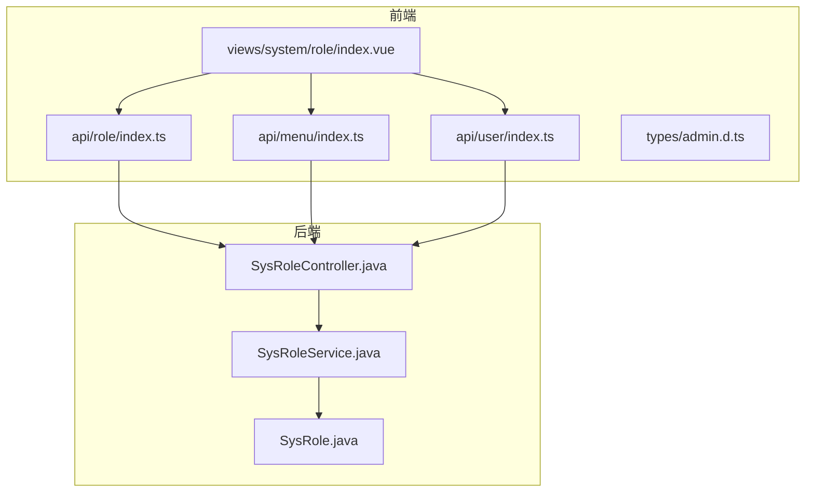
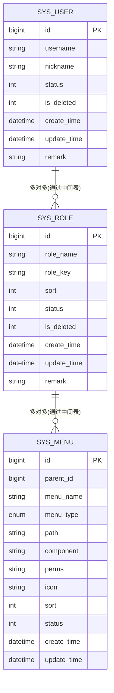
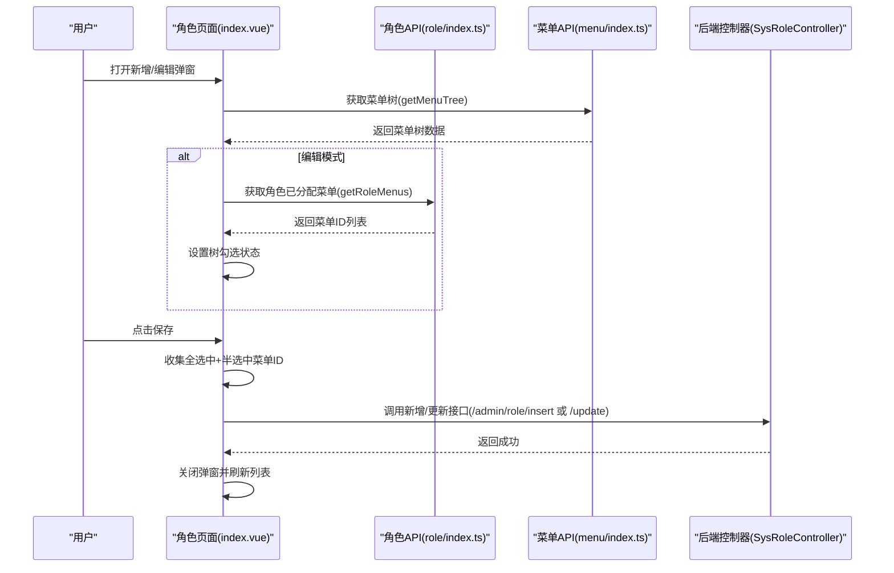
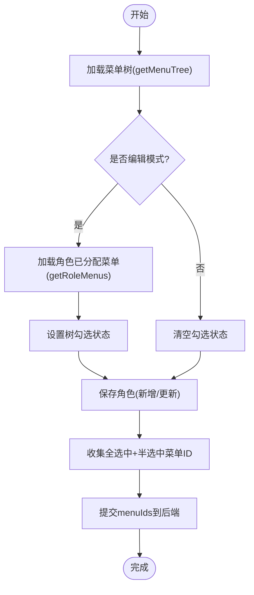
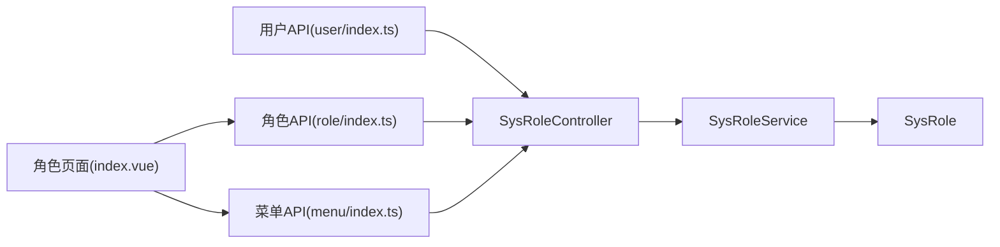

# 角色管理

<cite>
**本文引用的文件**
- [class_record_admin_front/src/api/role/index.ts](file://class_record_admin_front/src/api/role/index.ts)
- [class_record_admin_front/src/api/menu/index.ts](file://class_record_admin_front/src/api/menu/index.ts)
- [class_record_admin_front/src/api/user/index.ts](file://class_record_admin_front/src/api/user/index.ts)
- [class_record_admin_front/src/views/system/role/index.vue](file://class_record_admin_front/src/views/system/role/index.vue)
- [class_record_admin_front/src/types/admin.d.ts](file://class_record_admin_front/src/types/admin.d.ts)
- [class_times_record_back/admin-service/src/main/java/com/shiroko/controller/SysRoleController.java](file://class_times_record_back/admin-service/src/main/java/com/shiroko/controller/SysRoleController.java)
- [class_times_record_back/common/src/main/java/com/shiroko/service/SysRoleService.java](file://class_times_record_back/common/src/main/java/com/shiroko/service/SysRoleService.java)
- [class_times_record_back/common/src/main/java/com/shiroko/repository/entity/SysRole.java](file://class_times_record_back/common/src/main/java/com/shiroko/repository/entity/SysRole.java)
</cite>

## 目录
1. [简介](#简介)
2. [项目结构](#项目结构)
3. [核心组件](#核心组件)
4. [架构总览](#架构总览)
5. [详细组件分析](#详细组件分析)
6. [依赖分析](#依赖分析)
7. [性能考虑](#性能考虑)
8. [故障排查指南](#故障排查指南)
9. [结论](#结论)
10. [附录：API 接口与调用示例](#附录api-接口与调用示例)

## 简介
本章节面向“角色管理”模块，围绕 RBAC（基于角色的访问控制）权限模型，系统化梳理角色 CRUD、菜单权限分配、用户角色关联等核心能力。文档涵盖：
- 角色列表查询、新增、编辑、删除
- 菜单树形结构与权限勾选（含半选状态）
- 批量权限分配与保存
- 用户角色授权与回显
- 权限冲突检测与解决方案
- 完整 API 调用示例（请求路径、参数、响应要点）

## 项目结构
前端采用 Vue + Element Plus 实现角色管理页面，通过 api 层封装 HTTP 请求；后端以 Spring Boot 提供 RESTful 接口，服务层定义统一能力边界，实体层承载数据模型。

图表来源
- [class_record_admin_front/src/views/system/role/index.vue:1-312](file://class_record_admin_front/src/views/system/role/index.vue#L1-L312)
- [class_record_admin_front/src/api/role/index.ts:1-26](file://class_record_admin_front/src/api/role/index.ts#L1-L26)
- [class_record_admin_front/src/api/menu/index.ts:1-26](file://class_record_admin_front/src/api/menu/index.ts#L1-L26)
- [class_record_admin_front/src/api/user/index.ts:1-30](file://class_record_admin_front/src/api/user/index.ts#L1-L30)
- [class_record_admin_front/src/types/admin.d.ts:1-263](file://class_record_admin_front/src/types/admin.d.ts#L1-L263)
- [class_times_record_back/admin-service/src/main/java/com/shiroko/controller/SysRoleController.java:1-69](file://class_times_record_back/admin-service/src/main/java/com/shiroko/controller/SysRoleController.java#L1-L69)
- [class_times_record_back/common/src/main/java/com/shiroko/service/SysRoleService.java:1-31](file://class_times_record_back/common/src/main/java/com/shiroko/service/SysRoleService.java#L1-L31)
- [class_times_record_back/common/src/main/java/com/shiroko/repository/entity/SysRole.java:1-42](file://class_times_record_back/common/src/main/java/com/shiroko/repository/entity/SysRole.java#L1-L42)

章节来源
- [class_record_admin_front/src/views/system/role/index.vue:1-312](file://class_record_admin_front/src/views/system/role/index.vue#L1-L312)
- [class_record_admin_front/src/api/role/index.ts:1-26](file://class_record_admin_front/src/api/role/index.ts#L1-L26)
- [class_record_admin_front/src/api/menu/index.ts:1-26](file://class_record_admin_front/src/api/menu/index.ts#L1-L26)
- [class_record_admin_front/src/api/user/index.ts:1-30](file://class_record_admin_front/src/api/user/index.ts#L1-L30)
- [class_record_admin_front/src/types/admin.d.ts:1-263](file://class_record_admin_front/src/types/admin.d.ts#L1-L263)
- [class_times_record_back/admin-service/src/main/java/com/shiroko/controller/SysRoleController.java:1-69](file://class_times_record_back/admin-service/src/main/java/com/shiroko/controller/SysRoleController.java#L1-L69)
- [class_times_record_back/common/src/main/java/com/shiroko/service/SysRoleService.java:1-31](file://class_times_record_back/common/src/main/java/com/shiroko/service/SysRoleService.java#L1-L31)
- [class_times_record_back/common/src/main/java/com/shiroko/repository/entity/SysRole.java:1-42](file://class_times_record_back/common/src/main/java/com/shiroko/repository/entity/SysRole.java#L1-L42)

## 核心组件
- 角色管理页面：负责角色列表展示、搜索分页、新增/编辑弹窗、菜单权限树勾选、删除确认等交互。
- 角色 API 封装：对 /admin/role/* 端点进行统一封装，包括列表、详情、增删改、获取已分配菜单。
- 菜单 API 封装：提供菜单列表与树形结构接口，用于权限分配时的树渲染。
- 用户 API 封装：提供用户列表、详情、角色获取等接口，支撑用户角色授权。
- 类型定义：集中定义前后端交互的数据结构，如 SysRoleResponse、SysMenuResponse、InsertRoleRequest、UpdateRoleRequest 等。
- 后端控制器与服务：暴露角色相关 REST 接口，服务层定义业务边界，实体层映射数据库表结构。

章节来源
- [class_record_admin_front/src/views/system/role/index.vue:1-312](file://class_record_admin_front/src/views/system/role/index.vue#L1-L312)
- [class_record_admin_front/src/api/role/index.ts:1-26](file://class_record_admin_front/src/api/role/index.ts#L1-L26)
- [class_record_admin_front/src/api/menu/index.ts:1-26](file://class_record_admin_front/src/api/menu/index.ts#L1-L26)
- [class_record_admin_front/src/api/user/index.ts:1-30](file://class_record_admin_front/src/api/user/index.ts#L1-L30)
- [class_record_admin_front/src/types/admin.d.ts:1-263](file://class_record_admin_front/src/types/admin.d.ts#L1-L263)
- [class_times_record_back/admin-service/src/main/java/com/shiroko/controller/SysRoleController.java:1-69](file://class_times_record_back/admin-service/src/main/java/com/shiroko/controller/SysRoleController.java#L1-L69)
- [class_times_record_back/common/src/main/java/com/shiroko/service/SysRoleService.java:1-31](file://class_times_record_back/common/src/main/java/com/shiroko/service/SysRoleService.java#L1-L31)
- [class_times_record_back/common/src/main/java/com/shiroko/repository/entity/SysRole.java:1-42](file://class_times_record_back/common/src/main/java/com/shiroko/repository/entity/SysRole.java#L1-L42)

## 架构总览
RBAC 权限模型在本系统中的体现：
- 角色与菜单为多对多关系：一个角色可拥有多个菜单权限，一个菜单可被多个角色共享。
- 权限继承机制：菜单支持父子层级，前端在保存时同时提交“选中节点”和“半选父节点”，以实现按层级批量授权。
- 用户与角色为多对多关系：用户可被赋予多个角色，从而聚合获得相应菜单权限。

[此图为概念性 ER 图，未直接映射具体源码文件，故不附图表来源]

## 详细组件分析

### 角色管理页面（Vue 组件）
职责与流程：
- 初始化加载：进入页面后并行加载角色列表与菜单树。
- 列表操作：支持按名称、标识、状态筛选，分页浏览。
- 新增/编辑：表单校验通过后，收集“全选节点 + 半选父节点”的菜单 ID 集合，调用新增或更新接口。
- 删除：二次确认后删除角色。
- 权限树：使用树形控件展示菜单，支持严格模式与复选框，回显时根据角色已有菜单设置勾选状态。

关键交互序列（新增/编辑角色并保存权限）：

图表来源
- [class_record_admin_front/src/views/system/role/index.vue:96-172](file://class_record_admin_front/src/views/system/role/index.vue#L96-L172)
- [class_record_admin_front/src/api/menu/index.ts:1-26](file://class_record_admin_front/src/api/menu/index.ts#L1-L26)
- [class_record_admin_front/src/api/role/index.ts:1-26](file://class_record_admin_front/src/api/role/index.ts#L1-L26)
- [class_times_record_back/admin-service/src/main/java/com/shiroko/controller/SysRoleController.java:28-67](file://class_times_record_back/admin-service/src/main/java/com/shiroko/controller/SysRoleController.java#L28-L67)

章节来源
- [class_record_admin_front/src/views/system/role/index.vue:1-312](file://class_record_admin_front/src/views/system/role/index.vue#L1-L312)

### 角色 API 封装（前端）
- 列表查询：getRoleList，请求路径 /admin/role/list，支持分页与筛选。
- 详情查询：getRoleById，请求路径 /admin/role/get_by_id。
- 新增：insertRole，请求路径 /admin/role/insert，携带角色信息与 menuIds。
- 更新：updateRole，请求路径 /admin/role/update，携带角色信息与 menuIds。
- 删除：deleteRole，请求路径 /admin/role/delete。
- 获取角色菜单：getRoleMenus，请求路径 /admin/role/get_menus，返回该角色已分配的菜单列表。

章节来源
- [class_record_admin_front/src/api/role/index.ts:1-26](file://class_record_admin_front/src/api/role/index.ts#L1-L26)

### 菜单 API 封装（前端）
- 列表：getMenuList，请求路径 /admin/menu/list。
- 树形：getMenuTree，请求路径 /admin/menu/tree，返回层级结构供权限树展示。
- 新增/更新/删除：对应 /admin/menu/insert、/admin/menu/update、/admin/menu/delete。
- 用户菜单树：getUserMenuTree，请求路径 /admin/menu/user_tree，用于登录后的动态菜单渲染。

章节来源
- [class_record_admin_front/src/api/menu/index.ts:1-26](file://class_record_admin_front/src/api/menu/index.ts#L1-L26)

### 用户 API 封装（前端）
- 列表/详情/增删改：/admin/user/*。
- 获取用户角色：getUserRoles，请求路径 /admin/user/get_roles，返回用户当前拥有的角色 ID 集合，用于用户角色授权页面的回显与修改。

章节来源
- [class_record_admin_front/src/api/user/index.ts:1-30](file://class_record_admin_front/src/api/user/index.ts#L1-L30)

### 后端控制器与服务（Spring Boot）
- 控制器 SysRoleController：
  - listRoles：角色分页列表
  - getRoleById：按 ID 获取角色详情
  - insertRole：新增角色
  - updateRole：更新角色
  - deleteRole：删除角色
  - getRoleMenus：获取角色已分配菜单
  - saveRoleMenus：保存角色菜单权限（接收 roleId 与 menuIds 列表）
- 服务接口 SysRoleService：定义上述业务方法签名，作为 Controller 与持久层的契约。
- 实体 SysRole：映射 sys_role 表，包含角色基础字段与逻辑删除标记。

章节来源
- [class_times_record_back/admin-service/src/main/java/com/shiroko/controller/SysRoleController.java:1-69](file://class_times_record_back/admin-service/src/main/java/com/shiroko/controller/SysRoleController.java#L1-L69)
- [class_times_record_back/common/src/main/java/com/shiroko/service/SysRoleService.java:1-31](file://class_times_record_back/common/src/main/java/com/shiroko/service/SysRoleService.java#L1-L31)
- [class_times_record_back/common/src/main/java/com/shiroko/repository/entity/SysRole.java:1-42](file://class_times_record_back/common/src/main/java/com/shiroko/repository/entity/SysRole.java#L1-L42)

### 权限树形结构与批量分配
- 树形展示：通过 getMenuTree 获取菜单树，前端以树形控件渲染，支持父子层级展开。
- 批量分配：保存时同时收集“全选中节点”和“半选中父节点”的 ID，形成 menuIds 列表一并提交，从而实现按层级批量授权。
- 回显策略：编辑模式下先调用 getRoleMenus 获取已分配菜单，再设置树的勾选状态。

图表来源
- [class_record_admin_front/src/views/system/role/index.vue:96-172](file://class_record_admin_front/src/views/system/role/index.vue#L96-L172)
- [class_record_admin_front/src/api/menu/index.ts:1-26](file://class_record_admin_front/src/api/menu/index.ts#L1-L26)
- [class_record_admin_front/src/api/role/index.ts:1-26](file://class_record_admin_front/src/api/role/index.ts#L1-L26)

章节来源
- [class_record_admin_front/src/views/system/role/index.vue:96-172](file://class_record_admin_front/src/views/system/role/index.vue#L96-L172)

### 用户角色关联
- 获取用户角色：getUserRoles 返回用户当前角色 ID 集合，用于授权页面回显。
- 用户更新：updateUser 支持传入 roleIds 数组，完成用户角色变更。
- 用户列表：getUserList 支持分页与筛选，便于管理员进行批量授权。

章节来源
- [class_record_admin_front/src/api/user/index.ts:1-30](file://class_record_admin_front/src/api/user/index.ts#L1-L30)
- [class_record_admin_front/src/types/admin.d.ts:1-263](file://class_record_admin_front/src/types/admin.d.ts#L1-L263)

## 依赖分析
- 前端依赖：
  - 角色页面依赖角色 API 与菜单 API，用于列表与权限树展示。
  - 用户 API 独立于角色页面，但在用户管理模块中用于角色授权。
- 后端依赖：
  - 控制器依赖服务接口，服务接口定义业务边界，实体层承载数据模型。
  - 菜单与角色之间通过中间表建立多对多关系（概念层面）。

图表来源
- [class_record_admin_front/src/views/system/role/index.vue:1-312](file://class_record_admin_front/src/views/system/role/index.vue#L1-L312)
- [class_record_admin_front/src/api/role/index.ts:1-26](file://class_record_admin_front/src/api/role/index.ts#L1-L26)
- [class_record_admin_front/src/api/menu/index.ts:1-26](file://class_record_admin_front/src/api/menu/index.ts#L1-L26)
- [class_record_admin_front/src/api/user/index.ts:1-30](file://class_record_admin_front/src/api/user/index.ts#L1-L30)
- [class_times_record_back/admin-service/src/main/java/com/shiroko/controller/SysRoleController.java:1-69](file://class_times_record_back/admin-service/src/main/java/com/shiroko/controller/SysRoleController.java#L1-L69)
- [class_times_record_back/common/src/main/java/com/shiroko/service/SysRoleService.java:1-31](file://class_times_record_back/common/src/main/java/com/shiroko/service/SysRoleService.java#L1-L31)
- [class_times_record_back/common/src/main/java/com/shiroko/repository/entity/SysRole.java:1-42](file://class_times_record_back/common/src/main/java/com/shiroko/repository/entity/SysRole.java#L1-L42)

章节来源
- [class_record_admin_front/src/views/system/role/index.vue:1-312](file://class_record_admin_front/src/views/system/role/index.vue#L1-L312)
- [class_record_admin_front/src/api/role/index.ts:1-26](file://class_record_admin_front/src/api/role/index.ts#L1-L26)
- [class_record_admin_front/src/api/menu/index.ts:1-26](file://class_record_admin_front/src/api/menu/index.ts#L1-L26)
- [class_record_admin_front/src/api/user/index.ts:1-30](file://class_record_admin_front/src/api/user/index.ts#L1-L30)
- [class_times_record_back/admin-service/src/main/java/com/shiroko/controller/SysRoleController.java:1-69](file://class_times_record_back/admin-service/src/main/java/com/shiroko/controller/SysRoleController.java#L1-L69)
- [class_times_record_back/common/src/main/java/com/shiroko/service/SysRoleService.java:1-31](file://class_times_record_back/common/src/main/java/com/shiroko/service/SysRoleService.java#L1-L31)
- [class_times_record_back/common/src/main/java/com/shiroko/repository/entity/SysRole.java:1-42](file://class_times_record_back/common/src/main/java/com/shiroko/repository/entity/SysRole.java#L1-L42)

## 性能考虑
- 菜单树懒加载：当菜单数量较大时，建议在后端按需返回子节点，前端仅在展开时请求，减少首屏数据量。
- 权限树缓存：将菜单树与角色已分配菜单缓存至前端状态或浏览器存储，避免重复请求。
- 批量保存优化：合并多次权限变更为一笔事务，减少数据库往返次数。
- 分页与筛选：角色列表默认分页，结合后端索引提升查询效率。

[本节为通用指导，不直接分析具体文件，故无章节来源]

## 故障排查指南
- 权限树未回显：
  - 检查 getRoleMenus 是否正确返回菜单 ID 列表。
  - 确认前端在 nextTick 后调用 setCheckedKeys。
- 保存权限失败：
  - 核对提交的 menuIds 是否为整数数组，且包含全选中与半选中节点。
  - 检查后端 saveRoleMenus 接口参数解析与事务处理。
- 用户角色未生效：
  - 确认 updateUser 的 roleIds 已正确写入中间表。
  - 检查登录后的菜单树是否重新拉取 getUserMenuTree。
- 删除角色异常：
  - 若存在用户仍绑定该角色，应先解绑或提示不可删除。
  - 检查软删除标记 isDeleted 的设置。

章节来源
- [class_record_admin_front/src/views/system/role/index.vue:105-172](file://class_record_admin_front/src/views/system/role/index.vue#L105-L172)
- [class_times_record_back/admin-service/src/main/java/com/shiroko/controller/SysRoleController.java:48-67](file://class_times_record_back/admin-service/src/main/java/com/shiroko/controller/SysRoleController.java#L48-L67)
- [class_record_admin_front/src/api/user/index.ts:1-30](file://class_record_admin_front/src/api/user/index.ts#L1-L30)

## 结论
本模块以 RBAC 为核心，实现了角色与菜单的多对多权限模型，并通过前端树形控件与后端批量保存接口，达成高效的权限分配体验。配合用户角色关联接口，管理员可灵活地为不同用户授予相应权限。建议在后续迭代中引入权限冲突检测与更细粒度的按钮级权限控制，进一步提升系统的安全性与可维护性。

[本节为总结性内容，不直接分析具体文件，故无章节来源]

## 附录：API 接口与调用示例

### 角色管理接口
- 列表查询
  - 路径：POST /admin/role/list
  - 请求体：GetRoleListRequest（包含 roleName、roleKey、status、currentPage、pageSize）
  - 响应：ApiResponse<PageData<SysRoleResponse>>
- 详情查询
  - 路径：POST /admin/role/get_by_id
  - 请求体：{ id: number }
  - 响应：ApiResponse<SysRoleResponse>
- 新增角色
  - 路径：POST /admin/role/insert
  - 请求体：InsertRoleRequest（包含 roleName、roleKey、sort、status、remark、menuIds）
  - 响应：ApiResponse<void>
- 更新角色
  - 路径：POST /admin/role/update
  - 请求体：UpdateRoleRequest（包含 id、可选字段、menuIds）
  - 响应：ApiResponse<void>
- 删除角色
  - 路径：POST /admin/role/delete
  - 请求体：{ id: number }
  - 响应：ApiResponse<void>
- 获取角色菜单
  - 路径：POST /admin/role/get_menus
  - 请求体：{ roleId: number }
  - 响应：ApiResponse<GetRoleMenusResponse>

章节来源
- [class_record_admin_front/src/api/role/index.ts:1-26](file://class_record_admin_front/src/api/role/index.ts#L1-L26)
- [class_record_admin_front/src/types/admin.d.ts:106-196](file://class_record_admin_front/src/types/admin.d.ts#L106-L196)
- [class_times_record_back/admin-service/src/main/java/com/shiroko/controller/SysRoleController.java:28-67](file://class_times_record_back/admin-service/src/main/java/com/shiroko/controller/SysRoleController.java#L28-L67)

### 菜单管理接口
- 列表查询
  - 路径：POST /admin/menu/list
  - 请求体：GetMenuListRequest（可选）
  - 响应：ApiResponse<SysMenuResponse[]>
- 树形查询
  - 路径：POST /admin/menu/tree
  - 请求体：GetMenuListRequest（可选）
  - 响应：ApiResponse<SysMenuResponse[]>
- 新增菜单
  - 路径：POST /admin/menu/insert
  - 请求体：InsertMenuRequest
  - 响应：ApiResponse<void>
- 更新菜单
  - 路径：POST /admin/menu/update
  - 请求体：UpdateMenuRequest
  - 响应：ApiResponse<void>
- 删除菜单
  - 路径：POST /admin/menu/delete
  - 请求体：{ id: number }
  - 响应：ApiResponse<void>
- 用户菜单树
  - 路径：POST /admin/menu/user_tree
  - 请求体：{}
  - 响应：ApiResponse<SysMenuResponse[]>

章节来源
- [class_record_admin_front/src/api/menu/index.ts:1-26](file://class_record_admin_front/src/api/menu/index.ts#L1-L26)
- [class_record_admin_front/src/types/admin.d.ts:133-162](file://class_record_admin_front/src/types/admin.d.ts#L133-L162)

### 用户管理接口（与角色关联相关）
- 获取用户角色
  - 路径：POST /admin/user/get_roles
  - 请求体：{ userId: number }
  - 响应：ApiResponse<GetUserRolesResponse>
- 更新用户（含角色）
  - 路径：POST /admin/user/update
  - 请求体：UpdateUserRequest（包含 id、nickname、phone、email、status、remark、roleIds）
  - 响应：ApiResponse<void>

章节来源
- [class_record_admin_front/src/api/user/index.ts:1-30](file://class_record_admin_front/src/api/user/index.ts#L1-L30)
- [class_record_admin_front/src/types/admin.d.ts:91-99](file://class_record_admin_front/src/types/admin.d.ts#L91-L99)

### 权限冲突检测与解决方案
- 冲突场景
  - 同一菜单被多个角色同时授权，导致权限范围重叠。
  - 用户被赋予多个角色，出现权限叠加或覆盖。
- 检测策略
  - 前端：在保存角色权限前，计算所选菜单的祖先链，确保父子一致性，避免遗漏父节点导致的权限不完整。
  - 后端：在 saveRoleMenus 中校验是否存在非法菜单 ID 或循环引用，必要时记录审计日志。
- 解决方案
  - 明确权限最小化原则：仅授予必要菜单，避免过度授权。
  - 提供权限预览：在保存前展示最终权限集合，便于管理员确认。
  - 冲突告警：当检测到某菜单已被高敏感角色使用时，给出风险提示。

[本节为通用指导，不直接分析具体文件，故无章节来源]