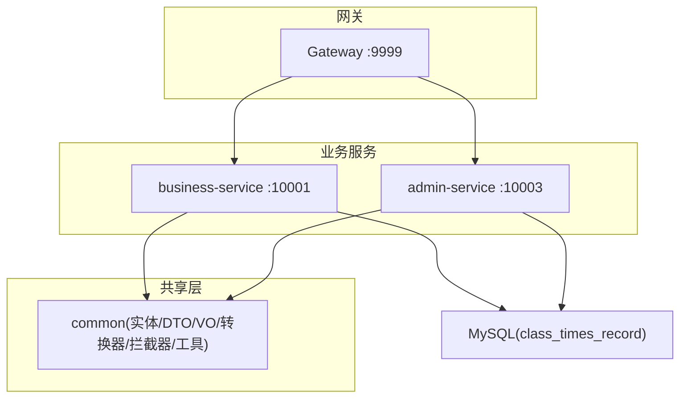
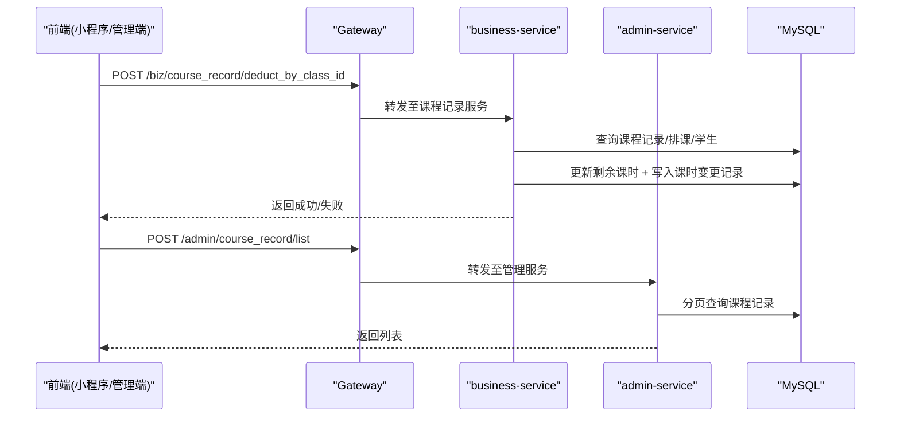
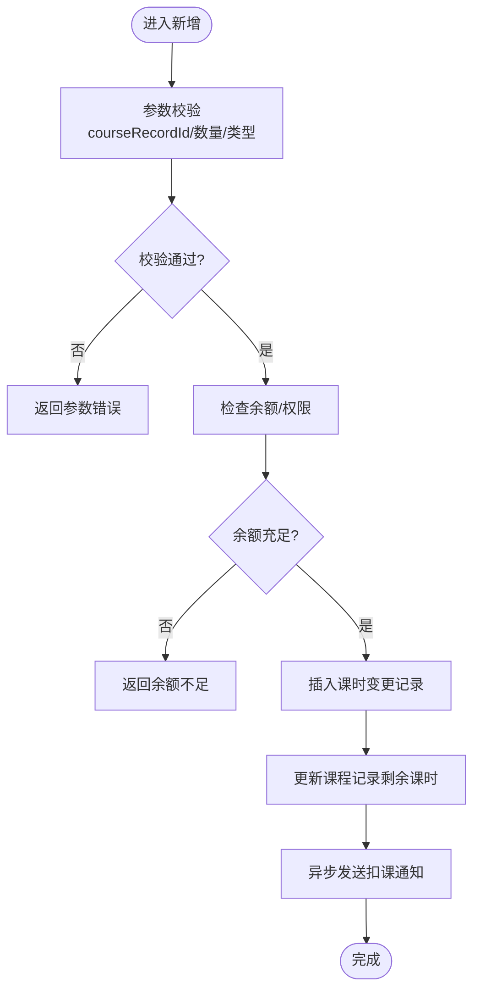
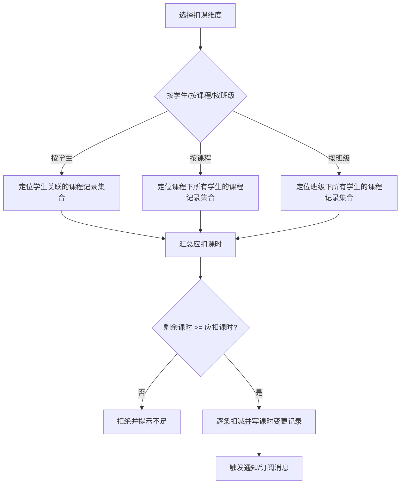
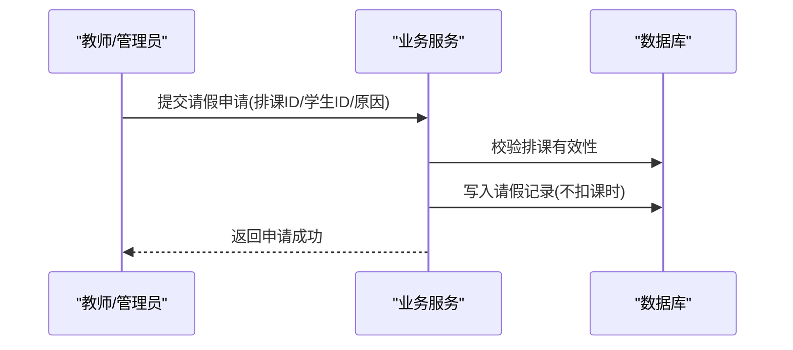
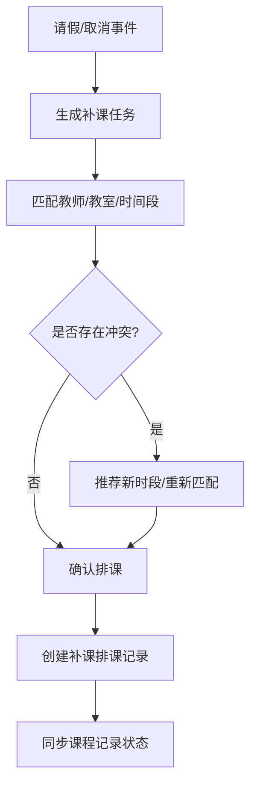
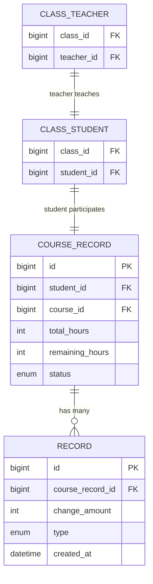
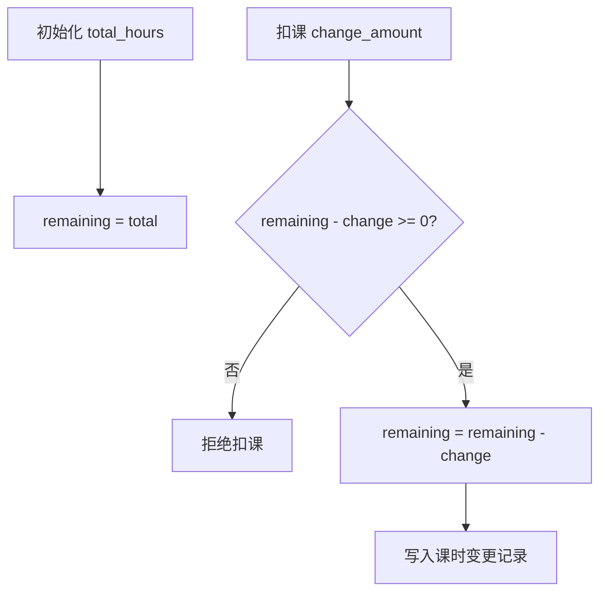
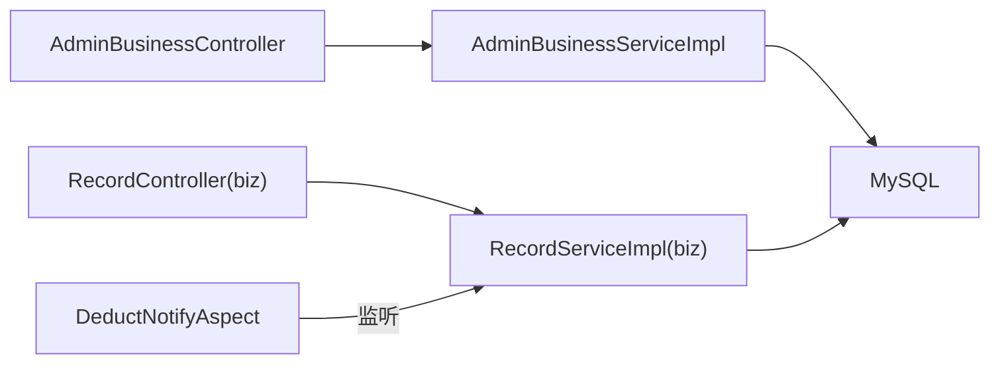

# 课时记录模块

<cite>
**本文引用的文件**   
- [CLAUDE.md](file://CLAUDE.md)
- [architecture.md](file://class_times_record_back/docs/architecture.md)
- [AdminBusinessController.java](file://class_times_record_back/admin-service/src/main/java/com/shiroko/controller/AdminBusinessController.java)
- [AdminBusinessServiceImpl.java](file://class_times_record_back/admin-service/src/main/java/com/shiroko/service/impl/AdminBusinessServiceImpl.java)
- [DeductNotifyAspect.java](file://class_times_record_back/business-service/src/main/java/com/shiroko/aspect/DeductNotifyAspect.java)
</cite>

## 目录
1. [简介](#简介)
2. [项目结构](#项目结构)
3. [核心组件](#核心组件)
4. [架构总览](#架构总览)
5. [详细组件分析](#详细组件分析)
6. [依赖关系分析](#依赖关系分析)
7. [性能与一致性](#性能与一致性)
8. [故障排查指南](#故障排查指南)
9. [结论](#结论)
10. [附录：API 接口文档](#附录api-接口文档)

## 简介
本模块聚焦“课时记录”全链路能力，覆盖上课记录管理、课时扣费、请假记录、补课安排等核心业务。文档从系统架构、数据模型、业务流程、异常处理、统计报表与批量操作、API 契约与一致性保障等方面展开，帮助读者快速理解并高效使用或扩展该模块。

## 项目结构
本仓库为多模块 monorepo，包含管理端前端、小程序前端、后端微服务以及运维 MCP Server。课时记录相关能力主要位于后端 business-service 与 admin-service，并通过 Gateway 统一路由暴露。

图表来源
- [architecture.md:47-65](file://class_times_record_back/docs/architecture.md#L47-L65)
- [CLAUDE.md:25-51](file://CLAUDE.md#L25-L51)

章节来源
- [CLAUDE.md:25-51](file://CLAUDE.md#L25-L51)
- [architecture.md:47-65](file://class_times_record_back/docs/architecture.md#L47-L65)

## 核心组件
- 课程记录（CourseRecord）：学生购课记录，承载总量、剩余、状态等，是课时扣费的主体。
- 课时记录（Record）：课时变更明细（增/减），用于审计与对账。
- 排课（ClassSchedule）：班级上课时间表，驱动按班级/课程的批量扣课。
- 请假与补课：通过课时记录的调整与备注体现，结合排课进行调度。
- 通知与订阅：扣课后触发微信订阅消息推送（面向家长）。

章节来源
- [CLAUDE.md:95-114](file://CLAUDE.md#L95-L114)
- [architecture.md:525-550](file://class_times_record_back/docs/architecture.md#L525-L550)

## 架构总览
课时记录模块遵循“Controller → Service → Mapper”的分层规范，所有请求经 Gateway 鉴权与签名校验后进入业务服务；管理端通过 admin-service 提供管理型 CRUD。

图表来源
- [architecture.md:59-65](file://class_times_record_back/docs/architecture.md#L59-L65)
- [CLAUDE.md:25-51](file://CLAUDE.md#L25-L51)

## 详细组件分析

### 课时记录（Record）CRUD
- 新增单条/批量新增：在业务服务中提供新增接口，支持多条课时变更记录一次性写入，便于批量扣课场景。
- 查询：支持按课程记录 ID 分页查询，以及新版查询以扩展筛选条件。
- 删除：采用逻辑删除策略，全局配置 isDeleted 字段控制。

图表来源
- [architecture.md:525-550](file://class_times_record_back/docs/architecture.md#L525-L550)

章节来源
- [architecture.md:525-550](file://class_times_record_back/docs/architecture.md#L525-L550)

### 课时扣费计算逻辑
- 扣费维度：支持按学生、按课程、按班级三种维度扣课。
- 计算规则：根据所选维度聚合应扣课时，校验课程记录剩余课时是否充足，逐条扣减并生成课时变更记录。
- 幂等与并发：建议对同一批次扣课加分布式锁或唯一约束，避免重复扣减。

图表来源
- [architecture.md:525-550](file://class_times_record_back/docs/architecture.md#L525-L550)

章节来源
- [architecture.md:525-550](file://class_times_record_back/docs/architecture.md#L525-L550)

### 请假申请处理流程
- 请假申请：由教师或管理员发起，关联具体排课与学生，标记为请假。
- 课时影响：请假不扣课时，但需记录请假原因与时间，便于后续补课安排。
- 审批与归档：支持审批流（可基于现有权限体系扩展），最终归档到课时记录备注或专用请假表。

[本节为概念性流程说明，未直接分析具体源文件]

### 补课安排调度机制
- 触发条件：请假生效或课程取消时，自动生成补课任务。
- 调度策略：优先匹配原教师与原时间段，若冲突则推荐可用时段；支持批量补课。
- 执行结果：生成新的排课记录，并在必要时同步更新课程记录状态。

[本节为概念性流程说明，未直接分析具体源文件]

### 课时记录与课程、学生、教师的关联
- 学生维度：c_course_record 以学生+课程为维度记录购课与剩余课时。
- 班级维度：c_class_student 将学生与班级关联，驱动按班级批量扣课。
- 教师维度：c_class_teacher 将教师与班级关联，用于排课与补课匹配。
- 课时明细：c_record 记录每次课时增减，形成完整审计链。

图表来源
- [CLAUDE.md:95-114](file://CLAUDE.md#L95-L114)

章节来源
- [CLAUDE.md:95-114](file://CLAUDE.md#L95-L114)

### 课时余额计算方法
- 初始余额：购课时写入 c_course_record.total_hours。
- 动态扣减：每次课时变更记录写入后，按 change_amount 更新 remaining_hours。
- 校验规则：扣课前必须校验 remaining_hours ≥ 本次应扣课时。

[本节为概念性算法说明，未直接分析具体源文件]

### 请假与补课的业务规则
- 请假不扣课时，仅记录请假信息。
- 补课优先复用原排课资源，冲突时自动推荐替代方案。
- 补课完成后，如需补扣课时，依据机构政策决定是否计入课时消耗。

[本节为概念性规则说明，未直接分析具体源文件]

### 课时统计报表
- 统计维度：按学生、按班级、按教师、按课程、按时间段。
- 指标项：已上课时、剩余课时、请假次数、补课次数、扣课明细。
- 输出形式：列表导出与可视化图表（前端实现）。

[本节为功能概述，未直接分析具体源文件]

### 批量操作
- 批量新增课时记录：一次请求写入多条课时变更记录，提升效率。
- 批量扣课：按班级或课程维度批量扣减，内部事务保证一致性。
- 注意事项：大批量操作建议分片执行，避免长事务与锁竞争。

章节来源
- [architecture.md:525-550](file://class_times_record_back/docs/architecture.md#L525-L550)

### 异常处理
- 统一异常处理：参数校验失败、业务异常、运行时异常、SQL 异常均被捕获并返回标准响应。
- 扣课通知异常：针对单条扣课通知发送异常进行日志记录与降级处理。

章节来源
- [architecture.md:250-262](file://class_times_record_back/docs/architecture.md#L250-L262)
- [DeductNotifyAspect.java:72-72](file://class_times_record_back/business-service/src/main/java/com/shiroko/aspect/DeductNotifyAspect.java#L72-L72)

## 依赖关系分析
- 管理端课程记录 CRUD：admin-service 的控制器与服务实现负责课程记录的管理型操作。
- 业务端课时记录：business-service 提供课时记录的新增与查询接口，支撑扣课与审计。
- 通知切面：扣课成功后触发通知，异常被切面捕获并记录。

图表来源
- [AdminBusinessController.java:72-72](file://class_times_record_back/admin-service/src/main/java/com/shiroko/controller/AdminBusinessController.java#L72-L72)
- [AdminBusinessController.java:203-215](file://class_times_record_back/admin-service/src/main/java/com/shiroko/controller/AdminBusinessController.java#L203-L215)
- [AdminBusinessServiceImpl.java:584-610](file://class_times_record_back/admin-service/src/main/java/com/shiroko/service/impl/AdminBusinessServiceImpl.java#L584-L610)
- [DeductNotifyAspect.java:72-72](file://class_times_record_back/business-service/src/main/java/com/shiroko/aspect/DeductNotifyAspect.java#L72-L72)

章节来源
- [AdminBusinessController.java:72-72](file://class_times_record_back/admin-service/src/main/java/com/shiroko/controller/AdminBusinessController.java#L72-L72)
- [AdminBusinessController.java:203-215](file://class_times_record_back/admin-service/src/main/java/com/shiroko/controller/AdminBusinessController.java#L203-L215)
- [AdminBusinessServiceImpl.java:584-610](file://class_times_record_back/admin-service/src/main/java/com/shiroko/service/impl/AdminBusinessServiceImpl.java#L584-L610)
- [DeductNotifyAspect.java:72-72](file://class_times_record_back/business-service/src/main/java/com/shiroko/aspect/DeductNotifyAspect.java#L72-L72)

## 性能与一致性
- 虚拟线程：JDK 21 虚拟线程降低 I/O 阻塞开销，适合高并发读写场景。
- 逻辑删除：全局 isDeleted 字段简化软删除逻辑，查询自动过滤。
- 主键策略：雪花算法主键趋势递增，利于索引与分库分表扩展。
- 事务边界：批量扣课应在单一事务内完成，确保余额与变更记录一致。
- 限流熔断：Gateway 集成 Sentinel，保护下游服务免受突发流量冲击。

章节来源
- [architecture.md:234-249](file://class_times_record_back/docs/architecture.md#L234-L249)
- [architecture.md:216-233](file://class_times_record_back/docs/architecture.md#L216-L233)
- [architecture.md:250-262](file://class_times_record_back/docs/architecture.md#L250-L262)

## 故障排查指南
- 扣课通知异常：查看切面日志，定位 studentId、courseId、recordId，确认微信订阅状态与模板可用性。
- 余额不足：核对课程记录剩余课时与本次应扣课时，检查并发扣课是否导致竞态。
- 参数校验失败：检查 DTO 校验注解与入参格式，关注分组校验是否遗漏。
- 数据库异常：检查 SQL 日志与连接池配置，确认索引与约束是否满足查询需求。

章节来源
- [DeductNotifyAspect.java:72-72](file://class_times_record_back/business-service/src/main/java/com/shiroko/aspect/DeductNotifyAspect.java#L72-L72)
- [architecture.md:250-262](file://class_times_record_back/docs/architecture.md#L250-L262)

## 结论
课时记录模块围绕“课程记录—课时记录—排课—通知”的主线构建，具备完善的 CRUD、批量操作与异常处理能力。通过统一的网关鉴权、签名校验与全局异常处理，保障了系统的稳定性与可观测性。建议在后续演进中引入 Redis 防重放、API 版本管理与分布式链路追踪，进一步提升可靠性与可维护性。

## 附录：API 接口文档

### 课时记录（Record）
- 新增单条：POST /biz/record/add
- 批量新增：POST /biz/record/add_all
- 查询课时变更记录：POST /biz/record/get
- 新版查询：POST /biz/record/new_get

章节来源
- [architecture.md:525-550](file://class_times_record_back/docs/architecture.md#L525-L550)

### 课程记录（CourseRecord）
- 分页查询：POST /biz/course_record/get
- 新版分页查询：POST /biz/course_record/new_get
- 新增购课记录（旧校验组）：POST /biz/course_record/add
- 新增购课记录（新校验组）：POST /biz/course_record/insert
- 更新购课记录：POST /biz/course_record/update
- 删除（逻辑删除）：POST /biz/course_record/delete
- 按学生扣课：POST /biz/course_record/deduct_by_student_id
- 按课程扣课：POST /biz/course_record/deduct_by_course_id
- 按班级扣课：POST /biz/course_record/deduct_by_class_id
- 按学生查询课程记录：POST /biz/course_record/get_by_student_id

章节来源
- [architecture.md:525-550](file://class_times_record_back/docs/architecture.md#L525-L550)

### 管理端课程记录（Admin）
- 列表查询：POST /admin/course_record/list
- 新增：POST /admin/course_record/insert
- 更新：POST /admin/course_record/update
- 删除：POST /admin/course_record/delete

章节来源
- [AdminBusinessController.java:72-72](file://class_times_record_back/admin-service/src/main/java/com/shiroko/controller/AdminBusinessController.java#L72-L72)
- [AdminBusinessController.java:203-215](file://class_times_record_back/admin-service/src/main/java/com/shiroko/controller/AdminBusinessController.java#L203-L215)
- [AdminBusinessServiceImpl.java:584-610](file://class_times_record_back/admin-service/src/main/java/com/shiroko/service/impl/AdminBusinessServiceImpl.java#L584-L610)