# 课程管理模块

<cite>
**本文引用的文件**   
- [class_record_admin_front/src/api/course/index.ts](file://class_record_admin_front/src/api/course/index.ts)
- [class_record_admin_front/src/views/business/course/index.vue](file://class_record_admin_front/src/views/business/course/index.vue)
- [class_record_admin_front/src/types/business.d.ts](file://class_record_admin_front/src/types/business.d.ts)
- [class_times_record/src/api/course/index.ts](file://class_times_record/src/api/course/index.ts)
- [class_times_record/src/pages/main/teacher/course-manage/index.vue](file://class_times_record/src/pages/main/teacher/course-manage/index.vue)
- [class_times_record/src/pages/main/teacher/add-course/index.vue](file://class_times_record/src/pages/main/teacher/add-course/index.vue)
- [class_times_record/src/pages/main/teacher/edit-course-info/index.vue](file://class_times_record/src/pages/main/teacher/edit-course-info/index.vue)
- [class_times_record/src/types/course.d.ts](file://class_times_record/src/types/course.d.ts)
- [class_times_record/src/types/common.d.ts](file://class_times_record/src/types/common.d.ts)
- [class_times_record/src/utils/request/index.ts](file://class_times_record/src/utils/request/index.ts)
- [class_record_admin_front/src/utils/request.ts](file://class_record_admin_front/src/utils/request.ts)
- [class_times_record/src/config/routes.ts](file://class_times_record/src/config/routes.ts)
- [class_record_admin_front/src/router/index.ts](file://class_record_admin_front/src/router/index.ts)
</cite>

## 目录
1. [简介](#简介)
2. [项目结构](#项目结构)
3. [核心组件](#核心组件)
4. [架构总览](#架构总览)
5. [详细组件分析](#详细组件分析)
6. [依赖分析](#依赖分析)
7. [性能考虑](#性能考虑)
8. [故障排查指南](#故障排查指南)
9. [结论](#结论)
10. [附录](#附录)

## 简介
本模块聚焦“课程管理”能力，覆盖课程设置、课程分类、课时定价、课程状态管理等关键业务。文档面向产品与研发人员，提供从前端到后端的端到端说明，包括：
- 课程的增删改查（CRUD）流程
- 课程分类体系与层级关系
- 课时价格配置与计费规则
- 课程上下架与版本控制策略
- 课程与教师、班级的关联关系
- 课程资源分配机制
- 模板化创建与批量操作支持
- 课程数据分析与报表能力
- 完整的API接口规范与数据模型设计

## 项目结构
本课程管理功能在前后端均有实现，主要涉及以下目录与文件：
- 管理端前端（Vue + TypeScript）：课程列表、新增、编辑、删除等页面与API封装
- 移动端（uni-app）：教师端课程管理、添加课程、编辑课程信息
- 类型定义：统一的数据模型与枚举
- 请求工具：统一的HTTP封装与拦截器

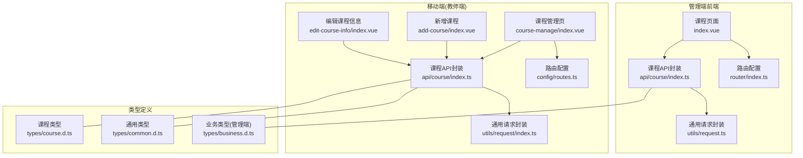

图表来源
- [class_record_admin_front/src/views/business/course/index.vue](file://class_record_admin_front/src/views/business/course/index.vue)
- [class_record_admin_front/src/api/course/index.ts](file://class_record_admin_front/src/api/course/index.ts)
- [class_record_admin_front/src/router/index.ts](file://class_record_admin_front/src/router/index.ts)
- [class_record_admin_front/src/utils/request.ts](file://class_record_admin_front/src/utils/request.ts)
- [class_times_record/src/pages/main/teacher/course-manage/index.vue](file://class_times_record/src/pages/main/teacher/course-manage/index.vue)
- [class_times_record/src/pages/main/teacher/add-course/index.vue](file://class_times_record/src/pages/main/teacher/add-course/index.vue)
- [class_times_record/src/pages/main/teacher/edit-course-info/index.vue](file://class_times_record/src/pages/main/teacher/edit-course-info/index.vue)
- [class_times_record/src/api/course/index.ts](file://class_times_record/src/api/course/index.ts)
- [class_times_record/src/utils/request/index.ts](file://class_times_record/src/utils/request/index.ts)
- [class_times_record/src/config/routes.ts](file://class_times_record/src/config/routes.ts)
- [class_times_record/src/types/course.d.ts](file://class_times_record/src/types/course.d.ts)
- [class_times_record/src/types/common.d.ts](file://class_times_record/src/types/common.d.ts)
- [class_record_admin_front/src/types/business.d.ts](file://class_record_admin_front/src/types/business.d.ts)

章节来源
- [class_record_admin_front/src/views/business/course/index.vue](file://class_record_admin_front/src/views/business/course/index.vue)
- [class_record_admin_front/src/api/course/index.ts](file://class_record_admin_front/src/api/course/index.ts)
- [class_record_admin_front/src/router/index.ts](file://class_record_admin_front/src/router/index.ts)
- [class_record_admin_front/src/utils/request.ts](file://class_record_admin_front/src/utils/request.ts)
- [class_times_record/src/pages/main/teacher/course-manage/index.vue](file://class_times_record/src/pages/main/teacher/course-manage/index.vue)
- [class_times_record/src/pages/main/teacher/add-course/index.vue](file://class_times_record/src/pages/main/teacher/add-course/index.vue)
- [class_times_record/src/pages/main/teacher/edit-course-info/index.vue](file://class_times_record/src/pages/main/teacher/edit-course-info/index.vue)
- [class_times_record/src/api/course/index.ts](file://class_times_record/src/api/course/index.ts)
- [class_times_record/src/utils/request/index.ts](file://class_times_record/src/utils/request/index.ts)
- [class_times_record/src/config/routes.ts](file://class_times_record/src/config/routes.ts)
- [class_times_record/src/types/course.d.ts](file://class_times_record/src/types/course.d.ts)
- [class_times_record/src/types/common.d.ts](file://class_times_record/src/types/common.d.ts)
- [class_record_admin_front/src/types/business.d.ts](file://class_record_admin_front/src/types/business.d.ts)

## 核心组件
- 课程列表与查询：支持分页、筛选（名称、分类、状态、时间范围）、排序与导出
- 课程新增与编辑：基础信息、分类、课时定价、状态、资源、版本控制
- 课程上下架：一键上架/下架，支持批量操作
- 课程模板：基于模板快速创建课程，减少重复录入
- 课程与教师/班级关联：绑定授课教师、适用班级或年级
- 课程资源：教材、课件、视频等资源挂载与权限控制
- 课程版本：版本号、变更日志、回滚与发布策略
- 数据分析：开课率、满班率、退课率、收入统计等

章节来源
- [class_record_admin_front/src/views/business/course/index.vue](file://class_record_admin_front/src/views/business/course/index.vue)
- [class_record_admin_front/src/api/course/index.ts](file://class_record_admin_front/src/api/course/index.ts)
- [class_times_record/src/pages/main/teacher/course-manage/index.vue](file://class_times_record/src/pages/main/teacher/course-manage/index.vue)
- [class_times_record/src/pages/main/teacher/add-course/index.vue](file://class_times_record/src/pages/main/teacher/add-course/index.vue)
- [class_times_record/src/pages/main/teacher/edit-course-info/index.vue](file://class_times_record/src/pages/main/teacher/edit-course-info/index.vue)
- [class_times_record/src/api/course/index.ts](file://class_times_record/src/api/course/index.ts)

## 架构总览
课程管理采用前后端分离架构，前端通过统一请求封装调用后端服务；移动端与管理端共享一致的API契约。

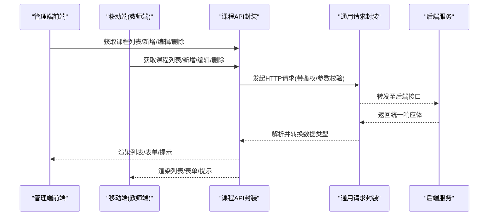

图表来源
- [class_record_admin_front/src/api/course/index.ts](file://class_record_admin_front/src/api/course/index.ts)
- [class_record_admin_front/src/utils/request.ts](file://class_record_admin_front/src/utils/request.ts)
- [class_times_record/src/api/course/index.ts](file://class_times_record/src/api/course/index.ts)
- [class_times_record/src/utils/request/index.ts](file://class_times_record/src/utils/request/index.ts)

## 详细组件分析

### 课程CRUD流程
- 新增课程：填写基础信息、选择分类、设置课时价格、绑定教师与班级、上传资源、选择模板、提交生成新版本
- 编辑课程：修改基本信息、调整价格、更新资源、升级版本、记录变更日志
- 删除课程：逻辑删除，保留历史数据与审计
- 查询课程：分页、多条件筛选、排序、导出

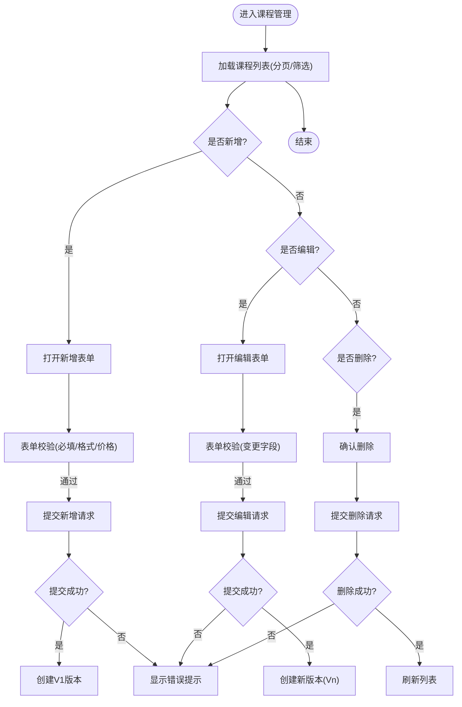

图表来源
- [class_record_admin_front/src/views/business/course/index.vue](file://class_record_admin_front/src/views/business/course/index.vue)
- [class_record_admin_front/src/api/course/index.ts](file://class_record_admin_front/src/api/course/index.ts)
- [class_times_record/src/pages/main/teacher/course-manage/index.vue](file://class_times_record/src/pages/main/teacher/course-manage/index.vue)
- [class_times_record/src/pages/main/teacher/add-course/index.vue](file://class_times_record/src/pages/main/teacher/add-course/index.vue)
- [class_times_record/src/pages/main/teacher/edit-course-info/index.vue](file://class_times_record/src/pages/main/teacher/edit-course-info/index.vue)
- [class_times_record/src/api/course/index.ts](file://class_times_record/src/api/course/index.ts)

章节来源
- [class_record_admin_front/src/views/business/course/index.vue](file://class_record_admin_front/src/views/business/course/index.vue)
- [class_record_admin_front/src/api/course/index.ts](file://class_record_admin_front/src/api/course/index.ts)
- [class_times_record/src/pages/main/teacher/course-manage/index.vue](file://class_times_record/src/pages/main/teacher/course-manage/index.vue)
- [class_times_record/src/pages/main/teacher/add-course/index.vue](file://class_times_record/src/pages/main/teacher/add-course/index.vue)
- [class_times_record/src/pages/main/teacher/edit-course-info/index.vue](file://class_times_record/src/pages/main/teacher/edit-course-info/index.vue)
- [class_times_record/src/api/course/index.ts](file://class_times_record/src/api/course/index.ts)

### 课程分类体系
- 分类层级：支持多级分类（如学科→科目→方向），便于检索与展示
- 分类属性：编码、名称、排序、状态、父级ID
- 分类使用：课程创建时选择分类，影响搜索、推荐与报表维度

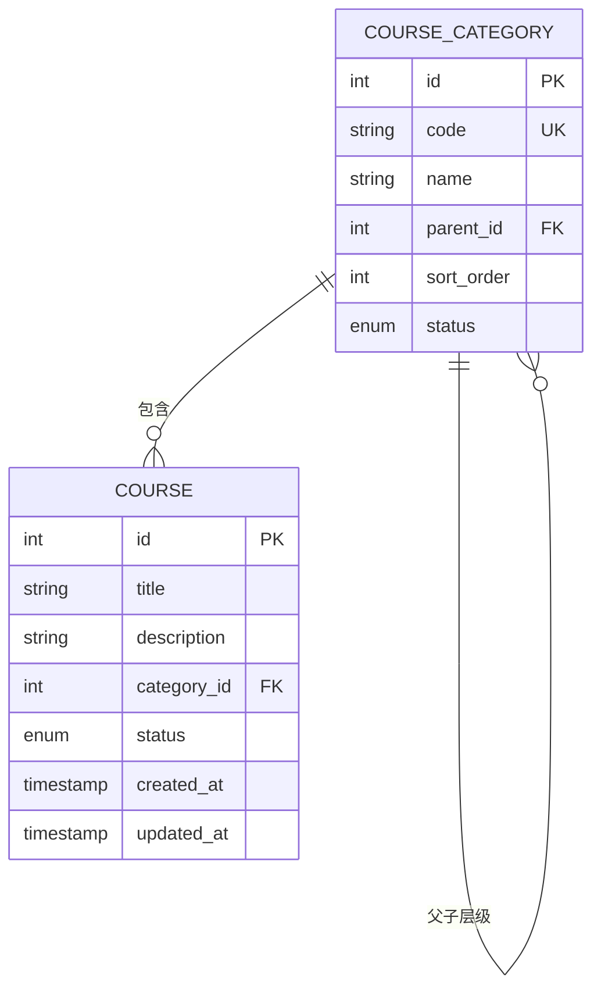

图表来源
- [class_times_record/src/types/course.d.ts](file://class_times_record/src/types/course.d.ts)
- [class_record_admin_front/src/types/business.d.ts](file://class_record_admin_front/src/types/business.d.ts)

章节来源
- [class_times_record/src/types/course.d.ts](file://class_times_record/src/types/course.d.ts)
- [class_record_admin_front/src/types/business.d.ts](file://class_record_admin_front/src/types/business.d.ts)

### 课时定价与计费
- 定价维度：按课时单价、套餐价、折扣价、会员价等
- 价格策略：阶梯价、限时优惠、早鸟价
- 计费规则：按实际上课次数扣费、按周期订阅、退款与补差

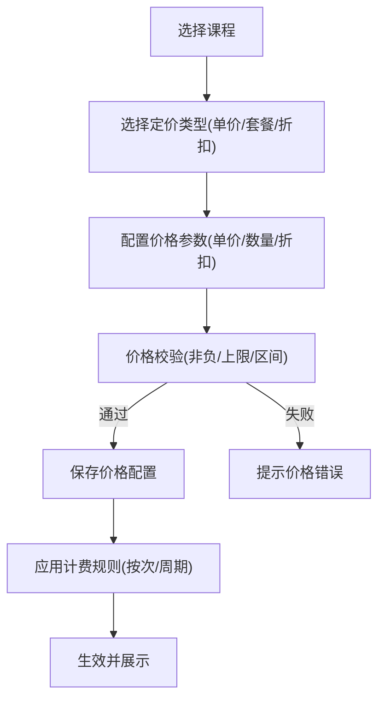

图表来源
- [class_times_record/src/types/course.d.ts](file://class_times_record/src/types/course.d.ts)
- [class_record_admin_front/src/types/business.d.ts](file://class_record_admin_front/src/types/business.d.ts)

章节来源
- [class_times_record/src/types/course.d.ts](file://class_times_record/src/types/course.d.ts)
- [class_record_admin_front/src/types/business.d.ts](file://class_record_admin_front/src/types/business.d.ts)

### 课程状态管理与上下架
- 状态机：草稿、已上架、已下架、已归档
- 上下架策略：定时上架、批量上下架、审核通过后自动上架
- 状态变更审计：记录操作人、时间、原因

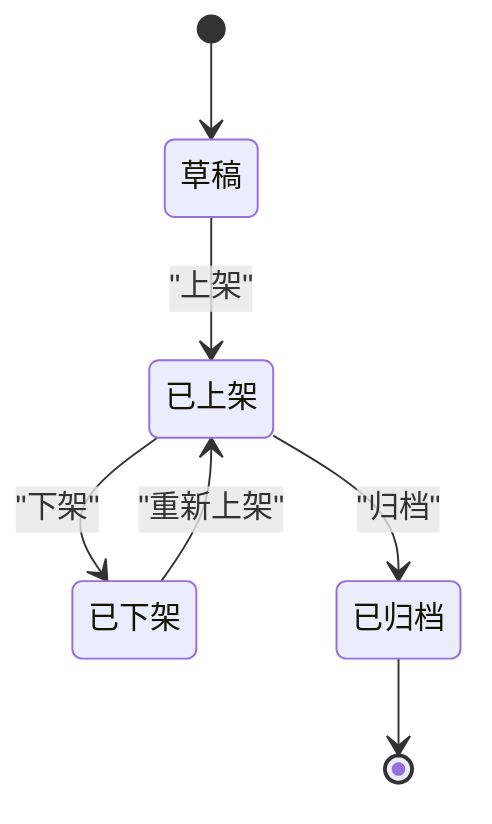

图表来源
- [class_record_admin_front/src/views/business/course/index.vue](file://class_record_admin_front/src/views/business/course/index.vue)
- [class_times_record/src/pages/main/teacher/course-manage/index.vue](file://class_times_record/src/pages/main/teacher/course-manage/index.vue)

章节来源
- [class_record_admin_front/src/views/business/course/index.vue](file://class_record_admin_front/src/views/business/course/index.vue)
- [class_times_record/src/pages/main/teacher/course-manage/index.vue](file://class_times_record/src/pages/main/teacher/course-manage/index.vue)

### 课程与教师、班级关联
- 教师绑定：主讲教师、助教、顾问，支持多教师协作
- 班级绑定：适用班级、年级、校区，支持一对多与多对多
- 排课联动：课程与排课系统联动，自动生成课表

```mermaid
erDiagram
TEACHER {
int id PK
string name
string title
enum status
}
CLASS {
int id PK
string name
string grade
string campus
}
COURSE_TEACHER_REL {
int course_id FK
int teacher_id FK
enum role
}
COURSE_CLASS_REL {
int course_id FK
int class_id FK
}
COURSE ||--o{ COURSE_TEACHER_REL : "关联"
TEACHER ||--o{ COURSE_TEACHER_REL : "被关联"
COURSE ||--o{ COURSE_CLASS_REL : "关联"
CLASS ||--o{ COURSE_CLASS_REL : "被关联"
```

图表来源
- [class_times_record/src/types/course.d.ts](file://class_times_record/src/types/course.d.ts)
- [class_record_admin_front/src/types/business.d.ts](file://class_record_admin_front/src/types/business.d.ts)

章节来源
- [class_times_record/src/types/course.d.ts](file://class_times_record/src/types/course.d.ts)
- [class_record_admin_front/src/types/business.d.ts](file://class_record_admin_front/src/types/business.d.ts)

### 课程资源分配机制
- 资源类型：教材、课件、视频、作业、考试
- 权限控制：公开、内部、指定教师可见
- 版本同步：资源随课程版本更新，支持回滚

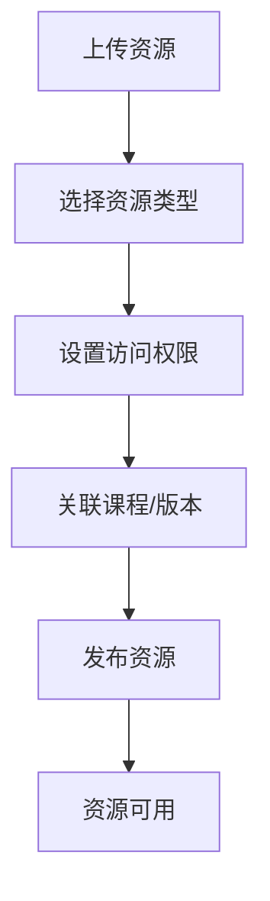

图表来源
- [class_times_record/src/types/course.d.ts](file://class_times_record/src/types/course.d.ts)
- [class_record_admin_front/src/types/business.d.ts](file://class_record_admin_front/src/types/business.d.ts)

章节来源
- [class_times_record/src/types/course.d.ts](file://class_times_record/src/types/course.d.ts)
- [class_record_admin_front/src/types/business.d.ts](file://class_record_admin_front/src/types/business.d.ts)

### 课程版本控制
- 版本策略：主版本+次版本+修订号，语义化版本
- 变更记录：变更摘要、影响范围、审批流
- 回滚策略：支持回滚到上一稳定版本

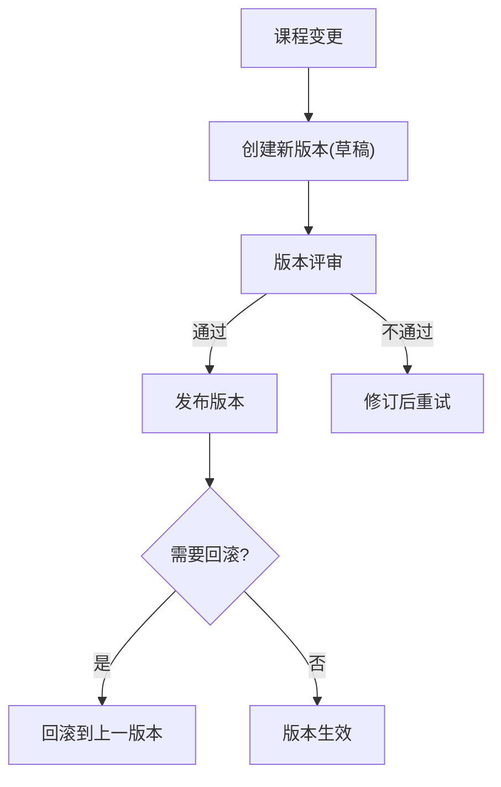

图表来源
- [class_record_admin_front/src/views/business/course/index.vue](file://class_record_admin_front/src/views/business/course/index.vue)
- [class_times_record/src/pages/main/teacher/edit-course-info/index.vue](file://class_times_record/src/pages/main/teacher/edit-course-info/index.vue)

章节来源
- [class_record_admin_front/src/views/business/course/index.vue](file://class_record_admin_front/src/views/business/course/index.vue)
- [class_times_record/src/pages/main/teacher/edit-course-info/index.vue](file://class_times_record/src/pages/main/teacher/edit-course-info/index.vue)

### 课程模板与批量操作
- 模板库：标准课程模板、活动课程模板、试听课模板
- 批量操作：批量上下架、批量调价、批量替换资源
- 模板变量：标题、描述、价格、教师、班级等占位符

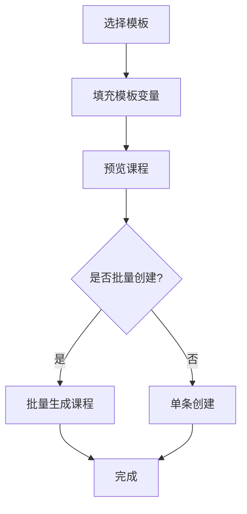

图表来源
- [class_record_admin_front/src/views/business/course/index.vue](file://class_record_admin_front/src/views/business/course/index.vue)
- [class_times_record/src/pages/main/teacher/add-course/index.vue](file://class_times_record/src/pages/main/teacher/add-course/index.vue)

章节来源
- [class_record_admin_front/src/views/business/course/index.vue](file://class_record_admin_front/src/views/business/course/index.vue)
- [class_times_record/src/pages/main/teacher/add-course/index.vue](file://class_times_record/src/pages/main/teacher/add-course/index.vue)

### 课程数据分析
- 指标：开课数、满班率、退课率、续报率、收入
- 维度：按分类、教师、班级、时间范围
- 导出：Excel/PDF报表，支持定时推送

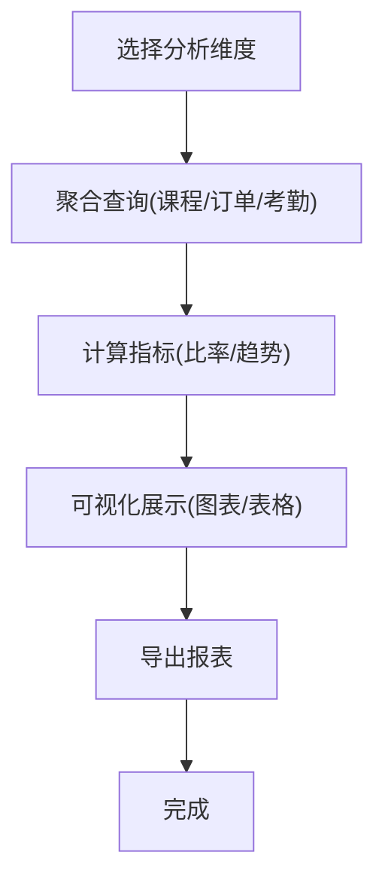

图表来源
- [class_record_admin_front/src/views/business/course/index.vue](file://class_record_admin_front/src/views/business/course/index.vue)

章节来源
- [class_record_admin_front/src/views/business/course/index.vue](file://class_record_admin_front/src/views/business/course/index.vue)

## 依赖分析
- 前端依赖：
  - 管理端：Vue组件、路由、API封装、类型定义
  - 移动端：uni-app组件、路由、API封装、类型定义
- 公共依赖：
  - 统一请求封装（鉴权、重试、错误处理）
  - 类型定义（课程、分类、教师、班级、通用响应）

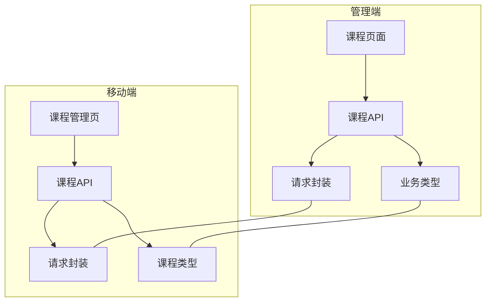

图表来源
- [class_record_admin_front/src/views/business/course/index.vue](file://class_record_admin_front/src/views/business/course/index.vue)
- [class_record_admin_front/src/api/course/index.ts](file://class_record_admin_front/src/api/course/index.ts)
- [class_record_admin_front/src/utils/request.ts](file://class_record_admin_front/src/utils/request.ts)
- [class_record_admin_front/src/types/business.d.ts](file://class_record_admin_front/src/types/business.d.ts)
- [class_times_record/src/pages/main/teacher/course-manage/index.vue](file://class_times_record/src/pages/main/teacher/course-manage/index.vue)
- [class_times_record/src/api/course/index.ts](file://class_times_record/src/api/course/index.ts)
- [class_times_record/src/utils/request/index.ts](file://class_times_record/src/utils/request/index.ts)
- [class_times_record/src/types/course.d.ts](file://class_times_record/src/types/course.d.ts)

章节来源
- [class_record_admin_front/src/views/business/course/index.vue](file://class_record_admin_front/src/views/business/course/index.vue)
- [class_record_admin_front/src/api/course/index.ts](file://class_record_admin_front/src/api/course/index.ts)
- [class_record_admin_front/src/utils/request.ts](file://class_record_admin_front/src/utils/request.ts)
- [class_record_admin_front/src/types/business.d.ts](file://class_record_admin_front/src/types/business.d.ts)
- [class_times_record/src/pages/main/teacher/course-manage/index.vue](file://class_times_record/src/pages/main/teacher/course-manage/index.vue)
- [class_times_record/src/api/course/index.ts](file://class_times_record/src/api/course/index.ts)
- [class_times_record/src/utils/request/index.ts](file://class_times_record/src/utils/request/index.ts)
- [class_times_record/src/types/course.d.ts](file://class_times_record/src/types/course.d.ts)

## 性能考虑
- 列表分页与懒加载：避免一次性加载大量数据
- 缓存策略：分类、教师、班级等字典数据本地缓存
- 批量操作异步化：后台任务处理，前端轮询进度
- 图片与资源压缩：上传前压缩，CDN加速
- 接口限流与幂等：防止重复提交与恶意请求

## 故障排查指南
- 网络与鉴权：检查请求封装的拦截器、Token刷新、超时重试
- 表单校验：必填项、价格区间、日期范围、资源大小限制
- 状态异常：课程状态不一致、版本冲突、并发编辑锁
- 数据一致性：分类、教师、班级关联外键约束与级联更新
- 日志与追踪：操作日志、错误堆栈、链路ID

章节来源
- [class_record_admin_front/src/utils/request.ts](file://class_record_admin_front/src/utils/request.ts)
- [class_times_record/src/utils/request/index.ts](file://class_times_record/src/utils/request/index.ts)
- [class_record_admin_front/src/types/business.d.ts](file://class_record_admin_front/src/types/business.d.ts)
- [class_times_record/src/types/course.d.ts](file://class_times_record/src/types/course.d.ts)

## 结论
课程管理模块以清晰的CRUD流程为核心，结合分类体系、定价策略、状态机与版本控制，形成完整闭环。通过模板与批量操作提升效率，借助数据分析驱动运营决策。前后端一致的类型定义与请求封装保障稳定性与可维护性。

## 附录

### API接口规范（示例）
- 列表查询
  - 方法：GET
  - 路径：/api/v1/courses
  - 查询参数：page、size、keyword、category_id、status、start_date、end_date、sort_by、order
  - 响应：分页结果（items、total、page、size）
- 新增课程
  - 方法：POST
  - 路径：/api/v1/courses
  - 请求体：title、description、category_id、price_config、teacher_ids、class_ids、resources、version_note
  - 响应：课程对象（含version）
- 更新课程
  - 方法：PUT
  - 路径：/api/v1/courses/{id}
  - 请求体：同新增，仅传变更字段
  - 响应：课程对象（含新version）
- 删除课程
  - 方法：DELETE
  - 路径：/api/v1/courses/{id}
  - 响应：成功标志
- 批量上下架
  - 方法：POST
  - 路径：/api/v1/courses/batch/status
  - 请求体：ids、status、reason
  - 响应：任务ID（异步）
- 模板创建
  - 方法：POST
  - 路径：/api/v1/courses/from-template
  - 请求体：template_id、variables、is_batch
  - 响应：课程列表（批量）

章节来源
- [class_record_admin_front/src/api/course/index.ts](file://class_record_admin_front/src/api/course/index.ts)
- [class_times_record/src/api/course/index.ts](file://class_times_record/src/api/course/index.ts)

### 数据模型设计（核心字段）
- 课程
  - 字段：id、title、description、category_id、status、version、created_at、updated_at
- 课程分类
  - 字段：id、code、name、parent_id、sort_order、status
- 课时定价
  - 字段：course_id、unit_price、package_price、discount、member_price、effective_date、expire_date
- 教师关联
  - 字段：course_id、teacher_id、role
- 班级关联
  - 字段：course_id、class_id
- 资源
  - 字段：course_id、resource_type、url、permission、version

章节来源
- [class_times_record/src/types/course.d.ts](file://class_times_record/src/types/course.d.ts)
- [class_record_admin_front/src/types/business.d.ts](file://class_record_admin_front/src/types/business.d.ts)
- [class_times_record/src/types/common.d.ts](file://class_times_record/src/types/common.d.ts)