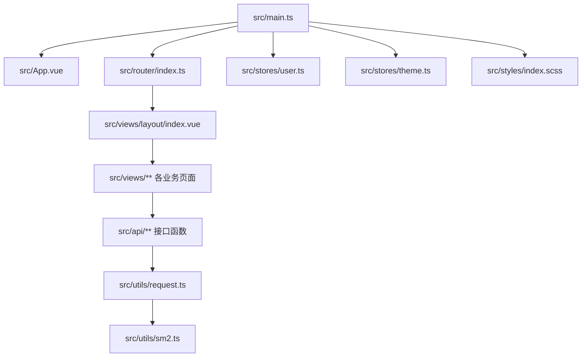
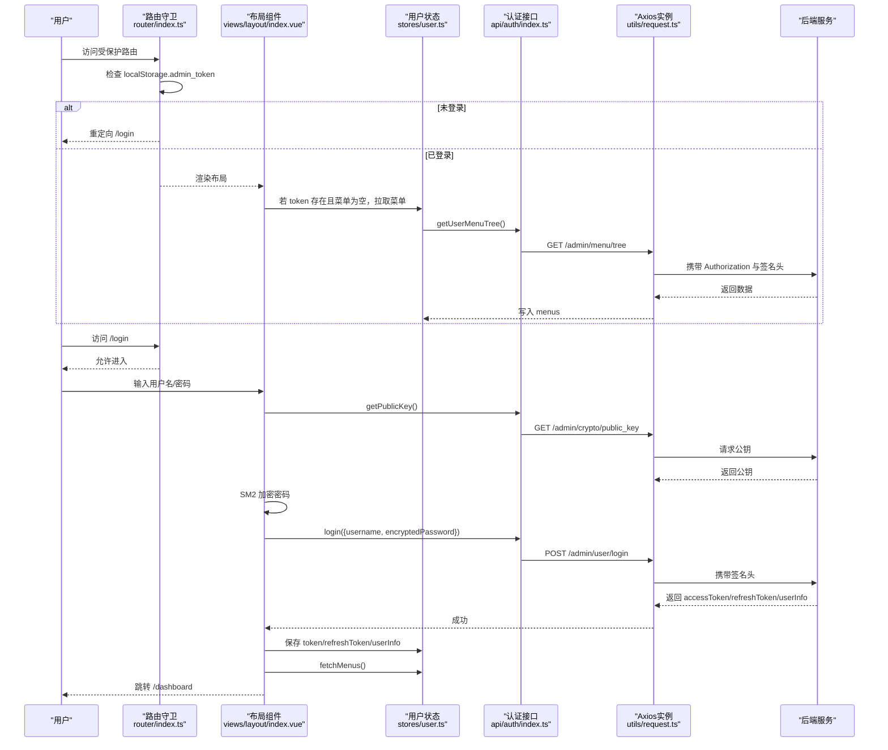
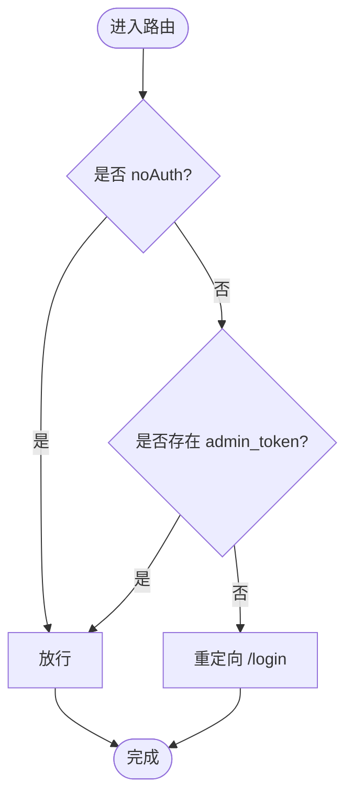
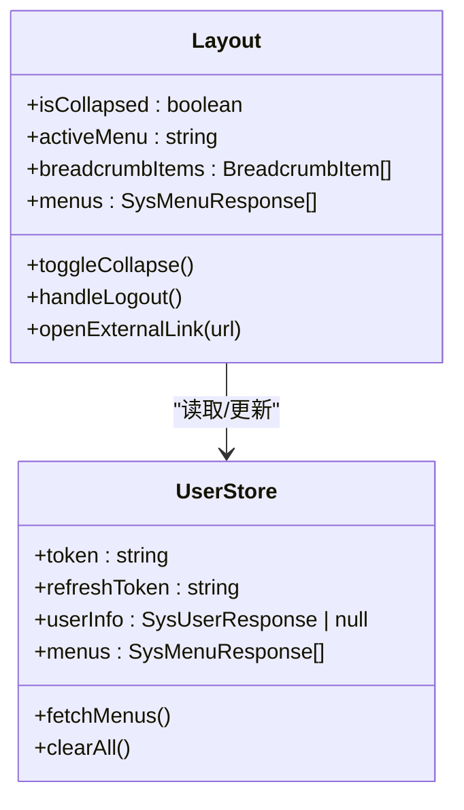
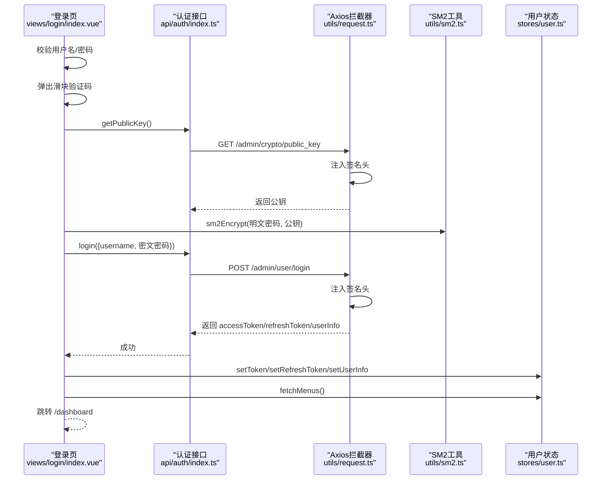
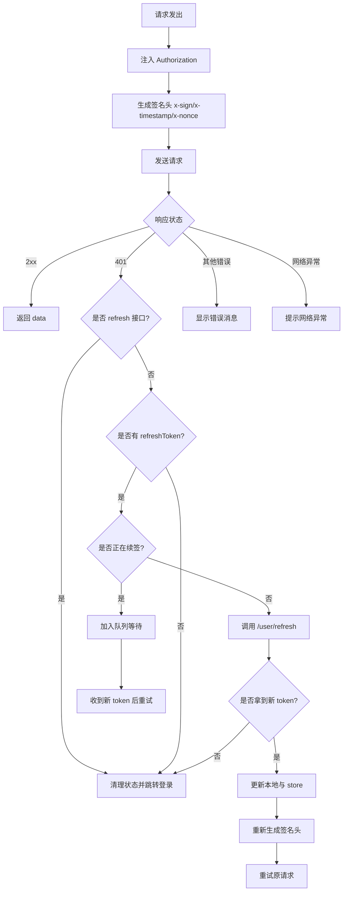
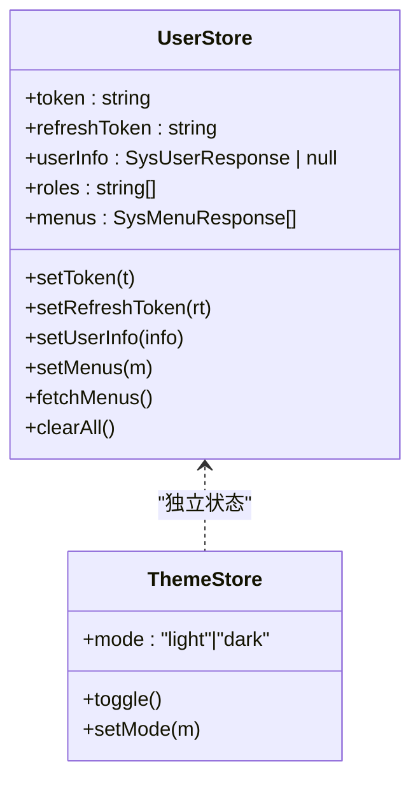
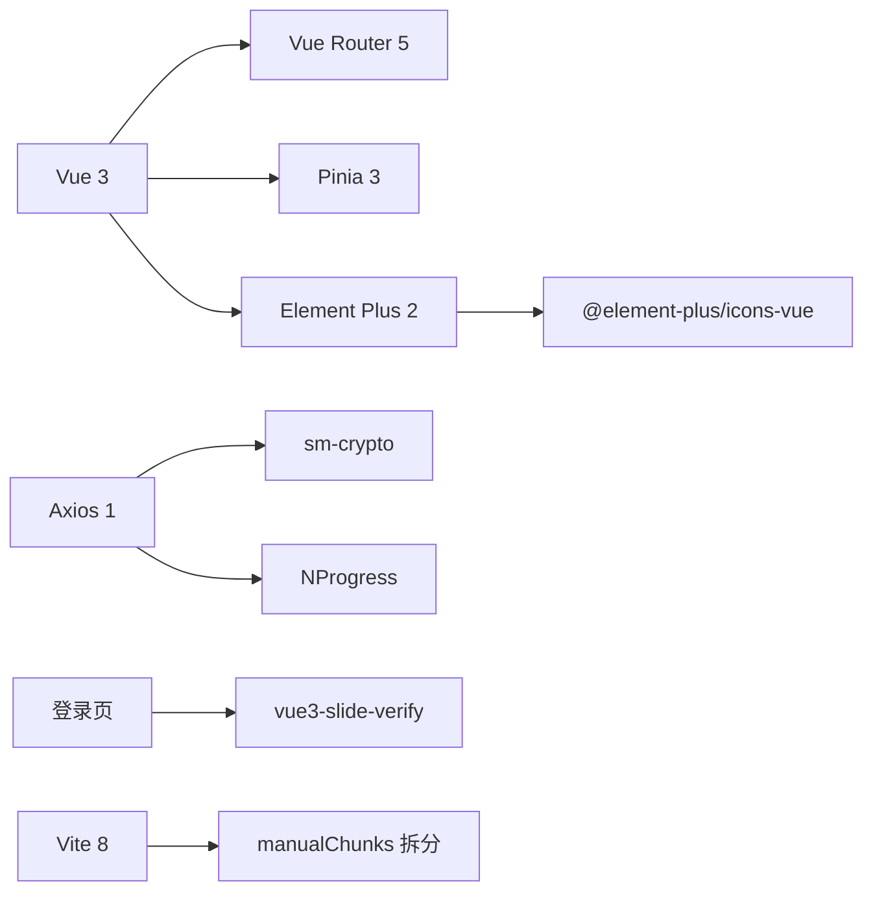

# 管理端前端架构

<cite>
**本文引用的文件**
- [package.json](file://class_record_admin_front/package.json)
- [vite.config.ts](file://class_record_admin_front/vite.config.ts)
- [src/main.ts](file://class_record_admin_front/src/main.ts)
- [src/App.vue](file://class_record_admin_front/src/App.vue)
- [src/router/index.ts](file://class_record_admin_front/src/router/index.ts)
- [src/utils/request.ts](file://class_record_admin_front/src/utils/request.ts)
- [src/api/auth/index.ts](file://class_record_admin_front/src/api/auth/index.ts)
- [src/utils/sm2.ts](file://class_record_admin_front/src/utils/sm2.ts)
- [src/stores/user.ts](file://class_record_admin_front/src/stores/user.ts)
- [src/stores/theme.ts](file://class_record_admin_front/src/stores/theme.ts)
- [src/views/layout/index.vue](file://class_record_admin_front/src/views/layout/index.vue)
- [src/views/login/index.vue](file://class_record_admin_front/src/views/login/index.vue)
- [src/styles/index.scss](file://class_record_admin_front/src/styles/index.scss)
- [src/types/admin.d.ts](file://class_record_admin_front/src/types/admin.d.ts)
- [src/types/http.d.ts](file://class_record_admin_front/src/types/http.d.ts)
</cite>

## 目录
1. [简介](#简介)
2. [项目结构](#项目结构)
3. [核心组件](#核心组件)
4. [架构总览](#架构总览)
5. [详细组件分析](#详细组件分析)
6. [依赖分析](#依赖分析)
7. [性能考虑](#性能考虑)
8. [故障排查指南](#故障排查指南)
9. [结论](#结论)
10. [附录：新功能开发流程与最佳实践](#附录：新功能开发流程与最佳实践)

## 简介
本文件面向管理端前端的架构文档，围绕 Vue 3 + Element Plus + Vite 8 + TypeScript 技术栈，系统阐述目录组织、模块化设计、API 封装、状态管理（Pinia）、路由配置、前后端通信机制（Axios 拦截器、Token 管理、错误处理）、组件化与样式体系（SCSS）、图标规范、类型定义管理等。同时提供端到端流程图与代码级关系图，帮助开发者快速理解并高效扩展功能。

## 项目结构
管理端前端位于 class_record_admin_front 目录，采用“按领域/功能”划分的 views 模块与 api 模块，配合 utils、stores、types、styles 等横切关注点，形成清晰的分层与职责边界。

- 入口与全局初始化
  - src/main.ts：应用启动、插件注册（Pinia、Router、Element Plus）、主题初始化、全局样式引入
  - src/App.vue：根容器，仅承载 router-view
- 路由与布局
  - src/router/index.ts：静态路由、懒加载、导航守卫、进度条集成
  - src/views/layout/index.vue：侧边栏、面包屑、用户菜单、主题切换、动态菜单渲染
- 业务视图
  - src/views/business/*：业务域页面（机构、学生、教师、课程、班级、排课、课时记录等）
  - src/views/system/*：系统管理（用户、角色、菜单、日志、权限、配置）
  - src/views/dashboard/*、src/views/profile/*、src/views/login/*：通用页面
- API 层
  - src/api/*：按领域划分接口函数，统一通过 @/utils/request 发起请求
- 状态管理
  - src/stores/user.ts：登录态、用户信息、菜单树、刷新令牌
  - src/stores/theme.ts：亮/暗主题持久化与 DOM 属性同步
- 工具与安全
  - src/utils/request.ts：Axios 实例、请求/响应拦截、签名头注入、401 自动续签与重试
  - src/utils/sm2.ts：SM2 加密、SM3 签名生成
- 类型与样式
  - src/types/*.d.ts：全局类型定义（HTTP 响应、业务实体、表单/查询参数）
  - src/styles/index.scss：设计系统变量、Element Plus 覆盖、暗色主题、过渡动画

图表来源
- [src/main.ts:1-22](file://class_record_admin_front/src/main.ts#L1-L22)
- [src/App.vue:1-10](file://class_record_admin_front/src/App.vue#L1-L10)
- [src/router/index.ts:1-160](file://class_record_admin_front/src/router/index.ts#L1-L160)
- [src/views/layout/index.vue:1-216](file://class_record_admin_front/src/views/layout/index.vue#L1-L216)
- [src/api/auth/index.ts:1-14](file://class_record_admin_front/src/api/auth/index.ts#L1-L14)
- [src/utils/request.ts:1-222](file://class_record_admin_front/src/utils/request.ts#L1-L222)
- [src/utils/sm2.ts:1-88](file://class_record_admin_front/src/utils/sm2.ts#L1-L88)

章节来源
- [src/main.ts:1-22](file://class_record_admin_front/src/main.ts#L1-L22)
- [src/App.vue:1-10](file://class_record_admin_front/src/App.vue#L1-L10)
- [src/router/index.ts:1-160](file://class_record_admin_front/src/router/index.ts#L1-L160)
- [src/views/layout/index.vue:1-216](file://class_record_admin_front/src/views/layout/index.vue#L1-L216)
- [src/styles/index.scss:1-493](file://class_record_admin_front/src/styles/index.scss#L1-L493)

## 核心组件
- 应用初始化与插件装配
  - 创建 Vue 应用，注册 Pinia、Router、Element Plus，挂载到 #app
  - 在挂载前初始化主题 store，确保 data-theme 尽早生效
- 路由与导航守卫
  - 使用 createWebHistory，基于 meta.noAuth 控制免鉴权页面
  - 未登录访问受保护路由时重定向至 /login；已登录访问 /login 则跳转 /dashboard
  - 集成 NProgress 提升导航体验
- 布局与动态菜单
  - 根据 userStore.menus 渲染多级菜单，支持目录 M、菜单 C、外链 L 三种类型
  - 支持折叠/展开、面包屑、用户下拉菜单（个人信息、退出登录）
- 登录与安全
  - 登录流程：获取 SM2 公钥 -> 密码 SM2 加密 -> 提交登录 -> 保存 Token/RefreshToken -> 拉取菜单树 -> 进入仪表盘
  - 滑块验证码作为二次校验，失败或异常时重置验证状态
- 网络与错误处理
  - 请求拦截：注入 Authorization、x-sign/x-timestamp/x-nonce 签名头
  - 响应拦截：统一返回 response.data；401 自动续签；无 refreshToken 或续签失败则清理状态并跳转登录；其他错误展示消息
- 状态管理（Pinia）
  - userStore：token、refreshToken、userInfo、roles、menus 及 set/clear/fetch 方法
  - themeStore：mode 持久化，监听变化同步到 DOM 的 data-theme 与 class，并启用过渡动画

章节来源
- [src/main.ts:1-22](file://class_record_admin_front/src/main.ts#L1-L22)
- [src/router/index.ts:1-160](file://class_record_admin_front/src/router/index.ts#L1-L160)
- [src/views/layout/index.vue:1-216](file://class_record_admin_front/src/views/layout/index.vue#L1-L216)
- [src/views/login/index.vue:1-177](file://class_record_admin_front/src/views/login/index.vue#L1-L177)
- [src/utils/request.ts:1-222](file://class_record_admin_front/src/utils/request.ts#L1-L222)
- [src/stores/user.ts:1-49](file://class_record_admin_front/src/stores/user.ts#L1-L49)
- [src/stores/theme.ts:1-47](file://class_record_admin_front/src/stores/theme.ts#L1-L47)

## 架构总览
下图展示了从浏览器到后端的关键交互路径，包括路由守卫、布局渲染、登录安全、网络拦截与续签策略。

图表来源
- [src/router/index.ts:135-157](file://class_record_admin_front/src/router/index.ts#L135-L157)
- [src/views/layout/index.vue:50-54](file://class_record_admin_front/src/views/layout/index.vue#L50-L54)
- [src/stores/user.ts:30-35](file://class_record_admin_front/src/stores/user.ts#L30-L35)
- [src/api/auth/index.ts:1-14](file://class_record_admin_front/src/api/auth/index.ts#L1-L14)
- [src/utils/request.ts:34-53](file://class_record_admin_front/src/utils/request.ts#L34-L53)
- [src/views/login/index.vue:70-112](file://class_record_admin_front/src/views/login/index.vue#L70-L112)

## 详细组件分析

### 路由与导航守卫
- 静态路由集中管理，采用懒加载减少首屏体积
- 通过 meta.title/icon/noAuth 描述页面元信息
- 导航守卫负责：
  - 未登录访问受保护路由 -> 重定向 /login
  - 已登录访问 /login -> 重定向 /dashboard
  - 未知路由 -> 重定向 /dashboard
- 集成 NProgress 提升感知性能

图表来源
- [src/router/index.ts:135-157](file://class_record_admin_front/src/router/index.ts#L135-L157)

章节来源
- [src/router/index.ts:1-160](file://class_record_admin_front/src/router/index.ts#L1-L160)

### 布局与动态菜单
- 侧边栏根据 userStore.menus 渲染三级结构：目录 M、菜单 C、外链 L
- 外链类型点击在新窗口打开，内部菜单使用 router 模式
- 顶部区域包含面包屑、主题切换、用户下拉菜单（个人信息、退出登录）
- 登出逻辑：清空状态、重置重定向标志、提示并跳转 /login

图表来源
- [src/views/layout/index.vue:1-216](file://class_record_admin_front/src/views/layout/index.vue#L1-L216)
- [src/stores/user.ts:1-49](file://class_record_admin_front/src/stores/user.ts#L1-L49)

章节来源
- [src/views/layout/index.vue:1-216](file://class_record_admin_front/src/views/layout/index.vue#L1-L216)
- [src/stores/user.ts:1-49](file://class_record_admin_front/src/stores/user.ts#L1-L49)

### 登录与安全流程
- 登录前弹出滑块验证码，成功后执行登录
- 获取 SM2 公钥，对密码进行 SM2 加密后提交
- 成功后保存 accessToken/refreshToken/userInfo，拉取菜单树并跳转仪表盘
- 失败或异常时提示并重置验证码状态

图表来源
- [src/views/login/index.vue:70-112](file://class_record_admin_front/src/views/login/index.vue#L70-L112)
- [src/api/auth/index.ts:1-14](file://class_record_admin_front/src/api/auth/index.ts#L1-L14)
- [src/utils/request.ts:34-53](file://class_record_admin_front/src/utils/request.ts#L34-L53)
- [src/utils/sm2.ts:15-17](file://class_record_admin_front/src/utils/sm2.ts#L15-L17)
- [src/stores/user.ts:12-24](file://class_record_admin_front/src/stores/user.ts#L12-L24)

章节来源
- [src/views/login/index.vue:1-177](file://class_record_admin_front/src/views/login/index.vue#L1-L177)
- [src/api/auth/index.ts:1-14](file://class_record_admin_front/src/api/auth/index.ts#L1-L14)
- [src/utils/sm2.ts:1-88](file://class_record_admin_front/src/utils/sm2.ts#L1-L88)
- [src/stores/user.ts:1-49](file://class_record_admin_front/src/stores/user.ts#L1-L49)

### Axios 请求拦截与自动续签
- 请求拦截
  - 注入 Authorization: Bearer <token>
  - 计算 x-sign/x-timestamp/x-nonce 签名头（基于 SM3）
- 响应拦截
  - 成功直接返回 response.data
  - 401 处理：
    - refresh 接口自身 401：清理本地状态并跳转登录
    - 无 refreshToken：清理状态并跳转登录
    - 正在续签：排队等待新 token，完成后重试原请求（重新生成签名）
    - 首次续签：调用 /user/refresh，成功后更新本地与 store，并重试原请求
    - 续签失败：清理状态并跳转登录
  - 非 401 错误：提取 message/msg 展示给用户
  - 网络异常：统一提示

图表来源
- [src/utils/request.ts:34-53](file://class_record_admin_front/src/utils/request.ts#L34-L53)
- [src/utils/request.ts:56-190](file://class_record_admin_front/src/utils/request.ts#L56-L190)
- [src/api/auth/index.ts:11-13](file://class_record_admin_front/src/api/auth/index.ts#L11-L13)

章节来源
- [src/utils/request.ts:1-222](file://class_record_admin_front/src/utils/request.ts#L1-L222)
- [src/api/auth/index.ts:1-14](file://class_record_admin_front/src/api/auth/index.ts#L1-L14)

### 状态管理（Pinia）
- userStore
  - 字段：token、refreshToken、userInfo、roles、menus
  - 方法：setToken、setRefreshToken、setUserInfo、setMenus、fetchMenus、clearAll
  - 与 request 拦截器协作：续签成功后更新 store 中的 token 与 userInfo
- themeStore
  - 字段：mode（light/dark），持久化到 localStorage
  - 行为：监听 mode 变化，设置 documentElement 的 data-theme 与 class，并移除过渡禁用类以启用动画

图表来源
- [src/stores/user.ts:1-49](file://class_record_admin_front/src/stores/user.ts#L1-L49)
- [src/stores/theme.ts:1-47](file://class_record_admin_front/src/stores/theme.ts#L1-L47)

章节来源
- [src/stores/user.ts:1-49](file://class_record_admin_front/src/stores/user.ts#L1-L49)
- [src/stores/theme.ts:1-47](file://class_record_admin_front/src/stores/theme.ts#L1-L47)

### 类型定义与 HTTP 约定
- 全局 HTTP 响应体 ApiResponse<T>：code、message、data、requestTime
- 分页 PageData<T>：list、total
- 业务类型集中在 types/admin.d.ts：用户、角色、菜单、操作日志、登录/刷新、系统配置等
- 所有 API 函数返回 Promise<ApiResponse<T>>，便于统一解包与类型推断

章节来源
- [src/types/http.d.ts:1-12](file://class_record_admin_front/src/types/http.d.ts#L1-L12)
- [src/types/admin.d.ts:1-263](file://class_record_admin_front/src/types/admin.d.ts#L1-L263)

### 样式系统与图标规范
- 设计系统
  - 通过 CSS 变量定义主色、文本色、边框、阴影、字体族等
  - 覆盖 Element Plus 默认主题变量，保持品牌一致性
  - 暗色主题通过 [data-theme="dark"] 作用域覆盖
- 组件样式
  - 表格、表单、对话框、卡片、标签等均有统一的圆角、间距、字号与颜色
  - 提供 page-container/page-content/search-bar/table-toolbar/pagination-wrapper 等常用布局类
- 过渡动画
  - 页面切换 slide-fade、淡入淡出 fade
  - 主题切换 transition-disabled 控制首次应用后的动画启用
- 图标
  - 使用 @element-plus/icons-vue，并通过 getIconComponent 动态解析图标名

章节来源
- [src/styles/index.scss:1-493](file://class_record_admin_front/src/styles/index.scss#L1-L493)
- [src/views/layout/index.vue:1-216](file://class_record_admin_front/src/views/layout/index.vue#L1-L216)

## 依赖分析
- 运行时依赖
  - vue、vue-router、pinia、element-plus、@element-plus/icons-vue、axios、nprogress、sm-crypto、vue3-slide-verify
- 构建与开发
  - vite 8、@vitejs/plugin-vue、@vitejs/plugin-vue-jsx、sass、typescript、vitest、playwright、eslint、oxlint、prettier
- 打包优化
  - manualChunks 将 element-plus、icons、vue 生态、工具库拆分为独立 chunk
  - sourcemap 关闭、assetsInlineLimit 内联小资源

图表来源
- [package.json:19-57](file://class_record_admin_front/package.json#L19-L57)
- [vite.config.ts:31-62](file://class_record_admin_front/vite.config.ts#L31-L62)

章节来源
- [package.json:1-63](file://class_record_admin_front/package.json#L1-L63)
- [vite.config.ts:1-64](file://class_record_admin_front/vite.config.ts#L1-L64)

## 性能考虑
- 路由懒加载：业务页面按需 import，降低首屏体积
- 分包策略：Element Plus、图标、Vue 生态、工具库独立 chunk，提高缓存命中率
- 资源内联：小于 4KB 的资源内联为 base64，减少请求数
- 主题切换动画：首次应用后移除过渡禁用类，避免闪烁
- 列表与表格：结合 Element Plus 的虚拟滚动与分页能力，避免一次性渲染大量数据（建议在具体页面实现中遵循）

[本节为通用指导，不直接分析具体文件]

## 故障排查指南
- 401 未授权
  - 检查是否缺少 refreshToken；若无则清理状态并跳转登录
  - 若 refresh 接口本身返回 401，说明双 token 均失效，需重新登录
  - 确认请求头是否包含正确的 Authorization 与签名头
- 签名失败
  - 确认 generateSign 的参数排序与空值过滤规则与后端一致
  - 检查 API_SECRET 是否与后端保持一致
- 网络异常
  - 检查代理配置（开发环境）与生产 baseURL
  - 确认跨域与证书配置
- 主题切换异常
  - 检查 html 的 data-theme 与 class 是否正确设置
  - 确认 transition-disabled 类是否在适当时机移除

章节来源
- [src/utils/request.ts:56-190](file://class_record_admin_front/src/utils/request.ts#L56-L190)
- [src/utils/sm2.ts:52-87](file://class_record_admin_front/src/utils/sm2.ts#L52-L87)
- [src/stores/theme.ts:21-43](file://class_record_admin_front/src/stores/theme.ts#L21-L43)

## 结论
本项目采用清晰的模块化分层与现代化工程化方案，结合安全的签名与加密机制、健壮的自动续签策略、完善的主题与样式体系，形成了可扩展、可维护的管理端前端架构。通过本文档的架构图与流程说明，开发者可以快速定位问题并高效扩展新功能。

[本节为总结性内容，不直接分析具体文件]

## 附录：新功能开发流程与最佳实践
- 新增页面
  - 在 src/views/<domain>/<page>/index.vue 创建页面，并在 src/router/index.ts 添加路由与 meta
  - 如需独立样式，可在同目录 index.scss 中编写，并在页面中引用
- 新增 API
  - 在 src/api/<domain>/index.ts 中定义接口函数，统一使用 get/post/put/del
  - 返回类型使用 ApiResponse<T>，并在 types/admin.d.ts 中补充相关类型
- 新增状态
  - 在 src/stores 下新建 store，使用 defineStore 声明响应式状态与方法
  - 在需要处通过 useXxxStore 引入并使用
- 安全与签名
  - 所有请求自动注入签名头，无需在业务层重复处理
  - 敏感数据（如密码）使用 SM2 加密后再提交
- 样式与主题
  - 优先复用 styles/index.scss 中的变量与通用类
  - 自定义样式尽量 scoped，必要时通过 CSS 变量覆盖 Element Plus 主题
- 测试与质量
  - 使用 vitest 进行单元测试，Playwright 进行端到端测试
  - 使用 eslint/oxlint/prettier 保证代码风格一致

[本节为通用指导，不直接分析具体文件]