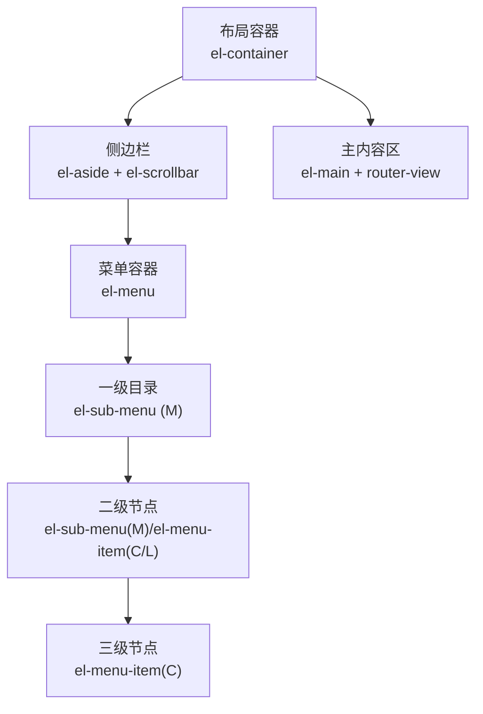
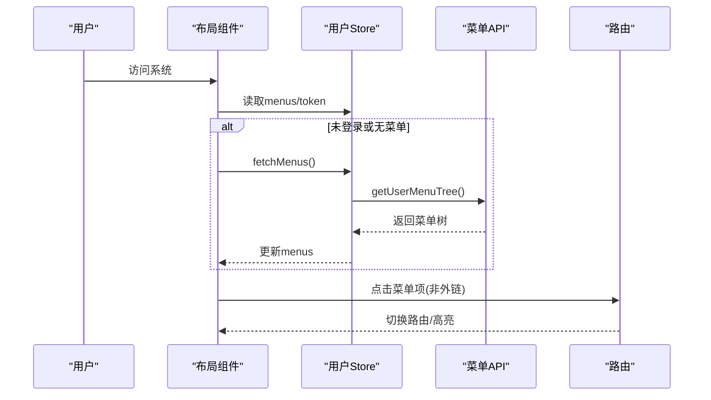
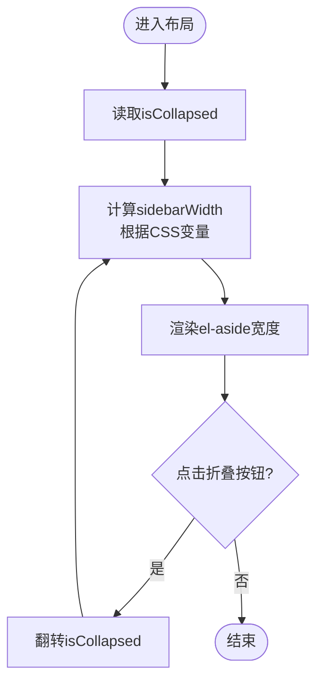
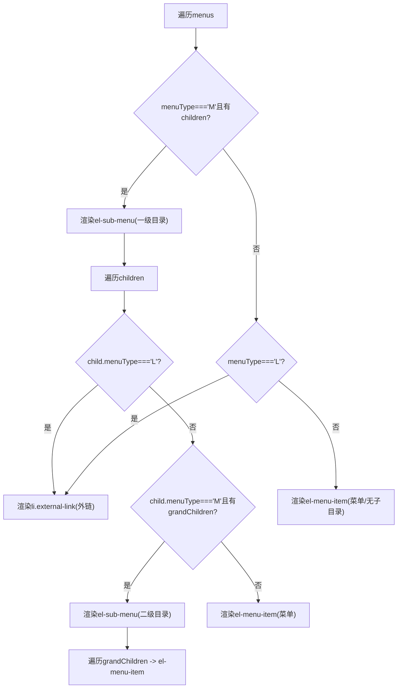
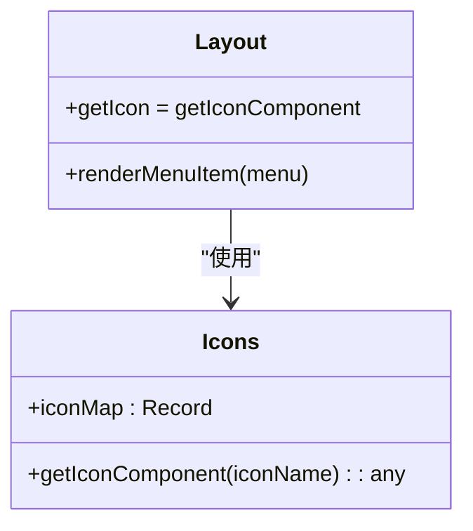
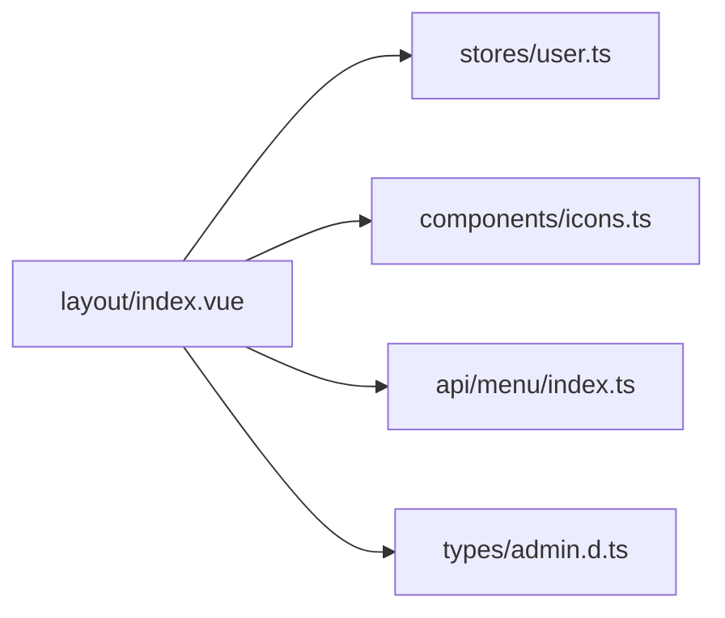

# 侧边栏导航组件

<cite>
**本文引用的文件**   
- [class_record_admin_front/src/views/layout/index.vue](file://class_record_admin_front/src/views/layout/index.vue)
- [class_record_admin_front/src/views/layout/index.scss](file://class_record_admin_front/src/views/layout/index.scss)
- [class_record_admin_front/src/components/icons.ts](file://class_record_admin_front/src/components/icons.ts)
- [class_record_admin_front/src/stores/user.ts](file://class_record_admin_front/src/stores/user.ts)
- [class_record_admin_front/src/api/menu/index.ts](file://class_record_admin_front/src/api/menu/index.ts)
- [class_record_admin_front/src/types/admin.d.ts](file://class_record_admin_front/src/types/admin.d.ts)
</cite>

## 目录
1. [简介](#简介)
2. [项目结构](#项目结构)
3. [核心组件](#核心组件)
4. [架构总览](#架构总览)
5. [详细组件分析](#详细组件分析)
6. [依赖关系分析](#依赖关系分析)
7. [性能与体验优化](#性能与体验优化)
8. [故障排查指南](#故障排查指南)
9. [结论](#结论)
10. [附录：扩展与最佳实践](#附录扩展与最佳实践)

## 简介
本文件围绕“侧边栏导航组件”的实现进行系统化文档化，重点覆盖以下能力：
- 折叠/展开交互与宽度计算
- 菜单动态渲染机制（基于后端返回的树形数据）
- 多级菜单支持（目录、子目录、孙级菜单）
- 菜单类型处理逻辑（目录 M、菜单 C、外链 L）
- 图标组件的动态加载机制
- 滚动条处理与响应式适配细节
- 自定义菜单项与扩展功能的开发指南与最佳实践

## 项目结构
侧边栏位于布局页面中，由布局容器、侧边栏区域、主内容区组成。侧边栏内部使用 Element Plus 的 el-menu 与 el-sub-menu 组合实现层级展示，并通过 computed 属性与 store 联动完成数据驱动渲染。

图表来源
- [class_record_admin_front/src/views/layout/index.vue:90-162](file://class_record_admin_front/src/views/layout/index.vue#L90-L162)

章节来源
- [class_record_admin_front/src/views/layout/index.vue:90-162](file://class_record_admin_front/src/views/layout/index.vue#L90-L162)

## 核心组件
- 布局与侧边栏容器：负责整体布局、侧边栏宽度控制、折叠按钮、滚动区域等。
- 菜单渲染器：根据用户权限树动态生成多级菜单，区分目录、菜单、外链三类节点。
- 图标动态加载器：通过名称映射到具体图标组件，按需渲染。
- 状态管理：从 Pinia Store 获取并缓存用户菜单树，提供刷新与清理能力。
- API 层：提供获取用户菜单树的接口封装。

章节来源
- [class_record_admin_front/src/views/layout/index.vue:1-87](file://class_record_admin_front/src/views/layout/index.vue#L1-L87)
- [class_record_admin_front/src/components/icons.ts:19-45](file://class_record_admin_front/src/components/icons.ts#L19-L45)
- [class_record_admin_front/src/stores/user.ts:5-48](file://class_record_admin_front/src/stores/user.ts#L5-L48)
- [class_record_admin_front/src/api/menu/index.ts:23-25](file://class_record_admin_front/src/api/menu/index.ts#L23-L25)

## 架构总览
侧边栏的数据流与控制流如下：
- 初始化时检查 token 与本地菜单缓存，若缺失则调用接口拉取用户菜单树。
- 菜单树进入 Store 后，布局组件通过 computed 暴露给模板渲染。
- 模板依据 menuType 分支渲染不同节点类型，外链类型直接打开新窗口，其余走路由。
- 图标通过 getIconComponent 动态解析为组件实例，避免硬编码。

图表来源
- [class_record_admin_front/src/views/layout/index.vue:50-54](file://class_record_admin_front/src/views/layout/index.vue#L50-L54)
- [class_record_admin_front/src/stores/user.ts:30-35](file://class_record_admin_front/src/stores/user.ts#L30-L35)
- [class_record_admin_front/src/api/menu/index.ts:23-25](file://class_record_admin_front/src/api/menu/index.ts#L23-L25)

## 详细组件分析

### 折叠/展开与宽度计算
- 折叠状态 isCollapsed 控制 el-aside 的 width 计算，通过 CSS 变量 --sidebar-width 与 --sidebar-collapsed-width 切换。
- 折叠按钮切换 isCollapsed，同时配合 transition 动画平滑过渡。
- 侧边栏头部 logo 文本在折叠时隐藏，保留图标以维持品牌识别。

图表来源
- [class_record_admin_front/src/views/layout/index.vue:25-29](file://class_record_admin_front/src/views/layout/index.vue#L25-L29)
- [class_record_admin_front/src/views/layout/index.vue:56-58](file://class_record_admin_front/src/views/layout/index.vue#L56-L58)
- [class_record_admin_front/src/views/layout/index.scss:6-13](file://class_record_admin_front/src/views/layout/index.scss#L6-L13)

章节来源
- [class_record_admin_front/src/views/layout/index.vue:25-29](file://class_record_admin_front/src/views/layout/index.vue#L25-L29)
- [class_record_admin_front/src/views/layout/index.vue:56-58](file://class_record_admin_front/src/views/layout/index.vue#L56-L58)
- [class_record_admin_front/src/views/layout/index.scss:6-13](file://class_record_admin_front/src/views/layout/index.scss#L6-L13)

### 菜单动态渲染机制
- 数据源：userStore.menus 为树形结构，包含 id、menuName、menuType、path、icon、children 等字段。
- 渲染策略：
  - 一级目录（menuType === 'M' 且存在 children）渲染为 el-sub-menu。
  - 二级节点：
    - 外链（menuType === 'L'）渲染为 li.external-link，点击触发 window.open。
    - 子目录（menuType === 'M' 且有孙子节点）继续嵌套 el-sub-menu。
    - 普通菜单（menuType === 'C' 或无子节点的 M）渲染为 el-menu-item。
- 路径解析：resolveMenuPath 确保 path 以 / 开头，否则拼接根路径；当 path 为空时使用 id 作为 index。

图表来源
- [class_record_admin_front/src/views/layout/index.vue:110-153](file://class_record_admin_front/src/views/layout/index.vue#L110-L153)
- [class_record_admin_front/src/views/layout/index.vue:43-46](file://class_record_admin_front/src/views/layout/index.vue#L43-L46)

章节来源
- [class_record_admin_front/src/views/layout/index.vue:110-153](file://class_record_admin_front/src/views/layout/index.vue#L110-L153)
- [class_record_admin_front/src/views/layout/index.vue:43-46](file://class_record_admin_front/src/views/layout/index.vue#L43-L46)

### 菜单类型处理（目录 M、菜单 C、外链 L）
- 目录 M：用于分组组织，可包含子菜单；若无子菜单则降级为普通菜单项。
- 菜单 C：最终可点击的页面入口，走路由跳转。
- 外链 L：不进入应用路由，点击在新窗口打开目标地址。
- 类型定义来源于 SysMenuResponse.menuType，支持 M/C/F/L，其中 F 为按钮类型，不在侧边栏渲染。

章节来源
- [class_record_admin_front/src/types/admin.d.ts:35-51](file://class_record_admin_front/src/types/admin.d.ts#L35-L51)
- [class_record_admin_front/src/views/layout/index.vue:110-153](file://class_record_admin_front/src/views/layout/index.vue#L110-L153)

### 图标组件动态加载机制
- 图标集中注册于 iconMap，键名为图标名，值为 @element-plus/icons-vue 导出的组件。
- getIconComponent 根据菜单项的 icon 字段返回对应组件引用，若不存在则返回 null。
- 模板中使用 <component :is="getIcon(menu.icon)" /> 动态挂载图标，避免硬编码与重复 import。

图表来源
- [class_record_admin_front/src/components/icons.ts:19-45](file://class_record_admin_front/src/components/icons.ts#L19-L45)
- [class_record_admin_front/src/views/layout/index.vue:41](file://class_record_admin_front/src/views/layout/index.vue#L41)

章节来源
- [class_record_admin_front/src/components/icons.ts:19-45](file://class_record_admin_front/src/components/icons.ts#L19-L45)
- [class_record_admin_front/src/views/layout/index.vue:41](file://class_record_admin_front/src/views/layout/index.vue#L41)

### 侧边栏宽度计算与滚动条处理
- 宽度：通过 computed sidebarWidth 绑定 CSS 变量，结合 transition 实现平滑过渡。
- 滚动：el-scrollbar 包裹 el-menu，保证长菜单可滚动；侧边栏 overflow:hidden 防止溢出影响布局。
- 样式：侧边栏背景、边框、头部高度、折叠按钮 hover 效果等均在 SCSS 中统一维护。

章节来源
- [class_record_admin_front/src/views/layout/index.vue:27-29](file://class_record_admin_front/src/views/layout/index.vue#L27-L29)
- [class_record_admin_front/src/views/layout/index.vue:102-155](file://class_record_admin_front/src/views/layout/index.vue#L102-L155)
- [class_record_admin_front/src/views/layout/index.scss:6-13](file://class_record_admin_front/src/views/layout/index.scss#L6-L13)
- [class_record_admin_front/src/views/layout/index.scss:51-58](file://class_record_admin_front/src/views/layout/index.scss#L51-L58)

### 响应式适配
- 当前实现主要依赖 CSS 变量与 flex 布局，未内置断点判断。
- 建议在移动端场景下：
  - 将侧边栏默认收起，通过遮罩+抽屉形式呈现。
  - 或在小屏下隐藏侧边栏，提供顶部汉堡菜单触发。
- 可在布局组件中监听窗口尺寸变化，动态调整 isCollapsed 或显示模式。

[本节为通用建议，不涉及具体代码文件]

## 依赖关系分析
- 布局组件依赖：
  - userStore：提供 menus、fetchMenus、clearAll 等方法。
  - icons.ts：提供 getIconComponent 与图标注册表。
  - api/menu：提供 getUserMenuTree 接口。
  - Element Plus：el-menu、el-sub-menu、el-scrollbar、el-icon 等。
- 类型定义：SysMenuResponse 定义了菜单树结构与字段约束。

图表来源
- [class_record_admin_front/src/views/layout/index.vue:1-87](file://class_record_admin_front/src/views/layout/index.vue#L1-L87)
- [class_record_admin_front/src/stores/user.ts:5-48](file://class_record_admin_front/src/stores/user.ts#L5-L48)
- [class_record_admin_front/src/components/icons.ts:19-45](file://class_record_admin_front/src/components/icons.ts#L19-L45)
- [class_record_admin_front/src/api/menu/index.ts:23-25](file://class_record_admin_front/src/api/menu/index.ts#L23-L25)
- [class_record_admin_front/src/types/admin.d.ts:35-51](file://class_record_admin_front/src/types/admin.d.ts#L35-L51)

章节来源
- [class_record_admin_front/src/views/layout/index.vue:1-87](file://class_record_admin_front/src/views/layout/index.vue#L1-L87)
- [class_record_admin_front/src/stores/user.ts:5-48](file://class_record_admin_front/src/stores/user.ts#L5-L48)
- [class_record_admin_front/src/components/icons.ts:19-45](file://class_record_admin_front/src/components/icons.ts#L19-L45)
- [class_record_admin_front/src/api/menu/index.ts:23-25](file://class_record_admin_front/src/api/menu/index.ts#L23-L25)
- [class_record_admin_front/src/types/admin.d.ts:35-51](file://class_record_admin_front/src/types/admin.d.ts#L35-L51)

## 性能与体验优化
- 菜单树缓存：已在 userStore 中缓存，避免重复请求；首次加载后仅在 token 存在且菜单为空时拉取。
- 图标按需加载：通过 map 查找组件引用，减少模板中的条件判断开销。
- 路由高亮：使用 default-active 绑定 route.path，提升导航一致性。
- 外链行为：外链使用 window.open，避免路由冲突与额外跳转成本。
- 滚动体验：el-scrollbar 提供原生滚动增强，保持侧边栏内容过长时的可用性。

章节来源
- [class_record_admin_front/src/views/layout/index.vue:50-54](file://class_record_admin_front/src/views/layout/index.vue#L50-L54)
- [class_record_admin_front/src/stores/user.ts:30-35](file://class_record_admin_front/src/stores/user.ts#L30-L35)
- [class_record_admin_front/src/views/layout/index.vue:103-108](file://class_record_admin_front/src/views/layout/index.vue#L103-L108)
- [class_record_admin_front/src/views/layout/index.vue:84-86](file://class_record_admin_front/src/views/layout/index.vue#L84-L86)

## 故障排查指南
- 菜单不显示：
  - 检查 userStore.menus 是否为空，确认 fetchMenus 是否被调用。
  - 校验后端返回的 menuType 是否符合预期（M/C/L）。
- 外链无效：
  - 确认菜单项 path 为完整 URL，且 openExternalLink 被正确触发。
- 图标不显示：
  - 检查菜单 icon 字段是否在 iconMap 中存在。
- 折叠异常：
  - 确认 CSS 变量 --sidebar-width 与 --sidebar-collapsed-width 已定义。
  - 检查 isCollapsed 状态是否被外部修改。

章节来源
- [class_record_admin_front/src/views/layout/index.vue:50-54](file://class_record_admin_front/src/views/layout/index.vue#L50-L54)
- [class_record_admin_front/src/views/layout/index.vue:84-86](file://class_record_admin_front/src/views/layout/index.vue#L84-L86)
- [class_record_admin_front/src/components/icons.ts:42-45](file://class_record_admin_front/src/components/icons.ts#L42-L45)
- [class_record_admin_front/src/views/layout/index.scss:6-13](file://class_record_admin_front/src/views/layout/index.scss#L6-L13)

## 结论
该侧边栏导航组件通过数据驱动的菜单树渲染、清晰的类型分支处理与动态图标加载，实现了灵活的多级导航能力。结合折叠交互与滚动优化，提供了良好的用户体验。后续可通过响应式适配与更丰富的菜单扩展点进一步提升可定制性与跨端兼容性。

## 附录：扩展与最佳实践
- 自定义菜单项
  - 在 iconMap 中新增图标组件，并在菜单数据中设置 icon 字段即可自动渲染。
  - 如需自定义菜单项行为，可在模板分支中添加新的 v-if 条件，例如添加徽章、操作按钮等。
- 扩展菜单功能
  - 增加权限控制：在渲染前过滤 perms 字段，仅展示具备权限的菜单。
  - 增加懒加载：对深层级菜单采用异步加载，减少首屏压力。
  - 国际化：将 menuName 替换为 i18n key，按语言环境动态显示。
- 最佳实践
  - 保持菜单树扁平化与层级不超过三层，避免过深导致导航复杂。
  - 外链地址需做安全校验，避免注入风险。
  - 使用 CSS 变量统一管理主题与尺寸，便于多主题切换。

[本节为通用指导，不涉及具体代码文件]