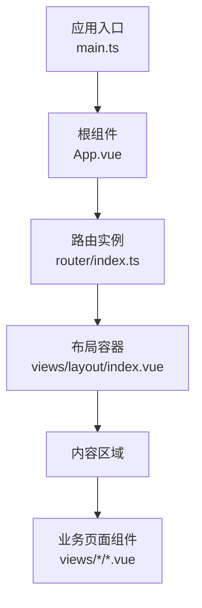
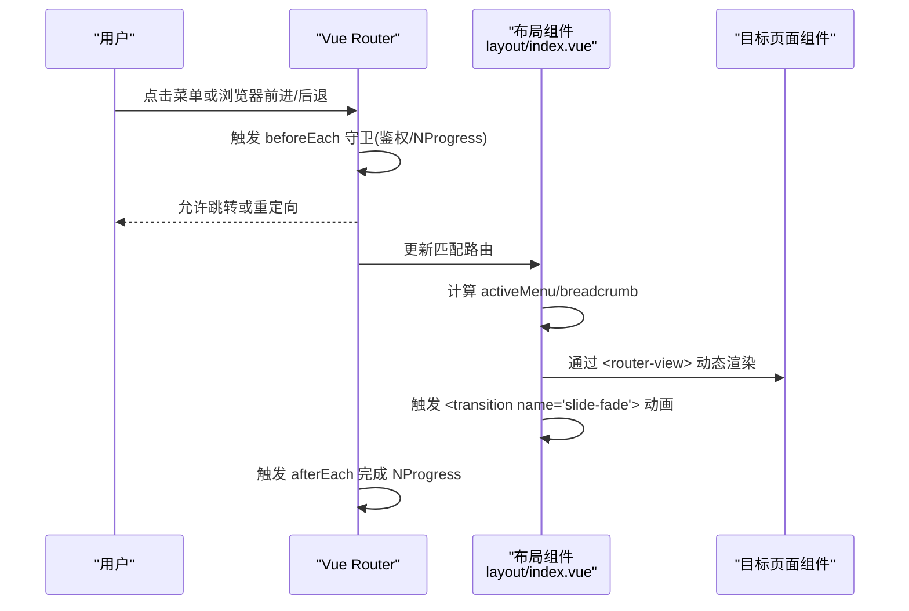
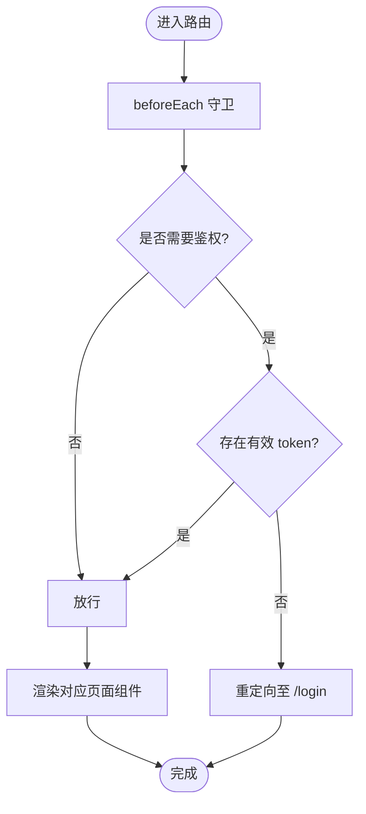
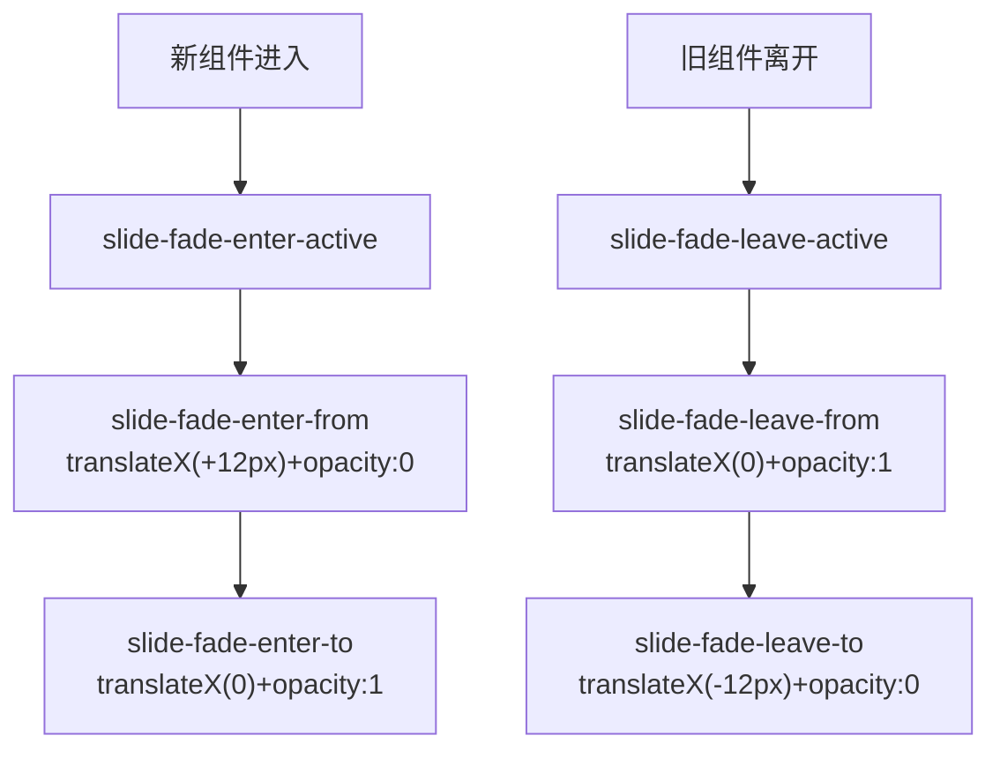
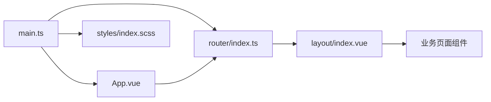

# 内容区域组件

<cite>
**本文引用的文件**
- [src/main.ts](file://class_record_admin_front/src/main.ts)
- [src/App.vue](file://class_record_admin_front/src/App.vue)
- [src/router/index.ts](file://class_record_admin_front/src/router/index.ts)
- [src/views/layout/index.vue](file://class_record_admin_front/src/views/layout/index.vue)
- [src/views/layout/index.scss](file://class_record_admin_front/src/views/layout/index.scss)
- [src/styles/index.scss](file://class_record_admin_front/src/styles/index.scss)
</cite>

## 目录
1. [简介](#简介)
2. [项目结构](#项目结构)
3. [核心组件](#核心组件)
4. [架构总览](#架构总览)
5. [详细组件分析](#详细组件分析)
6. [依赖关系分析](#依赖关系分析)
7. [性能与缓存优化](#性能与缓存优化)
8. [错误边界与异常处理](#错误边界与异常处理)
9. [故障排查指南](#故障排查指南)
10. [结论](#结论)
11. [附录：开发指南与最佳实践](#附录开发指南与最佳实践)

## 简介
本文件围绕“内容区域组件”（即布局容器中的页面渲染区域）进行深入解析，重点覆盖以下主题：
- Vue Router 集成与动态路由视图渲染机制
- 页面切换过渡动画的实现原理与配置
- 组件生命周期管理与状态流转
- 动态组件加载、路由守卫与权限控制
- 页面缓存策略与性能优化方案
- 错误边界处理思路与落地建议
- 自定义页面布局与添加切换效果的开发指南与最佳实践

## 项目结构
本项目采用基于 Vue 3 + Vue Router 的后台管理前端。内容区域由布局组件承载，并通过 <router-view> 动态渲染当前路由对应的页面组件。

图示来源
- [src/main.ts:1-22](file://class_record_admin_front/src/main.ts#L1-L22)
- [src/App.vue:1-10](file://class_record_admin_front/src/App.vue#L1-L10)
- [src/router/index.ts:1-160](file://class_record_admin_front/src/router/index.ts#L1-L160)
- [src/views/layout/index.vue:1-216](file://class_record_admin_front/src/views/layout/index.vue#L1-L216)

章节来源
- [src/main.ts:1-22](file://class_record_admin_front/src/main.ts#L1-L22)
- [src/App.vue:1-10](file://class_record_admin_front/src/App.vue#L1-L10)
- [src/router/index.ts:1-160](file://class_record_admin_front/src/router/index.ts#L1-L160)
- [src/views/layout/index.vue:1-216](file://class_record_admin_front/src/views/layout/index.vue#L1-L216)

## 核心组件
- 应用入口 main.ts：创建 Vue 应用、注册 Pinia、Element Plus、初始化主题 Store、挂载路由并启动应用。
- 根组件 App.vue：作为全局挂载点，包含 <router-view /> 用于顶层路由渲染。
- 路由 router/index.ts：定义静态路由表、懒加载页面组件、NProgress 进度条、beforeEach/afterEach 守卫。
- 布局组件 views/layout/index.vue：侧边栏、顶部导航、面包屑、用户菜单与内容区域；在内容区域使用 <transition> 包裹 <router-view> 实现页面切换动画。

章节来源
- [src/main.ts:1-22](file://class_record_admin_front/src/main.ts#L1-L22)
- [src/App.vue:1-10](file://class_record_admin_front/src/App.vue#L1-L10)
- [src/router/index.ts:1-160](file://class_record_admin_front/src/router/index.ts#L1-L160)
- [src/views/layout/index.vue:1-216](file://class_record_admin_front/src/views/layout/index.vue#L1-L216)

## 架构总览
内容区域组件位于布局容器中，负责将当前路由匹配的页面组件渲染到指定区域，并提供统一的头部、侧边栏与面包屑信息。

图示来源
- [src/router/index.ts:135-157](file://class_record_admin_front/src/router/index.ts#L135-L157)
- [src/views/layout/index.vue:204-210](file://class_record_admin_front/src/views/layout/index.vue#L204-L210)

## 详细组件分析

### 路由与动态渲染机制
- 路由定义：所有业务页面以懒加载方式引入，减少首屏体积。
- 动态渲染：布局组件内使用 <router-view v-slot="{ Component }"> 获取当前组件，并通过 <component :is="Component"> 动态渲染。
- 路由守卫：beforeEach 中读取本地 token 进行鉴权，noAuth 标记的页面可免登录访问；afterEach 关闭进度条。

图示来源
- [src/router/index.ts:135-157](file://class_record_admin_front/src/router/index.ts#L135-L157)

章节来源
- [src/router/index.ts:1-160](file://class_record_admin_front/src/router/index.ts#L1-L160)
- [src/views/layout/index.vue:204-210](file://class_record_admin_front/src/views/layout/index.vue#L204-L210)

### 页面切换动画实现原理
- 过渡容器：在 <router-view> 外层包裹 <transition name="slide-fade" mode="out-in">，确保页面切换时先出后进，避免闪烁。
- 动画样式：通过全局样式定义 slide-fade-enter-active/leave-active 等类名，实现位移与透明度变化。
- 其他过渡：侧边栏 Logo 文本使用 fade 过渡，提升交互细节。

图示来源
- [src/views/layout/index.vue:205-209](file://class_record_admin_front/src/views/layout/index.vue#L205-L209)
- [src/styles/index.scss:381-408](file://class_record_admin_front/src/styles/index.scss#L381-L408)

章节来源
- [src/views/layout/index.vue:204-210](file://class_record_admin_front/src/views/layout/index.vue#L204-L210)
- [src/styles/index.scss:381-408](file://class_record_admin_front/src/styles/index.scss#L381-L408)

### 组件生命周期管理
- 布局组件 onMounted：当用户已登录且菜单为空时，主动拉取菜单数据，保证侧边栏可用。
- 路由切换：每次路由变更会触发新页面组件的创建与销毁，配合过渡动画完成视觉切换。
- 主题切换：通过 store 切换 data-theme，全局 CSS 变量驱动 UI 主题平滑过渡。

章节来源
- [src/views/layout/index.vue:50-54](file://class_record_admin_front/src/views/layout/index.vue#L50-L54)
- [src/styles/index.scss:410-421](file://class_record_admin_front/src/styles/index.scss#L410-L421)

### Vue Router 集成要点
- 历史模式：使用 createWebHistory 并传入 BASE_URL，适配部署路径。
- 懒加载：所有页面组件通过 () => import(...) 按需加载，降低初始包体。
- 重定向：根路径重定向至仪表盘；未匹配路由统一重定向至仪表盘。
- 进度条：结合 NProgress 在路由切换前后显示/隐藏。

章节来源
- [src/router/index.ts:1-160](file://class_record_admin_front/src/router/index.ts#L1-L160)

### 动态组件加载
- 路由级懒加载：每个路由的 component 字段均为异步函数，仅在访问该路由时加载对应模块。
- 运行时动态渲染：布局组件通过 <component :is="Component"> 渲染当前路由组件，无需显式维护映射表。

章节来源
- [src/router/index.ts:10-132](file://class_record_admin_front/src/router/index.ts#L10-L132)
- [src/views/layout/index.vue:205-209](file://class_record_admin_front/src/views/layout/index.vue#L205-L209)

### 过渡动画配置
- 名称与模式：name="slide-fade"，mode="out-in" 确保顺序过渡。
- 关键类名：enter-active/leave-active 定义过渡时长与缓动；enter-from/leave-to 定义起始/结束状态。
- 全局样式：统一放置在 styles/index.scss，便于复用与维护。

章节来源
- [src/views/layout/index.vue:205-209](file://class_record_admin_front/src/views/layout/index.vue#L205-L209)
- [src/styles/index.scss:381-408](file://class_record_admin_front/src/styles/index.scss#L381-L408)

## 依赖关系分析
- main.ts 依赖：Pinia、Element Plus、主题 Store、路由、全局样式。
- App.vue 依赖：仅作为挂载点，包含 <router-view>。
- router/index.ts 依赖：vue-router、nprogress。
- layout/index.vue 依赖：vue-router、element-plus、用户与主题 Store、图标工具、请求工具。

图示来源
- [src/main.ts:1-22](file://class_record_admin_front/src/main.ts#L1-L22)
- [src/App.vue:1-10](file://class_record_admin_front/src/App.vue#L1-L10)
- [src/router/index.ts:1-160](file://class_record_admin_front/src/router/index.ts#L1-L160)
- [src/views/layout/index.vue:1-216](file://class_record_admin_front/src/views/layout/index.vue#L1-L216)
- [src/styles/index.scss:1-493](file://class_record_admin_front/src/styles/index.scss#L1-L493)

章节来源
- [src/main.ts:1-22](file://class_record_admin_front/src/main.ts#L1-L22)
- [src/App.vue:1-10](file://class_record_admin_front/src/App.vue#L1-L10)
- [src/router/index.ts:1-160](file://class_record_admin_front/src/router/index.ts#L1-L160)
- [src/views/layout/index.vue:1-216](file://class_record_admin_front/src/views/layout/index.vue#L1-L216)
- [src/styles/index.scss:1-493](file://class_record_admin_front/src/styles/index.scss#L1-L493)

## 性能与缓存优化
- 路由懒加载：已在路由层实现，显著降低首屏资源体积。
- 页面缓存策略：当前未在 <router-view> 外层使用 <keep-alive>，页面切换时会重新创建组件实例。若需保留滚动位置或表单状态，可在布局层对特定路由启用 keep-alive，并结合 include/exclude 精确控制。
- 过渡动画性能：当前动画为轻量位移与透明度变化，开销较小。应避免在动画期间执行重型计算或大量 DOM 操作。
- 主题切换：通过 CSS 变量与全局 transition 实现平滑切换，注意在复杂页面下控制过渡范围，避免不必要的重排。

章节来源
- [src/router/index.ts:10-132](file://class_record_admin_front/src/router/index.ts#L10-L132)
- [src/views/layout/index.vue:205-209](file://class_record_admin_front/src/views/layout/index.vue#L205-L209)
- [src/styles/index.scss:410-421](file://class_record_admin_front/src/styles/index.scss#L410-L421)

## 错误边界与异常处理
- 路由级错误：当前未配置路由级错误页或全局错误捕获。建议在路由层增加 catch 与 fallback 页面，或在布局层提供兜底视图。
- 组件级错误：可在布局层引入 ErrorBoundary 组件（如第三方库或自实现），捕获子树渲染异常并展示友好提示。
- 网络与鉴权错误：beforeEach 中已做基础鉴权，但可进一步结合响应拦截器统一处理 401/403 并重定向或刷新令牌。

章节来源
- [src/router/index.ts:135-157](file://class_record_admin_front/src/router/index.ts#L135-L157)

## 故障排查指南
- 页面不渲染：检查路由 path 与组件懒加载路径是否正确；确认 beforeEnter/全局 beforeEach 是否意外重定向。
- 动画不生效：确认 <transition> 的 name 与全局样式类名一致；检查 mode="out-in" 是否被覆盖；查看浏览器控制台是否有 CSS 冲突。
- 菜单高亮异常：activeMenu 基于 route.path 计算，确认路由层级与 index 值是否匹配。
- 主题切换卡顿：检查是否存在大范围 transition 属性导致重绘；必要时在切换时临时禁用全局过渡。

章节来源
- [src/views/layout/index.vue:31-39](file://class_record_admin_front/src/views/layout/index.vue#L31-L39)
- [src/views/layout/index.vue:205-209](file://class_record_admin_front/src/views/layout/index.vue#L205-L209)
- [src/styles/index.scss:381-408](file://class_record_admin_front/src/styles/index.scss#L381-L408)

## 结论
内容区域组件通过 Vue Router 的动态渲染能力与 <transition> 的过渡动画，实现了流畅的页面切换体验。当前实现简洁清晰，具备良好扩展性。后续可根据业务需要引入页面缓存、错误边界与更丰富的过渡效果，进一步提升用户体验与健壮性。

## 附录：开发指南与最佳实践
- 自定义页面布局
  - 在路由表中新增父级路由指向新的布局组件，并在其 children 中声明具体页面。
  - 在布局组件中使用 <router-view> 作为内容占位，并可在其外层包裹 <transition> 实现切换动画。
- 添加页面切换效果
  - 在布局层为 <router-view> 添加 <transition name="your-name" mode="out-in">。
  - 在全局样式中定义 enter-active/leave-active 与 enter-from/leave-to 等类名，控制位移、缩放、透明度等。
- 页面缓存策略
  - 在布局层使用 <keep-alive> 包裹 <router-view>，并通过 include/exclude 精确控制缓存页面。
  - 对于列表页，建议缓存以保持滚动位置与筛选条件；对于表单页，谨慎缓存以避免脏数据。
- 错误边界处理
  - 在布局层引入错误边界组件，捕获子树异常并展示重试按钮。
  - 在路由层增加通用错误页，处理未知路由或加载失败场景。
- 性能优化建议
  - 保持路由懒加载，避免一次性加载全部页面。
  - 合理使用 keep-alive，避免缓存过多大组件。
  - 动画尽量使用 transform 与 opacity，减少布局抖动。
  - 图片与静态资源使用 CDN 与压缩，开启 Gzip/Brotli。

[本节为概念性指导，不直接分析具体文件]