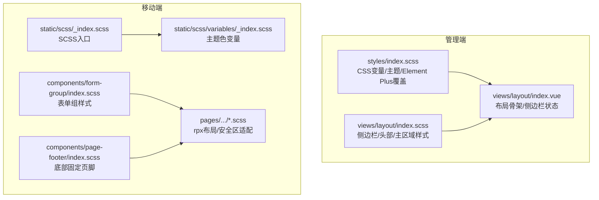
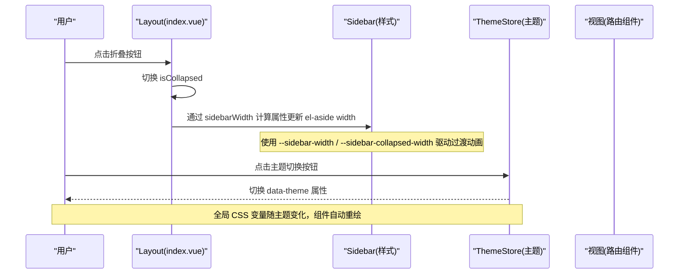
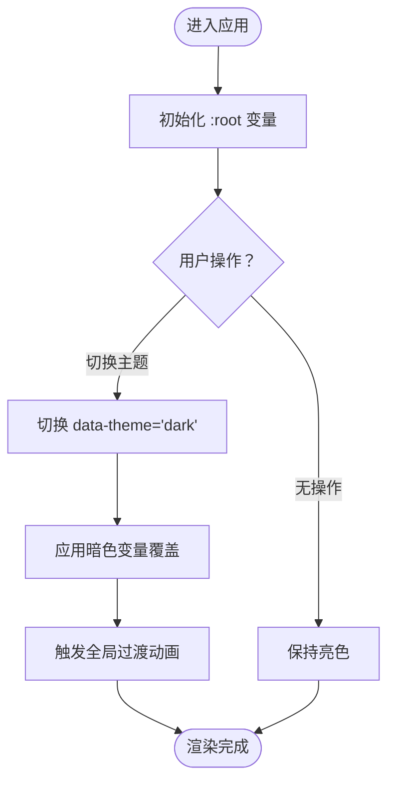
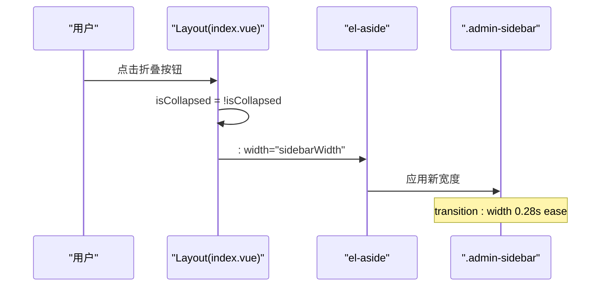
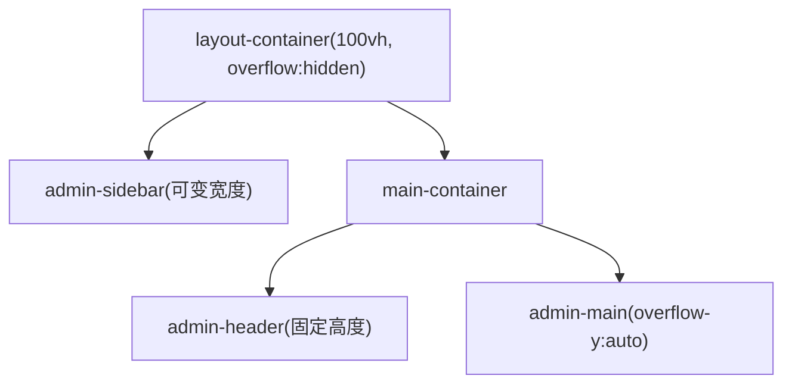
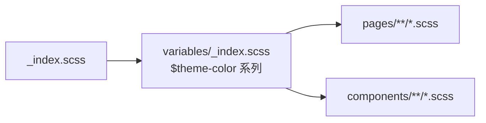
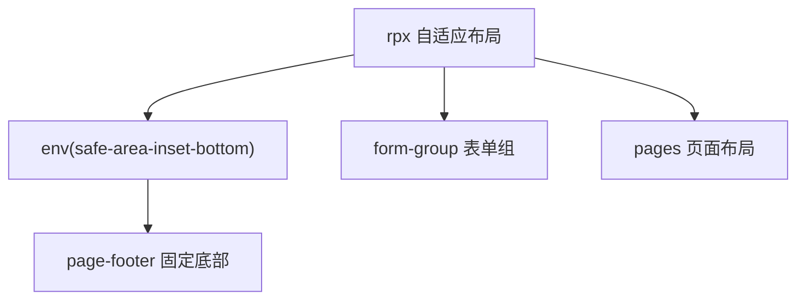
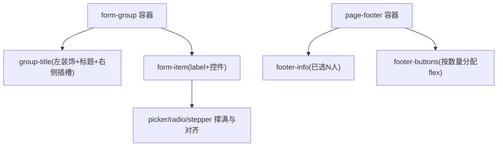
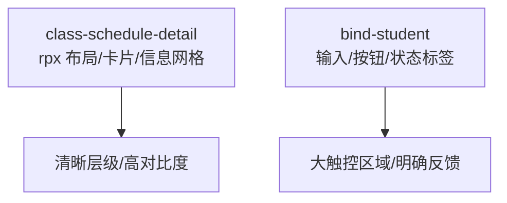
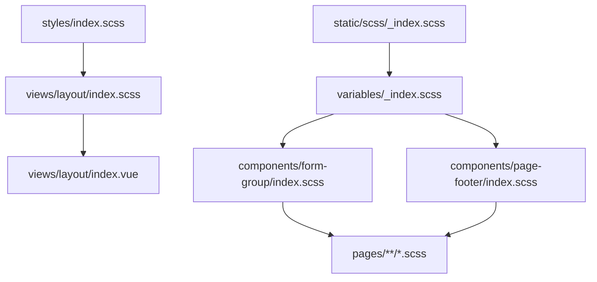

# 响应式布局适配

<cite>
**本文引用的文件**   
- [class_record_admin_front/src/styles/index.scss](file://class_record_admin_front/src/styles/index.scss)
- [class_record_admin_front/src/views/layout/index.vue](file://class_record_admin_front/src/views/layout/index.vue)
- [class_record_admin_front/src/views/layout/index.scss](file://class_record_admin_front/src/views/layout/index.scss)
- [class_times_record/src/static/scss/_index.scss](file://class_times_record/src/static/scss/_index.scss)
- [class_times_record/src/static/scss/variables/_index.scss](file://class_times_record/src/static/scss/variables/_index.scss)
- [class_times_record/src/components/form-group/index.scss](file://class_times_record/src/components/form-group/index.scss)
- [class_times_record/src/components/page-footer/index.scss](file://class_times_record/src/components/page-footer/index.scss)
- [class_times_record/src/pages/main/teacher/class-schedule-detail/index.scss](file://class_times_record/src/pages/main/teacher/class-schedule-detail/index.scss)
- [class_times_record/src/pages/main/parent/bind-student/index.scss](file://class_times_record/src/pages/main/parent/bind-student/index.scss)
</cite>

## 目录
1. [引言](#引言)
2. [项目结构](#项目结构)
3. [核心组件](#核心组件)
4. [架构总览](#架构总览)
5. [详细组件分析](#详细组件分析)
6. [依赖关系分析](#依赖关系分析)
7. [性能考量](#性能考量)
8. [故障排查指南](#故障排查指南)
9. [结论](#结论)
10. [附录：最佳实践与自定义适配规则](#附录最佳实践与自定义适配规则)

## 引言
本文件围绕“响应式布局适配”目标，系统梳理并解析本项目在管理端（Vue + Element Plus）与移动端（uni-app）两套前端的样式体系、断点策略、主题变量管理与跨设备兼容实现。重点覆盖：
- CSS 变量系统与主题切换机制
- 侧边栏宽度动态计算与折叠动画
- 布局容器自适应与页面内容区滚动
- SCSS 组织方式与主题变量管理
- 移动端 rpx 单位与小程序安全区适配
- 元素显示隐藏控制逻辑与过渡动画
- 响应式设计最佳实践与自定义适配规则开发指南

## 项目结构
本项目包含两个前端工程：
- class_record_admin_front：基于 Vue + Element Plus 的管理后台，采用 CSS 变量 + SCSS 全局样式覆盖的方式构建设计系统与主题。
- class_times_record：基于 uni-app 的移动端应用，使用 SCSS 变量与 rpx 单位进行移动端适配与安全区处理。

**图表来源**
- [class_record_admin_front/src/styles/index.scss:1-120](file://class_record_admin_front/src/styles/index.scss#L1-L120)
- [class_record_admin_front/src/views/layout/index.vue:1-60](file://class_record_admin_front/src/views/layout/index.vue#L1-L60)
- [class_record_admin_front/src/views/layout/index.scss:1-40](file://class_record_admin_front/src/views/layout/index.scss#L1-L40)
- [class_times_record/src/static/scss/_index.scss:1-2](file://class_times_record/src/static/scss/_index.scss#L1-L2)
- [class_times_record/src/static/scss/variables/_index.scss:1-8](file://class_times_record/src/static/scss/variables/_index.scss#L1-L8)
- [class_times_record/src/components/form-group/index.scss:1-60](file://class_times_record/src/components/form-group/index.scss#L1-L60)
- [class_times_record/src/components/page-footer/index.scss:1-30](file://class_times_record/src/components/page-footer/index.scss#L1-L30)

**章节来源**
- [class_record_admin_front/src/styles/index.scss:1-120](file://class_record_admin_front/src/styles/index.scss#L1-L120)
- [class_record_admin_front/src/views/layout/index.vue:1-60](file://class_record_admin_front/src/views/layout/index.vue#L1-L60)
- [class_record_admin_front/src/views/layout/index.scss:1-40](file://class_record_admin_front/src/views/layout/index.scss#L1-L40)
- [class_times_record/src/static/scss/_index.scss:1-2](file://class_times_record/src/static/scss/_index.scss#L1-L2)
- [class_times_record/src/static/scss/variables/_index.scss:1-8](file://class_times_record/src/static/scss/variables/_index.scss#L1-L8)

## 核心组件
- 全局样式与设计系统（管理端）
  - 通过 :root 定义颜色、字体、布局尺寸等 CSS 变量，并提供 [data-theme="dark"] 暗色主题覆盖。
  - 对 Element Plus 组件进行主题级覆盖，统一按钮、表格、对话框、卡片、标签等视觉风格。
  - 提供通用页面容器、搜索栏、分页、过渡动画等基础样式工具类。
- 布局容器（管理端）
  - 左侧侧边栏支持折叠与展开，宽度由 CSS 变量驱动，配合 transition 实现平滑动画。
  - 顶部导航栏与主内容区高度自适应，主内容区可独立滚动。
- 移动端组件与页面（移动端）
  - 使用 SCSS 变量集中管理主题色，统一全站视觉。
  - 大量使用 rpx 单位实现屏幕自适应；在固定定位页脚中结合 env(safe-area-inset-bottom) 适配刘海屏。
  - 表单组与页脚组件提供一致的交互与布局规范。

**章节来源**
- [class_record_admin_front/src/styles/index.scss:8-112](file://class_record_admin_front/src/styles/index.scss#L8-L112)
- [class_record_admin_front/src/views/layout/index.scss:1-40](file://class_record_admin_front/src/views/layout/index.scss#L1-L40)
- [class_times_record/src/static/scss/variables/_index.scss:1-8](file://class_times_record/src/static/scss/variables/_index.scss#L1-L8)
- [class_times_record/src/components/page-footer/index.scss:12-22](file://class_times_record/src/components/page-footer/index.scss#L12-L22)

## 架构总览
下图展示管理端与移动端在响应式适配上的关键路径与数据流：

**图表来源**
- [class_record_admin_front/src/views/layout/index.vue:25-30](file://class_record_admin_front/src/views/layout/index.vue#L25-L30)
- [class_record_admin_front/src/views/layout/index.vue:154-181](file://class_record_admin_front/src/views/layout/index.vue#L154-L181)
- [class_record_admin_front/src/styles/index.scss:8-112](file://class_record_admin_front/src/styles/index.scss#L8-L112)
- [class_record_admin_front/src/views/layout/index.scss:6-13](file://class_record_admin_front/src/views/layout/index.scss#L6-L13)

## 详细组件分析

### 管理端：CSS 变量系统与主题切换
- 变量分层
  - 色彩与表面：主色、强调色、文本色、边框、阴影、滚动条等。
  - 排版：正文字体、标题字体、字号基线。
  - 布局：侧边栏宽度、头部高度等。
  - 组件：覆盖 Element Plus 的变量以统一风格。
- 主题切换
  - 通过根节点 data-theme 切换暗色变量集，所有使用 var() 的组件即时生效。
  - 为 html 添加过渡类，使背景、边框、颜色、阴影平滑过渡。

**图表来源**
- [class_record_admin_front/src/styles/index.scss:8-112](file://class_record_admin_front/src/styles/index.scss#L8-L112)
- [class_record_admin_front/src/styles/index.scss:410-421](file://class_record_admin_front/src/styles/index.scss#L410-L421)

**章节来源**
- [class_record_admin_front/src/styles/index.scss:8-112](file://class_record_admin_front/src/styles/index.scss#L8-L112)
- [class_record_admin_front/src/styles/index.scss:410-421](file://class_record_admin_front/src/styles/index.scss#L410-L421)

### 管理端：侧边栏宽度动态计算与折叠动画
- 宽度计算
  - 使用 computed 根据 isCollapsed 返回不同的 CSS 变量值作为 el-aside 的 width。
  - 侧边栏样式设置 transition: width 0.28s ease，实现平滑过渡。
- 菜单与图标
  - 折叠时隐藏 logo 文本，保留图标；展开时显示完整标识。
- 交互
  - 点击折叠按钮切换 isCollapsed，同时更新侧边栏宽度。

**图表来源**
- [class_record_admin_front/src/views/layout/index.vue:25-30](file://class_record_admin_front/src/views/layout/index.vue#L25-L30)
- [class_record_admin_front/src/views/layout/index.vue:91-101](file://class_record_admin_front/src/views/layout/index.vue#L91-L101)
- [class_record_admin_front/src/views/layout/index.scss:6-13](file://class_record_admin_front/src/views/layout/index.scss#L6-L13)

**章节来源**
- [class_record_admin_front/src/views/layout/index.vue:25-30](file://class_record_admin_front/src/views/layout/index.vue#L25-L30)
- [class_record_admin_front/src/views/layout/index.vue:91-101](file://class_record_admin_front/src/views/layout/index.vue#L91-L101)
- [class_record_admin_front/src/views/layout/index.scss:6-13](file://class_record_admin_front/src/views/layout/index.scss#L6-L13)

### 管理端：布局容器自适应与内容滚动
- 整体容器
  - layout-container 占满视口高度，overflow: hidden 防止外层滚动。
- 主内容区
  - admin-main 设置 background 与 padding，overflow-y: auto 实现内容区独立滚动。
- 头部
  - admin-header 固定高度，使用 CSS 变量控制高度与边框颜色。

**图表来源**
- [class_record_admin_front/src/views/layout/index.scss:1-4](file://class_record_admin_front/src/views/layout/index.scss#L1-L4)
- [class_record_admin_front/src/views/layout/index.scss:77-91](file://class_record_admin_front/src/views/layout/index.scss#L77-L91)
- [class_record_admin_front/src/views/layout/index.scss:129-133](file://class_record_admin_front/src/views/layout/index.scss#L129-L133)

**章节来源**
- [class_record_admin_front/src/views/layout/index.scss:1-4](file://class_record_admin_front/src/views/layout/index.scss#L1-L4)
- [class_record_admin_front/src/views/layout/index.scss:77-91](file://class_record_admin_front/src/views/layout/index.scss#L77-L91)
- [class_record_admin_front/src/views/layout/index.scss:129-133](file://class_record_admin_front/src/views/layout/index.scss#L129-L133)

### 移动端：SCSS 组织与主题变量管理
- 入口与变量
  - static/scss/_index.scss 作为 SCSS 入口，forward 到 variables/_index.scss。
  - variables/_index.scss 集中定义主题色及其深浅变体、默认背景色。
- 使用方式
  - 各页面与组件通过 $theme-color 等变量统一视觉，便于后续扩展多主题。

**图表来源**
- [class_times_record/src/static/scss/_index.scss:1-2](file://class_times_record/src/static/scss/_index.scss#L1-L2)
- [class_times_record/src/static/scss/variables/_index.scss:1-8](file://class_times_record/src/static/scss/variables/_index.scss#L1-L8)

**章节来源**
- [class_times_record/src/static/scss/_index.scss:1-2](file://class_times_record/src/static/scss/_index.scss#L1-L2)
- [class_times_record/src/static/scss/variables/_index.scss:1-8](file://class_times_record/src/static/scss/variables/_index.scss#L1-L8)

### 移动端：rpx 布局与安全区适配
- rpx 单位
  - 广泛使用 rpx 实现不同屏幕宽度的自适应布局，如 header、summary-card、info-item 等。
- 安全区适配
  - 固定页脚使用 env(safe-area-inset-bottom) 避免被刘海/底部横条遮挡。
- 组件化
  - form-group 与 page-footer 提供统一的表单与底部操作区样式，保证一致性。

**图表来源**
- [class_times_record/src/components/page-footer/index.scss:12-22](file://class_times_record/src/components/page-footer/index.scss#L12-L22)
- [class_times_record/src/components/form-group/index.scss:10-30](file://class_times_record/src/components/form-group/index.scss#L10-L30)
- [class_times_record/src/pages/main/teacher/class-schedule-detail/index.scss:1-20](file://class_times_record/src/pages/main/teacher/class-schedule-detail/index.scss#L1-L20)

**章节来源**
- [class_times_record/src/components/page-footer/index.scss:12-22](file://class_times_record/src/components/page-footer/index.scss#L12-L22)
- [class_times_record/src/components/form-group/index.scss:10-30](file://class_times_record/src/components/form-group/index.scss#L10-L30)
- [class_times_record/src/pages/main/teacher/class-schedule-detail/index.scss:1-20](file://class_times_record/src/pages/main/teacher/class-schedule-detail/index.scss#L1-L20)

### 移动端：表单组与页脚组件的响应式细节
- 表单组
  - 使用 flex 布局对齐 label 与控件，针对 picker、radio-group、stepper 做撑满与右对齐优化。
  - 通过 :deep() 穿透小程序组件影子节点，确保内部元素正确对齐。
- 页脚
  - 根据按钮数量动态调整 flex 比例，单按钮占满，双按钮主次区分，三/四按钮等宽。
  - 当存在信息区域时，按钮区域不占满宽度，且最小宽度约束。

**图表来源**
- [class_times_record/src/components/form-group/index.scss:24-96](file://class_times_record/src/components/form-group/index.scss#L24-L96)
- [class_times_record/src/components/form-group/index.scss:102-223](file://class_times_record/src/components/form-group/index.scss#L102-L223)
- [class_times_record/src/components/page-footer/index.scss:23-98](file://class_times_record/src/components/page-footer/index.scss#L23-L98)

**章节来源**
- [class_times_record/src/components/form-group/index.scss:24-96](file://class_times_record/src/components/form-group/index.scss#L24-L96)
- [class_times_record/src/components/form-group/index.scss:102-223](file://class_times_record/src/components/form-group/index.scss#L102-L223)
- [class_times_record/src/components/page-footer/index.scss:23-98](file://class_times_record/src/components/page-footer/index.scss#L23-L98)

### 移动端：页面级布局示例（课程表详情/绑定学生）
- 课程表详情页
  - 使用 rpx 控制内边距、圆角、阴影与信息网格间距，形成清晰的层级与可读性。
- 家长绑定学生页
  - 输入框、按钮、状态标签、订阅引导等模块均采用 rpx 与 flex 组合，保证在小屏设备上良好的触控体验。

**图表来源**
- [class_times_record/src/pages/main/teacher/class-schedule-detail/index.scss:1-40](file://class_times_record/src/pages/main/teacher/class-schedule-detail/index.scss#L1-L40)
- [class_times_record/src/pages/main/parent/bind-student/index.scss:1-80](file://class_times_record/src/pages/main/parent/bind-student/index.scss#L1-L80)

**章节来源**
- [class_times_record/src/pages/main/teacher/class-schedule-detail/index.scss:1-40](file://class_times_record/src/pages/main/teacher/class-schedule-detail/index.scss#L1-L40)
- [class_times_record/src/pages/main/parent/bind-student/index.scss:1-80](file://class_times_record/src/pages/main/parent/bind-student/index.scss#L1-L80)

## 依赖关系分析
- 管理端
  - styles/index.scss 提供全局 CSS 变量与 Element Plus 覆盖，被 layout 组件样式引用。
  - layout/index.vue 通过 computed 与 CSS 变量联动控制侧边栏宽度。
- 移动端
  - static/scss/_index.scss 引入 variables/_index.scss，供 components 与 pages 共享主题变量。
  - components/form-group 与 components/page-footer 为页面提供一致的基础样式。

**图表来源**
- [class_record_admin_front/src/styles/index.scss:8-112](file://class_record_admin_front/src/styles/index.scss#L8-L112)
- [class_record_admin_front/src/views/layout/index.scss:1-40](file://class_record_admin_front/src/views/layout/index.scss#L1-L40)
- [class_record_admin_front/src/views/layout/index.vue:25-30](file://class_record_admin_front/src/views/layout/index.vue#L25-L30)
- [class_times_record/src/static/scss/_index.scss:1-2](file://class_times_record/src/static/scss/_index.scss#L1-L2)
- [class_times_record/src/static/scss/variables/_index.scss:1-8](file://class_times_record/src/static/scss/variables/_index.scss#L1-L8)
- [class_times_record/src/components/form-group/index.scss:10-30](file://class_times_record/src/components/form-group/index.scss#L10-L30)
- [class_times_record/src/components/page-footer/index.scss:12-22](file://class_times_record/src/components/page-footer/index.scss#L12-L22)

**章节来源**
- [class_record_admin_front/src/styles/index.scss:8-112](file://class_record_admin_front/src/styles/index.scss#L8-L112)
- [class_record_admin_front/src/views/layout/index.scss:1-40](file://class_record_admin_front/src/views/layout/index.scss#L1-L40)
- [class_record_admin_front/src/views/layout/index.vue:25-30](file://class_record_admin_front/src/views/layout/index.vue#L25-L30)
- [class_times_record/src/static/scss/_index.scss:1-2](file://class_times_record/src/static/scss/_index.scss#L1-L2)
- [class_times_record/src/static/scss/variables/_index.scss:1-8](file://class_times_record/src/static/scss/variables/_index.scss#L1-L8)
- [class_times_record/src/components/form-group/index.scss:10-30](file://class_times_record/src/components/form-group/index.scss#L10-L30)
- [class_times_record/src/components/page-footer/index.scss:12-22](file://class_times_record/src/components/page-footer/index.scss#L12-L22)

## 性能考量
- 减少重排与重绘
  - 侧边栏宽度变化仅影响 width 与 transform，配合 transition 降低抖动。
  - 主题切换通过 CSS 变量与全局过渡，避免频繁 DOM 操作。
- 合理使用单位
  - 移动端优先使用 rpx，减少媒体查询分支，提升渲染效率。
- 组件样式局部化
  - 使用 scoped 或模块化样式，避免全局污染导致的额外计算。

[本节为通用指导，无需源码引用]

## 故障排查指南
- 侧边栏折叠后内容错位
  - 检查 el-aside 的 width 是否绑定到 computed 返回值，确认 CSS 变量 --sidebar-width 与 --sidebar-collapsed-width 未被覆盖。
  - 确认 .admin-sidebar 的 transition 未被子级样式覆盖。
- 主题切换无效
  - 确认根节点 data-theme 是否正确切换，且全局样式中 [data-theme="dark"] 覆盖生效。
  - 检查 Element Plus 组件是否使用了 var(--xxx) 引用而非硬编码颜色。
- 移动端页脚被底部横条遮挡
  - 确认固定页脚使用了 env(safe-area-inset-bottom)，并在 iOS 等设备上测试。
- 表单项对齐异常
  - 检查 picker/radio/stepper 的 flex 与 width 设置，必要时使用 :deep() 穿透小程序组件节点。

**章节来源**
- [class_record_admin_front/src/views/layout/index.vue:25-30](file://class_record_admin_front/src/views/layout/index.vue#L25-L30)
- [class_record_admin_front/src/views/layout/index.scss:6-13](file://class_record_admin_front/src/views/layout/index.scss#L6-L13)
- [class_record_admin_front/src/styles/index.scss:8-112](file://class_record_admin_front/src/styles/index.scss#L8-L112)
- [class_times_record/src/components/page-footer/index.scss:12-22](file://class_times_record/src/components/page-footer/index.scss#L12-L22)
- [class_times_record/src/components/form-group/index.scss:102-223](file://class_times_record/src/components/form-group/index.scss#L102-L223)

## 结论
本项目在管理端与移动端分别采用了 CSS 变量与 SCSS 变量的方案，实现了统一的设计系统与高效的响应式适配。管理端通过变量驱动的侧边栏宽度与主题切换，提供了流畅的交互体验；移动端借助 rpx 与安全区适配，确保了在不同设备上的良好表现。建议继续完善断点策略与组件级适配规则，进一步提升跨设备兼容性。

[本节为总结，无需源码引用]

## 附录：最佳实践与自定义适配规则
- 断点策略
  - 管理端：当前未显式使用媒体查询，建议增加常见断点（如 768px、1024px、1280px），对表格列数、侧边栏行为、头部布局进行差异化处理。
  - 移动端：优先使用 rpx，仅在必要时补充 @media 微调。
- 主题变量管理
  - 将品牌色、语义色、中性色、阴影、圆角等抽象为变量，集中维护，便于多主题扩展。
- 侧边栏与布局
  - 使用 CSS 变量控制宽度与高度，配合 transition 实现平滑动画；主内容区独立滚动，避免整页滚动。
- 元素显示隐藏
  - 使用 v-show/v-if 控制复杂结构的渲染时机；对于简单可见性切换，优先使用 CSS 类名切换。
- 过渡动画
  - 为页面切换、面板展开/收起、主题切换添加合适的过渡时长与缓动函数，提升用户体验。
- 自定义适配规则
  - 在组件层建立适配规则（如表单项对齐、按钮尺寸、间距），并通过变量注入，避免在各页面重复实现。
  - 在移动端，注意小程序组件的影子节点与包装标签，使用 :deep() 精准穿透。

[本节为通用指导，无需源码引用]