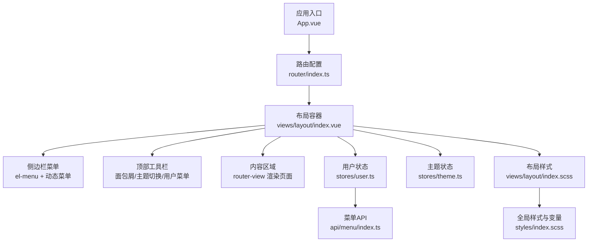
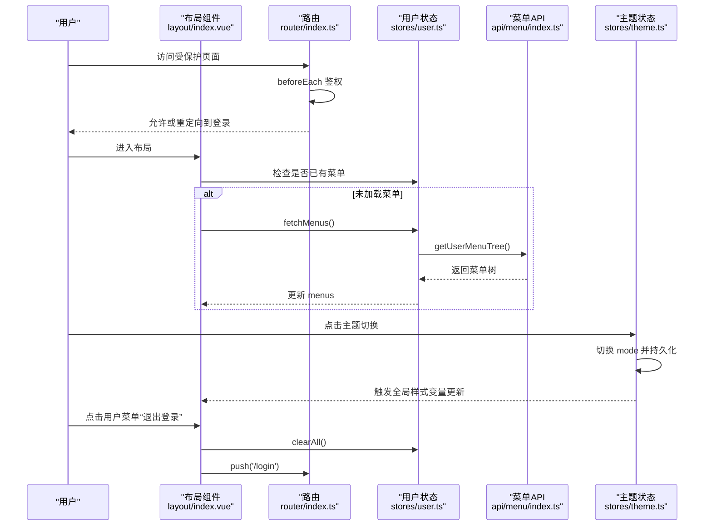
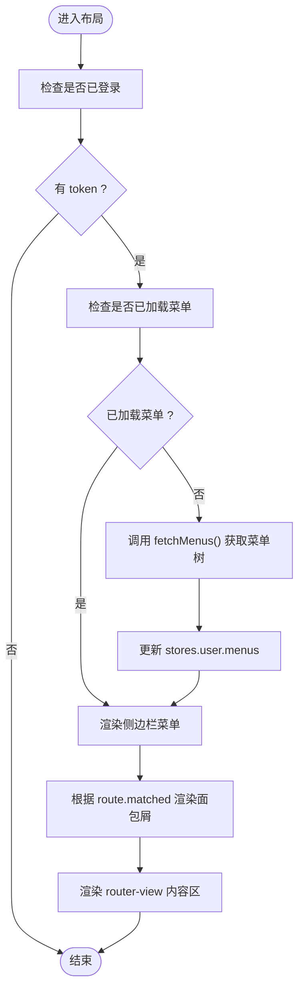
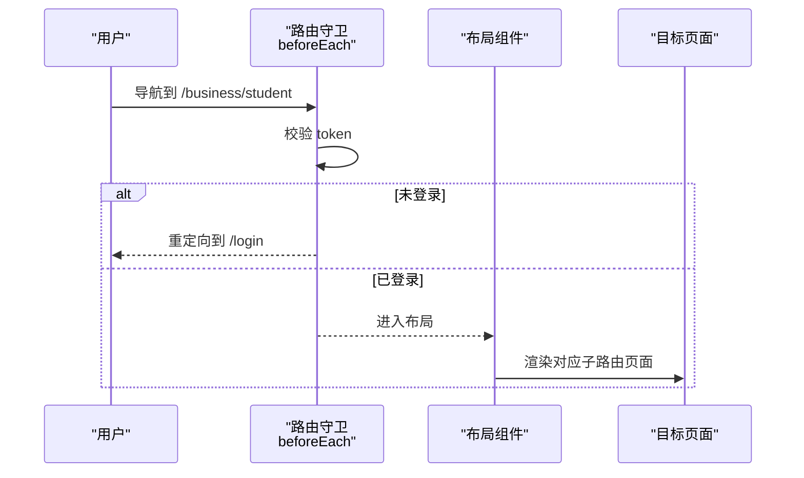
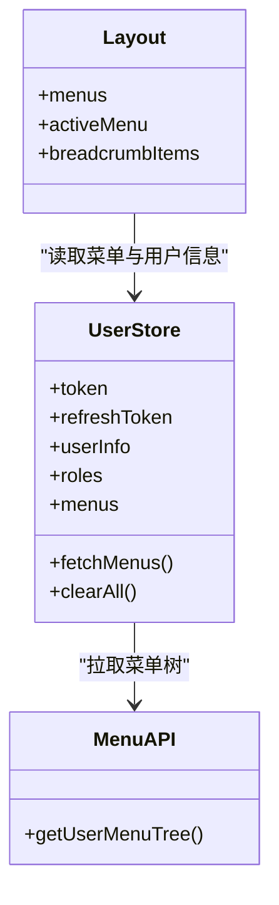
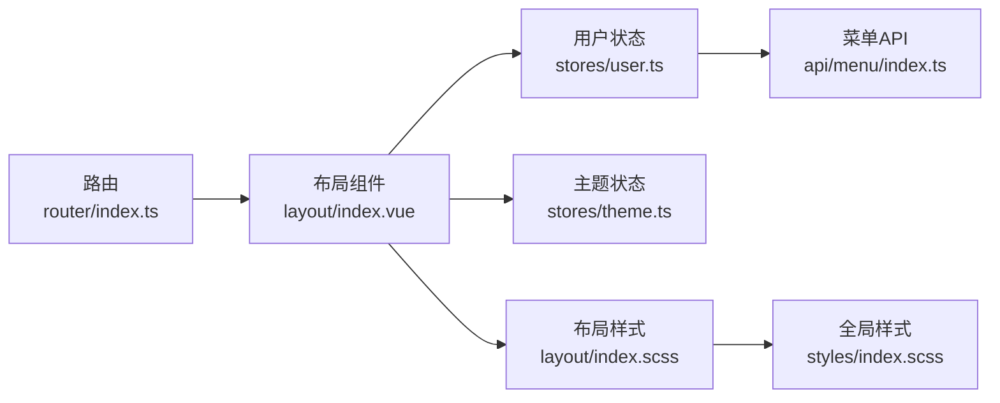

# 布局组件系统

<cite>
**本文引用的文件**   
- [src/views/layout/index.vue](file://class_record_admin_front/src/views/layout/index.vue)
- [src/views/layout/index.scss](file://class_record_admin_front/src/views/layout/index.scss)
- [src/views/layout/index.d.ts](file://class_record_admin_front/src/views/layout/index.d.ts)
- [src/router/index.ts](file://class_record_admin_front/src/router/index.ts)
- [src/stores/theme.ts](file://class_record_admin_front/src/stores/theme.ts)
- [src/stores/user.ts](file://class_record_admin_front/src/stores/user.ts)
- [src/api/menu/index.ts](file://class_record_admin_front/src/api/menu/index.ts)
- [src/styles/index.scss](file://class_record_admin_front/src/styles/index.scss)
- [src/types/admin.d.ts](file://class_record_admin_front/src/types/admin.d.ts)
</cite>

## 目录
1. [简介](#简介)
2. [项目结构](#项目结构)
3. [核心组件](#核心组件)
4. [架构总览](#架构总览)
5. [详细组件分析](#详细组件分析)
6. [依赖关系分析](#依赖关系分析)
7. [性能与体验优化](#性能与体验优化)
8. [故障排查指南](#故障排查指南)
9. [结论](#结论)
10. [附录：配置与扩展指南](#附录配置与扩展指南)

## 简介
本文件面向管理端布局组件系统，系统性解析主布局组件的实现架构与运行机制，涵盖侧边栏导航、顶部工具栏、内容区域的布局结构；深入说明路由集成、菜单动态加载、面包屑导航的实现机制；解释响应式布局适配、主题切换、多标签页管理等高级能力；并提供布局组件的配置选项、样式定制方法与扩展机制，以及自定义布局的开发指南与最佳实践。

## 项目结构
管理端前端采用 Vue 3 + Element Plus + Pinia + Vue Router 的架构。布局相关代码主要位于 views/layout 目录，配合全局样式与状态管理实现整体布局与交互。

图示来源
- [src/router/index.ts:1-160](file://class_record_admin_front/src/router/index.ts#L1-L160)
- [src/views/layout/index.vue:1-216](file://class_record_admin_front/src/views/layout/index.vue#L1-L216)
- [src/stores/user.ts:1-49](file://class_record_admin_front/src/stores/user.ts#L1-L49)
- [src/stores/theme.ts:1-47](file://class_record_admin_front/src/stores/theme.ts#L1-L47)
- [src/api/menu/index.ts:1-26](file://class_record_admin_front/src/api/menu/index.ts#L1-L26)
- [src/views/layout/index.scss:1-172](file://class_record_admin_front/src/views/layout/index.scss#L1-L172)
- [src/styles/index.scss:1-493](file://class_record_admin_front/src/styles/index.scss#L1-L493)

章节来源
- [src/router/index.ts:1-160](file://class_record_admin_front/src/router/index.ts#L1-L160)
- [src/views/layout/index.vue:1-216](file://class_record_admin_front/src/views/layout/index.vue#L1-L216)
- [src/stores/user.ts:1-49](file://class_record_admin_front/src/stores/user.ts#L1-L49)
- [src/stores/theme.ts:1-47](file://class_record_admin_front/src/stores/theme.ts#L1-L47)
- [src/api/menu/index.ts:1-26](file://class_record_admin_front/src/api/menu/index.ts#L1-L26)
- [src/views/layout/index.scss:1-172](file://class_record_admin_front/src/views/layout/index.scss#L1-L172)
- [src/styles/index.scss:1-493](file://class_record_admin_front/src/styles/index.scss#L1-L493)

## 核心组件
- 主布局容器：负责整体布局（侧边栏+头部+内容区），控制侧边栏折叠、面包屑展示、主题切换、用户操作等。
- 侧边栏菜单：基于后端返回的动态菜单树渲染，支持多级目录、外链、图标显示与高亮。
- 顶部工具栏：包含面包屑导航、主题切换按钮、用户下拉菜单（个人信息、退出登录）。
- 内容区域：通过 router-view 渲染业务页面，并带有过渡动画。
- 状态管理：
  - 用户状态：保存 token、用户信息、角色、菜单树，提供拉取菜单方法。
  - 主题状态：维护明暗模式，持久化到本地存储，并通过 data-theme 和 class 驱动样式。
- 路由守卫：统一鉴权与进度条控制。

章节来源
- [src/views/layout/index.vue:1-216](file://class_record_admin_front/src/views/layout/index.vue#L1-L216)
- [src/stores/user.ts:1-49](file://class_record_admin_front/src/stores/user.ts#L1-L49)
- [src/stores/theme.ts:1-47](file://class_record_admin_front/src/stores/theme.ts#L1-L47)
- [src/router/index.ts:1-160](file://class_record_admin_front/src/router/index.ts#L1-L160)

## 架构总览
布局组件作为根级容器，承载路由视图与全局交互。其数据流如下：
- 初始化时若已登录且无菜单，则调用用户状态中的拉取菜单接口，将菜单树写入 store。
- 侧边栏根据菜单树递归渲染子菜单、外链与叶子节点，并根据当前路由路径高亮。
- 顶部面包屑由当前路由匹配链生成，自动反映层级结构。
- 主题切换通过 Pinia 修改 data-theme 属性，全局 CSS 变量随之变化。
- 用户操作（退出登录）清理状态并跳转至登录页。

图示来源
- [src/views/layout/index.vue:1-216](file://class_record_admin_front/src/views/layout/index.vue#L1-L216)
- [src/stores/user.ts:1-49](file://class_record_admin_front/src/stores/user.ts#L1-L49)
- [src/api/menu/index.ts:1-26](file://class_record_admin_front/src/api/menu/index.ts#L1-L26)
- [src/stores/theme.ts:1-47](file://class_record_admin_front/src/stores/theme.ts#L1-L47)
- [src/router/index.ts:1-160](file://class_record_admin_front/src/router/index.ts#L1-L160)

## 详细组件分析

### 主布局组件（layout/index.vue）
- 布局结构
  - 左侧 el-aside 承载侧边栏，宽度由 CSS 变量与折叠状态计算得出。
  - 顶部 el-header 承载面包屑、主题切换、用户菜单。
  - 主体 el-main 承载 router-view 及页面过渡动画。
- 侧边栏菜单
  - 使用 computed 计算 activeMenu 为当前路由 path，驱动菜单高亮。
  - 根据菜单项类型（目录 M、菜单 C、外链 L）分别渲染 el-sub-menu、el-menu-item 或外链 li。
  - 外链菜单点击后通过 window.open 打开新窗口。
  - 图标通过 getIconComponent 动态解析并渲染。
- 面包屑导航
  - 基于 route.matched 过滤出带 meta.title 的路由片段，映射为面包屑项数组。
- 主题切换
  - 调用 themeStore.toggle 切换明暗模式，全局样式变量随之更新。
- 用户操作
  - 退出登录前弹出确认框，确认后清理用户状态并跳转登录页。
  - 个人信息跳转 /profile。
- 生命周期
  - onMounted 中检测 token 存在且菜单为空时，主动拉取菜单树。

图示来源
- [src/views/layout/index.vue:1-216](file://class_record_admin_front/src/views/layout/index.vue#L1-L216)
- [src/stores/user.ts:1-49](file://class_record_admin_front/src/stores/user.ts#L1-L49)

章节来源
- [src/views/layout/index.vue:1-216](file://class_record_admin_front/src/views/layout/index.vue#L1-L216)
- [src/views/layout/index.d.ts:1-5](file://class_record_admin_front/src/views/layout/index.d.ts#L1-L5)

### 路由集成与导航
- 路由定义
  - 根路由指向布局组件，并默认重定向到仪表盘。
  - 所有业务页面均作为 layout 的子路由，meta 中包含 title 与 icon 等信息。
- 路由守卫
  - beforeEach 中读取本地 token，对 noAuth 页面放行，其他页面需登录。
  - afterEach 关闭 NProgress 进度条。
- 面包屑联动
  - 布局组件从 route.matched 提取标题与路径，自动生成面包屑。

图示来源
- [src/router/index.ts:1-160](file://class_record_admin_front/src/router/index.ts#L1-L160)
- [src/views/layout/index.vue:1-216](file://class_record_admin_front/src/views/layout/index.vue#L1-L216)

章节来源
- [src/router/index.ts:1-160](file://class_record_admin_front/src/router/index.ts#L1-L160)
- [src/views/layout/index.vue:1-216](file://class_record_admin_front/src/views/layout/index.vue#L1-L216)

### 菜单动态加载机制
- 数据来源
  - 用户状态 stores/user.ts 暴露 fetchMenus，调用 api/menu/index.ts 的 getUserMenuTree。
  - 菜单类型为 SysMenuResponse[]，支持多级 children 嵌套。
- 渲染策略
  - 目录类型 M 且有子菜单：渲染 el-sub-menu。
  - 外链类型 L：渲染 li 并在新窗口打开。
  - 菜单类型 C 或无子菜单的 M：渲染 el-menu-item。
- 路径解析
  - resolveMenuPath 确保路径以 / 开头，兼容相对路径。

图示来源
- [src/stores/user.ts:1-49](file://class_record_admin_front/src/stores/user.ts#L1-L49)
- [src/api/menu/index.ts:1-26](file://class_record_admin_front/src/api/menu/index.ts#L1-L26)
- [src/views/layout/index.vue:1-216](file://class_record_admin_front/src/views/layout/index.vue#L1-L216)
- [src/types/admin.d.ts:35-51](file://class_record_admin_front/src/types/admin.d.ts#L35-L51)

章节来源
- [src/stores/user.ts:1-49](file://class_record_admin_front/src/stores/user.ts#L1-L49)
- [src/api/menu/index.ts:1-26](file://class_record_admin_front/src/api/menu/index.ts#L1-L26)
- [src/views/layout/index.vue:1-216](file://class_record_admin_front/src/views/layout/index.vue#L1-L216)
- [src/types/admin.d.ts:35-51](file://class_record_admin_front/src/types/admin.d.ts#L35-L51)

### 面包屑导航实现
- 数据来源：route.matched 中每个匹配的元信息 meta.title。
- 渲染逻辑：遍历 matched 并构造 BreadcrumbItem 列表，按顺序渲染。
- 行为特性：仅显示具有标题的路由段，保证面包屑语义清晰。

章节来源
- [src/views/layout/index.vue:33-39](file://class_record_admin_front/src/views/layout/index.vue#L33-L39)
- [src/views/layout/index.d.ts:1-5](file://class_record_admin_front/src/views/layout/index.d.ts#L1-L5)

### 主题切换与样式体系
- 主题状态
  - stores/theme.ts 维护 mode（light/dark），监听变更并设置 documentElement 的 data-theme 与 class。
  - 首次应用后移除 transition-disabled class，启用主题切换动画。
- 样式变量
  - styles/index.scss 定义明暗两套 CSS 变量，覆盖 Element Plus 主题色、背景、边框、文本等。
  - layout/index.scss 针对侧边栏、头部、用户菜单、外链菜单等进行局部样式增强。
- 切换体验
  - 通过 CSS transition 平滑过渡颜色与阴影，提升视觉一致性。

章节来源
- [src/stores/theme.ts:1-47](file://class_record_admin_front/src/stores/theme.ts#L1-L47)
- [src/styles/index.scss:1-493](file://class_record_admin_front/src/styles/index.scss#L1-L493)
- [src/views/layout/index.scss:1-172](file://class_record_admin_front/src/views/layout/index.scss#L1-L172)

### 响应式布局适配
- 侧边栏宽度
  - 通过 CSS 变量 --sidebar-width 与 --sidebar-collapsed-width 控制展开与收起宽度。
  - isCollapsed 状态驱动 sidebarWidth 计算值，实现平滑过渡。
- 滚动与溢出
  - 侧边栏与主内容区分别处理滚动，避免重复滚动条。
- 建议
  - 在移动端可结合媒体查询隐藏侧边栏，通过抽屉或全屏菜单替代。

章节来源
- [src/views/layout/index.vue:25-29](file://class_record_admin_front/src/views/layout/index.vue#L25-L29)
- [src/views/layout/index.scss:1-172](file://class_record_admin_front/src/views/layout/index.scss#L1-L172)
- [src/styles/index.scss:42-44](file://class_record_admin_front/src/styles/index.scss#L42-L44)

### 多标签页管理（现状与建议）
- 现状
  - 当前布局未实现多标签页功能，内容区通过 router-view 直接渲染单个页面。
- 建议方案
  - 引入标签页状态管理（如 Pinia 维护 tabs 列表、激活态、缓存 key）。
  - 使用 keep-alive 缓存活跃页面，提升切换性能。
  - 在顶部工具栏渲染标签栏，支持新增、关闭、右键菜单等操作。
  - 路由变更后同步更新标签状态，保持与 URL 一致。

[本节为概念性建议，不直接分析具体文件]

## 依赖关系分析
- 组件耦合
  - 布局组件依赖用户状态与主题状态，间接依赖菜单 API。
  - 路由守卫独立于布局，但影响布局的可见性与初始数据加载时机。
- 外部依赖
  - Element Plus 提供基础 UI 组件与主题变量覆盖。
  - nprogress 提供页面切换进度反馈。
- 潜在循环依赖
  - 当前结构未见循环依赖，布局与状态模块职责清晰。

图示来源
- [src/views/layout/index.vue:1-216](file://class_record_admin_front/src/views/layout/index.vue#L1-L216)
- [src/stores/user.ts:1-49](file://class_record_admin_front/src/stores/user.ts#L1-L49)
- [src/stores/theme.ts:1-47](file://class_record_admin_front/src/stores/theme.ts#L1-L47)
- [src/api/menu/index.ts:1-26](file://class_record_admin_front/src/api/menu/index.ts#L1-L26)
- [src/views/layout/index.scss:1-172](file://class_record_admin_front/src/views/layout/index.scss#L1-L172)
- [src/styles/index.scss:1-493](file://class_record_admin_front/src/styles/index.scss#L1-L493)
- [src/router/index.ts:1-160](file://class_record_admin_front/src/router/index.ts#L1-L160)

章节来源
- [src/views/layout/index.vue:1-216](file://class_record_admin_front/src/views/layout/index.vue#L1-L216)
- [src/stores/user.ts:1-49](file://class_record_admin_front/src/stores/user.ts#L1-L49)
- [src/stores/theme.ts:1-47](file://class_record_admin_front/src/stores/theme.ts#L1-L47)
- [src/api/menu/index.ts:1-26](file://class_record_admin_front/src/api/menu/index.ts#L1-L26)
- [src/views/layout/index.scss:1-172](file://class_record_admin_front/src/views/layout/index.scss#L1-L172)
- [src/styles/index.scss:1-493](file://class_record_admin_front/src/styles/index.scss#L1-L493)
- [src/router/index.ts:1-160](file://class_record_admin_front/src/router/index.ts#L1-L160)

## 性能与体验优化
- 菜单懒加载
  - 仅在需要时拉取菜单树，避免首屏冗余请求。
- 路由懒加载
  - 各业务页面使用动态 import，减少初始包体积。
- 主题切换动画
  - 通过 CSS transition 平滑过渡，避免闪烁。
- 滚动性能
  - 侧边栏与内容区各自滚动，避免整页滚动抖动。
- 建议
  - 对大型菜单树进行虚拟滚动或分页渲染。
  - 对频繁切换的页面使用 keep-alive 缓存。

[本节提供通用指导，不直接分析具体文件]

## 故障排查指南
- 菜单不显示
  - 检查用户是否已登录且 token 有效。
  - 确认 fetchMenus 是否被调用并成功返回菜单树。
  - 核对菜单类型与路径格式是否正确。
- 面包屑异常
  - 检查路由 meta.title 是否缺失。
  - 确认 route.matched 是否符合预期。
- 主题切换无效
  - 检查 stores/theme.ts 是否正确设置 data-theme 与 class。
  - 确认全局样式变量是否被覆盖。
- 外链菜单无法打开
  - 检查外链地址是否为合法 URL。
  - 确认浏览器弹窗拦截策略。

章节来源
- [src/views/layout/index.vue:50-86](file://class_record_admin_front/src/views/layout/index.vue#L50-L86)
- [src/stores/user.ts:30-35](file://class_record_admin_front/src/stores/user.ts#L30-L35)
- [src/stores/theme.ts:21-43](file://class_record_admin_front/src/stores/theme.ts#L21-L43)

## 结论
该布局组件系统以清晰的职责划分与良好的状态管理实现了管理端的基础布局能力。通过动态菜单、面包屑、主题切换等功能，提供了良好的用户体验。后续可在多标签页、权限细化、国际化等方面持续演进，进一步提升系统的可扩展性与易用性。

[本节为总结性内容，不直接分析具体文件]

## 附录：配置与扩展指南

### 布局配置项
- 侧边栏宽度
  - 通过 CSS 变量 --sidebar-width 与 --sidebar-collapsed-width 调整。
- 头部高度
  - 通过 CSS 变量 --header-height 调整。
- 主题模式
  - 通过 themeStore.mode 控制，支持 light/dark 两种模式。

章节来源
- [src/styles/index.scss:42-44](file://class_record_admin_front/src/styles/index.scss#L42-L44)
- [src/stores/theme.ts:6-19](file://class_record_admin_front/src/stores/theme.ts#L6-L19)

### 样式定制方法
- 覆盖 Element Plus 主题变量
  - 在 styles/index.scss 中重写 --el-* 变量，统一品牌色与字体。
- 局部样式增强
  - 在 layout/index.scss 中针对侧边栏、头部、用户菜单等进行精细化样式控制。
- 暗黑模式适配
  - 使用 [data-theme="dark"] 选择器覆盖深色场景下的组件样式。

章节来源
- [src/styles/index.scss:9-112](file://class_record_admin_front/src/styles/index.scss#L9-L112)
- [src/views/layout/index.scss:1-172](file://class_record_admin_front/src/views/layout/index.scss#L1-L172)

### 扩展机制
- 新增菜单项
  - 在后端菜单管理中新增菜单，确保 menuType、path、icon 等字段正确。
  - 前端无需改动，布局组件会自动渲染。
- 新增外链菜单
  - 设置 menuType 为 L，并在 path 中填写完整 URL。
- 自定义图标
  - 通过 getIconComponent 支持的图标名称进行配置，或在组件中扩展图标映射。

章节来源
- [src/views/layout/index.vue:110-153](file://class_record_admin_front/src/views/layout/index.vue#L110-L153)
- [src/types/admin.d.ts:35-51](file://class_record_admin_front/src/types/admin.d.ts#L35-L51)

### 自定义布局开发指南
- 创建新布局组件
  - 复制现有布局组件结构，按需调整侧边栏、头部与内容区。
- 接入路由
  - 在 router/index.ts 中注册新布局作为根路由，并将业务页面挂载为其子路由。
- 接入状态管理
  - 复用 userStore 与 themeStore，确保菜单与主题能力一致。
- 样式隔离
  - 为新布局创建独立样式文件，避免与全局样式冲突。
- 测试验证
  - 验证菜单渲染、面包屑联动、主题切换、用户操作等关键流程。

[本节为概念性指导，不直接分析具体文件]