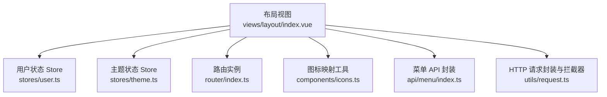
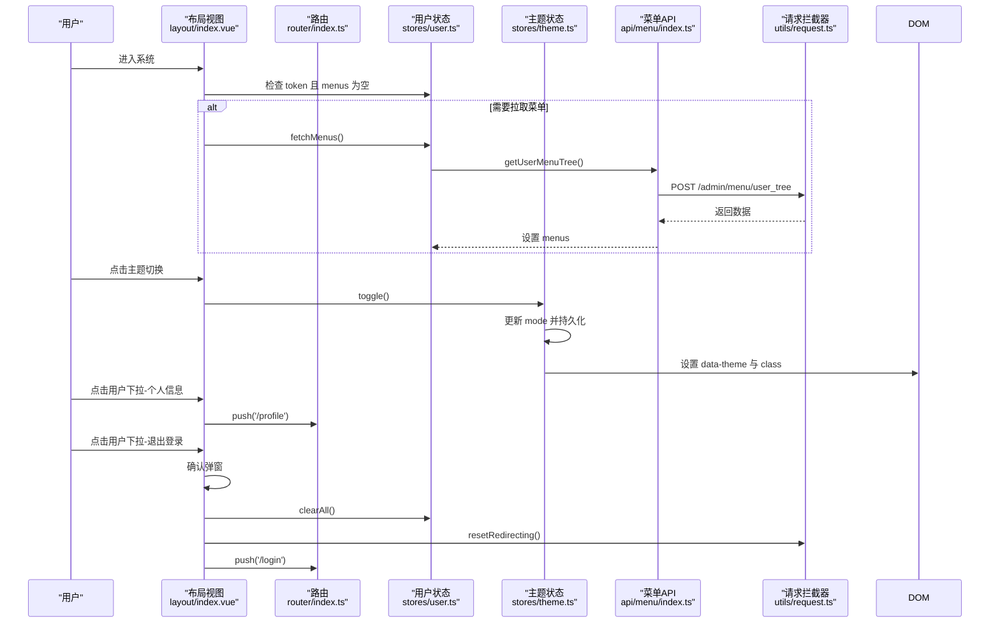
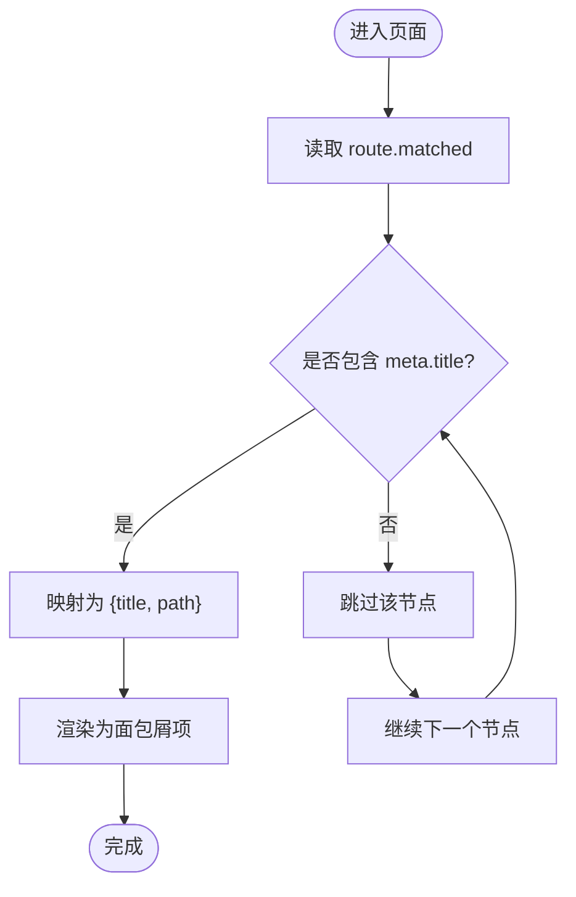
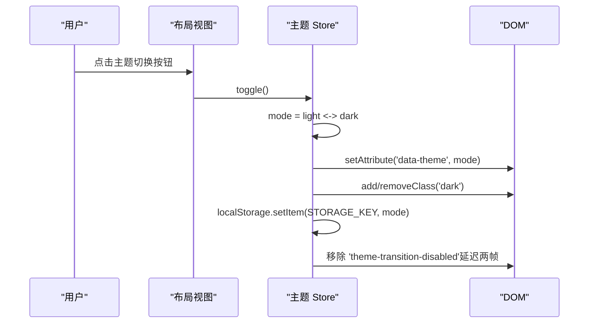
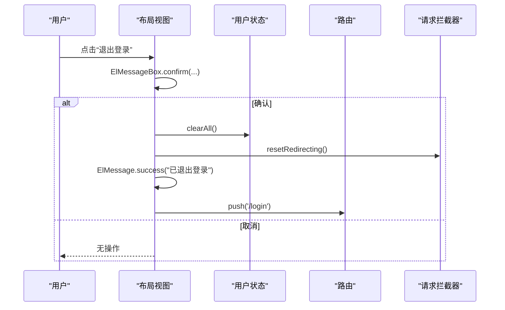
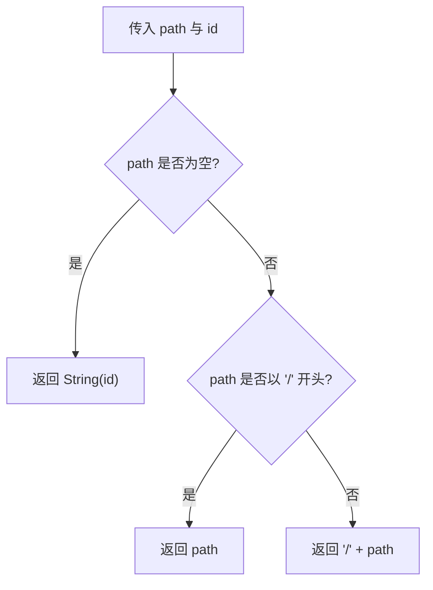
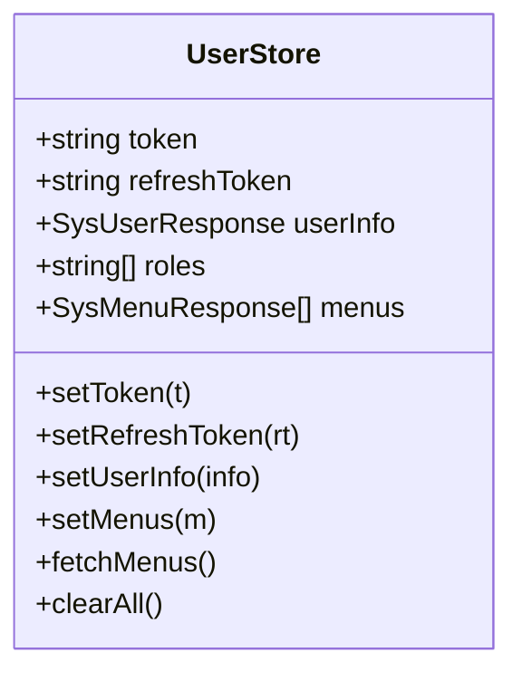
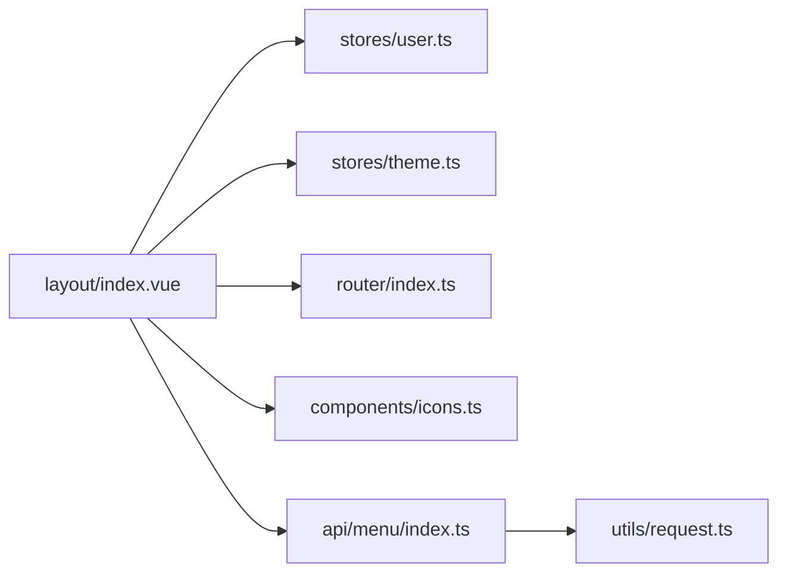

# 顶部工具栏组件

<cite>
**本文引用的文件**
- [index.vue](file://class_record_admin_front/src/views/layout/index.vue)
- [user.ts](file://class_record_admin_front/src/stores/user.ts)
- [theme.ts](file://class_record_admin_front/src/stores/theme.ts)
- [index.ts](file://class_record_admin_front/src/router/index.ts)
- [icons.ts](file://class_record_admin_front/src/components/icons.ts)
- [menu/index.ts](file://class_record_admin_front/src/api/menu/index.ts)
- [request.ts](file://class_record_admin_front/src/utils/request.ts)
</cite>

## 目录
1. [简介](#简介)
2. [项目结构](#项目结构)
3. [核心组件](#核心组件)
4. [架构总览](#架构总览)
5. [详细组件分析](#详细组件分析)
6. [依赖分析](#依赖分析)
7. [性能考虑](#性能考虑)
8. [故障排查指南](#故障排查指南)
9. [结论](#结论)
10. [附录](#附录)

## 简介
本文件围绕“顶部工具栏组件”（位于布局页面）进行系统化文档化，重点解析以下能力：
- 面包屑导航的动态生成机制
- 主题切换功能的实现原理与持久化策略
- 用户信息下拉菜单的处理逻辑（个人信息跳转、退出登录）
- 路由匹配信息的获取方式与菜单路径解析算法
- 外部链接打开机制
- 用户状态管理集成（Pinia）、登出流程处理
- 个人信息页面跳转的实现细节
- 工具栏定制化和功能扩展的开发指南

## 项目结构
该组件属于布局视图的一部分，负责侧边栏、顶部工具栏（面包屑、主题切换、用户下拉菜单）以及主内容区渲染。其关键依赖包括：
- Vue Router：用于路由匹配、导航跳转
- Pinia：用户状态与主题状态管理
- Element Plus：UI 组件（面包屑、下拉菜单、图标等）
- 自定义图标映射：动态渲染菜单图标
- 菜单 API：根据当前用户权限动态加载菜单树
- 请求拦截器：统一鉴权、续签、错误提示

图表来源
- [index.vue:1-216](file://class_record_admin_front/src/views/layout/index.vue#L1-L216)
- [user.ts:1-49](file://class_record_admin_front/src/stores/user.ts#L1-L49)
- [theme.ts:1-47](file://class_record_admin_front/src/stores/theme.ts#L1-L47)
- [index.ts:1-160](file://class_record_admin_front/src/router/index.ts#L1-L160)
- [icons.ts:1-46](file://class_record_admin_front/src/components/icons.ts#L1-L46)
- [menu/index.ts:1-26](file://class_record_admin_front/src/api/menu/index.ts#L1-L26)
- [request.ts:1-222](file://class_record_admin_front/src/utils/request.ts#L1-L222)

章节来源
- [index.vue:1-216](file://class_record_admin_front/src/views/layout/index.vue#L1-L216)
- [index.ts:1-160](file://class_record_admin_front/src/router/index.ts#L1-L160)

## 核心组件
- 面包屑导航：基于当前路由的 matched 元信息动态生成，仅展示包含标题的路由节点。
- 主题切换：通过 Pinia 维护 theme 状态，监听变化并同步到 DOM 属性与类名，同时持久化至 localStorage。
- 用户信息下拉菜单：提供“个人信息”和“退出登录”两个命令项；前者跳转到 /profile，后者触发登出流程。
- 菜单渲染与外链：支持多级菜单、外链类型 L 的新窗口打开、图标动态渲染。
- 路由匹配与路径解析：使用 resolveMenuPath 规范化路径，确保以 / 开头或回退为 id 字符串。

章节来源
- [index.vue:33-46](file://class_record_admin_front/src/views/layout/index.vue#L33-L46)
- [index.vue:167-171](file://class_record_admin_front/src/views/layout/index.vue#L167-L171)
- [index.vue:174-181](file://class_record_admin_front/src/views/layout/index.vue#L174-L181)
- [index.vue:182-201](file://class_record_admin_front/src/views/layout/index.vue#L182-L201)
- [index.vue:119-147](file://class_record_admin_front/src/views/layout/index.vue#L119-L147)
- [index.vue:43-46](file://class_record_admin_front/src/views/layout/index.vue#L43-L46)

## 架构总览
顶部工具栏在布局视图中作为全局 UI 入口，与路由、状态、API 层紧密协作。下图展示了关键交互关系。

图表来源
- [index.vue:50-54](file://class_record_admin_front/src/views/layout/index.vue#L50-L54)
- [user.ts:30-35](file://class_record_admin_front/src/stores/user.ts#L30-L35)
- [menu/index.ts:23-25](file://class_record_admin_front/src/api/menu/index.ts#L23-L25)
- [request.ts:34-53](file://class_record_admin_front/src/utils/request.ts#L34-L53)
- [theme.ts:21-43](file://class_record_admin_front/src/stores/theme.ts#L21-L43)
- [index.vue:76-86](file://class_record_admin_front/src/views/layout/index.vue#L76-L86)

## 详细组件分析

### 面包屑导航动态生成机制
- 数据来源：Vue Router 的 route.matched 数组，过滤出包含 meta.title 的节点。
- 渲染规则：按 matched 顺序渲染为 el-breadcrumb-item，显示 title。
- 适用场景：适用于所有具有 meta.title 的路由层级，便于快速定位当前位置。

图表来源
- [index.vue:33-39](file://class_record_admin_front/src/views/layout/index.vue#L33-L39)

章节来源
- [index.vue:33-39](file://class_record_admin_front/src/views/layout/index.vue#L33-L39)

### 主题切换功能实现原理
- 状态存储：Pinia store 中维护 mode（light/dark），并在初始化时从 localStorage 恢复。
- 变更监听：watch 模式变化，同步到 document.documentElement 的 data-theme 属性与 dark 类名，同时写入 localStorage。
- 动画优化：首次应用后移除过渡禁用类，启用主题切换动画。
- 交互入口：顶部工具栏按钮调用 toggle，切换 light/dark。

图表来源
- [theme.ts:9-11](file://class_record_admin_front/src/stores/theme.ts#L9-L11)
- [theme.ts:13-19](file://class_record_admin_front/src/stores/theme.ts#L13-L19)
- [theme.ts:21-43](file://class_record_admin_front/src/stores/theme.ts#L21-L43)
- [index.vue:174-181](file://class_record_admin_front/src/views/layout/index.vue#L174-L181)

章节来源
- [theme.ts:1-47](file://class_record_admin_front/src/stores/theme.ts#L1-L47)
- [index.vue:174-181](file://class_record_admin_front/src/views/layout/index.vue#L174-L181)

### 用户信息下拉菜单处理逻辑
- 菜单项：
  - 个人信息：command='profile'，触发 router.push('/profile')
  - 退出登录：command='logout'，弹出确认框，确认后执行登出流程
- 登出流程：
  - 清空用户状态（token、refreshToken、userInfo、roles、menus）
  - 重置重定向标志位，避免重复提示
  - 成功提示后跳转至 /login

图表来源
- [index.vue:60-74](file://class_record_admin_front/src/views/layout/index.vue#L60-L74)
- [index.vue:76-82](file://class_record_admin_front/src/views/layout/index.vue#L76-L82)
- [user.ts:37-45](file://class_record_admin_front/src/stores/user.ts#L37-L45)
- [request.ts:14-18](file://class_record_admin_front/src/utils/request.ts#L14-L18)

章节来源
- [index.vue:76-82](file://class_record_admin_front/src/views/layout/index.vue#L76-L82)
- [index.vue:60-74](file://class_record_admin_front/src/views/layout/index.vue#L60-L74)
- [user.ts:37-45](file://class_record_admin_front/src/stores/user.ts#L37-L45)
- [request.ts:14-18](file://class_record_admin_front/src/utils/request.ts#L14-L18)

### 路由匹配信息与菜单路径解析
- 路由匹配信息：
  - activeMenu 直接绑定 route.path，用于高亮当前菜单项
  - breadcrumbItems 基于 route.matched 计算，仅包含有标题的节点
- 菜单路径解析：
  - resolveMenuPath(path, id)：若 path 为空则回退为 id 字符串；若不以 / 开头则补前缀，保证 index 值规范
- 外链处理：
  - menuType === 'L' 的菜单项点击时调用 openExternalLink(url)，使用 window.open(url, '_blank') 在新标签页打开

图表来源
- [index.vue:31](file://class_record_admin_front/src/views/layout/index.vue#L31)
- [index.vue:33-39](file://class_record_admin_front/src/views/layout/index.vue#L33-L39)
- [index.vue:43-46](file://class_record_admin_front/src/views/layout/index.vue#L43-L46)
- [index.vue:84-86](file://class_record_admin_front/src/views/layout/index.vue#L84-L86)

章节来源
- [index.vue:31](file://class_record_admin_front/src/views/layout/index.vue#L31)
- [index.vue:33-39](file://class_record_admin_front/src/views/layout/index.vue#L33-L39)
- [index.vue:43-46](file://class_record_admin_front/src/views/layout/index.vue#L43-L46)
- [index.vue:84-86](file://class_record_admin_front/src/views/layout/index.vue#L84-L86)

### 用户状态管理集成与登出流程
- 状态字段：token、refreshToken、userInfo、roles、menus
- 关键方法：
  - setToken/setRefreshToken/setUserInfo/setMenus：更新状态并持久化（token/refreshToken）
  - fetchMenus：调用 getUserMenuTree 获取菜单树并缓存
  - clearAll：清空内存与本地存储中的认证与用户信息
- 集成点：
  - 布局视图 onMounted 时，若存在 token 且 menus 为空，自动拉取菜单
  - 登出时调用 clearAll 并跳转登录页

图表来源
- [user.ts:5-48](file://class_record_admin_front/src/stores/user.ts#L5-L48)
- [menu/index.ts:23-25](file://class_record_admin_front/src/api/menu/index.ts#L23-L25)

章节来源
- [user.ts:1-49](file://class_record_admin_front/src/stores/user.ts#L1-L49)
- [index.vue:50-54](file://class_record_admin_front/src/views/layout/index.vue#L50-L54)

### 个人信息页面跳转实现细节
- 路由定义：/profile 对应 Profile 页面，meta.title 为“个人信息”
- 跳转触发：用户下拉菜单 command='profile' 时执行 router.push('/profile')
- 面包屑联动：由于 /profile 具备 meta.title，面包屑将自动显示“个人信息”

章节来源
- [index.ts:28-33](file://class_record_admin_front/src/router/index.ts#L28-L33)
- [index.vue:76-82](file://class_record_admin_front/src/views/layout/index.vue#L76-L82)
- [index.vue:33-39](file://class_record_admin_front/src/views/layout/index.vue#L33-L39)

### 外部链接打开机制
- 触发条件：菜单项 menuType === 'L'
- 行为：openExternalLink(url) 调用 window.open(url, '_blank') 在新标签页打开
- 视觉提示：外链菜单项右侧显示 TopRight 图标

章节来源
- [index.vue:119-147](file://class_record_admin_front/src/views/layout/index.vue#L119-L147)
- [index.vue:84-86](file://class_record_admin_front/src/views/layout/index.vue#L84-L86)

## 依赖分析
- 组件耦合度：
  - 布局视图对路由、用户状态、主题状态、图标映射、菜单 API 均有依赖
  - 通过 Pinia 解耦业务状态，降低视图与数据源耦合
- 外部依赖：
  - Element Plus 提供 UI 组件与图标
  - Vue Router 提供导航与元信息
  - Axios 拦截器统一处理鉴权与续签
- 潜在循环依赖：
  - 布局视图不直接依赖 request.ts，但通过 userStore.fetchMenus -> api/menu -> utils/request 间接使用
  - 建议保持现状，避免在 request 中反向引用布局视图

图表来源
- [index.vue:1-216](file://class_record_admin_front/src/views/layout/index.vue#L1-L216)
- [user.ts:1-49](file://class_record_admin_front/src/stores/user.ts#L1-L49)
- [theme.ts:1-47](file://class_record_admin_front/src/stores/theme.ts#L1-L47)
- [index.ts:1-160](file://class_record_admin_front/src/router/index.ts#L1-L160)
- [icons.ts:1-46](file://class_record_admin_front/src/components/icons.ts#L1-L46)
- [menu/index.ts:1-26](file://class_record_admin_front/src/api/menu/index.ts#L1-L26)
- [request.ts:1-222](file://class_record_admin_front/src/utils/request.ts#L1-L222)

章节来源
- [index.vue:1-216](file://class_record_admin_front/src/views/layout/index.vue#L1-L216)
- [request.ts:1-222](file://class_record_admin_front/src/utils/request.ts#L1-L222)

## 性能考虑
- 菜单渲染：
  - 使用 computed 缓存菜单与面包屑，避免重复计算
  - 仅在 token 存在且菜单为空时拉取一次菜单树
- 主题切换：
  - 通过 watch 一次性更新 DOM 属性与类名，减少多次重排
  - 使用 requestAnimationFrame 延迟移除过渡禁用类，提升首屏体验
- 路由跳转：
  - 使用 router.push 进行 SPA 内跳转，避免整页刷新
- 外链打开：
  - 外链使用 window.open，不阻塞主线程

[本节为通用指导，无需源码引用]

## 故障排查指南
- 面包屑未显示：
  - 检查路由 meta.title 是否正确配置
  - 确认 route.matched 是否包含目标节点
- 主题切换无效：
  - 检查 localStorage 中 admin_theme 键值
  - 确认 DOM 的 data-theme 与 dark 类名是否同步
- 用户下拉菜单无响应：
  - 检查 handleCommand 的 command 分支
  - 确认 /profile 路由是否存在并可访问
- 退出登录后仍停留在原页面：
  - 检查 clearAll 是否被调用
  - 确认 resetRedirecting 是否被调用以避免重复提示
  - 检查路由守卫是否允许跳转到 /login

章节来源
- [index.vue:33-39](file://class_record_admin_front/src/views/layout/index.vue#L33-L39)
- [theme.ts:21-43](file://class_record_admin_front/src/stores/theme.ts#L21-L43)
- [index.vue:76-82](file://class_record_admin_front/src/views/layout/index.vue#L76-L82)
- [index.vue:60-74](file://class_record_admin_front/src/views/layout/index.vue#L60-L74)
- [request.ts:14-18](file://class_record_admin_front/src/utils/request.ts#L14-L18)

## 结论
顶部工具栏组件通过简洁的状态管理与清晰的职责划分，实现了面包屑导航、主题切换、用户下拉菜单、外链打开等核心能力。借助 Vue Router 的元信息与 Pinia 的状态持久化，组件具备良好的可维护性与可扩展性。建议在后续迭代中：
- 为外链菜单增加安全校验与白名单机制
- 为面包屑添加可点击跳转能力（当前仅展示）
- 为主题切换增加更多预设主题与动态变量

[本节为总结性内容，无需源码引用]

## 附录
- 开发指南与扩展建议：
  - 新增菜单项：在后端返回的菜单树中添加新节点，前端无需改动即可渲染
  - 新增外链：将菜单项 menuType 设置为 'L'，并确保 path 为完整 URL
  - 新增图标：在 icons.ts 中注册新的图标名称，并在菜单 icon 字段中使用
  - 新增下拉菜单项：在 handleCommand 中增加新的 command 分支，并实现相应逻辑
  - 自定义面包屑：为路由 meta 补充 title，或在布局中扩展过滤与映射逻辑

章节来源
- [icons.ts:19-45](file://class_record_admin_front/src/components/icons.ts#L19-L45)
- [index.vue:119-147](file://class_record_admin_front/src/views/layout/index.vue#L119-L147)
- [index.vue:76-82](file://class_record_admin_front/src/views/layout/index.vue#L76-L82)
- [index.vue:33-39](file://class_record_admin_front/src/views/layout/index.vue#L33-L39)