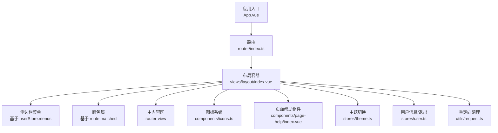
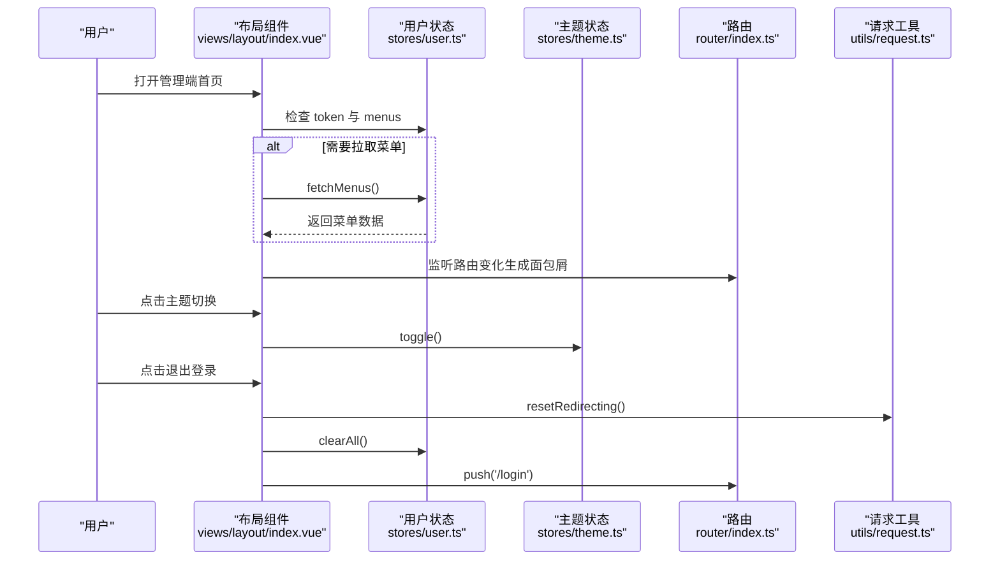
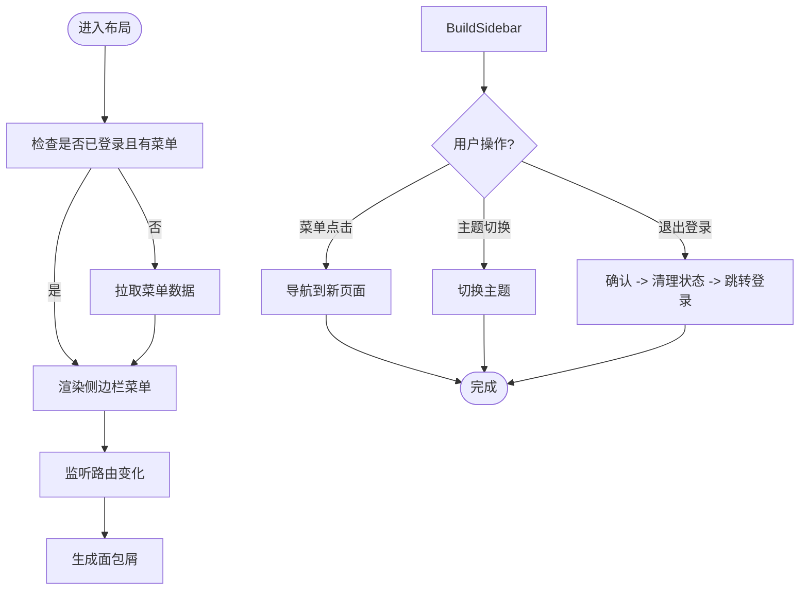
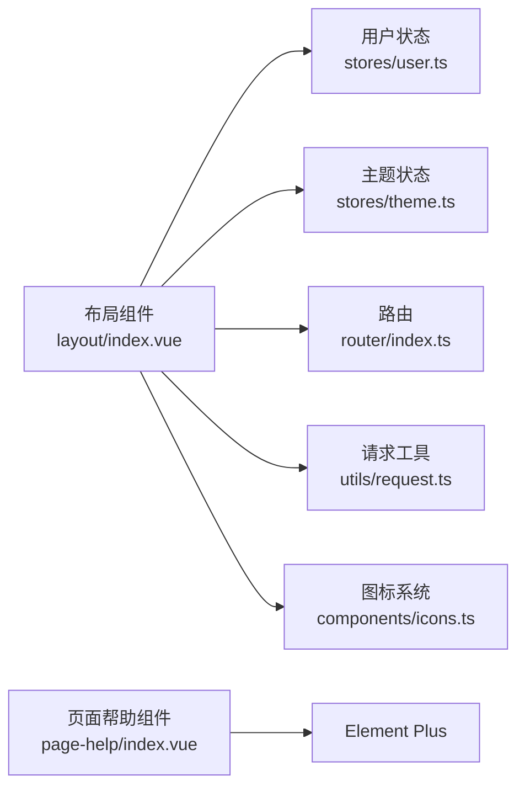

# 组件架构设计

<cite>
**本文引用的文件**
- [class_record_admin_front/src/views/layout/index.vue](file://class_record_admin_front/src/views/layout/index.vue)
- [class_record_admin_front/src/views/layout/index.scss](file://class_record_admin_front/src/views/layout/index.scss)
- [class_record_admin_front/src/components/page-help/index.vue](file://class_record_admin_front/src/components/page-help/index.vue)
- [class_record_admin_front/src/components/icons.ts](file://class_record_admin_front/src/components/icons.ts)
- [class_record_admin_front/src/stores/user.ts](file://class_record_admin_front/src/stores/user.ts)
- [class_record_admin_front/src/stores/theme.ts](file://class_record_admin_front/src/stores/theme.ts)
- [class_record_admin_front/src/utils/request.ts](file://class_record_admin_front/src/utils/request.ts)
- [class_record_admin_front/src/router/index.ts](file://class_record_admin_front/src/router/index.ts)
- [class_record_admin_front/src/__tests__/App.spec.ts](file://class_record_admin_front/src/__tests__/App.spec.ts)
- [class_record_admin_front/e2e/vue.spec.ts](file://class_record_admin_front/e2e/vue.spec.ts)
</cite>

## 目录
1. [简介](#简介)
2. [项目结构](#项目结构)
3. [核心组件](#核心组件)
4. [架构总览](#架构总览)
5. [详细组件分析](#详细组件分析)
6. [依赖关系分析](#依赖关系分析)
7. [性能考虑](#性能考虑)
8. [故障排查指南](#故障排查指南)
9. [结论](#结论)
10. [附录](#附录)

## 简介
本文件面向管理端（Web）的组件化架构设计与实现，聚焦以下目标：
- 通用组件的设计原则与目录组织规范
- 布局组件、页面辅助组件、图标系统的实现与使用方式
- 组件通信机制（props、事件、插槽）
- 组件测试策略与性能优化技巧
- 自定义组件开发规范与示例指引

本项目采用 Vue 3 + TypeScript + Element Plus 技术栈，通过组合式 API 与响应式状态管理构建可维护、可扩展的管理后台。

## 项目结构
管理端前端位于 class_record_admin_front 目录，关键目录与职责如下：
- src/views：页面级视图，包含布局与业务页面
- src/components：通用/页面辅助组件与工具型模块
- src/stores：全局状态（用户、主题等）
- src/router：路由配置
- src/utils：工具函数（如请求封装）
- __tests__ 与 e2e：单元测试与端到端测试

图表来源
- [class_record_admin_front/src/views/layout/index.vue:1-216](file://class_record_admin_front/src/views/layout/index.vue#L1-L216)
- [class_record_admin_front/src/components/icons.ts:1-46](file://class_record_admin_front/src/components/icons.ts#L1-L46)
- [class_record_admin_front/src/components/page-help/index.vue:1-33](file://class_record_admin_front/src/components/page-help/index.vue#L1-L33)
- [class_record_admin_front/src/stores/user.ts](file://class_record_admin_front/src/stores/user.ts)
- [class_record_admin_front/src/stores/theme.ts](file://class_record_admin_front/src/stores/theme.ts)
- [class_record_admin_front/src/utils/request.ts](file://class_record_admin_front/src/utils/request.ts)
- [class_record_admin_front/src/router/index.ts](file://class_record_admin_front/src/router/index.ts)

章节来源
- [class_record_admin_front/src/views/layout/index.vue:1-216](file://class_record_admin_front/src/views/layout/index.vue#L1-L216)
- [class_record_admin_front/src/views/layout/index.scss:1-172](file://class_record_admin_front/src/views/layout/index.scss#L1-L172)

## 核心组件
本节从“布局组件”、“页面辅助组件”、“图标系统”三个维度解析现有实现与设计要点。

### 布局组件（Layout）
- 功能要点
  - 侧边栏折叠/展开、动态宽度计算
  - 根据路由生成面包屑
  - 动态渲染多级菜单（支持外链 L、目录 M、菜单 C）
  - 顶部操作：主题切换、用户下拉菜单（个人信息、退出登录）
  - 主内容区使用 router-view 渲染页面
- 数据流
  - 菜单数据来自 userStore.menus；首次挂载时若存在 token 且无菜单则拉取
  - 面包屑由 route.matched 推导
  - 主题模式由 themeStore.mode 控制
  - 退出登录调用 userStore.clearAll() 并清理重定向标志后跳转登录页
- 样式
  - 通过 index.scss 定义侧边栏、头部、主区域、外链菜单项、主题切换按钮等样式变量与交互态

章节来源
- [class_record_admin_front/src/views/layout/index.vue:25-86](file://class_record_admin_front/src/views/layout/index.vue#L25-L86)
- [class_record_admin_front/src/views/layout/index.vue:89-216](file://class_record_admin_front/src/views/layout/index.vue#L89-L216)
- [class_record_admin_front/src/views/layout/index.scss:1-172](file://class_record_admin_front/src/views/layout/index.scss#L1-L172)

### 页面辅助组件（Page Help）
- 功能要点
  - 以悬浮气泡形式展示帮助说明文本
  - 通过 props.content 传入帮助文案
  - 使用 Element Plus 的 Popover 与 Icon 组合
- 使用建议
  - 在表单字段或复杂操作旁放置，提升可用性
  - 文案应简洁明确，必要时提供链接到文档

章节来源
- [class_record_admin_front/src/components/page-help/index.vue:1-33](file://class_record_admin_front/src/components/page-help/index.vue#L1-L33)

### 图标系统（Icons）
- 功能要点
  - 集中导出常用图标映射表 iconMap
  - 提供 getIconComponent 方法按名称获取图标组件
  - 提供 iconOptions 列表用于选择器展示
- 使用方式
  - 在模板中通过 <component :is="getIcon(name)" /> 动态渲染
  - 在菜单、按钮等处统一引用，避免分散导入

章节来源
- [class_record_admin_front/src/components/icons.ts:1-46](file://class_record_admin_front/src/components/icons.ts#L1-L46)

## 架构总览
下图展示了布局组件与相关模块的交互关系，包括状态、路由、工具与外部库。

图表来源
- [class_record_admin_front/src/views/layout/index.vue:50-86](file://class_record_admin_front/src/views/layout/index.vue#L50-L86)
- [class_record_admin_front/src/stores/user.ts](file://class_record_admin_front/src/stores/user.ts)
- [class_record_admin_front/src/stores/theme.ts](file://class_record_admin_front/src/stores/theme.ts)
- [class_record_admin_front/src/utils/request.ts](file://class_record_admin_front/src/utils/request.ts)
- [class_record_admin_front/src/router/index.ts](file://class_record_admin_front/src/router/index.ts)

## 详细组件分析

### 布局组件（Layout）深度分析
- 设计模式
  - 组合式 API：ref/computed/onMounted 管理局部状态与副作用
  - 响应式数据驱动：sidebarWidth、activeMenu、breadcrumbItems 均由状态派生
  - 条件渲染：根据菜单类型（M/L/C）与层级渲染不同节点
- 关键流程
  - 初始化：onMounted 中判断是否需要拉取菜单
  - 菜单导航：resolveMenuPath 规范化路径，支持外链与新窗口打开
  - 用户操作：handleLogout 二次确认、清理状态、跳转登录
  - 主题切换：themeStore.toggle 切换亮/暗模式
- 扩展点
  - 可在菜单渲染处接入权限校验或懒加载
  - 面包屑可按需添加可点击跳转逻辑

图表来源
- [class_record_admin_front/src/views/layout/index.vue:25-86](file://class_record_admin_front/src/views/layout/index.vue#L25-L86)
- [class_record_admin_front/src/views/layout/index.vue:89-216](file://class_record_admin_front/src/views/layout/index.vue#L89-L216)

章节来源
- [class_record_admin_front/src/views/layout/index.vue:1-216](file://class_record_admin_front/src/views/layout/index.vue#L1-L216)

### 页面辅助组件（Page Help）深度分析
- Props 设计
  - content: string，帮助文案
- 交互与可访问性
  - 鼠标悬停触发提示，适合轻量说明
  - 建议为图标增加 aria-label 以提升可访问性
- 样式与主题
  - 使用 CSS 变量适配主题色，保持视觉一致性

章节来源
- [class_record_admin_front/src/components/page-help/index.vue:1-33](file://class_record_admin_front/src/components/page-help/index.vue#L1-L33)

### 图标系统（Icons）深度分析
- 数据结构
  - iconMap: Record<string, any>，键为图标名，值为图标组件
  - iconOptions: 用于下拉选择的 { label, value } 列表
- 接口
  - getIconComponent(iconName): 返回对应图标组件或 null
- 使用建议
  - 在菜单、按钮、标签等位置统一通过 getIconComponent 获取，便于集中管理与按需引入

章节来源
- [class_record_admin_front/src/components/icons.ts:1-46](file://class_record_admin_front/src/components/icons.ts#L1-L46)

## 依赖关系分析
- 组件耦合
  - 布局组件依赖 stores（user、theme）、router、utils/request 与 icons 工具
  - 页面辅助组件仅依赖 UI 库，低耦合
- 外部依赖
  - Element Plus：UI 组件与图标
  - Vue Router：路由与导航
  - Pinia（推测）：stores 状态管理
- 潜在风险
  - 菜单渲染逻辑较复杂，建议在新增菜单类型时补充边界处理与测试用例

图表来源
- [class_record_admin_front/src/views/layout/index.vue:1-216](file://class_record_admin_front/src/views/layout/index.vue#L1-L216)
- [class_record_admin_front/src/components/page-help/index.vue:1-33](file://class_record_admin_front/src/components/page-help/index.vue#L1-L33)
- [class_record_admin_front/src/components/icons.ts:1-46](file://class_record_admin_front/src/components/icons.ts#L1-L46)

章节来源
- [class_record_admin_front/src/views/layout/index.vue:1-216](file://class_record_admin_front/src/views/layout/index.vue#L1-L216)
- [class_record_admin_front/src/components/page-help/index.vue:1-33](file://class_record_admin_front/src/components/page-help/index.vue#L1-L33)
- [class_record_admin_front/src/components/icons.ts:1-46](file://class_record_admin_front/src/components/icons.ts#L1-L46)

## 性能考虑
- 菜单渲染优化
  - 对大型菜单树进行虚拟化或分页加载，减少首屏渲染压力
  - 将 resolveMenuPath 等纯函数提取为独立工具，避免重复计算
- 图标按需加载
  - 结合打包工具实现图标按需引入，减小包体积
- 路由与过渡
  - 合理使用 transition 的 mode 与延迟，避免频繁重绘
- 状态更新
  - 在 onMounted 中批量拉取必要数据，减少多次网络请求
- 样式与主题
  - 使用 CSS 变量与 scoped 样式，降低样式冲突与重排

[本节为通用指导，不直接分析具体文件]

## 故障排查指南
- 菜单未显示
  - 检查 userStore.token 是否存在以及 fetchMenus 是否成功返回数据
  - 确认菜单数据结构是否符合预期（menuType、children、path 等）
- 外链无法打开
  - 检查 menu.path 是否为完整 URL，openExternalLink 是否正确调用 window.open
- 退出登录后仍停留在原页面
  - 确认 userStore.clearAll() 与 resetRedirecting() 是否执行
  - 检查路由守卫与 redirect 逻辑
- 主题切换无效
  - 检查 themeStore.mode 与 toggle 实现是否正确
- 帮助组件文案不显示
  - 检查 props.content 是否传入且非空

章节来源
- [class_record_admin_front/src/views/layout/index.vue:50-86](file://class_record_admin_front/src/views/layout/index.vue#L50-L86)
- [class_record_admin_front/src/utils/request.ts](file://class_record_admin_front/src/utils/request.ts)
- [class_record_admin_front/src/stores/user.ts](file://class_record_admin_front/src/stores/user.ts)
- [class_record_admin_front/src/stores/theme.ts](file://class_record_admin_front/src/stores/theme.ts)

## 结论
当前管理端组件架构以布局为核心，围绕状态、路由与图标系统形成清晰的数据流与职责边界。通过统一的图标系统与页面辅助组件，提升了复用性与一致性。后续可在菜单渲染、图标按需加载、测试覆盖等方面进一步优化，以支撑更大规模的业务扩展。

[本节为总结性内容，不直接分析具体文件]

## 附录

### 组件通信机制速查
- Props
  - 父组件通过属性传递数据给子组件
  - 示例参考：页面帮助组件的 content 属性
- 事件
  - 子组件通过 emit 向父组件抛出事件
  - 示例参考：移动端项目中多处 defineEmits 的使用（与本仓库其他子项目一致）
- 插槽
  - 使用具名插槽与默认插槽扩展组件行为
  - 示例参考：布局组件中 el-sub-menu 的 title 插槽

章节来源
- [class_record_admin_front/src/components/page-help/index.vue:1-33](file://class_record_admin_front/src/components/page-help/index.vue#L1-L33)

### 组件测试策略
- 单元测试
  - 使用 Vitest + @vue/test-utils 挂载组件，断言渲染结果
  - 示例参考：App 组件的基础挂载测试
- 端到端测试
  - 使用 Playwright 验证页面根路径与关键元素
  - 示例参考：e2e 测试访问根路径并断言标题

章节来源
- [class_record_admin_front/src/__tests__/App.spec.ts:1-15](file://class_record_admin_front/src/__tests__/App.spec.ts#L1-L15)
- [class_record_admin_front/e2e/vue.spec.ts:1-9](file://class_record_admin_front/e2e/vue.spec.ts#L1-L9)

### 自定义组件开发规范（建议）
- 命名与目录
  - 组件目录以小写短横线命名，index.vue 作为入口
  - 同目录内 types.d.ts 存放类型定义，index.scss 存放样式
- 接口设计
  - 使用 TypeScript 定义 props 与 emits，提供默认值与必填校验
  - 对外暴露最小必要接口，内部细节隐藏
- 可访问性
  - 为交互元素提供语义化标签与 aria-* 属性
- 可测试性
  - 每个组件至少包含基础渲染与交互用例
- 可复用性
  - 避免硬编码业务逻辑，尽量通过 props/events/slots 解耦
- 示例指引（路径）
  - 参考页面帮助组件的 props 定义与样式隔离
  - 参考布局组件中对图标系统的统一使用方式

章节来源
- [class_record_admin_front/src/components/page-help/index.vue:1-33](file://class_record_admin_front/src/components/page-help/index.vue#L1-L33)
- [class_record_admin_front/src/components/icons.ts:1-46](file://class_record_admin_front/src/components/icons.ts#L1-L46)
- [class_record_admin_front/src/views/layout/index.vue:1-216](file://class_record_admin_front/src/views/layout/index.vue#L1-L216)