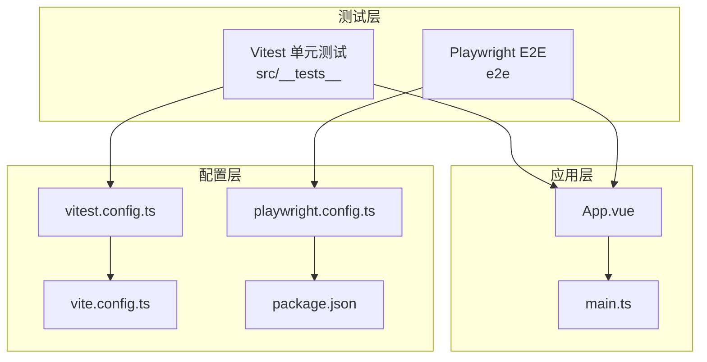
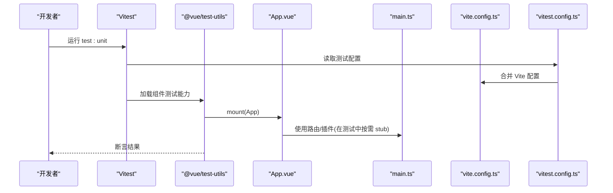
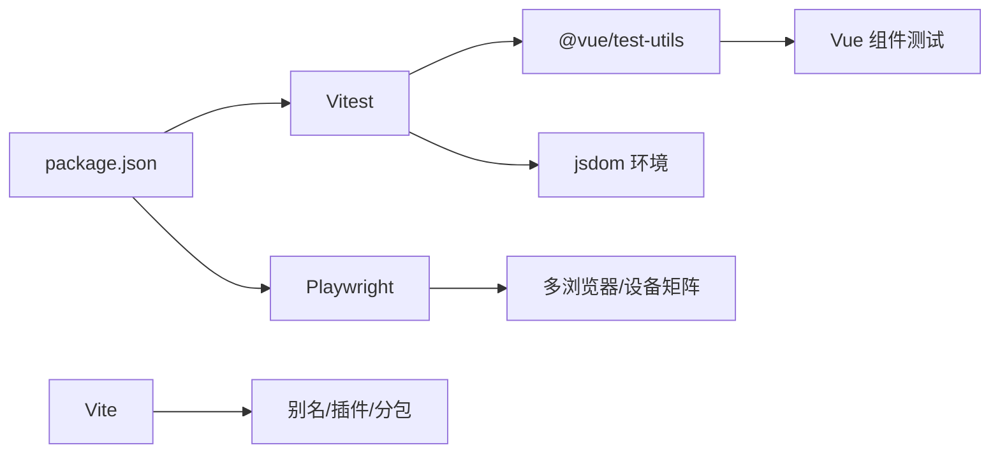

# 组件测试策略

<cite>
**本文引用的文件**   
- [vitest.config.ts](file://class_record_admin_front/vitest.config.ts)
- [vite.config.ts](file://class_record_admin_front/vite.config.ts)
- [package.json](file://class_record_admin_front/package.json)
- [playwright.config.ts](file://class_record_admin_front/playwright.config.ts)
- [vue.spec.ts](file://class_record_admin_front/e2e/vue.spec.ts)
- [App.spec.ts](file://class_record_admin_front/src/__tests__/App.spec.ts)
- [App.vue](file://class_record_admin_front/src/App.vue)
- [main.ts](file://class_record_admin_front/src/main.ts)
</cite>

## 目录
1. [简介](#简介)
2. [项目结构](#项目结构)
3. [核心组件](#核心组件)
4. [架构总览](#架构总览)
5. [详细组件分析](#详细组件分析)
6. [依赖分析](#依赖分析)
7. [性能考虑](#性能考虑)
8. [故障排查指南](#故障排查指南)
9. [结论](#结论)
10. [附录](#附录)

## 简介
本文件面向管理端前端（Vue 3 + Vite）的“组件测试策略”，聚焦于：
- Vitest 单元测试与集成测试的配置与实践
- Vue 组件测试最佳实践（mock、异步、用户交互模拟）
- 覆盖率要求、持续集成与自动化流程建议
- 性能测试与兼容性测试的策略与工具
- 用例编写示例与调试技巧

本项目已具备基础的 Vitest 单测与 Playwright E2E 配置，可作为扩展与完善的基线。

## 项目结构
管理端前端的测试相关结构与职责如下：
- 单元测试：Vitest + jsdom + @vue/test-utils，位于 src/__tests__
- 端到端测试：Playwright，位于 e2e
- 构建与脚本：通过 package.json 暴露 test:unit 与 test:e2e 命令
- 构建与开发服务器：Vite 配置提供别名、代理与分包策略，便于本地开发与测试环境一致

图表来源
- [vitest.config.ts:1-15](file://class_record_admin_front/vitest.config.ts#L1-L15)
- [vite.config.ts:1-64](file://class_record_admin_front/vite.config.ts#L1-L64)
- [playwright.config.ts:1-111](file://class_record_admin_front/playwright.config.ts#L1-L111)
- [package.json:1-63](file://class_record_admin_front/package.json#L1-L63)
- [App.vue:1-10](file://class_record_admin_front/src/App.vue#L1-L10)
- [main.ts:1-22](file://class_record_admin_front/src/main.ts#L1-L22)

章节来源
- [vitest.config.ts:1-15](file://class_record_admin_front/vitest.config.ts#L1-L15)
- [vite.config.ts:1-64](file://class_record_admin_front/vite.config.ts#L1-L64)
- [playwright.config.ts:1-111](file://class_record_admin_front/playwright.config.ts#L1-L111)
- [package.json:1-63](file://class_record_admin_front/package.json#L1-L63)
- [App.vue:1-10](file://class_record_admin_front/src/App.vue#L1-L10)
- [main.ts:1-22](file://class_record_admin_front/src/main.ts#L1-L22)

## 核心组件
- 单元测试框架：Vitest，运行环境为 jsdom，排除 e2e 目录，根路径指向项目根
- 组件测试库：@vue/test-utils，用于挂载与断言 Vue 组件
- E2E 框架：Playwright，支持多浏览器/设备矩阵，CI 下 headless 执行并生成报告
- 构建与脚本：通过 npm scripts 暴露 test:unit 与 test:e2e，统一入口

章节来源
- [vitest.config.ts:1-15](file://class_record_admin_front/vitest.config.ts#L1-L15)
- [App.spec.ts:1-15](file://class_record_admin_front/src/__tests__/App.spec.ts#L1-L15)
- [playwright.config.ts:1-111](file://class_record_admin_front/playwright.config.ts#L1-L111)
- [package.json:1-63](file://class_record_admin_front/package.json#L1-L63)

## 架构总览
下图展示了从测试到应用的调用关系与关键配置点。

图表来源
- [vitest.config.ts:1-15](file://class_record_admin_front/vitest.config.ts#L1-L15)
- [vite.config.ts:1-64](file://class_record_admin_front/vite.config.ts#L1-L64)
- [App.spec.ts:1-15](file://class_record_admin_front/src/__tests__/App.spec.ts#L1-L15)
- [App.vue:1-10](file://class_record_admin_front/src/App.vue#L1-L10)
- [main.ts:1-22](file://class_record_admin_front/src/main.ts#L1-L22)

## 详细组件分析

### Vitest 配置与运行
- 运行环境：jsdom，适合 DOM 操作与组件渲染测试
- 排除规则：默认排除项基础上追加 e2e/**，避免与 E2E 混跑
- 根目录：指向项目根，保证 import 路径与 Vite 一致
- 与 Vite 配置合并：复用别名、插件等，减少重复配置

章节来源
- [vitest.config.ts:1-15](file://class_record_admin_front/vitest.config.ts#L1-L15)
- [vite.config.ts:1-64](file://class_record_admin_front/vite.config.ts#L1-L64)

### 单元测试示例与规范（Vue 组件）
- 示例位置：src/__tests__/App.spec.ts
- 要点：
  - 使用 @vue/test-utils 的 mount 挂载组件
  - 通过 global.stubs 对第三方组件（如 router-view）进行桩替换，隔离外部依赖
  - 使用 expect 断言渲染文本或属性
- 规范建议：
  - 每个业务组件至少覆盖正常路径与边界条件
  - 对外部依赖（路由、网络、全局状态）采用 mock/stub，确保单测稳定可重复
  - 命名遵循 describe/it 语义化描述

章节来源
- [App.spec.ts:1-15](file://class_record_admin_front/src/__tests__/App.spec.ts#L1-L15)
- [App.vue:1-10](file://class_record_admin_front/src/App.vue#L1-L10)

### 端到端测试（Playwright）
- 配置要点：
  - 测试目录：e2e
  - 超时与重试：整体超时、expect 超时、CI 下自动重试
  - 浏览器矩阵：Chromium/Firefox/Webkit 桌面设备
  - 基础地址：本地 dev server 或 CI preview server
  - 追踪与截图：失败时生成 trace，便于定位
  - webServer：本地优先复用 dev server，CI 使用 preview
- 示例用例：访问首页并断言标题文本

章节来源
- [playwright.config.ts:1-111](file://class_record_admin_front/playwright.config.ts#L1-L111)
- [vue.spec.ts:1-9](file://class_record_admin_front/e2e/vue.spec.ts#L1-L9)

### 组件测试最佳实践清单
- Mock 数据与依赖
  - API 请求：拦截 axios 或使用 fetch mock，返回固定响应
  - 第三方 UI 组件：使用 stubs 替换复杂子组件
  - Pinia/Store：创建空 store 或注入 mock state/actions
- 异步操作处理
  - 等待 DOM 更新：await nextTick()
  - 等待网络：waitForResponse / flushPromises 模式
  - 定时器：jest.useFakeTimers 等价方案（Vitest 内置 fake timers）
- 用户交互模拟
  - 点击/输入/选择：trigger('click')、fill()、selectOptions()
  - 表单校验：触发提交后断言错误提示或成功反馈
- 断言策略
  - 文本/属性/样式：text、classes、styles、data-*
  - 路由跳转：stub router 并断言导航行为
  - 事件冒泡：监听自定义事件并断言 payload

[本节为通用实践说明，不直接分析具体文件]

### 覆盖率要求与报告
- 建议指标
  - 语句/分支/函数/行覆盖率阈值（例如：语句≥80%，分支≥70%）
  - 关键业务模块提高阈值，工具类可适当放宽
- 报告输出
  - 控制台 HTML 报告：便于快速查看
  - JSON/LCOV：接入 CI 质量门禁与历史趋势
- 配置思路
  - 在 vitest.config.ts 中启用 coverage 并提供阈值
  - 将覆盖率检查纳入 test:unit 脚本

[本节为通用实践说明，不直接分析具体文件]

### 持续集成与自动化流程
- 本地开发
  - 运行单测：npm run test:unit
  - 运行 E2E：npm run test:e2e
- CI 流水线建议
  - 安装依赖 → 构建 → 运行单测（含覆盖率）→ 运行 E2E（headless）→ 上传产物与报告
  - 缓存 node_modules 与浏览器二进制，缩短构建时间
  - 并行执行：按模块拆分任务，控制并发度
- 质量门禁
  - 覆盖率未达标则失败
  - E2E 失败阻断发布
  - 生成并归档测试报告与截图/trace

章节来源
- [package.json:1-63](file://class_record_admin_front/package.json#L1-63)
- [playwright.config.ts:1-111](file://class_record_admin_front/playwright.config.ts#L1-L111)

### 性能测试与兼容性测试
- 性能测试
  - Lighthouse CI：评估首屏、交互延迟、资源体积
  - WebPageTest：跨地域与带宽下的性能对比
  - 包体监控：结合 vite.config.ts 的 manualChunks 与 chunkSizeWarningLimit，防止回归
- 兼容性测试
  - Playwright 多浏览器矩阵已在配置中声明
  - 移动端视口：可在 projects 中开启 Mobile Chrome/Safari 设备
  - 主题与暗色模式：基于 main.ts 初始化 theme store，建议在 E2E 中切换主题断言样式

章节来源
- [vite.config.ts:1-64](file://class_record_admin_front/vite.config.ts#L1-L64)
- [playwright.config.ts:1-111](file://class_record_admin_front/playwright.config.ts#L1-L111)
- [main.ts:1-22](file://class_record_admin_front/src/main.ts#L1-L22)

### 调试技巧
- 单测
  - 仅运行指定文件：vitest path/to/file.spec.ts
  - 观察器：配合 IDE 或 --watch 增量运行
  - 打印日志：console.log 或 vitest 的 expect.extend 自定义断言
- E2E
  - 可视化调试：打开 playwright-report.html
  - 录制与回放：使用代码生成器辅助编写用例
  - 失败重放：利用 trace 查看步骤快照与网络请求

[本节为通用实践说明，不直接分析具体文件]

## 依赖分析
测试相关的依赖与职责划分如下：

图表来源
- [package.json:1-63](file://class_record_admin_front/package.json#L1-63)
- [vite.config.ts:1-64](file://class_record_admin_front/vite.config.ts#L1-L64)
- [vitest.config.ts:1-15](file://class_record_admin_front/vitest.config.ts#L1-L15)
- [playwright.config.ts:1-111](file://class_record_admin_front/playwright.config.ts#L1-L111)

章节来源
- [package.json:1-63](file://class_record_admin_front/package.json#L1-63)
- [vite.config.ts:1-64](file://class_record_admin_front/vite.config.ts#L1-L64)
- [vitest.config.ts:1-15](file://class_record_admin_front/vitest.config.ts#L1-L15)
- [playwright.config.ts:1-111](file://class_record_admin_front/playwright.config.ts#L1-L111)

## 性能考虑
- 单测执行速度
  - 合理拆分测试文件，避免全量扫描
  - 使用只运行变更文件的策略（CI 中）
- 组件渲染成本
  - 大量列表/表格组件使用虚拟滚动或分页，测试中仅渲染必要片段
  - 使用 stubs 替代重型第三方组件
- E2E 稳定性
  - 设置合理的等待策略，避免硬编码 sleep
  - 使用稳定的选择器（data-testid），降低维护成本

[本节为通用实践说明，不直接分析具体文件]

## 故障排查指南
- 单测无法解析路径
  - 确认 vitest.config.ts 与 vite.config.ts 的 alias 一致
  - 检查 root 配置是否指向正确目录
- 组件挂载失败
  - 检查是否需要 stub 路由视图或全局插件
  - 确认 Element Plus 样式与主题在测试环境中可用
- E2E 启动失败
  - 确认端口占用与 baseURL 配置
  - 检查 webServer 命令与 reuseExistingServer 设置
- 覆盖率报告缺失
  - 确认 coverage 配置与阈值设置
  - 检查被测试文件是否被正确包含

章节来源
- [vitest.config.ts:1-15](file://class_record_admin_front/vitest.config.ts#L1-L15)
- [vite.config.ts:1-64](file://class_record_admin_front/vite.config.ts#L1-L64)
- [playwright.config.ts:1-111](file://class_record_admin_front/playwright.config.ts#L1-L111)
- [App.spec.ts:1-15](file://class_record_admin_front/src/__tests__/App.spec.ts#L1-L15)

## 结论
本项目已具备清晰的测试分层与基础配置。建议在此基础上：
- 完善组件级单测覆盖，建立统一的 mock 与 stub 策略
- 引入覆盖率阈值与质量门禁，纳入 CI
- 扩展 E2E 用例至关键业务流程，并启用 trace 与截图
- 建立性能与兼容性基线，定期回归

[本节为总结性内容，不直接分析具体文件]

## 附录
- 常用命令
  - 运行单测：npm run test:unit
  - 运行 E2E：npm run test:e2e
- 参考文件
  - 单测示例：src/__tests__/App.spec.ts
  - E2E 示例：e2e/vue.spec.ts
  - 测试配置：vitest.config.ts、playwright.config.ts
  - 构建配置：vite.config.ts
  - 脚本入口：package.json

章节来源
- [package.json:1-63](file://class_record_admin_front/package.json#L1-63)
- [App.spec.ts:1-15](file://class_record_admin_front/src/__tests__/App.spec.ts#L1-L15)
- [vue.spec.ts:1-9](file://class_record_admin_front/e2e/vue.spec.ts#L1-L9)
- [vitest.config.ts:1-15](file://class_record_admin_front/vitest.config.ts#L1-L15)
- [playwright.config.ts:1-111](file://class_record_admin_front/playwright.config.ts#L1-L111)
- [vite.config.ts:1-64](file://class_record_admin_front/vite.config.ts#L1-L64)