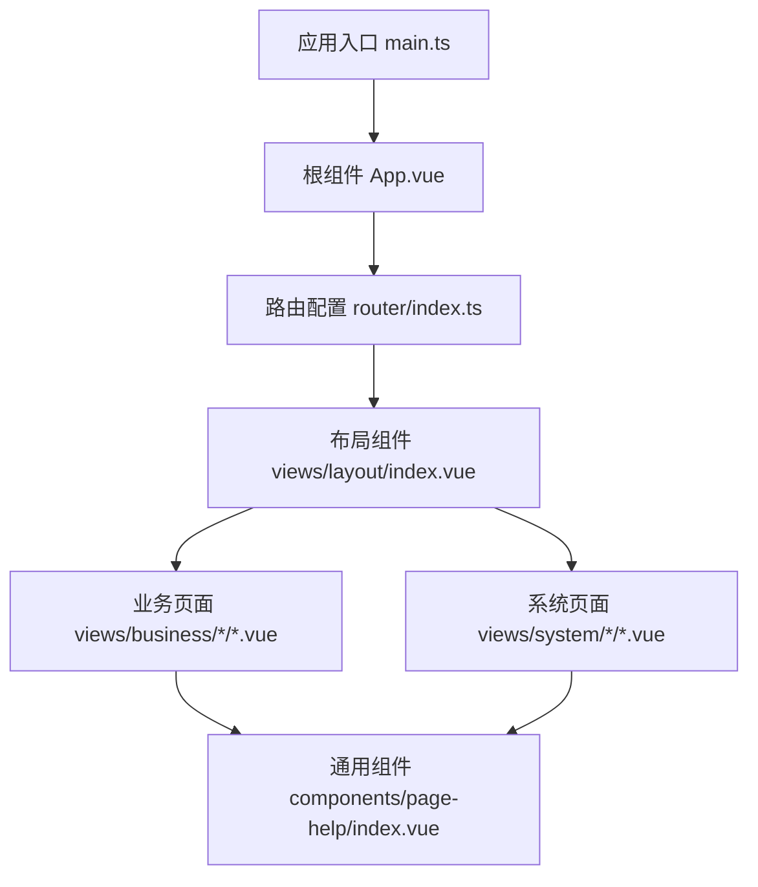
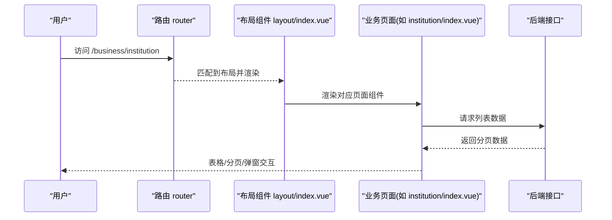
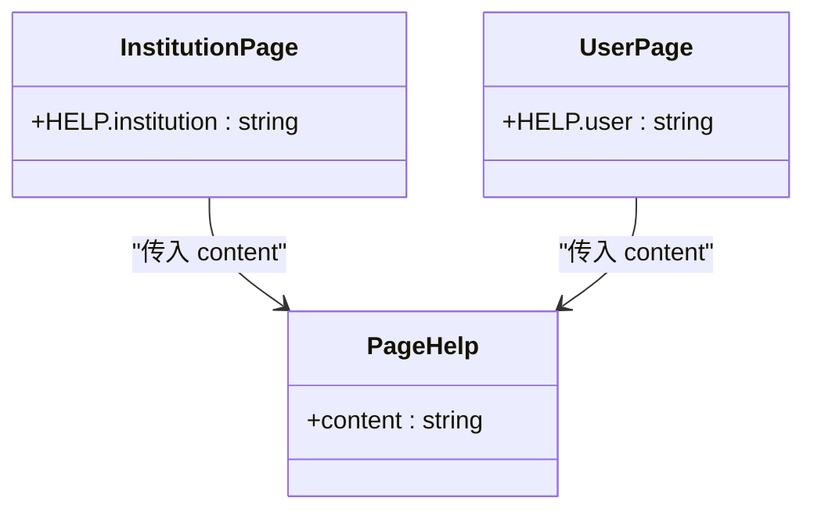
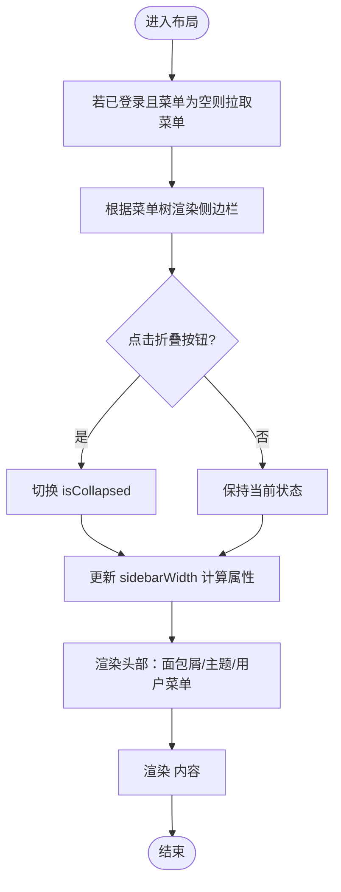
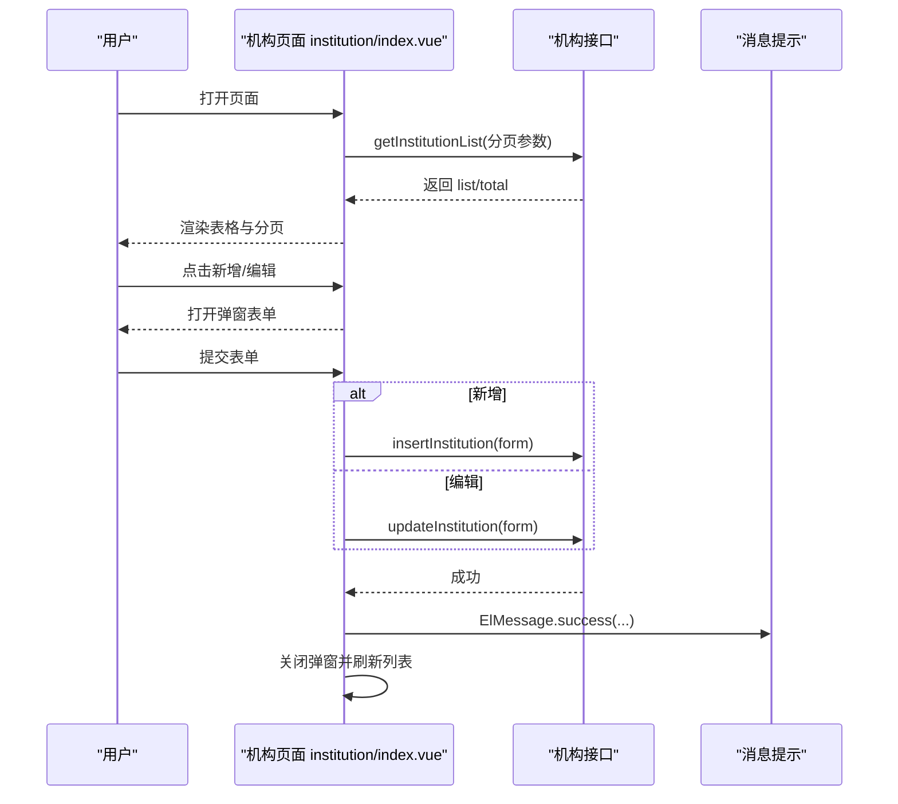
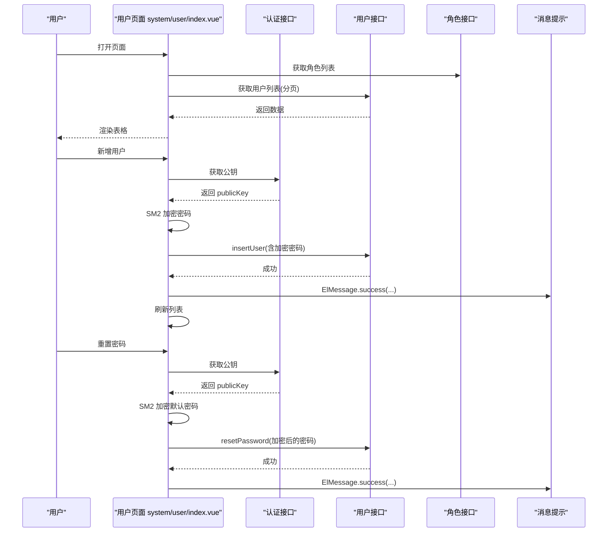
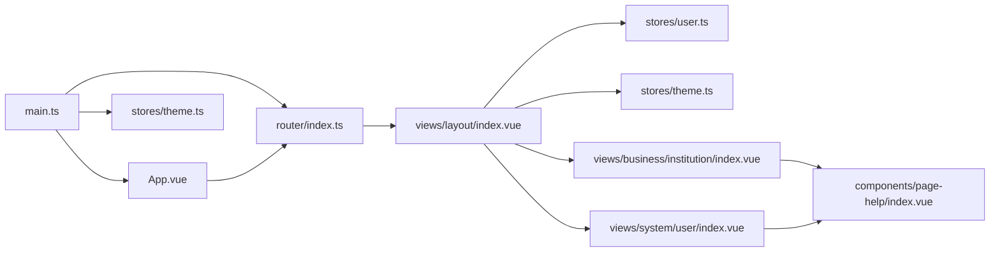

# 组件设计模式

<cite>
**本文引用的文件**   
- [main.ts](file://class_record_admin_front/src/main.ts)
- [App.vue](file://class_record_admin_front/src/App.vue)
- [路由配置 index.ts](file://class_record_admin_front/src/router/index.ts)
- [布局组件 layout/index.vue](file://class_record_admin_front/src/views/layout/index.vue)
- [页面帮助组件 page-help/index.vue](file://class_record_admin_front/src/components/page-help/index.vue)
- [机构管理页面 business/institution/index.vue](file://class_record_admin_front/src/views/business/institution/index.vue)
- [用户管理页面 system/user/index.vue](file://class_record_admin_front/src/views/system/user/index.vue)
</cite>

## 目录
1. [简介](#简介)
2. [项目结构](#项目结构)
3. [核心组件与API](#核心组件与api)
4. [架构总览](#架构总览)
5. [详细组件分析](#详细组件分析)
6. [依赖关系分析](#依赖关系分析)
7. [性能与可维护性建议](#性能与可维护性建议)
8. [故障排查指南](#故障排查指南)
9. [结论](#结论)

## 简介
本文件围绕管理端前端（Vue 3 + TypeScript）的“组件设计模式”进行系统化梳理，重点覆盖：
- 组合式 API 的核心用法：defineProps、defineEmits、defineExpose
- 组件间通信：props 传递、事件冒泡、provide/inject 依赖注入
- 生命周期管理、响应式数据绑定、计算属性与侦听器最佳实践
- 组件复用性与代码组织规范
- 结合仓库中真实页面与通用组件，给出落地示例与图示

## 项目结构
管理端采用基于路由的动态加载布局模式。入口初始化应用、注册插件与主题；根组件仅渲染路由视图；布局组件承载侧边栏、面包屑、头部操作区与内容区；业务页面以“列表+搜索+分页+弹窗表单”的常见形态实现。

图表来源
- [main.ts:1-22](file://class_record_admin_front/src/main.ts#L1-L22)
- [App.vue:1-10](file://class_record_admin_front/src/App.vue#L1-L10)
- [路由配置 index.ts:1-160](file://class_record_admin_front/src/router/index.ts#L1-L160)
- [布局组件 layout/index.vue:1-216](file://class_record_admin_front/src/views/layout/index.vue#L1-L216)
- [页面帮助组件 page-help/index.vue:1-33](file://class_record_admin_front/src/components/page-help/index.vue#L1-L33)

章节来源
- [main.ts:1-22](file://class_record_admin_front/src/main.ts#L1-L22)
- [App.vue:1-10](file://class_record_admin_front/src/App.vue#L1-L10)
- [路由配置 index.ts:1-160](file://class_record_admin_front/src/router/index.ts#L1-L160)
- [布局组件 layout/index.vue:1-216](file://class_record_admin_front/src/views/layout/index.vue#L1-L216)

## 核心组件与API
- defineProps：用于声明子组件接收的属性类型与约束，提升类型安全与可读性。例如页面帮助组件通过 defineProps 声明 content 字段，父组件直接传入说明文本。
- defineEmits：用于声明子组件向外抛出的事件，配合模板中的 @event 语法完成父子通信。
- defineExpose：在组合式 API 下显式暴露实例方法或状态，供父组件通过 ref 调用，常用于封装复杂交互（如表单校验、滚动定位等）。

在本仓库中，页面级组件多采用“组合式函数 + 响应式变量 + 模板指令”的模式，未大量使用自定义组件的 defineProps/defineEmits 定义，但已具备清晰的职责边界与数据流向，便于后续抽取为可复用组件。

章节来源
- [页面帮助组件 page-help/index.vue:1-33](file://class_record_admin_front/src/components/page-help/index.vue#L1-L33)

## 架构总览
整体采用“布局容器 + 动态路由 + 页面组件”的分层结构。布局组件负责全局导航、主题切换、用户信息展示与退出逻辑；业务页面聚焦于数据获取、表格展示、表单提交与交互反馈。

图表来源
- [路由配置 index.ts:1-160](file://class_record_admin_front/src/router/index.ts#L1-L160)
- [布局组件 layout/index.vue:1-216](file://class_record_admin_front/src/views/layout/index.vue#L1-L216)
- [机构管理页面 business/institution/index.vue:1-326](file://class_record_admin_front/src/views/business/institution/index.vue#L1-L326)

## 详细组件分析

### 页面帮助组件（page-help）
该组件是典型的“纯展示型子组件”，通过 props 接收帮助文案，内部使用 Element Plus 的 Popover 展示。其职责单一、无副作用，适合作为跨页面复用的提示组件。

图表来源
- [页面帮助组件 page-help/index.vue:1-33](file://class_record_admin_front/src/components/page-help/index.vue#L1-L33)
- [机构管理页面 business/institution/index.vue:1-326](file://class_record_admin_front/src/views/business/institution/index.vue#L1-L326)
- [用户管理页面 system/user/index.vue:1-360](file://class_record_admin_front/src/views/system/user/index.vue#L1-L360)

章节来源
- [页面帮助组件 page-help/index.vue:1-33](file://class_record_admin_front/src/components/page-help/index.vue#L1-L33)
- [机构管理页面 business/institution/index.vue:1-326](file://class_record_admin_front/src/views/business/institution/index.vue#L1-L326)
- [用户管理页面 system/user/index.vue:1-360](file://class_record_admin_front/src/views/system/user/index.vue#L1-L360)

### 布局组件（layout）
布局组件承担以下职责：
- 侧边栏菜单渲染与折叠控制
- 面包屑生成（基于路由元信息）
- 主题切换（亮/暗）
- 用户下拉菜单（个人信息、退出登录）
- 动态路由视图渲染与过渡动画

图表来源
- [布局组件 layout/index.vue:1-216](file://class_record_admin_front/src/views/layout/index.vue#L1-L216)

章节来源
- [布局组件 layout/index.vue:1-216](file://class_record_admin_front/src/views/layout/index.vue#L1-L216)

### 机构管理页面（institution）
典型的数据驱动页面，包含：
- 查询条件与重置
- 列表加载与分页
- 状态开关（启用/禁用）
- 新增/编辑弹窗表单
- 详情弹窗

图表来源
- [机构管理页面 business/institution/index.vue:1-326](file://class_record_admin_front/src/views/business/institution/index.vue#L1-L326)

章节来源
- [机构管理页面 business/institution/index.vue:1-326](file://class_record_admin_front/src/views/business/institution/index.vue#L1-L326)

### 用户管理页面（user）
除基础 CRUD 外，还涉及：
- 角色多选与回显
- 密码 SM2 加密后提交
- 重置密码默认值加密

图表来源
- [用户管理页面 system/user/index.vue:1-360](file://class_record_admin_front/src/views/system/user/index.vue#L1-L360)

章节来源
- [用户管理页面 system/user/index.vue:1-360](file://class_record_admin_front/src/views/system/user/index.vue#L1-L360)

## 依赖关系分析
- 应用入口 main.ts 负责创建 Vue 应用、挂载 Pinia、注册 ElementPlus 与路由，并在挂载前初始化主题 store，确保首屏样式正确。
- App.vue 作为根组件，仅包含路由出口，保持最小化职责。
- 路由配置集中管理页面映射与守卫逻辑，统一处理进度条与鉴权跳转。
- 布局组件依赖用户与主题 store，提供全局交互能力。
- 业务页面依赖各自 API 模块与工具函数，遵循“页面内聚合逻辑”的组织方式。

图表来源
- [main.ts:1-22](file://class_record_admin_front/src/main.ts#L1-L22)
- [App.vue:1-10](file://class_record_admin_front/src/App.vue#L1-L10)
- [路由配置 index.ts:1-160](file://class_record_admin_front/src/router/index.ts#L1-L160)
- [布局组件 layout/index.vue:1-216](file://class_record_admin_front/src/views/layout/index.vue#L1-L216)
- [页面帮助组件 page-help/index.vue:1-33](file://class_record_admin_front/src/components/page-help/index.vue#L1-L33)
- [机构管理页面 business/institution/index.vue:1-326](file://class_record_admin_front/src/views/business/institution/index.vue#L1-L326)
- [用户管理页面 system/user/index.vue:1-360](file://class_record_admin_front/src/views/system/user/index.vue#L1-L360)

章节来源
- [main.ts:1-22](file://class_record_admin_front/src/main.ts#L1-L22)
- [App.vue:1-10](file://class_record_admin_front/src/App.vue#L1-L10)
- [路由配置 index.ts:1-160](file://class_record_admin_front/src/router/index.ts#L1-L160)
- [布局组件 layout/index.vue:1-216](file://class_record_admin_front/src/views/layout/index.vue#L1-L216)

## 性能与可维护性建议
- 组件粒度拆分
  - 将“搜索栏”“表格”“分页”“弹窗表单”从页面中抽离为独立组件，减少单文件体积，提高复用率。
  - 对复杂表单（如用户管理）可进一步拆分为“基础信息表单”“角色选择表单”等子组件。
- 响应式与计算属性
  - 使用 computed 派生 UI 状态（如面包屑、侧边栏宽度），避免重复计算与冗余 ref。
  - 对大列表数据使用虚拟滚动或分页懒加载，降低首屏渲染压力。
- 事件与通信
  - 对于跨层级通信（如布局与页面），优先使用 provide/inject 共享轻量上下文（如主题、语言），避免 prop drilling。
  - 子组件对外暴露关键方法时使用 defineExpose，明确 API 边界。
- 错误处理与用户体验
  - 统一拦截器处理网络异常，页面层只关注业务态变更与用户提示。
  - 对耗时操作增加 loading 与防抖/节流，避免重复提交。

[本节为通用建议，不直接分析具体文件]

## 故障排查指南
- 路由跳转与权限
  - 检查路由守卫中对 token 的判断逻辑与 noAuth 页面的放行策略，确认重定向路径是否正确。
- 主题切换失效
  - 确认入口是否在挂载前初始化主题 store，以及 CSS 变量是否被正确应用到根节点。
- 表单提交失败
  - 核对必填校验规则与触发时机；确认接口返回结构与前端期望一致；注意敏感字段（如密码）是否需要加密后再提交。
- 列表数据不更新
  - 检查分页参数变化是否触发重新请求；确认 tableData 赋值是否为引用替换而非原地修改。

章节来源
- [路由配置 index.ts:135-157](file://class_record_admin_front/src/router/index.ts#L135-L157)
- [main.ts:15-16](file://class_record_admin_front/src/main.ts#L15-L16)
- [用户管理页面 system/user/index.vue:161-185](file://class_record_admin_front/src/views/system/user/index.vue#L161-L185)
- [机构管理页面 business/institution/index.vue:44-64](file://class_record_admin_front/src/views/business/institution/index.vue#L44-L64)

## 结论
本项目在管理端采用了清晰的分层与职责划分：入口初始化、根组件极简、布局承载全局交互、页面聚焦业务逻辑。通过组合式 API 与响应式范式，实现了良好的可维护性与扩展性。建议在后续迭代中逐步沉淀通用组件、完善 defineProps/defineEmits/defineExpose 的类型契约，并结合 provide/inject 优化跨层级通信，进一步提升复用率与开发效率。