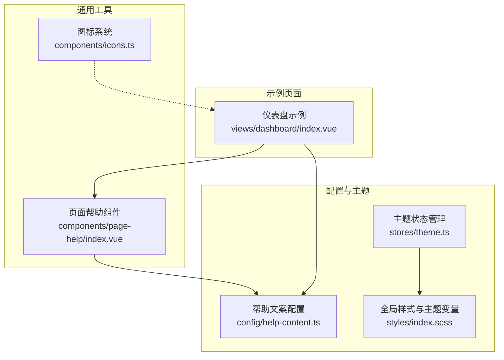
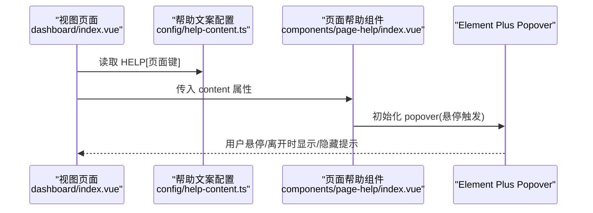
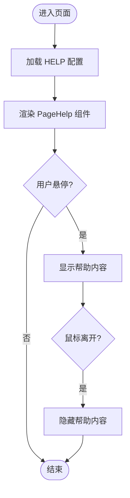
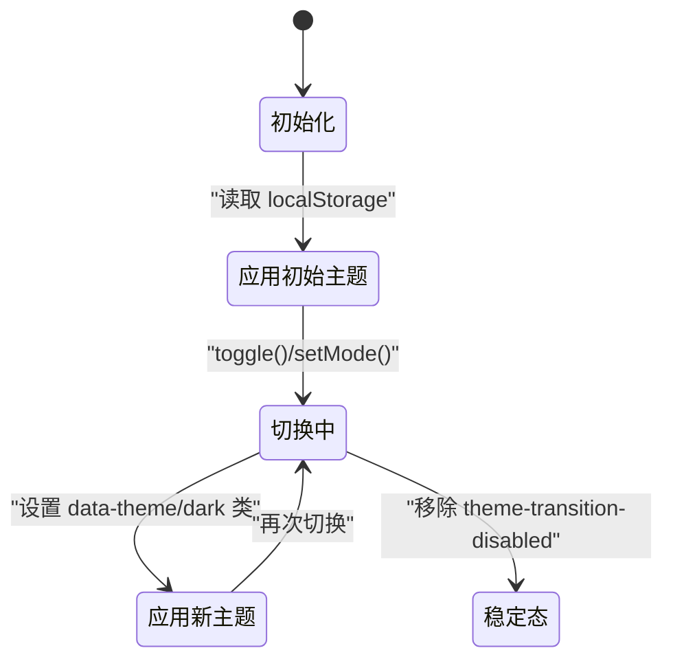
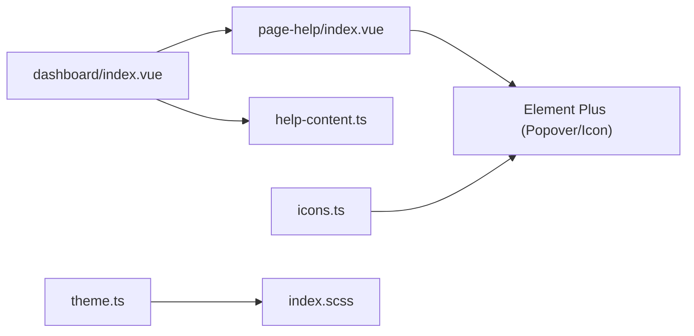

# 通用工具组件

<cite>
**本文引用的文件**
- [page-help/index.vue](file://class_record_admin_front/src/components/page-help/index.vue)
- [icons.ts](file://class_record_admin_front/src/components/icons.ts)
- [help-content.ts](file://class_record_admin_front/src/config/help-content.ts)
- [index.scss](file://class_record_admin_front/src/styles/index.scss)
- [theme.ts](file://class_record_admin_front/src/stores/theme.ts)
- [dashboard/index.vue](file://class_record_admin_front/src/views/dashboard/index.vue)
</cite>

## 目录
1. [简介](#简介)
2. [项目结构](#项目结构)
3. [核心组件](#核心组件)
4. [架构总览](#架构总览)
5. [详细组件分析](#详细组件分析)
6. [依赖关系分析](#依赖关系分析)
7. [性能考虑](#性能考虑)
8. [故障排查指南](#故障排查指南)
9. [结论](#结论)
10. [附录：使用与扩展指南](#附录使用与扩展指南)

## 简介
本文件面向管理端通用工具组件，聚焦以下基础能力：
- 页面帮助组件：以轻量悬浮提示形式提供上下文说明，支持多语言内容配置。
- 图标系统：集中导出与管理图标组件，提供动态渲染与选项列表生成。
- 样式与主题：基于 CSS 变量与 Element Plus 覆盖实现明暗主题适配。
- 国际化支持：通过配置化文案映射，为帮助内容提供可扩展的文本来源（当前为中文）。
- 测试、性能与错误处理：给出可落地的策略与建议。

## 项目结构
管理端前端采用 Vue 3 + TypeScript + Element Plus 技术栈。通用工具组件位于 components 目录，样式与主题在 styles 与 stores 中统一管理，帮助文案集中在 config 下。



图表来源
- [page-help/index.vue:1-33](file://class_record_admin_front/src/components/page-help/index.vue#L1-L33)
- [icons.ts:1-46](file://class_record_admin_front/src/components/icons.ts#L1-L46)
- [help-content.ts:1-30](file://class_record_admin_front/src/config/help-content.ts#L1-L30)
- [index.scss:1-493](file://class_record_admin_front/src/styles/index.scss#L1-L493)
- [theme.ts:1-47](file://class_record_admin_front/src/stores/theme.ts#L1-L47)
- [dashboard/index.vue:1-106](file://class_record_admin_front/src/views/dashboard/index.vue#L1-L106)

章节来源
- [page-help/index.vue:1-33](file://class_record_admin_front/src/components/page-help/index.vue#L1-L33)
- [icons.ts:1-46](file://class_record_admin_front/src/components/icons.ts#L1-L46)
- [help-content.ts:1-30](file://class_record_admin_front/src/config/help-content.ts#L1-L30)
- [index.scss:1-493](file://class_record_admin_front/src/styles/index.scss#L1-L493)
- [theme.ts:1-47](file://class_record_admin_front/src/stores/theme.ts#L1-L47)
- [dashboard/index.vue:1-106](file://class_record_admin_front/src/views/dashboard/index.vue#L1-L106)

## 核心组件
本节对两个关键工具组件进行接口、行为与样式的深入解析。

### 页面帮助组件 PageHelp
- 职责：在表单或字段旁提供“？”图标，悬停时弹出帮助内容。
- Props 定义：
  - content: string — 帮助文本内容。
- 事件机制：无自定义事件；交互由底层 Popover 触发。
- 插槽使用：未暴露插槽；如需复杂内容可在父级封装。
- 样式封装：
  - 图标颜色跟随主题变量，hover 高亮主色。
  - 帮助内容区域使用等宽换行与主题文本色。
- 主题适配：
  - 使用 CSS 变量 --color-text-secondary、--color-primary、--color-text 等，随 data-theme 切换自动生效。
- 国际化支持：
  - 通过外部 HELP 配置对象传入不同页面的帮助文案，便于后续接入 i18n。

章节来源
- [page-help/index.vue:1-33](file://class_record_admin_front/src/components/page-help/index.vue#L1-L33)
- [index.scss:1-493](file://class_record_admin_front/src/styles/index.scss#L1-L493)
- [help-content.ts:1-30](file://class_record_admin_front/src/config/help-content.ts#L1-L30)

### 图标系统 icons.ts
- 职责：集中导入并导出常用图标组件，提供按名称获取组件的能力与下拉选项生成。
- 主要导出：
  - iconMap: Record<string, any> — 图标名到组件的映射表。
  - iconOptions: Array<{label, value}> — 用于选择器的图标选项。
  - getIconComponent(iconName): 根据名称返回对应图标组件实例或 null。
- 使用方式：
  - 在模板中以 <component :is="getIconComponent(name)" /> 动态渲染。
  - 在表单中选择器中使用 iconOptions 作为数据源。
- 主题适配：
  - 图标本身不直接受主题影响，但可通过外层容器颜色变量控制显示效果。

章节来源
- [icons.ts:1-46](file://class_record_admin_front/src/components/icons.ts#L1-L46)

## 架构总览
页面帮助组件与图标系统在管理端的使用路径如下：



图表来源
- [dashboard/index.vue:1-106](file://class_record_admin_front/src/views/dashboard/index.vue#L1-L106)
- [help-content.ts:1-30](file://class_record_admin_front/src/config/help-content.ts#L1-L30)
- [page-help/index.vue:1-33](file://class_record_admin_front/src/components/page-help/index.vue#L1-L33)

## 详细组件分析

### 页面帮助组件 PageHelp
- 设计要点：
  - 最小化侵入：仅接收 content，避免耦合业务逻辑。
  - 交互友好：默认 hover 触发，适合辅助说明场景。
  - 样式内聚：组件内部 scoped 样式，减少对外部样式污染。
- 数据结构与复杂度：
  - 输入为字符串，渲染为 DOM 文本节点，时间复杂度 O(n)，空间复杂度 O(1)。
- 依赖链：
  - 依赖 Element Plus 的 el-popover 与 el-icon。
  - 依赖主题变量，确保在不同主题下可读性良好。
- 优化点：
  - 若帮助内容较长，建议分页或折叠展示（可在父级封装）。
  - 对于频繁出现的固定帮助，可在父级缓存 HELP 条目引用，避免重复计算。
- 错误处理：
  - 当 content 为空或未定义时，Popover 仍会渲染空内容，建议在父级做非空校验或提供默认提示。



图表来源
- [page-help/index.vue:1-33](file://class_record_admin_front/src/components/page-help/index.vue#L1-L33)
- [help-content.ts:1-30](file://class_record_admin_front/src/config/help-content.ts#L1-L30)

章节来源
- [page-help/index.vue:1-33](file://class_record_admin_front/src/components/page-help/index.vue#L1-L33)
- [help-content.ts:1-30](file://class_record_admin_front/src/config/help-content.ts#L1-L30)

### 图标系统 icons.ts
- 设计要点：
  - 集中管理：统一从 @element-plus/icons-vue 导入，避免分散 import。
  - 动态渲染：通过 getIconComponent 将字符串转为组件，提升灵活性。
  - 选项生成：iconOptions 可直接用于选择器，减少样板代码。
- 数据结构与复杂度：
  - iconMap 为字典结构，查找时间复杂度 O(1)。
  - iconOptions 为数组，长度等于图标数量，构建一次后复用。
- 依赖链：
  - 依赖 Element Plus 图标库。
  - 被视图或表单组件按需引入。
- 优化点：
  - 图标按需打包：结合构建工具 tree-shaking，避免全量引入。
  - 大图标集懒加载：可按模块拆分多个 iconMap，按需合并。
- 错误处理：
  - getIconComponent 对空值与未知名称返回 null，调用方需判空后再渲染。

```mermaid
classDiagram
class IconsModule {
+iconMap : Record~string, any~
+iconOptions : {label,value}[]
+getIconComponent(iconName) : any
}
class ViewPage {
+使用 getIconComponent 渲染图标
}
IconsModule <.. ViewPage : "被引用"
```

图表来源
- [icons.ts:1-46](file://class_record_admin_front/src/components/icons.ts#L1-L46)
- [dashboard/index.vue:1-106](file://class_record_admin_front/src/views/dashboard/index.vue#L1-L106)

章节来源
- [icons.ts:1-46](file://class_record_admin_front/src/components/icons.ts#L1-L46)

### 主题与样式体系
- 主题变量：
  - 在根元素定义浅色与深色两套 CSS 变量，包括色彩、字体、布局尺寸等。
  - Element Plus 的主题变量被覆盖，保证 UI 一致性。
- 主题切换：
  - 通过 Pinia store 维护 mode，watch 监听变化并设置 html 的 data-theme 与 dark 类。
  - 首次应用后移除过渡禁用类，启用平滑切换动画。
- 组件样式：
  - 页面帮助组件使用主题变量控制图标与文本颜色，确保明暗模式可读性。
  - 表格、按钮、对话框等全局样式均遵循主题变量。



图表来源
- [theme.ts:1-47](file://class_record_admin_front/src/stores/theme.ts#L1-L47)
- [index.scss:1-493](file://class_record_admin_front/src/styles/index.scss#L1-L493)

章节来源
- [theme.ts:1-47](file://class_record_admin_front/src/stores/theme.ts#L1-L47)
- [index.scss:1-493](file://class_record_admin_front/src/styles/index.scss#L1-L493)

## 依赖关系分析
- 组件间依赖：
  - dashboard 页面引入 PageHelp 与 HELP 配置，演示帮助组件的实际用法。
  - PageHelp 依赖 Element Plus 的 Popover 与 Icon。
  - icons.ts 被多处视图或表单组件引用，提供动态图标能力。
- 外部依赖：
  - Element Plus 提供 UI 基础组件与图标库。
  - Pinia 管理主题状态。
  - SCSS 与 CSS 变量驱动主题。



图表来源
- [dashboard/index.vue:1-106](file://class_record_admin_front/src/views/dashboard/index.vue#L1-L106)
- [page-help/index.vue:1-33](file://class_record_admin_front/src/components/page-help/index.vue#L1-L33)
- [help-content.ts:1-30](file://class_record_admin_front/src/config/help-content.ts#L1-L30)
- [icons.ts:1-46](file://class_record_admin_front/src/components/icons.ts#L1-L46)
- [theme.ts:1-47](file://class_record_admin_front/src/stores/theme.ts#L1-L47)
- [index.scss:1-493](file://class_record_admin_front/src/styles/index.scss#L1-L493)

章节来源
- [dashboard/index.vue:1-106](file://class_record_admin_front/src/views/dashboard/index.vue#L1-L106)
- [page-help/index.vue:1-33](file://class_record_admin_front/src/components/page-help/index.vue#L1-L33)
- [help-content.ts:1-30](file://class_record_admin_front/src/config/help-content.ts#L1-L30)
- [icons.ts:1-46](file://class_record_admin_front/src/components/icons.ts#L1-L46)
- [theme.ts:1-47](file://class_record_admin_front/src/stores/theme.ts#L1-L47)
- [index.scss:1-493](file://class_record_admin_front/src/styles/index.scss#L1-L493)

## 性能考虑
- 帮助组件：
  - 使用 hover 触发，避免常驻渲染开销；长文本建议分页或折叠。
  - 避免在循环中重复创建相同 help 内容，尽量复用 HELP 引用。
- 图标系统：
  - 利用 tree-shaking 按需引入图标，减少包体体积。
  - 大量图标场景可采用分模块 iconMap 与懒加载。
- 主题切换：
  - 通过 CSS 变量与 data-theme 切换，避免重绘大面积 DOM。
  - 首次切换后移除过渡禁用类，获得平滑体验。

## 故障排查指南
- 帮助内容为空：
  - 检查 HELP 配置是否包含对应页面键，或父组件是否正确传入 content。
- 图标未显示：
  - 确认 getIconComponent 返回值是否为 null，并在模板中判空。
  - 检查图标名是否在 iconMap 中存在。
- 主题不生效：
  - 确认 html 的 data-theme 与 dark 类是否正确设置。
  - 检查样式文件中变量覆盖是否被其他样式优先级覆盖。

章节来源
- [page-help/index.vue:1-33](file://class_record_admin_front/src/components/page-help/index.vue#L1-L33)
- [icons.ts:1-46](file://class_record_admin_front/src/components/icons.ts#L1-L46)
- [theme.ts:1-47](file://class_record_admin_front/src/stores/theme.ts#L1-L47)
- [index.scss:1-493](file://class_record_admin_front/src/styles/index.scss#L1-L493)

## 结论
- 页面帮助组件与图标系统提供了简洁、可复用的基础能力，配合主题与配置化文案，满足管理端常见需求。
- 通过 CSS 变量与 Element Plus 覆盖，实现了良好的主题适配与一致性。
- 建议在后续迭代中完善国际化、增强帮助内容的结构化与可访问性，并对图标系统进行模块化与懒加载优化。

## 附录：使用与扩展指南

### 使用示例
- 在页面中使用帮助组件：
  - 从 HELP 配置中读取对应键的内容，作为 content 传入 PageHelp。
  - 参考仪表盘页面中的用法。
- 在页面中使用图标系统：
  - 通过 getIconComponent 获取图标组件，再在模板中以 <component :is="..."/> 渲染。
  - 在表单选择器中使用 iconOptions 作为数据源。

章节来源
- [dashboard/index.vue:1-106](file://class_record_admin_front/src/views/dashboard/index.vue#L1-L106)
- [icons.ts:1-46](file://class_record_admin_front/src/components/icons.ts#L1-L46)

### 自定义开发指南
- 扩展帮助内容：
  - 在 HELP 配置中添加新的页面键与文案。
  - 如需多语言，可将 HELP 替换为 i18n 资源，保持 PageHelp 的 props 不变。
- 扩展图标系统：
  - 在 icons.ts 中新增图标导入与映射项，并更新 iconOptions。
  - 对大型图标集，可按功能域拆分为多个文件，最后聚合导出。
- 主题定制：
  - 在 index.scss 中调整 CSS 变量与 Element Plus 覆盖规则。
  - 通过 theme store 的 setMode/toggle 方法控制主题切换。

章节来源
- [help-content.ts:1-30](file://class_record_admin_front/src/config/help-content.ts#L1-L30)
- [icons.ts:1-46](file://class_record_admin_front/src/components/icons.ts#L1-L46)
- [index.scss:1-493](file://class_record_admin_front/src/styles/index.scss#L1-L493)
- [theme.ts:1-47](file://class_record_admin_front/src/stores/theme.ts#L1-L47)