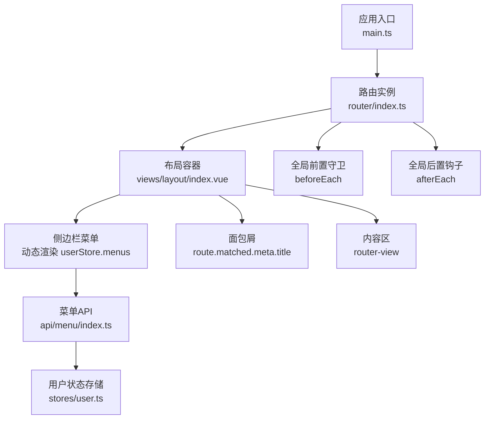
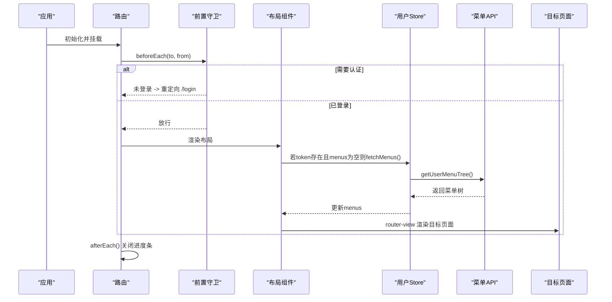
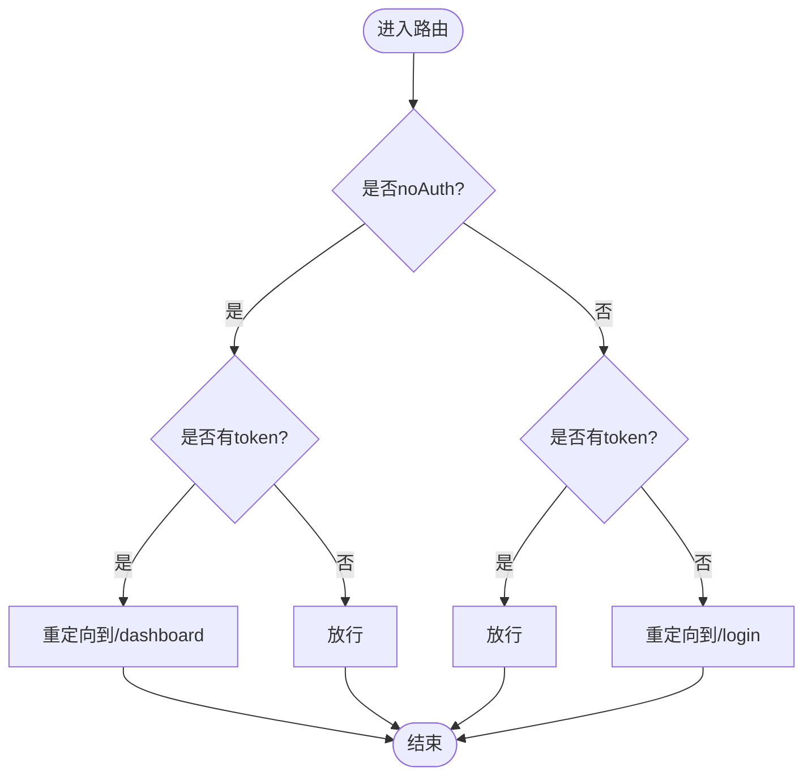
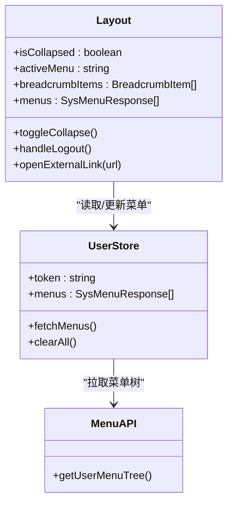
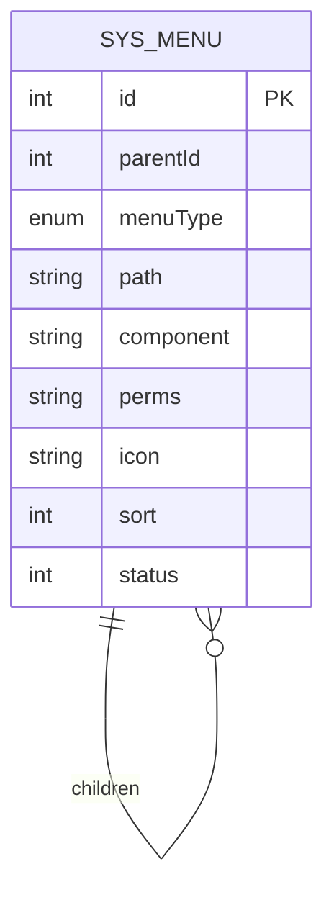
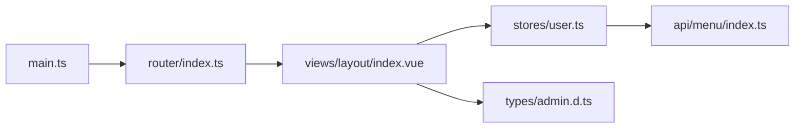

# 路由与导航系统

<cite>
**本文引用的文件**   
- [src/router/index.ts](file://class_record_admin_front/src/router/index.ts)
- [src/main.ts](file://class_record_admin_front/src/main.ts)
- [src/views/layout/index.vue](file://class_record_admin_front/src/views/layout/index.vue)
- [src/views/layout/index.d.ts](file://class_record_admin_front/src/views/layout/index.d.ts)
- [src/stores/user.ts](file://class_record_admin_front/src/stores/user.ts)
- [src/api/menu/index.ts](file://class_record_admin_front/src/api/menu/index.ts)
- [src/types/admin.d.ts](file://class_record_admin_front/src/types/admin.d.ts)
- [src/components/page-help/index.vue](file://class_record_admin_front/src/components/page-help/index.vue)
- [src/config/help-content.ts](file://class_record_admin_front/src/config/help-content.ts)
</cite>

## 目录
1. [简介](#简介)
2. [项目结构](#项目结构)
3. [核心组件](#核心组件)
4. [架构总览](#架构总览)
5. [详细组件分析](#详细组件分析)
6. [依赖关系分析](#依赖关系分析)
7. [性能考虑](#性能考虑)
8. [故障排查指南](#故障排查指南)
9. [结论](#结论)
10. [附录](#附录)

## 简介
本文件面向管理端的前端路由与导航体系，系统性解析基于 Vue Router 的路由配置、动态菜单生成、面包屑导航、权限控制与页面元信息。文档同时覆盖路由守卫、懒加载、外链处理、帮助系统集成等关键能力，并提供可落地的权限控制最佳实践建议。

## 项目结构
管理端采用“静态路由 + 动态菜单”的混合模式：
- 静态路由：登录页、布局壳、仪表盘、个人信息以及若干系统/业务页面以静态方式注册，便于快速访问与基础导航。
- 动态菜单：登录后根据用户角色/权限拉取菜单树，渲染侧边栏菜单；外链类型菜单在新窗口打开。
- 路由守卫：统一进行登录态校验与进度条提示。
- 面包屑：基于当前路由匹配链自动生成。
- 懒加载：所有页面组件通过动态 import 实现按需加载。

图表来源
- [src/main.ts:1-22](file://class_record_admin_front/src/main.ts#L1-L22)
- [src/router/index.ts:1-160](file://class_record_admin_front/src/router/index.ts#L1-L160)
- [src/views/layout/index.vue:1-216](file://class_record_admin_front/src/views/layout/index.vue#L1-L216)
- [src/api/menu/index.ts:1-26](file://class_record_admin_front/src/api/menu/index.ts#L1-L26)
- [src/stores/user.ts:1-49](file://class_record_admin_front/src/stores/user.ts#L1-L49)

章节来源
- [src/main.ts:1-22](file://class_record_admin_front/src/main.ts#L1-L22)
- [src/router/index.ts:1-160](file://class_record_admin_front/src/router/index.ts#L1-L160)
- [src/views/layout/index.vue:1-216](file://class_record_admin_front/src/views/layout/index.vue#L1-L216)

## 核心组件
- 路由定义与守卫
  - 使用 createWebHistory 创建历史模式路由，集中注册静态路由与通配符重定向。
  - 全局前置守卫负责登录态检查与无权限跳转；全局后置钩子用于关闭进度条。
- 布局与导航
  - 布局组件提供侧边栏、面包屑、主题切换、用户下拉菜单与内容区过渡动画。
  - 侧边栏根据用户菜单树动态渲染，支持目录、菜单、外链三种节点类型。
- 数据与状态
  - Pinia store 维护 token、用户信息与菜单树，并在首次进入时按需拉取菜单。
- 菜单 API
  - 提供获取用户可见菜单树的接口封装，供布局组件在挂载后调用。

章节来源
- [src/router/index.ts:1-160](file://class_record_admin_front/src/router/index.ts#L1-L160)
- [src/views/layout/index.vue:1-216](file://class_record_admin_front/src/views/layout/index.vue#L1-L216)
- [src/stores/user.ts:1-49](file://class_record_admin_front/src/stores/user.ts#L1-L49)
- [src/api/menu/index.ts:1-26](file://class_record_admin_front/src/api/menu/index.ts#L1-L26)

## 架构总览
下图展示了从应用启动到页面渲染的关键流程，包括路由初始化、守卫拦截、菜单拉取与渲染、面包屑生成与内容区展示。

图表来源
- [src/router/index.ts:135-157](file://class_record_admin_front/src/router/index.ts#L135-L157)
- [src/views/layout/index.vue:50-54](file://class_record_admin_front/src/views/layout/index.vue#L50-L54)
- [src/stores/user.ts:30-35](file://class_record_admin_front/src/stores/user.ts#L30-L35)
- [src/api/menu/index.ts:23-25](file://class_record_admin_front/src/api/menu/index.ts#L23-L25)

## 详细组件分析

### 路由配置与守卫
- 路由模式与基础路径
  - 使用 createWebHistory 并读取环境变量作为 BASE_URL。
- 静态路由
  - 登录页标记 noAuth 允许免鉴权访问。
  - 根路径重定向至仪表盘。
  - 其余系统/业务页面均位于 layout 子路由下，并通过 meta 设置标题与图标。
- 通配符
  - 未匹配路径统一重定向至仪表盘。
- 全局前置守卫
  - 读取本地存储中的 admin_token 判断登录态。
  - 对 noAuth 路由做特殊处理：已登录访问登录页时重定向至仪表盘。
  - 非 noAuth 路由若无 token 则重定向至登录页。
- 全局后置钩子
  - 每次路由切换完成后关闭 NProgress 进度条。

图表来源
- [src/router/index.ts:135-157](file://class_record_admin_front/src/router/index.ts#L135-L157)

章节来源
- [src/router/index.ts:1-160](file://class_record_admin_front/src/router/index.ts#L1-160)

### 布局与导航（侧边栏、面包屑、外链）
- 侧边栏菜单
  - 数据来源：userStore.menus（类型为 SysMenuResponse[]）。
  - 节点类型：
    - M（目录）：有子节点时渲染为子菜单，否则降级为普通菜单项。
    - C（菜单）：渲染为普通菜单项。
    - L（外链）：点击在新窗口打开，不触发路由。
  - 索引解析：resolveMenuPath 将 path 规范化为绝对路径，兜底使用 id 作为 index。
- 面包屑
  - 基于 route.matched 过滤出包含 meta.title 的层级，映射为 {title, path} 列表。
- 外链处理
  - 外链菜单通过 window.open 在新标签页打开，并显示外部链接图标。
- 交互与状态
  - 折叠/展开侧边栏。
  - 顶部用户下拉菜单支持跳转到个人信息与退出登录。
  - 首次进入且已登录但菜单为空时，自动拉取菜单树。

图表来源
- [src/views/layout/index.vue:20-86](file://class_record_admin_front/src/views/layout/index.vue#L20-L86)
- [src/stores/user.ts:5-48](file://class_record_admin_front/src/stores/user.ts#L5-L48)
- [src/api/menu/index.ts:23-25](file://class_record_admin_front/src/api/menu/index.ts#L23-L25)
- [src/views/layout/index.d.ts:1-5](file://class_record_admin_front/src/views/layout/index.d.ts#L1-L5)

章节来源
- [src/views/layout/index.vue:1-216](file://class_record_admin_front/src/views/layout/index.vue#L1-L216)
- [src/views/layout/index.d.ts:1-5](file://class_record_admin_front/src/views/layout/index.d.ts#L1-L5)
- [src/stores/user.ts:1-49](file://class_record_admin_front/src/stores/user.ts#L1-L49)
- [src/api/menu/index.ts:1-26](file://class_record_admin_front/src/api/menu/index.ts#L1-L26)

### 菜单管理与权限标识
- 菜单数据结构
  - SysMenuResponse 包含 id、parentId、menuType、path、component、perms、icon、sort、status 等字段，支持多级 children。
- 菜单管理页面
  - 提供菜单的增删改查、树形展示、分页、搜索与状态切换。
  - 新增/编辑表单支持选择上级目录、菜单类型、图标、路由路径、组件路径、权限标识、排序与状态。
- 权限标识
  - perms 字段用于记录按钮或资源级权限标识，可在页面内结合指令或逻辑进行显隐控制（当前仓库未内置指令，建议在页面中按 perms 值进行条件渲染）。

图表来源
- [src/types/admin.d.ts:35-51](file://class_record_admin_front/src/types/admin.d.ts#L35-L51)

章节来源
- [src/types/admin.d.ts:1-263](file://class_record_admin_front/src/types/admin.d.ts#L1-L263)
- [src/views/system/menu/index.vue:1-457](file://class_record_admin_front/src/views/system/menu/index.vue#L1-L457)

### 帮助系统集成与页面元信息
- 帮助集成
  - 页面可通过引入 PageHelp 组件并传入 HELP 配置对象，在页面头部显示帮助入口。
- 页面元信息
  - 路由 meta.title 用于面包屑与页面标题；meta.icon 用于侧边栏图标（在布局中配合图标工具函数渲染）。

章节来源
- [src/views/system/menu/index.vue:1-457](file://class_record_admin_front/src/views/system/menu/index.vue#L1-L457)
- [src/components/page-help/index.vue](file://class_record_admin_front/src/components/page-help/index.vue)
- [src/config/help-content.ts](file://class_record_admin_front/src/config/help-content.ts)

### 路由懒加载与参数传递
- 懒加载
  - 所有页面组件均采用动态 import 形式注册，确保首屏体积最小化与按需加载。
- 参数传递
  - 当前仓库未使用带参数的动态路由。如需扩展，可在路由定义中使用 params，并在页面中通过 useRoute().params 读取。
- 查询字符串
  - 当前仓库未使用 query 传参。如需扩展，可在页面中通过 useRoute().query 读取与拼接。

章节来源
- [src/router/index.ts:1-160](file://class_record_admin_front/src/router/index.ts#L1-160)

### 路由权限控制的实现方案与最佳实践
现状说明
- 当前前端仅基于 token 进行登录态校验，未实现基于角色/权限标识的细粒度路由控制。
- 菜单树由后端按用户权限返回，前端据此渲染侧边栏，间接实现了“可见即可用”的菜单级权限控制。

推荐方案（落地步骤）
- 服务端
  - 返回用户角色集合与菜单树（含 perms 标识），必要时返回白名单路由表。
- 前端
  - 在 store 中缓存 roles 与 menus。
  - 在 beforeEach 中：
    - 若 to.meta.requiresAuth 为真，校验 token。
    - 若 to.meta.roles 存在，校验当前用户 roles 是否满足。
    - 若 to.meta.perms 存在，校验当前用户 perms 是否包含所需标识。
    - 不满足则重定向至 403 或上一页。
  - 菜单渲染：
    - 仅渲染用户拥有权限的菜单节点。
    - 按钮级权限：在页面中根据 perms 控制显隐。
- 开发规范
  - 为每个受控路由添加 meta.requiresAuth/roles/perms 描述。
  - 统一错误码与提示文案，避免泄露敏感信息。
  - 对高频鉴权逻辑进行缓存与短路优化。

[本节为通用方案建议，不直接分析具体代码文件]

## 依赖关系分析
- main.ts 注入 Pinia、ElementPlus 与 router，完成应用初始化。
- router/index.ts 定义路由与守卫，依赖 NProgress 提供进度反馈。
- views/layout/index.vue 依赖 stores/user.ts 与 api/menu/index.ts 拉取并渲染菜单。
- types/admin.d.ts 提供菜单、用户、角色等类型定义，贯穿前后端契约。

图表来源
- [src/main.ts:1-22](file://class_record_admin_front/src/main.ts#L1-L22)
- [src/router/index.ts:1-160](file://class_record_admin_front/src/router/index.ts#L1-L160)
- [src/views/layout/index.vue:1-216](file://class_record_admin_front/src/views/layout/index.vue#L1-L216)
- [src/stores/user.ts:1-49](file://class_record_admin_front/src/stores/user.ts#L1-L49)
- [src/api/menu/index.ts:1-26](file://class_record_admin_front/src/api/menu/index.ts#L1-L26)
- [src/types/admin.d.ts:1-263](file://class_record_admin_front/src/types/admin.d.ts#L1-L263)

章节来源
- [src/main.ts:1-22](file://class_record_admin_front/src/main.ts#L1-L22)
- [src/router/index.ts:1-160](file://class_record_admin_front/src/router/index.ts#L1-L160)
- [src/views/layout/index.vue:1-216](file://class_record_admin_front/src/views/layout/index.vue#L1-L216)
- [src/stores/user.ts:1-49](file://class_record_admin_front/src/stores/user.ts#L1-L49)
- [src/api/menu/index.ts:1-26](file://class_record_admin_front/src/api/menu/index.ts#L1-L26)
- [src/types/admin.d.ts:1-263](file://class_record_admin_front/src/types/admin.d.ts#L1-L263)

## 性能考虑
- 路由懒加载：所有页面组件采用动态 import，减少首屏体积。
- 菜单树缓存：用户菜单树在 store 中持久化，避免重复请求。
- 进度条：仅在路由切换期间显示，避免阻塞渲染。
- 建议
  - 对大型页面进一步拆分与预加载策略。
  - 对菜单树进行去重与扁平化缓存，提升渲染性能。
  - 对高频鉴权逻辑增加短路判断与缓存。

[本节为通用指导，不直接分析具体代码文件]

## 故障排查指南
- 无法进入受保护页面
  - 检查本地存储是否存在 admin_token。
  - 确认路由 meta 是否误标 noAuth 或缺少 requiresAuth。
- 侧边栏菜单为空
  - 检查用户是否已登录且成功拉取菜单树。
  - 查看 getUserMenuTree 接口返回是否为空数组。
- 外链菜单无效
  - 确认菜单类型为 L 且 path 为合法 URL。
- 面包屑缺失
  - 确认路由 meta.title 是否正确设置。
- 进度条卡住
  - 检查 afterEach 钩子是否正常执行。

章节来源
- [src/router/index.ts:135-157](file://class_record_admin_front/src/router/index.ts#L135-L157)
- [src/views/layout/index.vue:50-54](file://class_record_admin_front/src/views/layout/index.vue#L50-L54)
- [src/stores/user.ts:30-35](file://class_record_admin_front/src/stores/user.ts#L30-L35)
- [src/api/menu/index.ts:23-25](file://class_record_admin_front/src/api/menu/index.ts#L23-L25)

## 结论
本项目采用“静态路由 + 动态菜单”的组合方案，结合全局守卫与菜单树渲染，实现了简洁而可扩展的管理端导航体系。当前已具备完善的登录态校验、懒加载与面包屑能力；后续可按需引入基于角色/权限标识的细粒度路由与按钮级权限控制，进一步提升安全性与灵活性。

## 附录
- 相关类型定义参考
  - 菜单实体与请求响应类型见 types/admin.d.ts。
- 帮助集成参考
  - 页面帮助组件与帮助内容配置文件见 components/page-help 与 config/help-content。

章节来源
- [src/types/admin.d.ts:1-263](file://class_record_admin_front/src/types/admin.d.ts#L1-L263)
- [src/components/page-help/index.vue](file://class_record_admin_front/src/components/page-help/index.vue)
- [src/config/help-content.ts](file://class_record_admin_front/src/config/help-content.ts)