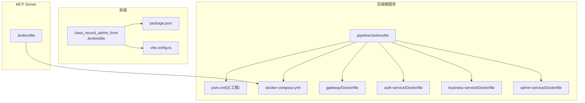
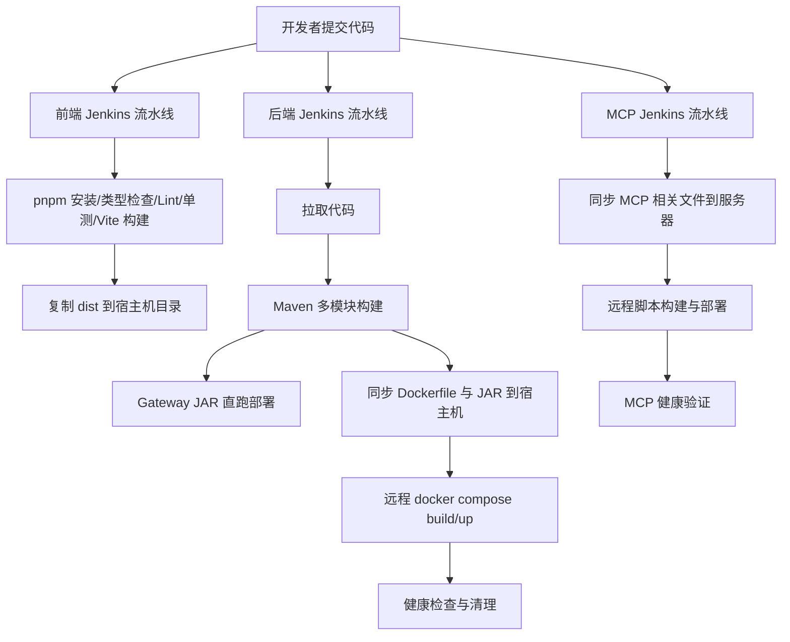
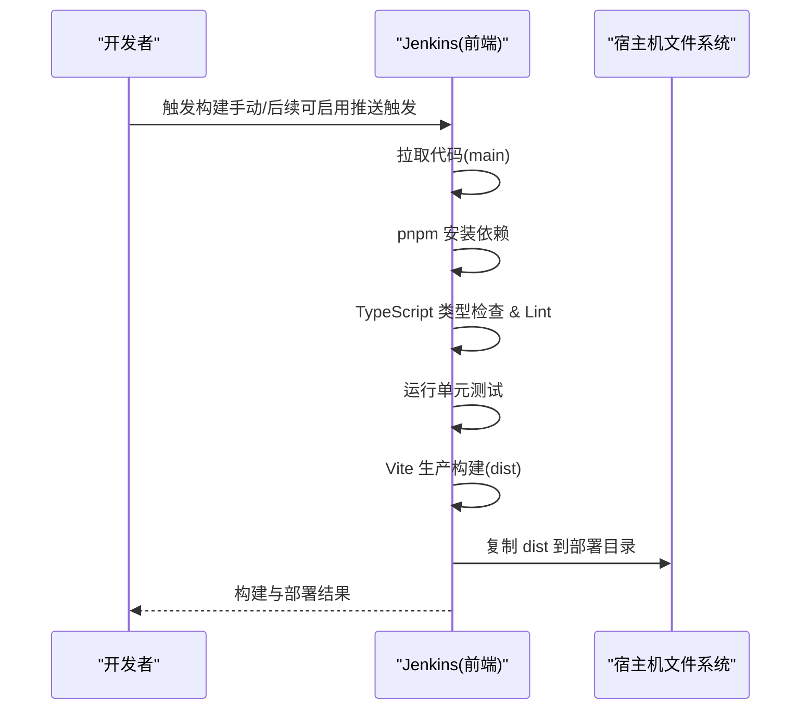
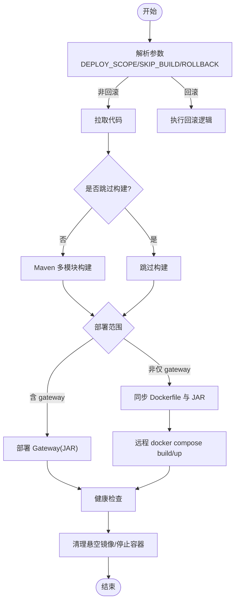
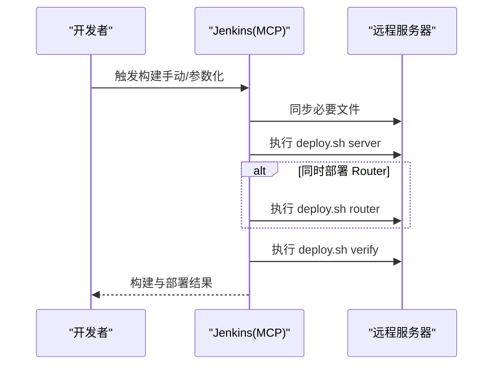
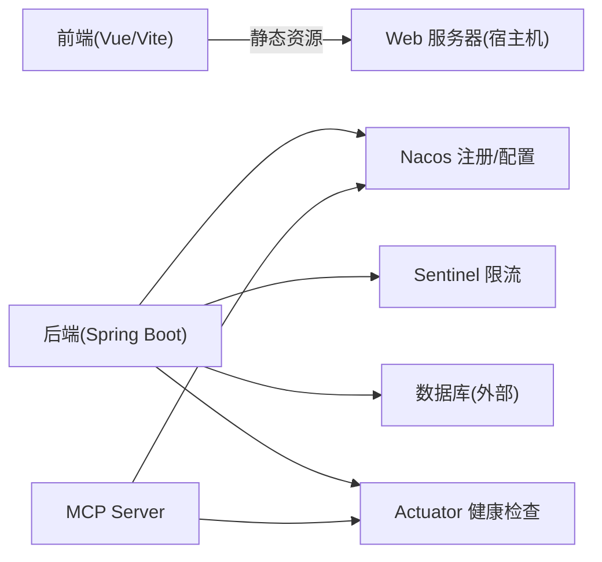

# CI/CD流水线

<cite>
**本文引用的文件**
- [class_record_admin_front/pipeline/Jenkinsfile](file://class_record_admin_front/pipeline/Jenkinsfile)
- [class_times_record_back/pipeline/Jenkinsfile](file://class_times_record_back/pipeline/Jenkinsfile)
- [course_record_mcp_server/Jenkinsfile](file://course_record_mcp_server/Jenkinsfile)
- [class_times_record_back/pom.xml](file://class_times_record_back/pom.xml)
- [class_record_admin_front/package.json](file://class_record_admin_front/package.json)
- [class_record_admin_front/vite.config.ts](file://class_record_admin_front/vite.config.ts)
- [class_times_record_back/docker-compose.yml](file://class_times_record_back/docker-compose.yml)
- [class_times_record_back/gateway/Dockerfile](file://class_times_record_back/gateway/Dockerfile)
- [class_times_record_back/auth-service/Dockerfile](file://class_times_record_back/auth-service/Dockerfile)
- [class_times_record_back/business-service/Dockerfile](file://class_times_record_back/business-service/Dockerfile)
- [class_times_record_back/admin-service/Dockerfile](file://class_times_record_back/admin-service/Dockerfile)
- [class_times_record_back/gateway/pom.xml](file://class_times_record_back/gateway/pom.xml)
- [class_times_record_back/auth-service/pom.xml](file://class_times_record_back/auth-service/pom.xml)
- [class_times_record_back/business-service/pom.xml](file://class_times_record_back/business-service/pom.xml)
- [class_times_record_back/admin-service/pom.xml](file://class_times_record_back/admin-service/pom.xml)
</cite>

## 目录
1. [简介](#简介)
2. [项目结构](#项目结构)
3. [核心组件](#核心组件)
4. [架构总览](#架构总览)
5. [详细组件分析](#详细组件分析)
6. [依赖关系分析](#依赖关系分析)
7. [性能与优化建议](#性能与优化建议)
8. [故障排查指南](#故障排查指南)
9. [结论](#结论)
10. [附录](#附录)

## 简介
本文件面向开发团队，系统化梳理课程记录系统的持续集成与持续交付（CI/CD）流水线。内容覆盖：
- Jenkins 多分支构建策略与触发方式
- 前端管理端（Vue + Vite）自动化构建、静态资源优化与部署
- 后端微服务（Spring Cloud Alibaba）Maven 多模块编译、测试、Docker 镜像构建与滚动发布
- MCP Server 的打包与可选 Router 部署
- 健康检查、回滚机制与验证步骤
- 监控与告警建议（基于现有健康端点与日志输出）

## 项目结构
仓库包含三条独立流水线，分别对应：
- 前端管理端：class_record_admin_front
- 后端微服务：class_times_record_back
- MCP Server：course_record_mcp_server

图表来源
- [class_record_admin_front/pipeline/Jenkinsfile:1-123](file://class_record_admin_front/pipeline/Jenkinsfile#L1-L123)
- [class_times_record_back/pipeline/Jenkinsfile:1-381](file://class_times_record_back/pipeline/Jenkinsfile#L1-L381)
- [course_record_mcp_server/Jenkinsfile:1-111](file://course_record_mcp_server/Jenkinsfile#L1-L111)
- [class_times_record_back/pom.xml:1-162](file://class_times_record_back/pom.xml#L1-L162)
- [class_record_admin_front/package.json:1-63](file://class_record_admin_front/package.json#L1-L63)
- [class_record_admin_front/vite.config.ts:1-64](file://class_record_admin_front/vite.config.ts#L1-L64)
- [class_times_record_back/docker-compose.yml:1-75](file://class_times_record_back/docker-compose.yml#L1-L75)
- [class_times_record_back/gateway/Dockerfile:1-29](file://class_times_record_back/gateway/Dockerfile#L1-L29)
- [class_times_record_back/auth-service/Dockerfile:1-30](file://class_times_record_back/auth-service/Dockerfile#L1-L30)
- [class_times_record_back/business-service/Dockerfile:1-29](file://class_times_record_back/business-service/Dockerfile#L1-L29)
- [class_times_record_back/admin-service/Dockerfile:1-31](file://class_times_record_back/admin-service/Dockerfile#L1-L31)

章节来源
- [class_record_admin_front/pipeline/Jenkinsfile:1-123](file://class_record_admin_front/pipeline/Jenkinsfile#L1-L123)
- [class_times_record_back/pipeline/Jenkinsfile:1-381](file://class_times_record_back/pipeline/Jenkinsfile#L1-L381)
- [course_record_mcp_server/Jenkinsfile:1-111](file://course_record_mcp_server/Jenkinsfile#L1-L111)

## 核心组件
- 前端流水线（Vue/Vite）
  - 拉取代码、安装依赖（pnpm）、类型检查与 Lint、单元测试、Vite 生产构建、归档产物、部署到宿主机指定目录
  - 通过环境变量控制构建与部署路径，支持跳过 GitHub 推送触发
- 后端流水线（Spring Boot 微服务）
  - 参数化构建：支持选择部署范围（all/gateway/auth-service/business-service/admin-service）、跳过构建、回滚
  - 拉取代码、Maven 多模块构建、Gateway JAR 直跑部署、同步 Docker 文件与 JAR、远程构建镜像并启动容器、健康检查与清理
- MCP Server 流水线
  - 拉取代码、同步必要文件至服务器、执行远程脚本完成构建与部署、可选部署 Nacos MCP Router、健康验证

章节来源
- [class_record_admin_front/pipeline/Jenkinsfile:1-123](file://class_record_admin_front/pipeline/Jenkinsfile#L1-L123)
- [class_times_record_back/pipeline/Jenkinsfile:1-381](file://class_times_record_back/pipeline/Jenkinsfile#L1-L381)
- [course_record_mcp_server/Jenkinsfile:1-111](file://course_record_mcp_server/Jenkinsfile#L1-L111)

## 架构总览
整体流水线由 Jenkins 驱动，按模块拆分，分别负责前端静态站点、后端微服务与 MCP Server 的构建与部署。后端采用 Spring Cloud Alibaba（Nacos、Sentinel），网关既支持 JAR 直跑也支持 Docker 镜像运行；微服务统一使用 docker-compose 编排。

图表来源
- [class_record_admin_front/pipeline/Jenkinsfile:1-123](file://class_record_admin_front/pipeline/Jenkinsfile#L1-L123)
- [class_times_record_back/pipeline/Jenkinsfile:1-381](file://class_times_record_back/pipeline/Jenkinsfile#L1-L381)
- [course_record_mcp_server/Jenkinsfile:1-111](file://course_record_mcp_server/Jenkinsfile#L1-L111)

## 详细组件分析

### 前端管理端流水线（Vue + Vite）
- 多分支策略
  - 当前配置固定拉取 main 分支；如需多分支，可在 withCredentials 或 git 步骤中动态读取分支参数
- 依赖与工具链
  - NodeJS 工具环境、pnpm 包管理器、TypeScript 类型检查、oxlint/eslint 代码规范、vitest 单元测试
- 构建与优化
  - Vite 生产构建，关闭 sourcemap，手动拆分 chunk（Element Plus、图标、Vue 生态、工具库），内联小资源，限制 chunk 大小警告阈值
- 部署
  - 将 dist 复制到宿主机挂载目录，供 Web 服务器访问
- 产物归档
  - 成功时归档 dist 目录，便于回溯

图表来源
- [class_record_admin_front/pipeline/Jenkinsfile:1-123](file://class_record_admin_front/pipeline/Jenkinsfile#L1-L123)
- [class_record_admin_front/package.json:1-63](file://class_record_admin_front/package.json#L1-L63)
- [class_record_admin_front/vite.config.ts:1-64](file://class_record_admin_front/vite.config.ts#L1-L64)

章节来源
- [class_record_admin_front/pipeline/Jenkinsfile:1-123](file://class_record_admin_front/pipeline/Jenkinsfile#L1-L123)
- [class_record_admin_front/package.json:1-63](file://class_record_admin_front/package.json#L1-L63)
- [class_record_admin_front/vite.config.ts:1-64](file://class_record_admin_front/vite.config.ts#L1-L64)

### 后端微服务流水线（Spring Cloud Alibaba）
- 参数化构建
  - GIT_BRANCH：Git 分支
  - DEPLOY_SCOPE：部署范围（all/gateway/auth-service/business-service/admin-service）
  - SKIP_BUILD：跳过构建直接部署
  - ROLLBACK：回滚到上一版本
- 构建流程
  - 拉取代码（SSH Key 鉴权）
  - Maven 多模块构建（默认跳过测试以加速，可通过参数调整）
- 部署策略
  - Gateway：JAR 直跑模式，停止旧进程后启动新实例
  - 微服务：同步 Dockerfile 与 JAR 到宿主机，远程执行 docker compose build/up，保留 backup 镜像用于回滚
- 健康检查与清理
  - 校验各服务 /actuator/health 返回 UP
  - 清理悬空镜像与停止的容器

图表来源
- [class_times_record_back/pipeline/Jenkinsfile:1-381](file://class_times_record_back/pipeline/Jenkinsfile#L1-L381)
- [class_times_record_back/pom.xml:1-162](file://class_times_record_back/pom.xml#L1-L162)
- [class_times_record_back/docker-compose.yml:1-75](file://class_times_record_back/docker-compose.yml#L1-L75)
- [class_times_record_back/gateway/Dockerfile:1-29](file://class_times_record_back/gateway/Dockerfile#L1-L29)
- [class_times_record_back/auth-service/Dockerfile:1-30](file://class_times_record_back/auth-service/Dockerfile#L1-L30)
- [class_times_record_back/business-service/Dockerfile:1-29](file://class_times_record_back/business-service/Dockerfile#L1-L29)
- [class_times_record_back/admin-service/Dockerfile:1-31](file://class_times_record_back/admin-service/Dockerfile#L1-L31)

章节来源
- [class_times_record_back/pipeline/Jenkinsfile:1-381](file://class_times_record_back/pipeline/Jenkinsfile#L1-L381)
- [class_times_record_back/pom.xml:1-162](file://class_times_record_back/pom.xml#L1-L162)
- [class_times_record_back/docker-compose.yml:1-75](file://class_times_record_back/docker-compose.yml#L1-L75)
- [class_times_record_back/gateway/Dockerfile:1-29](file://class_times_record_back/gateway/Dockerfile#L1-L29)
- [class_times_record_back/auth-service/Dockerfile:1-30](file://class_times_record_back/auth-service/Dockerfile#L1-L30)
- [class_times_record_back/business-service/Dockerfile:1-29](file://class_times_record_back/business-service/Dockerfile#L1-L29)
- [class_times_record_back/admin-service/Dockerfile:1-31](file://class_times_record_back/admin-service/Dockerfile#L1-L31)

### MCP Server 流水线
- 功能要点
  - 拉取代码、同步必要文件（Dockerfile、compose、脚本等）到服务器
  - 调用远程 deploy.sh 完成构建与部署，支持可选部署 Nacos MCP Router
  - 健康验证阶段调用同一脚本进行验证
- 适用场景
  - 快速迭代 MCP SSE/Router 能力，保持与主后端一致的部署体验

图表来源
- [course_record_mcp_server/Jenkinsfile:1-111](file://course_record_mcp_server/Jenkinsfile#L1-L111)

章节来源
- [course_record_mcp_server/Jenkinsfile:1-111](file://course_record_mcp_server/Jenkinsfile#L1-L111)

## 依赖关系分析
- 前端
  - 依赖 Node.js 工具链与 pnpm，构建产物为静态资源，部署到宿主机的 Web 根目录
- 后端
  - 父 POM 统一管理依赖版本与插件，子模块继承公共配置
  - 网关与微服务均引入 Nacos 发现与配置、Sentinel 限流、Actuator 健康检查
  - Docker 镜像基于 Alpine JRE，暴露各自端口并通过 healthcheck 探测
- MCP Server
  - 通过 SSH 同步文件并在远端执行脚本，复用 docker compose 编排

图表来源
- [class_times_record_back/pom.xml:1-162](file://class_times_record_back/pom.xml#L1-L162)
- [class_times_record_back/gateway/pom.xml:1-81](file://class_times_record_back/gateway/pom.xml#L1-L81)
- [class_times_record_back/auth-service/pom.xml:1-80](file://class_times_record_back/auth-service/pom.xml#L1-L80)
- [class_times_record_back/business-service/pom.xml:1-75](file://class_times_record_back/business-service/pom.xml#L1-L75)
- [class_times_record_back/admin-service/pom.xml:1-95](file://class_times_record_back/admin-service/pom.xml#L1-L95)
- [class_times_record_back/docker-compose.yml:1-75](file://class_times_record_back/docker-compose.yml#L1-L75)

章节来源
- [class_times_record_back/pom.xml:1-162](file://class_times_record_back/pom.xml#L1-L162)
- [class_times_record_back/gateway/pom.xml:1-81](file://class_times_record_back/gateway/pom.xml#L1-L81)
- [class_times_record_back/auth-service/pom.xml:1-80](file://class_times_record_back/auth-service/pom.xml#L1-L80)
- [class_times_record_back/business-service/pom.xml:1-75](file://class_times_record_back/business-service/pom.xml#L1-L75)
- [class_times_record_back/admin-service/pom.xml:1-95](file://class_times_record_back/admin-service/pom.xml#L1-L95)
- [class_times_record_back/docker-compose.yml:1-75](file://class_times_record_back/docker-compose.yml#L1-L75)

## 性能与优化建议
- 前端
  - 已开启 chunk 拆分与小资源内联，建议结合 CDN 缓存策略提升首屏加载速度
  - 在流水线中增加构建产物体积统计与阈值告警，避免大包回归
- 后端
  - 微服务 JVM 参数已针对内存与 GC 优化，建议在压测环境下评估线程池与连接池上限
  - 远程构建镜像时，优先增量构建与缓存层复用，减少重复下载
- 通用
  - 对关键接口增加端到端健康探针（如业务级 readiness/liveness）
  - 收集构建时长、失败率、部署耗时等指标，纳入监控看板

[本节为通用指导，不直接分析具体文件]

## 故障排查指南
- 前端
  - 若构建失败，优先查看类型检查与 Lint 输出；确认 pnpm 依赖安装是否被忽略构建脚本导致中断
  - 部署后页面空白，检查 dist 目录是否存在且权限正确
- 后端
  - Gateway 未启动：检查进程是否存在、端口占用与日志
  - 微服务容器未运行：查看 docker compose logs 与 actuator/health 响应
  - 回滚失败：确认 backup 镜像是否存在，必要时重新构建并标记备份
- MCP Server
  - 部署失败：检查远程脚本执行权限与依赖文件是否完整同步
  - 路由不可用：确认 Router 是否按需部署及域名解析

章节来源
- [class_record_admin_front/pipeline/Jenkinsfile:1-123](file://class_record_admin_front/pipeline/Jenkinsfile#L1-L123)
- [class_times_record_back/pipeline/Jenkinsfile:1-381](file://class_times_record_back/pipeline/Jenkinsfile#L1-L381)
- [course_record_mcp_server/Jenkinsfile:1-111](file://course_record_mcp_server/Jenkinsfile#L1-L111)

## 结论
本项目已形成前后端与 MCP Server 三套独立的 Jenkins 流水线，覆盖从代码拉取、构建、测试、镜像构建到部署与健康检查的完整闭环。通过参数化构建与回滚机制，提升了发布灵活性与稳定性。建议后续补充推送触发、制品仓库、CDN 与更完善的监控告警体系，进一步提升交付效率与可观测性。

[本节为总结性内容，不直接分析具体文件]

## 附录
- 关键环境变量与路径
  - 前端部署目录：/opt/deploy/cr-admin-dashboard
  - 后端宿主机部署目录：/opt/java-deploy/class_times_record_docker
  - Gateway 直跑目录：/opt/java-deploy/class_times_record_back/gateway
  - MCP 部署目录：/opt/java-deploy/class_times_record_docker/mcp
- 健康检查端点
  - 网关与微服务均提供 /actuator/health，用于健康探测
- 端口规划
  - 网关：9999
  - auth-service：10002
  - business-service：10001
  - admin-service：10003

章节来源
- [class_record_admin_front/pipeline/Jenkinsfile:1-123](file://class_record_admin_front/pipeline/Jenkinsfile#L1-L123)
- [class_times_record_back/pipeline/Jenkinsfile:1-381](file://class_times_record_back/pipeline/Jenkinsfile#L1-L381)
- [class_times_record_back/gateway/Dockerfile:1-29](file://class_times_record_back/gateway/Dockerfile#L1-L29)
- [class_times_record_back/auth-service/Dockerfile:1-30](file://class_times_record_back/auth-service/Dockerfile#L1-L30)
- [class_times_record_back/business-service/Dockerfile:1-29](file://class_times_record_back/business-service/Dockerfile#L1-L29)
- [class_times_record_back/admin-service/Dockerfile:1-31](file://class_times_record_back/admin-service/Dockerfile#L1-L31)