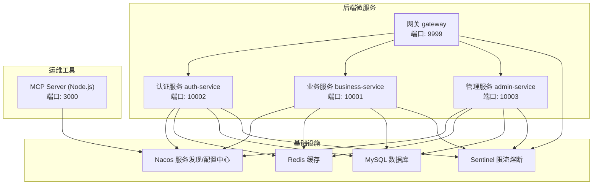
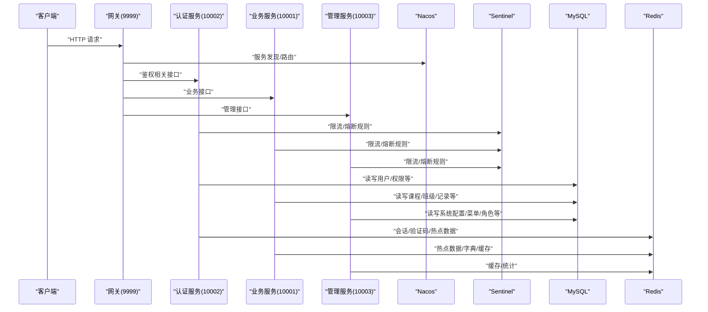
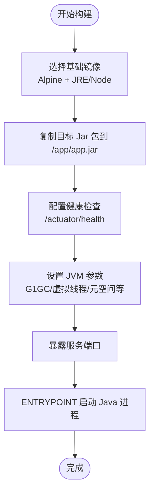
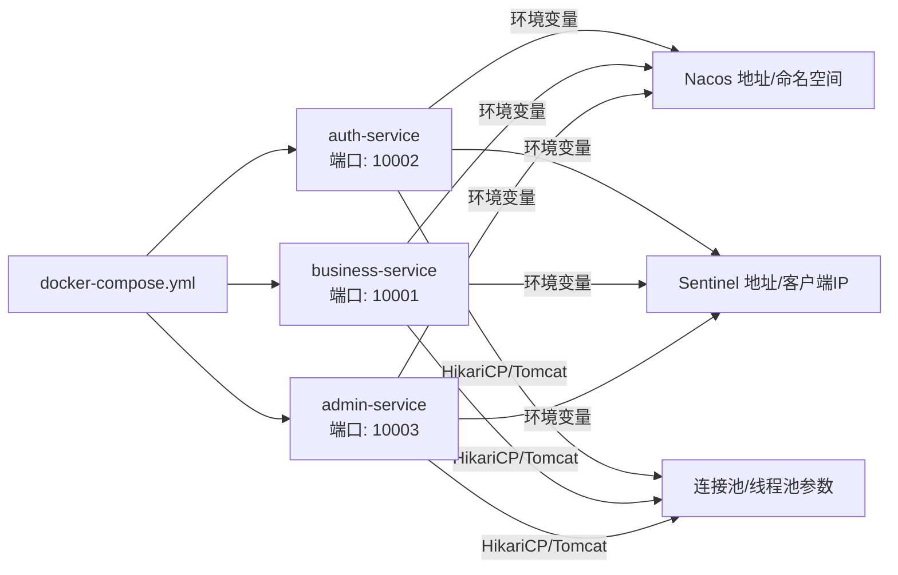
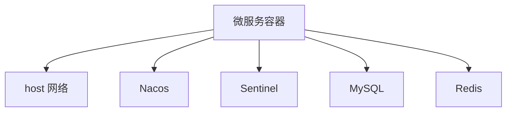
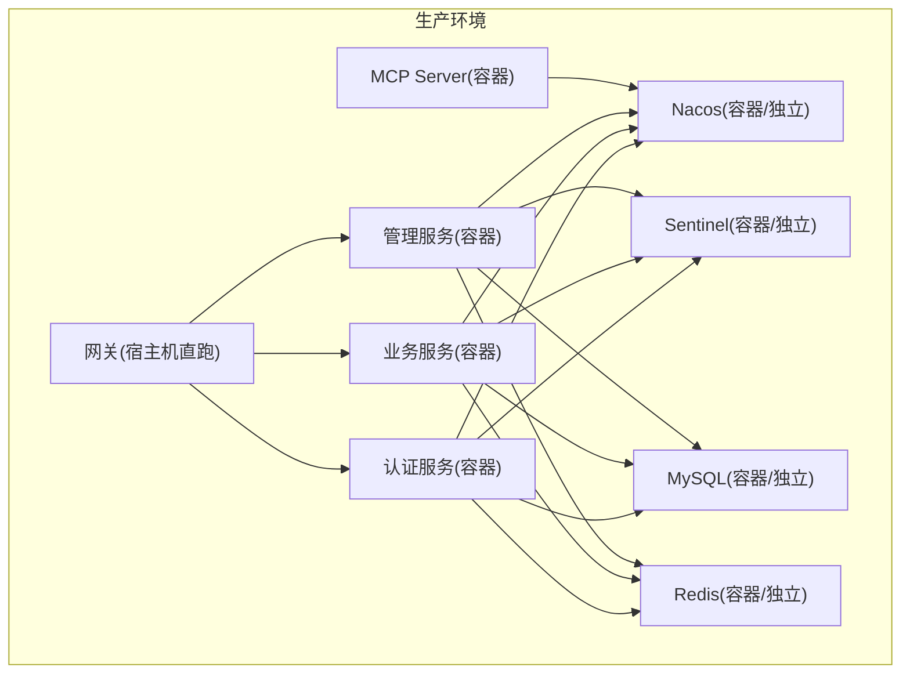

# 容器化部署

<cite>
**本文引用的文件**   
- [docker-compose.yml](file://class_times_record_back/docker-compose.yml)
- [admin-service/Dockerfile](file://class_times_record_back/admin-service/Dockerfile)
- [auth-service/Dockerfile](file://class_times_record_back/auth-service/Dockerfile)
- [business-service/Dockerfile](file://class_times_record_back/business-service/Dockerfile)
- [gateway/Dockerfile](file://class_times_record_back/gateway/Dockerfile)
- [.dockerignore](file://class_times_record_back/.dockerignore)
- [nacos-common-redis.yaml](file://class_times_record_back/docs/nacos-common-redis.yaml)
- [course_record_mcp_server/Dockerfile](file://course_record_mcp_server/Dockerfile)
- [course_record_mcp_server/docker-compose.yml](file://course_record_mcp_server/docker-compose.yml)
</cite>

## 目录
1. [简介](#简介)
2. [项目结构](#项目结构)
3. [核心组件](#核心组件)
4. [架构总览](#架构总览)
5. [详细组件分析](#详细组件分析)
6. [依赖关系分析](#依赖关系分析)
7. [性能与资源限制](#性能与资源限制)
8. [生产环境部署拓扑](#生产环境部署拓扑)
9. [运维操作指南](#运维操作指南)
10. [故障排查](#故障排查)
11. [结论](#结论)

## 简介
本文件面向运维与研发人员，提供课程记录系统的容器化部署完整指南。内容覆盖：
- Docker 镜像构建流程与各微服务 Dockerfile 配置说明
- docker-compose 编排与服务依赖、网络、数据卷、环境变量管理
- 容器资源限制（内存/CPU）与连接池调优建议
- 生产环境拓扑（Nacos 服务发现、Sentinel 限流、MySQL、Redis）的容器化方案
- 健康检查、日志收集策略与启动脚本要点
- 面向生产环境的最佳实践与排障指引

## 项目结构
后端采用 Spring Boot 多模块微服务架构，包含认证服务、业务服务、管理服务与网关；前端为独立静态站点（不在本次容器化范围）。MCP Server 为 Node.js 应用，用于统一运维能力接入。

图示来源
- [docker-compose.yml:1-75](file://class_times_record_back/docker-compose.yml#L1-L75)
- [admin-service/Dockerfile:1-31](file://class_times_record_back/admin-service/Dockerfile#L1-L31)
- [auth-service/Dockerfile:1-30](file://class_times_record_back/auth-service/Dockerfile#L1-L30)
- [business-service/Dockerfile:1-29](file://class_times_record_back/business-service/Dockerfile#L1-L29)
- [gateway/Dockerfile:1-29](file://class_times_record_back/gateway/Dockerfile#L1-L29)
- [course_record_mcp_server/Dockerfile:1-41](file://course_record_mcp_server/Dockerfile#L1-L41)

章节来源
- [docker-compose.yml:1-75](file://class_times_record_back/docker-compose.yml#L1-L75)

## 核心组件
- 微服务镜像构建
  - 基础镜像：eclipse-temurin:21-jre-alpine（轻量 JRE + Alpine）
  - 运行入口：exec java ${JAVA_OPTS} -jar app.jar
  - 健康检查：基于 /actuator/health 的 HTTP 探测
  - JVM 优化：G1GC、虚拟线程、元空间与代码缓存上限
- 编排与依赖
  - 通过 docker-compose 定义服务、镜像、环境变量、资源限制
  - 使用 host 网络模式直接暴露宿主机端口
  - 通过环境变量注入 Nacos/Sentinel 地址与客户端 IP
- 共享配置
  - Redis 连接池参数通过 Nacos 公共配置下发（Data ID: common-redis.yaml）

章节来源
- [admin-service/Dockerfile:1-31](file://class_times_record_back/admin-service/Dockerfile#L1-L31)
- [auth-service/Dockerfile:1-30](file://class_times_record_back/auth-service/Dockerfile#L1-L30)
- [business-service/Dockerfile:1-29](file://class_times_record_back/business-service/Dockerfile#L1-L29)
- [gateway/Dockerfile:1-29](file://class_times_record_back/gateway/Dockerfile#L1-L29)
- [docker-compose.yml:1-75](file://class_times_record_back/docker-compose.yml#L1-L75)
- [nacos-common-redis.yaml:1-26](file://class_times_record_back/docs/nacos-common-redis.yaml#L1-L26)

## 架构总览
下图展示容器内外的关键交互：外部请求经网关进入，各微服务通过 Nacos 注册与发现，使用 Sentinel 进行限流保护，持久层访问 MySQL，缓存访问 Redis。MCP Server 作为运维侧能力接入点，同样注册到 Nacos。

图示来源
- [docker-compose.yml:1-75](file://class_times_record_back/docker-compose.yml#L1-L75)
- [gateway/Dockerfile:1-29](file://class_times_record_back/gateway/Dockerfile#L1-L29)
- [auth-service/Dockerfile:1-30](file://class_times_record_back/auth-service/Dockerfile#L1-L30)
- [business-service/Dockerfile:1-29](file://class_times_record_back/business-service/Dockerfile#L1-L29)
- [admin-service/Dockerfile:1-31](file://class_times_record_back/admin-service/Dockerfile#L1-L31)

## 详细组件分析

### 镜像构建与优化
- 基础镜像选择
  - 后端：eclipse-temurin:21-jre-alpine（JRE 最小运行时 + Alpine 精简系统）
  - MCP Server：node:20-alpine（Node.js 运行时）
- 构建上下文与复制策略
  - 当前 Dockerfile 从宿主机 target 目录复制已编译 Jar 包，适合本地构建后直接打包
  - .dockerignore 排除 target、.git、文档等无关文件，减小构建上下文体积
- 健康检查
  - 所有后端服务均通过 /actuator/health 暴露健康端点，Dockerfile 中内置 HEALTHCHECK
- JVM 优化
  - G1GC、最大 GC 暂停时间、虚拟线程开关、随机数源、元空间与代码缓存上限
  - 不同服务按负载设置不同堆大小（网关较小，业务/认证/管理中等）

图示来源
- [admin-service/Dockerfile:1-31](file://class_times_record_back/admin-service/Dockerfile#L1-L31)
- [auth-service/Dockerfile:1-30](file://class_times_record_back/auth-service/Dockerfile#L1-L30)
- [business-service/Dockerfile:1-29](file://class_times_record_back/business-service/Dockerfile#L1-L29)
- [gateway/Dockerfile:1-29](file://class_times_record_back/gateway/Dockerfile#L1-L29)
- [course_record_mcp_server/Dockerfile:1-41](file://course_record_mcp_server/Dockerfile#L1-L41)
- [.dockerignore:1-12](file://class_times_record_back/.dockerignore#L1-L12)

章节来源
- [admin-service/Dockerfile:1-31](file://class_times_record_back/admin-service/Dockerfile#L1-L31)
- [auth-service/Dockerfile:1-30](file://class_times_record_back/auth-service/Dockerfile#L1-L30)
- [business-service/Dockerfile:1-29](file://class_times_record_back/business-service/Dockerfile#L1-L29)
- [gateway/Dockerfile:1-29](file://class_times_record_back/gateway/Dockerfile#L1-L29)
- [course_record_mcp_server/Dockerfile:1-41](file://course_record_mcp_server/Dockerfile#L1-L41)
- [.dockerignore:1-12](file://class_times_record_back/.dockerignore#L1-L12)

### docker-compose 编排
- 服务定义
  - auth-service、business-service、admin-service 三个后端服务
  - 镜像名、容器名、重启策略、网络模式（host）
- 环境变量
  - Nacos 服务器地址与命名空间
  - Sentinel 地址与客户端 IP
  - Tomcat 线程池与 HikariCP 连接池参数
- 资源限制
  - 每个服务设置 memory limits/reservations
- 注意
  - 当前 compose 未包含 gateway 服务定义（注释说明网关以宿主直跑方式运行）

图示来源
- [docker-compose.yml:1-75](file://class_times_record_back/docker-compose.yml#L1-L75)

章节来源
- [docker-compose.yml:1-75](file://class_times_record_back/docker-compose.yml#L1-L75)

### 共享配置与连接池调优
- Redis 共享配置
  - Data ID: common-redis.yaml，Group: DEFAULT_GROUP，命名空间: course-record
  - 连接池参数：max-active、max-idle、min-idle、max-wait、connect-timeout、timeout 等
- 连接池建议
  - 根据实例数量与并发调整 max-active
  - 合理设置 max-wait 避免无限等待导致雪崩
  - 关闭超时与命令执行超时需结合业务 SLA 评估

章节来源
- [nacos-common-redis.yaml:1-26](file://class_times_record_back/docs/nacos-common-redis.yaml#L1-L26)

### MCP Server 容器化
- 基础镜像：node:20-alpine
- 安装依赖与全局 tsx，复制源码并暴露 3000 端口
- 默认以 SSE 模式运行，支持自动注册到 Nacos AI MCP
- 可通过环境变量控制传输模式、端口、主机与 Nacos 注册信息

章节来源
- [course_record_mcp_server/Dockerfile:1-41](file://course_record_mcp_server/Dockerfile#L1-L41)
- [course_record_mcp_server/docker-compose.yml](file://course_record_mcp_server/docker-compose.yml)

## 依赖关系分析
- 运行时依赖
  - Nacos：服务注册与配置中心
  - Sentinel：限流与熔断
  - MySQL：持久化存储
  - Redis：缓存与会话
- 网络模型
  - 当前使用 host 网络模式，容器直接复用宿主机网络栈，便于与外部 Nacos/Sentinel/DB/Redis 通信
- 配置注入
  - 通过环境变量注入 Nacos/Sentinel 地址与客户端 IP
  - 通过 Nacos 公共配置下发 Redis 连接池参数

图示来源
- [docker-compose.yml:1-75](file://class_times_record_back/docker-compose.yml#L1-L75)

章节来源
- [docker-compose.yml:1-75](file://class_times_record_back/docker-compose.yml#L1-L75)

## 性能与资源限制
- 容器资源限制
  - 当前对三个后端服务设置了内存限制与保留值（limits/reservations），有助于在集群环境中稳定调度
- JVM 与线程
  - 启用虚拟线程减少线程栈占用，配合 G1GC 平衡吞吐与延迟
  - 针对网关设置更小的堆，降低内存占用
- 连接池调优
  - HikariCP：maximum-pool-size、minimum-idle 已在 compose 中通过环境变量注入
  - Lettuce（Redis）：连接池参数由 Nacos 公共配置下发，可按实例规模调整

章节来源
- [docker-compose.yml:1-75](file://class_times_record_back/docker-compose.yml#L1-L75)
- [nacos-common-redis.yaml:1-26](file://class_times_record_back/docs/nacos-common-redis.yaml#L1-L26)
- [admin-service/Dockerfile:17-31](file://class_times_record_back/admin-service/Dockerfile#L17-L31)
- [auth-service/Dockerfile:17-30](file://class_times_record_back/auth-service/Dockerfile#L17-L30)
- [business-service/Dockerfile:16-29](file://class_times_record_back/business-service/Dockerfile#L16-L29)
- [gateway/Dockerfile:16-29](file://class_times_record_back/gateway/Dockerfile#L16-L29)

## 生产环境部署拓扑
- 服务发现与配置
  - Nacos：部署于独立节点或容器集群，命名空间 course-record
  - 公共配置：common-redis.yaml 上传至 Nacos
- 限流与熔断
  - Sentinel：集中式控制台与规则持久化，微服务通过环境变量接入
- 数据存储
  - MySQL：主备或高可用集群，持久化数据卷挂载
  - Redis：哨兵或集群模式，开启持久化与密码
- 网关
  - 当前以宿主直跑方式运行，可考虑后续纳入容器编排统一管理
- 运维接入
  - MCP Server：SSE 模式对外提供服务，注册到 Nacos AI MCP

[此图为概念性拓扑，不直接映射具体源码文件]

## 运维操作指南
- 前置准备
  - 确保宿主机已安装 Docker 与 docker-compose
  - 提前构建各模块 Jar 包，保证 target 目录下存在对应版本 jar
  - 确认 Nacos、Sentinel、MySQL、Redis 可达且配置正确
- 构建镜像
  - 在 class_times_record_back 根目录执行 docker-compose build
  - 如需仅构建指定服务，可在命令后追加服务名
- 启动服务
  - 执行 docker-compose up -d 启动编排的服务
  - 网关如以宿主直跑，请单独启动其 JAR 并配置相同环境变量
- 健康检查
  - 查看容器状态与健康结果：docker inspect --format='{{json .State.Health}}' <容器名>
  - 或直接访问各服务的 /actuator/health
- 日志收集
  - 建议将容器标准输出重定向到宿主机日志目录或使用日志采集器（如 Filebeat/Fluent Bit）
  - 若应用内部有日志文件，可通过数据卷挂载到宿主机路径
- 环境变量管理
  - 通过 docker-compose.yml 中的 environment 字段注入
  - 敏感信息建议使用外部密钥管理或环境变量文件
- 数据卷挂载
  - MySQL/Redis 数据目录应挂载到宿主机持久化路径
  - 配置文件建议通过只读挂载或 Nacos 动态下发
- 扩缩容
  - 增加服务副本时，需同步调整连接池参数与 Sentinel 规则
  - 监控 CPU/内存使用率，必要时调整 limits/reservations 与 JVM 参数

章节来源
- [docker-compose.yml:1-75](file://class_times_record_back/docker-compose.yml#L1-L75)
- [admin-service/Dockerfile:14-16](file://class_times_record_back/admin-service/Dockerfile#L14-L16)
- [auth-service/Dockerfile:14-16](file://class_times_record_back/auth-service/Dockerfile#L14-L16)
- [business-service/Dockerfile:13-15](file://class_times_record_back/business-service/Dockerfile#L13-L15)
- [gateway/Dockerfile:13-15](file://class_times_record_back/gateway/Dockerfile#L13-L15)

## 故障排查
- 常见启动失败
  - 检查 Nacos/Sentinel 地址与命名空间是否正确
  - 确认 /actuator/health 是否可达，查看容器日志定位初始化错误
- 连接池问题
  - HikariCP：观察 maximum-pool-size 与数据库最大连接数匹配情况
  - Lettuce：关注 max-wait 与 connect-timeout，避免长时间阻塞
- 资源不足
  - 若 OOM，适当提高 limits/reservations 与 JVM 堆大小
  - 若 CPU 瓶颈，考虑水平扩展或优化慢查询
- 网络连通性
  - host 模式下需确保宿主机防火墙放行相应端口
  - 若切换桥接网络，需显式声明端口映射

章节来源
- [docker-compose.yml:1-75](file://class_times_record_back/docker-compose.yml#L1-L75)
- [nacos-common-redis.yaml:1-26](file://class_times_record_back/docs/nacos-common-redis.yaml#L1-L26)

## 结论
本项目已具备完善的容器化基础：统一的 Alpine 基础镜像、健康检查、JVM 优化与 docker-compose 编排。生产环境建议完善网关容器化、引入数据卷与日志采集、并通过 Nacos 集中化管理配置。结合合理的资源限制与连接池调优，可在保障稳定性的同时提升整体吞吐与弹性伸缩能力。