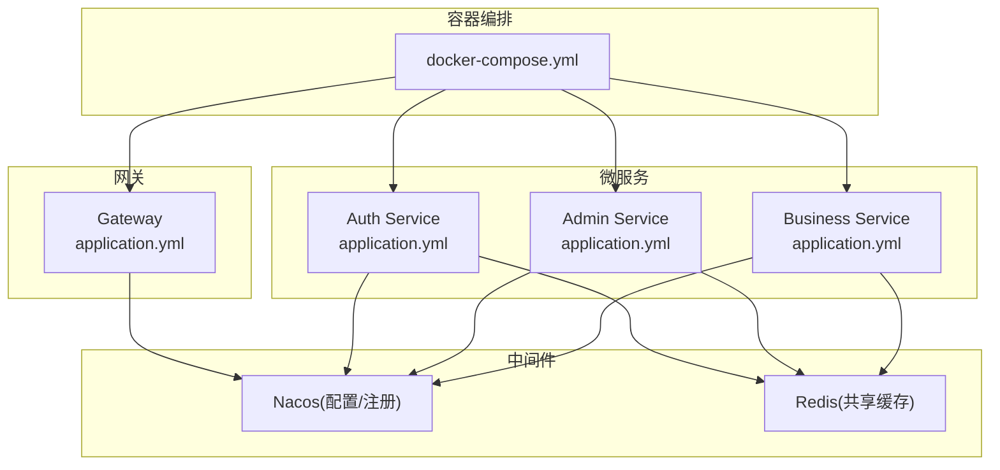
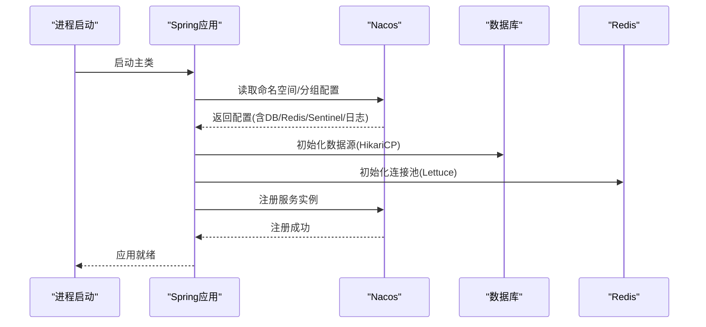
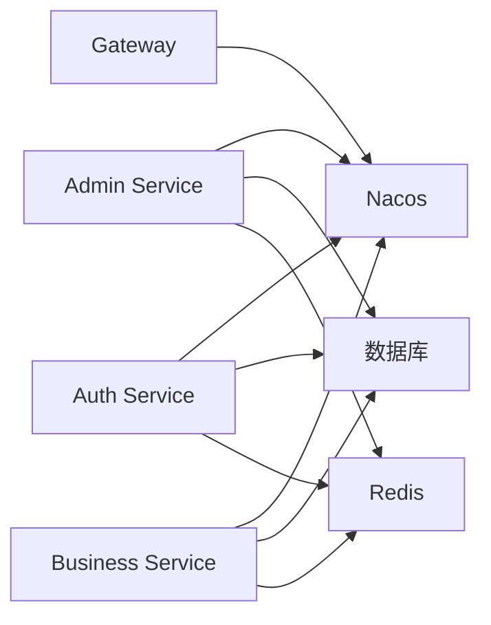

# 故障排查

<cite>
**本文引用的文件**   
- [docker-compose.yml](file://class_times_record_back/docker-compose.yml)
- [nacos-common-redis.yaml](file://class_times_record_back/docs/nacos-common-redis.yaml)
- [admin-service/application.yml](file://class_times_record_back/admin-service/src/main/resources/application.yml)
- [auth-service/application.yml](file://class_times_record_back/auth-service/src/main/resources/application.yml)
- [business-service/application.yml](file://class_times_record_back/business-service/src/main/resources/application.yml)
- [gateway/application.yml](file://class_times_record_back/gateway/src/main/resources/application.yml)
</cite>

## 目录
1. [简介](#简介)
2. [项目结构](#项目结构)
3. [核心组件](#核心组件)
4. [架构总览](#架构总览)
5. [详细组件分析](#详细组件分析)
6. [依赖关系分析](#依赖关系分析)
7. [性能注意事项](#性能注意事项)
8. [故障排查指南](#故障排查指南)
9. [结论](#结论)
10. [附录](#附录)

## 简介
本指南面向开发与运维人员，聚焦于课程记录系统的启动与运行期问题诊断与解决。内容覆盖：
- 常见启动问题：端口冲突、数据库连接失败、Nacos 注册异常等
- 运行时错误：异常堆栈分析、日志关键字搜索、性能瓶颈定位
- API 接口调试：请求链路追踪、参数验证错误、权限认证问题
- 数据库问题：慢查询分析、连接池耗尽、死锁检测
- 性能诊断工具与方法：JVM 内存分析、线程 dump、GC 日志分析

## 项目结构
系统采用微服务架构，包含网关与各业务服务（认证、管理、业务），并通过 Nacos 完成配置管理与服务发现。Redis 作为共享缓存通过 Nacos 统一配置注入各服务。

图示来源
- [docker-compose.yml:1-75](file://class_times_record_back/docker-compose.yml#L1-L75)
- [gateway/application.yml:1-19](file://class_times_record_back/gateway/src/main/resources/application.yml#L1-L19)
- [auth-service/application.yml:1-24](file://class_times_record_back/auth-service/src/main/resources/application.yml#L1-L24)
- [admin-service/application.yml:1-23](file://class_times_record_back/admin-service/src/main/resources/application.yml#L1-L23)
- [business-service/application.yml:1-24](file://class_times_record_back/business-service/src/main/resources/application.yml#L1-L24)

章节来源
- [docker-compose.yml:1-75](file://class_times_record_back/docker-compose.yml#L1-L75)
- [gateway/application.yml:1-19](file://class_times_record_back/gateway/src/main/resources/application.yml#L1-L19)
- [auth-service/application.yml:1-24](file://class_times_record_back/auth-service/src/main/resources/application.yml#L1-L24)
- [admin-service/application.yml:1-23](file://class_times_record_back/admin-service/src/main/resources/application.yml#L1-L23)
- [business-service/application.yml:1-24](file://class_times_record_back/business-service/src/main/resources/application.yml#L1-L24)

## 核心组件
- 网关服务：负责外部请求接入与路由转发，依赖 Nacos 进行动态配置与服务发现。
- 认证服务：提供鉴权能力，依赖 Redis 做会话/令牌缓存，依赖 Nacos 获取配置。
- 管理服务：后台管理能力，依赖数据库与 Redis，通过 Nacos 拉取配置。
- 业务服务：核心业务逻辑，依赖数据库与 Redis，通过 Nacos 拉取配置。
- Nacos：集中式配置中心与服务注册中心，所有服务均从 Nacos 导入配置并注册自身。
- Redis：共享缓存，连接池参数由 Nacos 的 common-redis.yaml 统一管理。

章节来源
- [admin-service/application.yml:1-23](file://class_times_record_back/admin-service/src/main/resources/application.yml#L1-L23)
- [auth-service/application.yml:1-24](file://class_times_record_back/auth-service/src/main/resources/application.yml#L1-L24)
- [business-service/application.yml:1-24](file://class_times_record_back/business-service/src/main/resources/application.yml#L1-L24)
- [gateway/application.yml:1-19](file://class_times_record_back/gateway/src/main/resources/application.yml#L1-L19)
- [nacos-common-redis.yaml:1-26](file://class_times_record_back/docs/nacos-common-redis.yaml#L1-L26)

## 架构总览
下图展示了服务启动与配置加载的关键流程：服务启动后从 Nacos 导入配置，随后初始化数据源、Redis 客户端，并向 Nacos 注册实例。

图示来源
- [admin-service/application.yml:1-23](file://class_times_record_back/admin-service/src/main/resources/application.yml#L1-L23)
- [auth-service/application.yml:1-24](file://class_times_record_back/auth-service/src/main/resources/application.yml#L1-L24)
- [business-service/application.yml:1-24](file://class_times_record_back/business-service/src/main/resources/application.yml#L1-L24)
- [gateway/application.yml:1-19](file://class_times_record_back/gateway/src/main/resources/application.yml#L1-L19)
- [nacos-common-redis.yaml:1-26](file://class_times_record_back/docs/nacos-common-redis.yaml#L1-L26)

## 详细组件分析

### 配置与注册中心(Nacos)
- 每个服务在 application.yml 中声明了从 Nacos 导入的配置项，包括服务专属配置、通用数据库、通用 Redis、Sentinel 以及日志配置。
- 服务发现与配置中心的命名空间、分组、服务端地址均通过环境变量或默认值注入。

章节来源
- [admin-service/application.yml:1-23](file://class_times_record_back/admin-service/src/main/resources/application.yml#L1-L23)
- [auth-service/application.yml:1-24](file://class_times_record_back/auth-service/src/main/resources/application.yml#L1-L24)
- [business-service/application.yml:1-24](file://class_times_record_back/business-service/src/main/resources/application.yml#L1-L24)
- [gateway/application.yml:1-19](file://class_times_record_back/gateway/src/main/resources/application.yml#L1-L19)

### 共享缓存(Redis)
- Redis 连接池参数通过 Nacos 的 common-redis.yaml 统一注入，包含最大活跃连接、空闲连接、等待超时、连接与命令超时等。
- 多服务共享同一 Redis 时，需根据实例数量调整 max-active，避免连接不足导致阻塞。

章节来源
- [nacos-common-redis.yaml:1-26](file://class_times_record_back/docs/nacos-common-redis.yaml#L1-L26)

### 容器编排与环境变量
- docker-compose 为各服务设置 Nacos 地址、命名空间、Sentinel 地址与客户端 IP，同时限制 Tomcat 线程池与 HikariCP 连接池大小，降低内存占用。
- 使用 host 网络模式，便于直接访问宿主机上的中间件。

章节来源
- [docker-compose.yml:1-75](file://class_times_record_back/docker-compose.yml#L1-L75)

## 依赖关系分析
- 服务对 Nacos 的强依赖体现在配置导入与服务注册；若 Nacos 不可用，服务可能无法正确加载配置或注册失败。
- 数据库与 Redis 的连接池参数受 Nacos 配置与容器环境变量双重影响，需保持一致性以避免资源争用。

图示来源
- [admin-service/application.yml:1-23](file://class_times_record_back/admin-service/src/main/resources/application.yml#L1-L23)
- [auth-service/application.yml:1-24](file://class_times_record_back/auth-service/src/main/resources/application.yml#L1-L24)
- [business-service/application.yml:1-24](file://class_times_record_back/business-service/src/main/resources/application.yml#L1-L24)
- [gateway/application.yml:1-19](file://class_times_record_back/gateway/src/main/resources/application.yml#L1-L19)

## 性能注意事项
- Tomcat 线程池与 HikariCP 连接池大小已在容器编排中限制，建议结合压测结果调优，避免线程或连接耗尽导致请求排队。
- Redis 连接池 max-active 需按实例数评估，确保整体并发下仍有足够连接可用。
- 建议在 Nacos 中开启 Sentinel 相关配置以进行流量控制与熔断降级。

章节来源
- [docker-compose.yml:1-75](file://class_times_record_back/docker-compose.yml#L1-L75)
- [nacos-common-redis.yaml:1-26](file://class_times_record_back/docs/nacos-common-redis.yaml#L1-L26)

## 故障排查指南

### 一、启动阶段常见问题

#### 1. 端口冲突
- 现象：服务启动失败或无法被外部访问。
- 排查步骤：
  - 检查宿主机端口占用情况，确认服务监听端口未被其他进程占用。
  - 核对容器编排中的网络模式与端口映射策略，确保与宿主网络一致。
  - 若使用反向代理或负载均衡，确认其转发端口与服务实际端口匹配。
- 解决方案：
  - 释放冲突端口或修改服务监听端口。
  - 调整容器网络模式或端口映射，保证可达性。

章节来源
- [docker-compose.yml:1-75](file://class_times_record_back/docker-compose.yml#L1-L75)

#### 2. 数据库连接失败
- 现象：应用启动时报数据库连接异常或查询超时。
- 排查步骤：
  - 确认 Nacos 中 common-db.yaml 的数据源地址、用户名、密码、驱动类名是否正确。
  - 校验数据库服务可达性与防火墙规则，确保服务能连通数据库端口。
  - 检查 HikariCP 连接池参数是否过小导致连接不足。
- 解决方案：
  - 修正数据源配置，重启服务重新加载。
  - 适当增大连接池大小，观察连接使用率与等待时间。
  - 启用 SQL 日志与慢查询日志，定位具体语句问题。

章节来源
- [admin-service/application.yml:1-23](file://class_times_record_back/admin-service/src/main/resources/application.yml#L1-L23)
- [auth-service/application.yml:1-24](file://class_times_record_back/auth-service/src/main/resources/application.yml#L1-L24)
- [business-service/application.yml:1-24](file://class_times_record_back/business-service/src/main/resources/application.yml#L1-L24)

#### 3. Nacos 注册异常
- 现象：服务启动后未出现在 Nacos 控制台，或无法被网关/其他服务发现。
- 排查步骤：
  - 检查 Nacos 服务端地址与命名空间是否与容器环境变量一致。
  - 确认服务在 application.yml 中已正确导入 Nacos 配置与发现配置。
  - 查看服务日志中是否有连接 Nacos 失败或注册失败的错误信息。
- 解决方案：
  - 修正 Nacos 地址、命名空间、分组等配置。
  - 确保网络可达且无安全组/防火墙拦截。
  - 必要时清理旧实例并重启服务。

章节来源
- [admin-service/application.yml:1-23](file://class_times_record_back/admin-service/src/main/resources/application.yml#L1-L23)
- [auth-service/application.yml:1-24](file://class_times_record_back/auth-service/src/main/resources/application.yml#L1-L24)
- [business-service/application.yml:1-24](file://class_times_record_back/business-service/src/main/resources/application.yml#L1-L24)
- [gateway/application.yml:1-19](file://class_times_record_back/gateway/src/main/resources/application.yml#L1-L19)
- [docker-compose.yml:1-75](file://class_times_record_back/docker-compose.yml#L1-L75)

### 二、运行期错误排查

#### 1. 异常堆栈分析
- 方法：
  - 收集完整堆栈信息，关注根因异常与最近一次业务调用点。
  - 结合上下文日志（如请求ID、用户ID、业务键）定位具体场景。
- 建议：
  - 在关键路径增加结构化日志，便于快速关联问题。
  - 对可恢复异常进行降级处理，避免雪崩。

#### 2. 日志关键字搜索
- 常用关键字：
  - 连接类：连接超时、连接拒绝、连接池耗尽、HikariPool、Lettuce
  - 注册类：Nacos、注册失败、心跳失败、服务发现
  - 业务类：参数校验失败、权限不足、业务异常
- 操作：
  - 使用日志聚合平台或命令行工具过滤关键字，缩小范围。
  - 结合时间窗口与请求链路ID进行交叉比对。

#### 3. 性能瓶颈定位
- 指标：
  - CPU/内存使用率、线程数、GC 次数与停顿时间、数据库连接池使用率、Redis 连接池使用率。
- 方法：
  - 使用监控平台观察热点接口与慢请求。
  - 结合线程 dump 与火焰图定位热点代码路径。

### 三、API 接口调试

#### 1. 请求链路追踪
- 建议：
  - 在网关层生成唯一请求ID，透传到下游服务。
  - 在各服务中记录请求ID，便于跨服务串联日志。
- 操作：
  - 通过请求ID在日志系统中检索完整链路。

#### 2. 参数验证错误
- 现象：接口返回参数校验失败。
- 排查：
  - 核对前端传参与后端 DTO 字段类型、必填约束。
  - 检查序列化/反序列化配置与日期格式。
- 解决：
  - 修正前端传参或后端校验规则，保持前后端契约一致。

#### 3. 权限认证问题
- 现象：接口返回未授权或鉴权失败。
- 排查：
  - 确认 Token 是否有效、是否过期、是否携带必要权限。
  - 检查网关与服务的鉴权过滤器配置。
- 解决：
  - 刷新 Token 或补充权限，修复鉴权规则。

### 四、数据库相关问题

#### 1. 慢查询分析
- 方法：
  - 开启慢查询日志，捕获执行时间超标的 SQL。
  - 使用 EXPLAIN 分析执行计划，优化索引与查询条件。
- 建议：
  - 避免全表扫描与大结果集返回，分页查询。

#### 2. 连接池耗尽
- 现象：大量请求等待数据库连接，出现超时。
- 排查：
  - 观察 HikariPool 使用率与等待队列长度。
  - 检查是否存在长事务或未关闭连接。
- 解决：
  - 合理调整连接池大小，缩短事务范围，修复连接泄漏。

#### 3. 死锁检测
- 现象：部分请求长时间挂起或报死锁异常。
- 排查：
  - 查看数据库死锁日志，定位涉及的事务与行级锁。
  - 分析业务逻辑中加锁顺序与粒度。
- 解决：
  - 统一加锁顺序，减少锁竞争，拆分大事务。

### 五、性能问题诊断工具与方法

#### 1. JVM 内存分析
- 工具：
  - jmap、jstat、VisualVM、MAT。
- 步骤：
  - 导出堆转储文件，分析对象引用链与内存泄漏。
  - 关注大对象与频繁分配的对象。

#### 2. 线程 Dump 分析
- 工具：
  - jstack、Arthas。
- 步骤：
  - 采集线程快照，识别阻塞线程与热点方法。
  - 结合业务日志定位具体请求与上下文。

#### 3. GC 日志分析
- 工具：
  - GCViewer、GCEasy。
- 步骤：
  - 开启 GC 日志，观察 Full GC 频率与停顿时间。
  - 调整新生代/老年代比例与垃圾回收器参数。

### 六、Redis 相关问题

#### 1. 连接池耗尽
- 现象：Redis 操作阻塞或超时。
- 排查：
  - 检查 Lettuce 连接池参数与实例数，评估 max-active 是否充足。
  - 观察命令执行耗时与网络延迟。
- 解决：
  - 提升连接池上限，优化慢命令，必要时分库分片。

章节来源
- [nacos-common-redis.yaml:1-26](file://class_times_record_back/docs/nacos-common-redis.yaml#L1-L26)

## 结论
通过统一的 Nacos 配置与容器化编排，系统在可观测性与可维护性方面具备良好基础。针对启动与运行期问题，建议建立标准化的排查流程与监控告警体系，结合日志、指标与链路追踪快速定位与解决问题。对于性能问题，应持续进行容量规划与压测验证，确保资源参数与实际负载相匹配。

## 附录

### 常用命令与参考
- 查看端口占用：netstat/ss/lsof
- 查看容器状态：docker ps / docker logs
- 查看 Nacos 配置：登录控制台查看 Data ID 与 Group
- 查看 Redis 连接池：通过监控或客户端命令统计

[本节为通用指导，不直接分析具体文件]