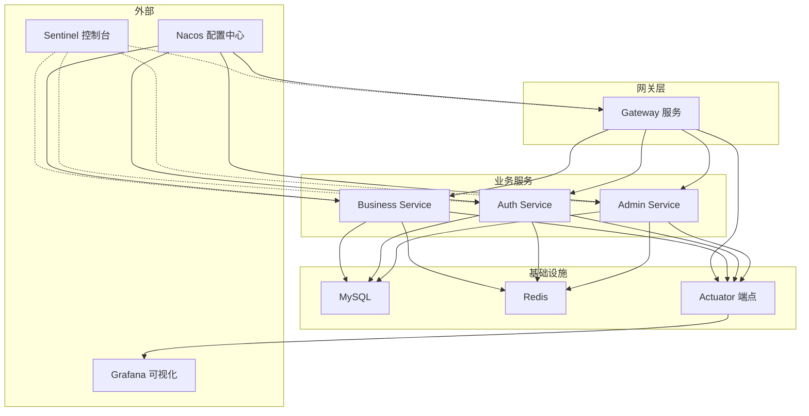
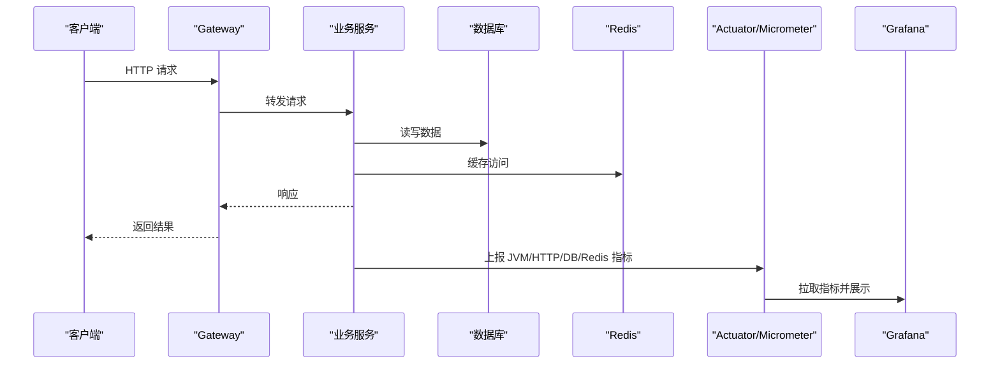
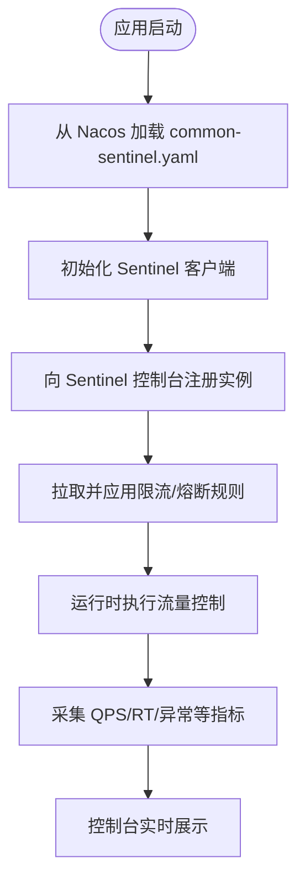
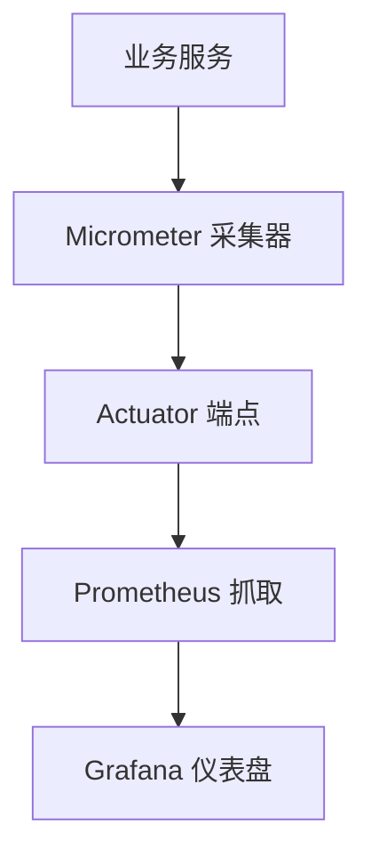
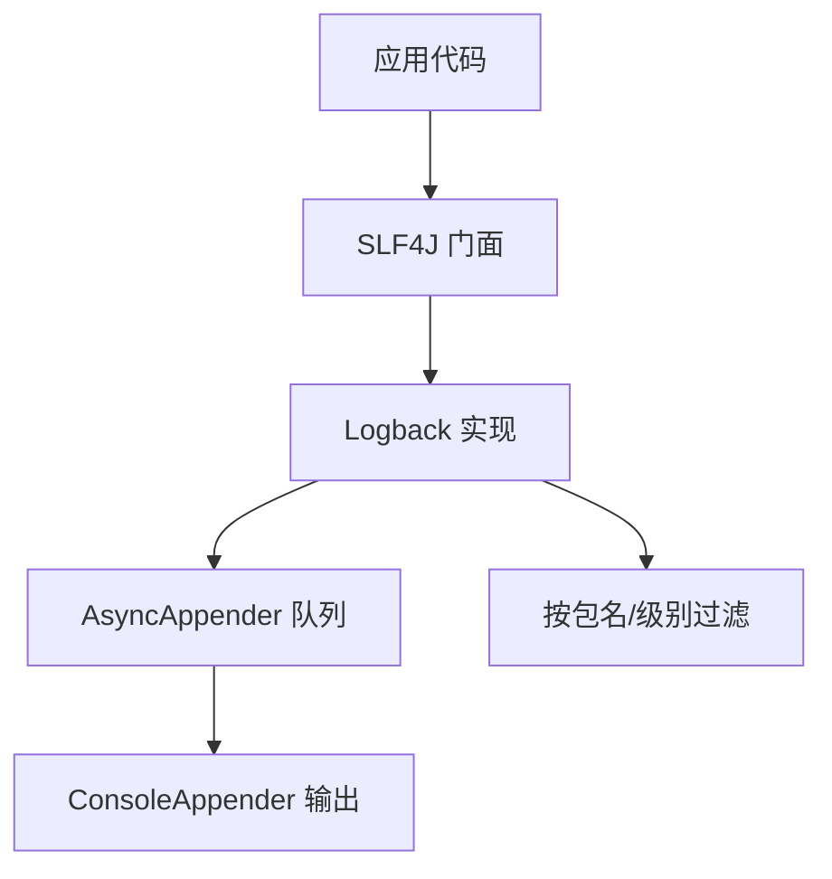
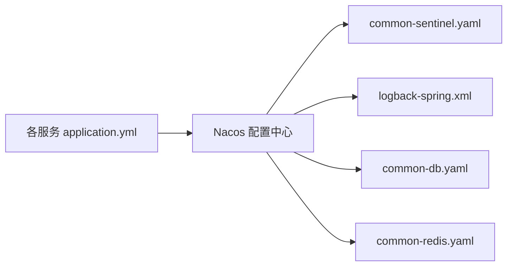

# 监控告警

<cite>
**本文引用的文件**
- [logback-spring.xml](file://class_times_record_back/common/src/main/resources/logback-spring.xml)
- [application.yml（admin-service）](file://class_times_record_back/admin-service/src/main/resources/application.yml)
- [application.yml（auth-service）](file://class_times_record_back/auth-service/src/main/resources/application.yml)
- [application.yml（business-service）](file://class_times_record_back/business-service/src/main/resources/application.yml)
- [application.yml（gateway）](file://class_times_record_back/gateway/src/main/resources/application.yml)
- [nacos-common-redis.yaml](file://class_times_record_back/docs/nacos-common-redis.yaml)
- [CLAUDE.md](file://CLAUDE.md)
</cite>

## 目录
1. [简介](#简介)
2. [项目结构](#项目结构)
3. [核心组件](#核心组件)
4. [架构总览](#架构总览)
5. [详细组件分析](#详细组件分析)
6. [依赖分析](#依赖分析)
7. [性能考虑](#性能考虑)
8. [故障排查指南](#故障排查指南)
9. [结论](#结论)
10. [附录](#附录)

## 简介
本文件面向运维与研发，提供课程记录系统的“监控与告警”完整方案。内容覆盖：
- Sentinel 流量治理：限流规则、熔断降级策略、实时监控面板接入
- 系统性能监控：JVM、数据库连接池、API 响应时间统计
- 日志收集与分析：Logback 配置、分级输出、错误追踪
- 告警规则：异常告警、性能阈值告警、业务指标告警
- 可视化：Grafana 仪表盘关键指标展示
- 运维操作指南：从部署到排障的闭环流程

## 项目结构
后端采用微服务架构，包含网关与多个业务服务；所有服务的运行期配置通过 Nacos 动态下发，包括 Sentinel 与日志配置。

**图表来源**
- [application.yml（admin-service）:1-23](file://class_times_record_back/admin-service/src/main/resources/application.yml#L1-L23)
- [application.yml（auth-service）:1-24](file://class_times_record_back/auth-service/src/main/resources/application.yml#L1-L24)
- [application.yml（business-service）:1-24](file://class_times_record_back/business-service/src/main/resources/application.yml#L1-L24)
- [application.yml（gateway）:1-19](file://class_times_record_back/gateway/src/main/resources/application.yml#L1-L19)
- [nacos-common-redis.yaml:1-26](file://class_times_record_back/docs/nacos-common-redis.yaml#L1-L26)

**章节来源**
- [application.yml（admin-service）:1-23](file://class_times_record_back/admin-service/src/main/resources/application.yml#L1-L23)
- [application.yml（auth-service）:1-24](file://class_times_record_back/auth-service/src/main/resources/application.yml#L1-L24)
- [application.yml（business-service）:1-24](file://class_times_record_back/business-service/src/main/resources/application.yml#L1-L24)
- [application.yml（gateway）:1-19](file://class_times_record_back/gateway/src/main/resources/application.yml#L1-L19)
- [nacos-common-redis.yaml:1-26](file://class_times_record_back/docs/nacos-common-redis.yaml#L1-L26)

## 核心组件
- 配置中心（Nacos）：集中管理各服务配置，支持热更新
- 流量治理（Sentinel）：限流、熔断降级、实时监控
- 可观测性（Actuator + Micrometer）：暴露 JVM、线程、HTTP、DB、Redis 等指标
- 日志（Logback）：统一格式、异步输出、按环境分级
- 缓存（Redis）：共享缓存与连接池参数集中配置
- 网关（Gateway）：统一入口，承载路由与全局限流/熔断

**章节来源**
- [CLAUDE.md:67-67](file://CLAUDE.md#L67-L67)
- [CLAUDE.md:234-234](file://CLAUDE.md#L234-L234)
- [CLAUDE.md:270-270](file://CLAUDE.md#L270-L270)

## 架构总览
下图展示了请求在网关与各服务间的流转，以及监控数据如何汇聚至可视化平台。

**图表来源**
- [application.yml（gateway）:1-19](file://class_times_record_back/gateway/src/main/resources/application.yml#L1-L19)
- [application.yml（admin-service）:1-23](file://class_times_record_back/admin-service/src/main/resources/application.yml#L1-L23)
- [nacos-common-redis.yaml:1-26](file://class_times_record_back/docs/nacos-common-redis.yaml#L1-L26)

## 详细组件分析

### Sentinel 流量治理与实时监控
- 集成方式：各服务引入 Sentinel 相关 starter，并通过 Nacos 动态下发规则
- 规则类型：
  - 限流规则：针对接口或资源设置 QPS/并发阈值
  - 熔断降级：基于异常比例、慢调用比例、异常数等触发降级
- 实时监控：
  - 服务启动后向 Sentinel 控制台注册机器列表
  - 控制台提供实时 QPS、RT、异常率、线程池等视图
- 配置位置：
  - 服务侧通过 Nacos Data ID 导入 common-sentinel.yaml
  - 控制台地址与环境信息见文档说明

**图表来源**
- [application.yml（admin-service）:1-23](file://class_times_record_back/admin-service/src/main/resources/application.yml#L1-L23)
- [application.yml（auth-service）:1-24](file://class_times_record_back/auth-service/src/main/resources/application.yml#L1-L24)
- [application.yml（business-service）:1-24](file://class_times_record_back/business-service/src/main/resources/application.yml#L1-L24)
- [application.yml（gateway）:1-19](file://class_times_record_back/gateway/src/main/resources/application.yml#L1-L19)
- [CLAUDE.md:234-234](file://CLAUDE.md#L234-L234)
- [CLAUDE.md:270-270](file://CLAUDE.md#L270-L270)

**章节来源**
- [CLAUDE.md:234-234](file://CLAUDE.md#L234-L234)
- [CLAUDE.md:270-270](file://CLAUDE.md#L270-L270)

### 系统性能监控（JVM/DB/Redis/API）
- 指标来源：
  - JVM：堆内存、GC、线程、类加载等
  - 数据库：连接池活跃/空闲、等待、慢查询等
  - Redis：连接池、命令耗时、命中率等
  - API：QPS、RT、错误率、P95/P99
- 采集与暴露：
  - 通过 Actuator + Micrometer 暴露 /actuator/prometheus 等端点
  - 由 Prometheus/Grafana 拉取并展示
- 关键配置要点：
  - 确保 Actuator 端点启用
  - 合理设置连接池大小与超时，避免资源争用

[本节为通用说明，不直接分析具体文件，故无“章节来源”]

### 日志收集与分析（Logback）
- 统一格式与异步输出：
  - 使用 AsyncAppender 降低对业务线程阻塞
  - 控制台输出带颜色、结构化字段便于检索
- 分级策略：
  - dev 环境开启 DEBUG，便于调试
  - 生产默认 INFO，屏蔽高频心跳日志
- 特定包级别控制：
  - MyBatis Mapper、Spring MVC、Sentinel 健康检查等可按需调整级别
- 远程/集中化建议：
  - 生产建议将日志输出到文件并按天滚动，配合 ELK/Loki 集中分析

**图表来源**
- [logback-spring.xml:1-83](file://class_times_record_back/common/src/main/resources/logback-spring.xml#L1-L83)

**章节来源**
- [logback-spring.xml:1-83](file://class_times_record_back/common/src/main/resources/logback-spring.xml#L1-L83)

### 告警规则配置
- 异常告警：
  - 基于错误日志关键字（如 Exception/Error）或 Actuator 健康状态变化
- 性能阈值告警：
  - RT P95/P99 超过阈值
  - 错误率突增
  - 连接池耗尽、等待超时
- 业务指标告警：
  - 订单量/录制成功率等业务 KPI 低于阈值
- 告警通道：
  - 邮件、企业微信、钉钉、短信等

[本节为通用说明，不直接分析具体文件，故无“章节来源”]

### 监控数据可视化（Grafana 仪表盘）
- 推荐面板：
  - JVM 概览：堆、非堆、GC、线程
  - HTTP 服务：QPS、RT、错误率
  - 数据库：连接池、慢查询、锁等待
  - Redis：连接池、命中率、命令耗时
  - Sentinel：限流/熔断事件、资源 RT/QPS
- 数据来源：
  - Prometheus 作为时序数据库
  - 从 Actuator/Micrometer 采集

[本节为通用说明，不直接分析具体文件，故无“章节来源”]

## 依赖分析
- 配置依赖：
  - 各服务 application.yml 通过 spring.config.import 从 Nacos 导入公共配置（含 Sentinel、日志、数据库、Redis 等）
- 运行依赖：
  - Nacos 负责配置与发现
  - Sentinel 控制台用于规则管理与实时监控
  - Actuator 暴露运行时指标
  - Redis 提供缓存能力

**图表来源**
- [application.yml（admin-service）:1-23](file://class_times_record_back/admin-service/src/main/resources/application.yml#L1-L23)
- [application.yml（auth-service）:1-24](file://class_times_record_back/auth-service/src/main/resources/application.yml#L1-L24)
- [application.yml（business-service）:1-24](file://class_times_record_back/business-service/src/main/resources/application.yml#L1-L24)
- [application.yml（gateway）:1-19](file://class_times_record_back/gateway/src/main/resources/application.yml#L1-L19)
- [nacos-common-redis.yaml:1-26](file://class_times_record_back/docs/nacos-common-redis.yaml#L1-L26)

**章节来源**
- [application.yml（admin-service）:1-23](file://class_times_record_back/admin-service/src/main/resources/application.yml#L1-L23)
- [application.yml（auth-service）:1-24](file://class_times_record_back/auth-service/src/main/resources/application.yml#L1-L24)
- [application.yml（business-service）:1-24](file://class_times_record_back/business-service/src/main/resources/application.yml#L1-L24)
- [application.yml（gateway）:1-19](file://class_times_record_back/gateway/src/main/resources/application.yml#L1-L19)
- [nacos-common-redis.yaml:1-26](file://class_times_record_back/docs/nacos-common-redis.yaml#L1-L26)

## 性能考虑
- 连接池与超时：
  - Redis 连接池最大连接数、空闲连接、获取等待时间与超时时间需根据实例数量与负载评估
- 日志开销：
  - 生产环境关闭 DEBUG，使用异步输出，避免 IO 阻塞
- 限流与熔断：
  - 合理设置阈值，避免误杀；结合业务峰值与容量规划
- 指标采样：
  - 对高吞吐接口采用采样或聚合，减少指标体积

**章节来源**
- [nacos-common-redis.yaml:1-26](file://class_times_record_back/docs/nacos-common-redis.yaml#L1-L26)
- [logback-spring.xml:1-83](file://class_times_record_back/common/src/main/resources/logback-spring.xml#L1-L83)

## 故障排查指南
- 快速定位：
  - 查看 Actuator 健康端点与指标
  - 在 Sentinel 控制台查看资源 RT/QPS/异常率
  - 通过日志关键字搜索异常堆栈
- 常见问题：
  - 连接池耗尽：检查 max-active/max-wait 与慢查询
  - 限流过严：调整 Sentinel 限流阈值
  - 熔断频繁：检查下游依赖稳定性与超时配置
- 日志定位：
  - 使用异步输出与分级策略，聚焦 ERROR/WARN
  - 关注 MyBatis、Web、Sentinel 等包的日志级别

**章节来源**
- [logback-spring.xml:1-83](file://class_times_record_back/common/src/main/resources/logback-spring.xml#L1-L83)
- [nacos-common-redis.yaml:1-26](file://class_times_record_back/docs/nacos-common-redis.yaml#L1-L26)

## 结论
本项目已具备完善的监控与可观测性基础：通过 Nacos 统一管理配置，Sentinel 提供流量治理与实时监控，Actuator+Micrometer 暴露系统指标，Logback 提供统一日志输出。在此基础上，建议完善 Prometheus/Grafana 可视化与告警体系，形成“采集—展示—告警—处置”的闭环。

[本节为总结性内容，不直接分析具体文件，故无“章节来源”]

## 附录
- 环境与地址参考：
  - Nacos：nacos.kurimula-airi.top:8848
  - Sentinel 控制台：sentinel.kurimula-airi.top:7819
  - MySQL：121.196.229.10:3306
  - Nginx：121.196.229.10:9080 → Gateway :9999

**章节来源**
- [CLAUDE.md:270-270](file://CLAUDE.md#L270-L270)