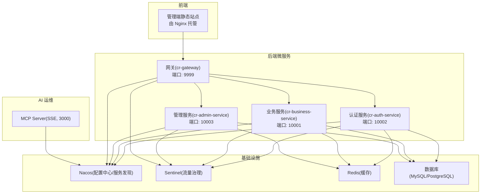
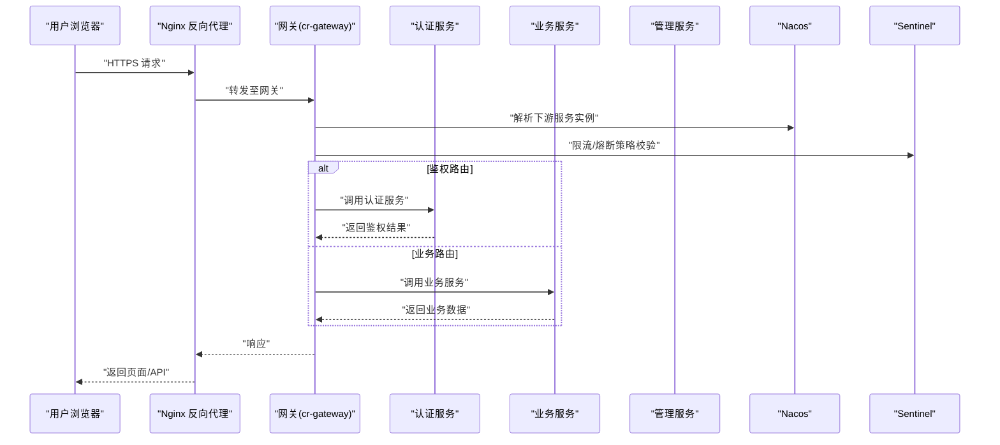
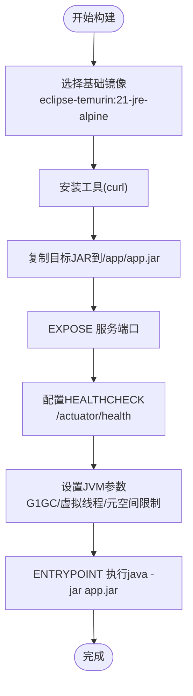
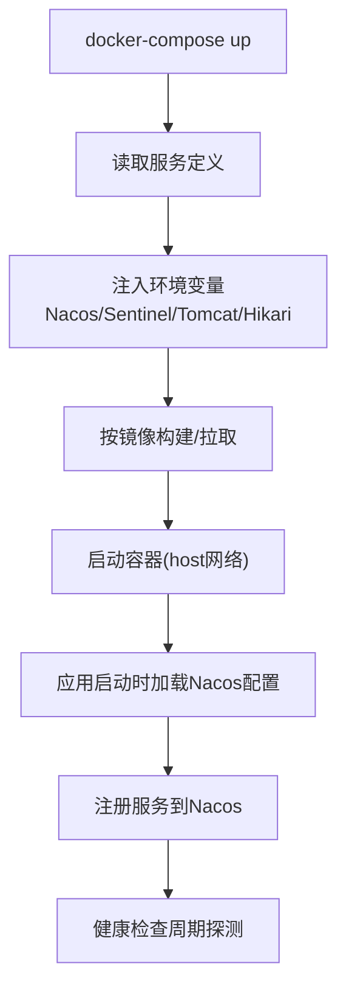
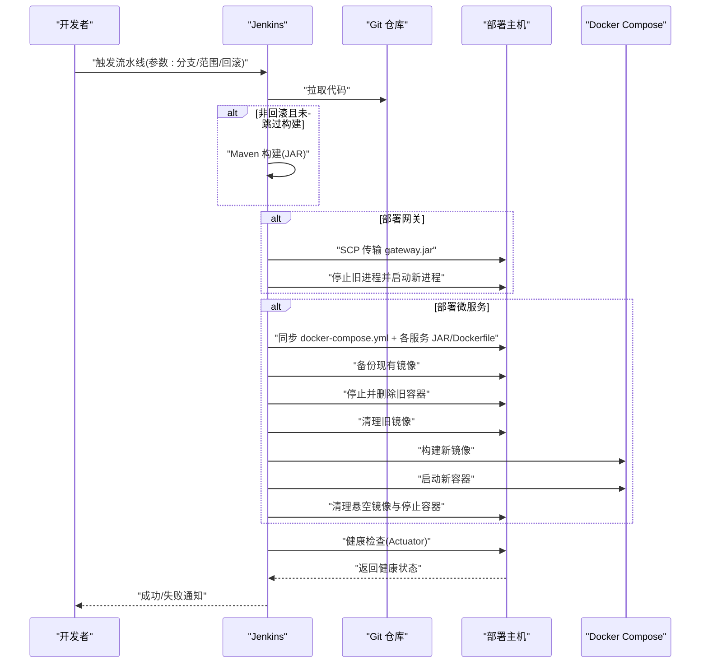
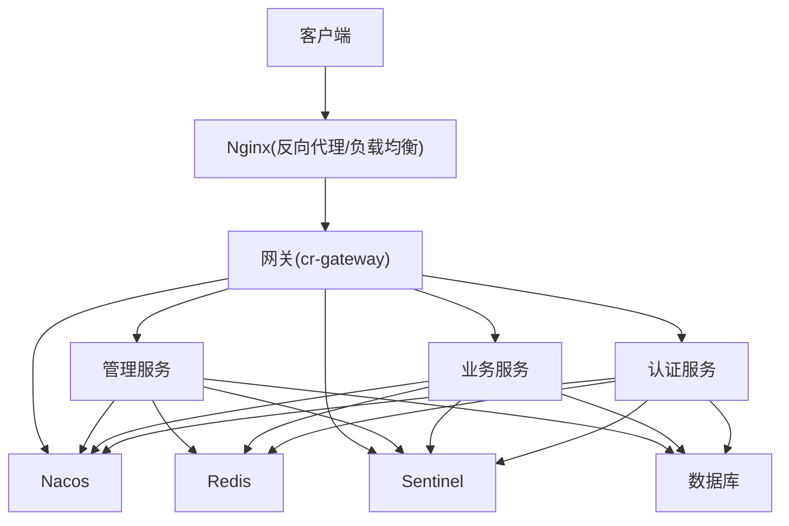
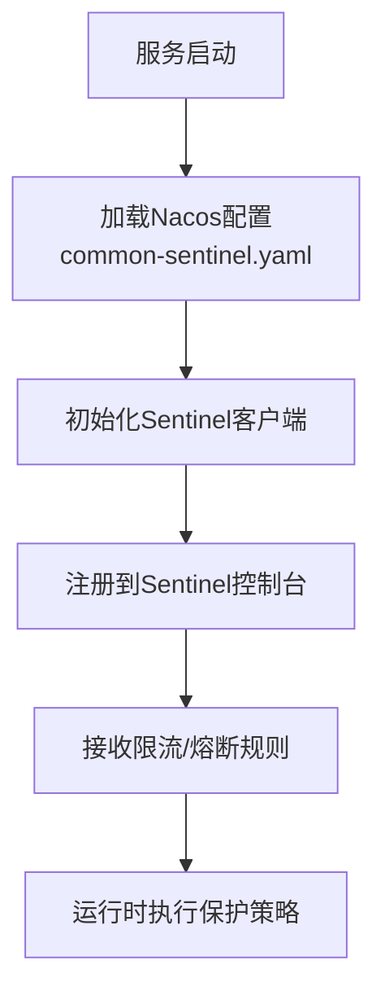
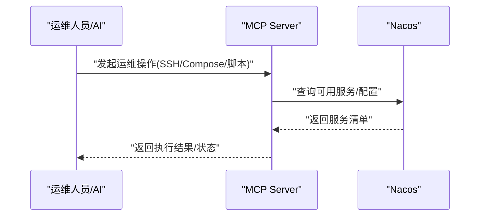
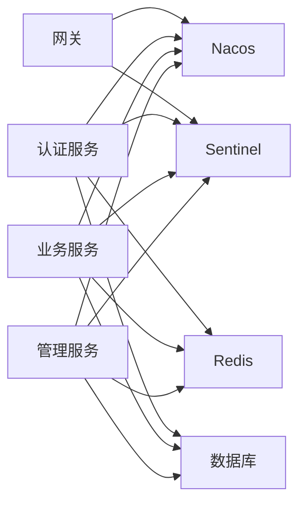

# 部署与运维

<cite>
**本文引用的文件**   
- [docker-compose.yml](file://class_times_record_back/docker-compose.yml)
- [admin-service/Dockerfile](file://class_times_record_back/admin-service/Dockerfile)
- [auth-service/Dockerfile](file://class_times_record_back/auth-service/Dockerfile)
- [business-service/Dockerfile](file://class_times_record_back/business-service/Dockerfile)
- [gateway/Dockerfile](file://class_times_record_back/gateway/Dockerfile)
- [pipeline/Jenkinsfile（后端）](file://class_times_record_back/pipeline/Jenkinsfile)
- [pipeline/Jenkinsfile（前端管理端）](file://class_record_admin_front/pipeline/Jenkinsfile)
- [Dockerfile（MCP Server）](file://course_record_mcp_server/Dockerfile)
- [application.yml（认证服务）](file://class_times_record_back/auth-service/src/main/resources/application.yml)
- [application.yml（业务服务）](file://class_times_record_back/business-service/src/main/resources/application.yml)
- [application.yml（管理服务）](file://class_times_record_back/admin-service/src/main/resources/application.yml)
- [application.yml（网关）](file://class_times_record_back/gateway/src/main/resources/application.yml)
- [nacos-common-redis.yaml](file://class_times_record_back/docs/nacos-common-redis.yaml)
</cite>

## 目录
1. [简介](#简介)
2. [项目结构](#项目结构)
3. [核心组件](#核心组件)
4. [架构总览](#架构总览)
5. [详细组件分析](#详细组件分析)
6. [依赖关系分析](#依赖关系分析)
7. [性能考量](#性能考量)
8. [故障排查指南](#故障排查指南)
9. [结论](#结论)
10. [附录](#附录)

## 简介
本文件面向运维与平台工程团队，提供课程记录系统的容器化部署、CI/CD流水线、生产拓扑、监控与日志、以及自动化运维的完整指导。系统包含：
- 后端微服务：认证服务、业务服务、管理服务、网关
- 前端管理端：Vue 构建产物静态站点
- MCP Server：统一运维能力（Nacos/Sentinel/Docker/Jenkins）的 AI 可操作接口
- 基础设施：Nacos 配置中心与服务发现、Sentinel 流量治理、Redis 缓存、数据库

## 项目结构
仓库采用多模块多语言组织：
- class_times_record_back：Java 微服务（Spring Boot + Nacos + Sentinel），含 Dockerfile 与 docker-compose 编排
- class_record_admin_front：Vue 管理端，Jenkins 构建并输出静态资源
- course_record_mcp_server：Node.js MCP Server，支持 SSE 模式运行并注册到 Nacos

图示来源
- [docker-compose.yml:1-75](file://class_times_record_back/docker-compose.yml#L1-L75)
- [application.yml（认证服务）:1-24](file://class_times_record_back/auth-service/src/main/resources/application.yml#L1-L24)
- [application.yml（业务服务）:1-24](file://class_times_record_back/business-service/src/main/resources/application.yml#L1-L24)
- [application.yml（管理服务）:1-23](file://class_times_record_back/admin-service/src/main/resources/application.yml#L1-L23)
- [application.yml（网关）:1-19](file://class_times_record_back/gateway/src/main/resources/application.yml#L1-L19)
- [Dockerfile（MCP Server）:1-41](file://course_record_mcp_server/Dockerfile#L1-L41)

章节来源
- [docker-compose.yml:1-75](file://class_times_record_back/docker-compose.yml#L1-L75)

## 核心组件
- 容器镜像与运行时
  - 基于 eclipse-temurin:21-jre-alpine 的轻量 JRE 镜像，启用 G1GC 与 Java 21 虚拟线程，降低线程栈内存占用
  - 每个服务独立 Dockerfile，暴露对应端口，内置健康检查
- 容器编排
  - docker-compose 定义三个微服务，使用 host 网络模式，通过环境变量注入 Nacos/Sentinel 地址与连接池参数
- CI/CD
  - 后端 Jenkinsfile：拉取代码、Maven 构建、Gateway 直跑部署、同步微服务 JAR 与 Dockerfile、远程构建镜像、启动容器、健康验证、回滚
  - 前端 Jenkinsfile：pnpm 安装依赖、类型检查与 Lint、单元测试、Vite 构建、复制产物到宿主机目录归档
- 配置中心与服务发现
  - 各服务 application.yml 通过 optional:nacos 导入公共配置（数据库、Redis、Sentinel、日志），并通过环境变量覆盖 Nacos 地址与命名空间
- 监控与治理
  - Sentinel 客户端 IP 与地址通过环境变量注入；服务通过 actuator/health 暴露健康状态
- 运维 MCP
  - Node.js MCP Server 以 SSE 模式运行，自动注册到 Nacos，为 AI 驱动运维提供统一入口

章节来源
- [admin-service/Dockerfile:1-31](file://class_times_record_back/admin-service/Dockerfile#L1-L31)
- [auth-service/Dockerfile:1-30](file://class_times_record_back/auth-service/Dockerfile#L1-L30)
- [business-service/Dockerfile:1-29](file://class_times_record_back/business-service/Dockerfile#L1-L29)
- [gateway/Dockerfile:1-29](file://class_times_record_back/gateway/Dockerfile#L1-L29)
- [docker-compose.yml:1-75](file://class_times_record_back/docker-compose.yml#L1-L75)
- [pipeline/Jenkinsfile（后端）:1-381](file://class_times_record_back/pipeline/Jenkinsfile#L1-L381)
- [pipeline/Jenkinsfile（前端管理端）:1-123](file://class_record_admin_front/pipeline/Jenkinsfile#L1-L123)
- [application.yml（认证服务）:1-24](file://class_times_record_back/auth-service/src/main/resources/application.yml#L1-L24)
- [application.yml（业务服务）:1-24](file://class_times_record_back/business-service/src/main/resources/application.yml#L1-L24)
- [application.yml（管理服务）:1-23](file://class_times_record_back/admin-service/src/main/resources/application.yml#L1-L23)
- [application.yml（网关）:1-19](file://class_times_record_back/gateway/src/main/resources/application.yml#L1-L19)
- [Dockerfile（MCP Server）:1-41](file://course_record_mcp_server/Dockerfile#L1-L41)

## 架构总览
下图展示从浏览器到微服务的请求路径、反向代理、负载均衡、服务发现与治理的关键节点。

图示来源
- [application.yml（网关）:1-19](file://class_times_record_back/gateway/src/main/resources/application.yml#L1-L19)
- [application.yml（认证服务）:1-24](file://class_times_record_back/auth-service/src/main/resources/application.yml#L1-L24)
- [application.yml（业务服务）:1-24](file://class_times_record_back/business-service/src/main/resources/application.yml#L1-L24)
- [application.yml（管理服务）:1-23](file://class_times_record_back/admin-service/src/main/resources/application.yml#L1-L23)

## 详细组件分析

### 容器化与镜像构建
- 基础镜像与优化
  - 使用 Alpine 精简镜像，预装 curl 用于健康检查
  - JVM 参数启用 G1GC、最大 GC 暂停时间、虚拟线程、元空间与代码缓存限制
- 健康检查
  - 各服务通过 /actuator/health 暴露健康状态，HEALTHCHECK 定期探测
- 端口映射
  - 网关 9999，认证 10002，业务 10001，管理 10003

图示来源
- [admin-service/Dockerfile:1-31](file://class_times_record_back/admin-service/Dockerfile#L1-L31)
- [auth-service/Dockerfile:1-30](file://class_times_record_back/auth-service/Dockerfile#L1-L30)
- [business-service/Dockerfile:1-29](file://class_times_record_back/business-service/Dockerfile#L1-L29)
- [gateway/Dockerfile:1-29](file://class_times_record_back/gateway/Dockerfile#L1-L29)

章节来源
- [admin-service/Dockerfile:1-31](file://class_times_record_back/admin-service/Dockerfile#L1-L31)
- [auth-service/Dockerfile:1-30](file://class_times_record_back/auth-service/Dockerfile#L1-L30)
- [business-service/Dockerfile:1-29](file://class_times_record_back/business-service/Dockerfile#L1-L29)
- [gateway/Dockerfile:1-29](file://class_times_record_back/gateway/Dockerfile#L1-L29)

### 容器编排与环境变量管理
- 编排方式
  - docker-compose 定义 auth-service、business-service、admin-service 三个服务，使用 host 网络模式
- 关键环境变量
  - NACOS_SERVER_ADDR、NACOS_NAMESPACE：指定 Nacos 地址与命名空间
  - SENTINEL_ADDR、SENTINEL_CLIENT_IP：Sentinel 服务端与客户端 IP
  - SERVER_TOMCAT_THREADS_MAX/MIN_SPARE：Tomcat 线程池上限与最小空闲
  - SPRING_DATASOURCE_HIKARI_MAXIMUM_POOL_SIZE/MINIMUM_IDLE：HikariCP 连接池大小
- 资源限制
  - deploy.resources.limits/reservations 控制容器内存上限与预留

图示来源
- [docker-compose.yml:1-75](file://class_times_record_back/docker-compose.yml#L1-L75)
- [application.yml（认证服务）:1-24](file://class_times_record_back/auth-service/src/main/resources/application.yml#L1-L24)
- [application.yml（业务服务）:1-24](file://class_times_record_back/business-service/src/main/resources/application.yml#L1-L24)
- [application.yml（管理服务）:1-23](file://class_times_record_back/admin-service/src/main/resources/application.yml#L1-L23)

章节来源
- [docker-compose.yml:1-75](file://class_times_record_back/docker-compose.yml#L1-L75)

### CI/CD 流水线（Jenkins）
- 后端流水线
  - 阶段：拉取代码、Maven 构建、Gateway 直跑部署、同步微服务 JAR 与 Dockerfile、远程构建镜像、启动容器、健康验证、失败回滚
  - 参数化：分支、部署范围（all/gateway/auth-service/business-service/admin-service）、跳过构建、回滚开关
  - 安全：SSH 私钥凭据、严格主机密钥检查
- 前端流水线
  - 阶段：拉取代码、pnpm 安装依赖、类型检查与 Lint、单元测试、Vite 构建、复制到宿主机部署目录、归档产物

图示来源
- [pipeline/Jenkinsfile（后端）:1-381](file://class_times_record_back/pipeline/Jenkinsfile#L1-L381)
- [pipeline/Jenkinsfile（前端管理端）:1-123](file://class_record_admin_front/pipeline/Jenkinsfile#L1-L123)

章节来源
- [pipeline/Jenkinsfile（后端）:1-381](file://class_times_record_back/pipeline/Jenkinsfile#L1-L381)
- [pipeline/Jenkinsfile（前端管理端）:1-123](file://class_record_admin_front/pipeline/Jenkinsfile#L1-L123)

### 生产环境部署拓扑
- 反向代理与负载均衡
  - Nginx 作为入口，将 HTTPS 请求转发到网关（端口 9999）
  - 可在 Nginx 层配置 upstream 实现多实例负载均衡与健康检查
- 服务发现与路由
  - 网关通过 Nacos 动态发现下游服务实例，结合 Sentinel 进行限流与熔断
- 外部依赖
  - Redis 共享配置通过 Nacos 的 common-redis.yaml 注入
  - 数据库连接通过 Nacos 的 common-db.yaml 注入（由各服务 application.yml 引入）

图示来源
- [application.yml（网关）:1-19](file://class_times_record_back/gateway/src/main/resources/application.yml#L1-L19)
- [application.yml（认证服务）:1-24](file://class_times_record_back/auth-service/src/main/resources/application.yml#L1-L24)
- [application.yml（业务服务）:1-24](file://class_times_record_back/business-service/src/main/resources/application.yml#L1-L24)
- [application.yml（管理服务）:1-23](file://class_times_record_back/admin-service/src/main/resources/application.yml#L1-L23)
- [nacos-common-redis.yaml:1-26](file://class_times_record_back/docs/nacos-common-redis.yaml#L1-L26)

章节来源
- [nacos-common-redis.yaml:1-26](file://class_times_record_back/docs/nacos-common-redis.yaml#L1-L26)

### 监控系统集成（Sentinel、日志、告警）
- Sentinel 集成
  - 通过环境变量 SENTINEL_ADDR 与 SENTINEL_CLIENT_IP 注入客户端信息
  - 各服务 application.yml 引入 common-sentinel.yaml 配置
- 日志收集
  - 各服务 application.yml 引入 logback-spring.xml，建议将日志输出到标准输出或集中式日志存储（如 ELK/Loki）
- 告警规则
  - 在 Sentinel 控制台配置 QPS/异常比例阈值，结合 Prometheus/Grafana 或企业告警平台进行通知

图示来源
- [application.yml（认证服务）:1-24](file://class_times_record_back/auth-service/src/main/resources/application.yml#L1-L24)
- [application.yml（业务服务）:1-24](file://class_times_record_back/business-service/src/main/resources/application.yml#L1-L24)
- [application.yml（管理服务）:1-23](file://class_times_record_back/admin-service/src/main/resources/application.yml#L1-L23)
- [docker-compose.yml:1-75](file://class_times_record_back/docker-compose.yml#L1-L75)

章节来源
- [docker-compose.yml:1-75](file://class_times_record_back/docker-compose.yml#L1-L75)

### 运维 MCP Server
- 运行模式
  - 基于 Node.js 20 Alpine，默认使用 tsx 运行 TypeScript
  - 支持 SSE 模式，监听 3000 端口，可通过环境变量切换
- 自动注册
  - 通过 Nacos MCP 相关环境变量自动注册到 Nacos，便于 AI 运维统一调度

图示来源
- [Dockerfile（MCP Server）:1-41](file://course_record_mcp_server/Dockerfile#L1-L41)

章节来源
- [Dockerfile（MCP Server）:1-41](file://course_record_mcp_server/Dockerfile#L1-L41)

## 依赖关系分析
- 组件耦合
  - 网关强依赖 Nacos 与 Sentinel；微服务同时依赖 Nacos、Sentinel、Redis、数据库
- 直接依赖
  - 各服务 application.yml 通过 optional:nacos 导入公共配置，避免本地硬编码
- 间接依赖
  - 通过 docker-compose 的环境变量注入，影响运行时行为（连接池、线程池、Nacos/Sentinel 地址）

图示来源
- [application.yml（网关）:1-19](file://class_times_record_back/gateway/src/main/resources/application.yml#L1-L19)
- [application.yml（认证服务）:1-24](file://class_times_record_back/auth-service/src/main/resources/application.yml#L1-L24)
- [application.yml（业务服务）:1-24](file://class_times_record_back/business-service/src/main/resources/application.yml#L1-L24)
- [application.yml（管理服务）:1-23](file://class_times_record_back/admin-service/src/main/resources/application.yml#L1-L23)

章节来源
- [application.yml（网关）:1-19](file://class_times_record_back/gateway/src/main/resources/application.yml#L1-L19)
- [application.yml（认证服务）:1-24](file://class_times_record_back/auth-service/src/main/resources/application.yml#L1-L24)
- [application.yml（业务服务）:1-24](file://class_times_record_back/business-service/src/main/resources/application.yml#L1-L24)
- [application.yml（管理服务）:1-23](file://class_times_record_back/admin-service/src/main/resources/application.yml#L1-L23)

## 性能考量
- JVM 与运行时
  - 启用 G1GC 与最大 GC 暂停时间，平衡吞吐与延迟
  - 开启 Java 21 虚拟线程，显著降低线程栈内存占用
  - 限制元空间与代码缓存，防止内存泄漏导致 OOM
- 连接池与线程池
  - HikariCP 最大连接数与最小空闲根据实例数量调整
  - Tomcat 线程池上限与最小空闲根据 CPU 核数与负载调优
- 容器资源
  - 通过 deploy.resources.limits/reservations 限制与预留内存，避免争抢
- 网络与 I/O
  - host 网络模式减少 NAT 开销，适合单机或小集群部署
  - Redis 连接池 max-active 需考虑多服务共享场景

[本节为通用性能建议，不直接分析具体文件]

## 故障排查指南
- 常见问题定位
  - 容器无法启动：查看 docker compose logs <service>，确认端口占用与依赖可达性
  - 健康检查失败：访问 /actuator/health，检查 Nacos/Sentinel 连通性与配置项
  - 网关不可用：确认进程存在与端口监听，检查上游 Nginx 转发规则
- 日志分析方法
  - 后端：查看服务日志（stdout 或集中式日志），关注错误堆栈与慢查询
  - 前端：检查浏览器控制台与 Nginx 访问/错误日志
- 性能瓶颈分析
  - 观察 JVM GC 日志与线程栈，评估虚拟线程效果
  - 监控数据库连接池与 SQL 执行时间，识别热点表与索引缺失
  - 使用 Sentinel 控制台查看限流/熔断触发点，优化规则与降级策略

章节来源
- [pipeline/Jenkinsfile（后端）:297-355](file://class_times_record_back/pipeline/Jenkinsfile#L297-L355)
- [docker-compose.yml:1-75](file://class_times_record_back/docker-compose.yml#L1-L75)

## 结论
本方案通过容器化与编排实现微服务快速部署，借助 Nacos 与 Sentinel 达成配置管理与流量治理，Jenkins 流水线提供端到端的自动化构建与发布。配合 MCP Server 可实现 AI 驱动的运维操作，提升效率与一致性。建议在后续迭代中完善日志采集与告警闭环，持续优化连接池与线程池参数，确保生产稳定性与可扩展性。

[本节为总结性内容，不直接分析具体文件]

## 附录
- 常用命令参考
  - 查看容器状态：docker ps -a
  - 查看服务日志：docker compose logs --tail=20 <service>
  - 重启服务：docker compose restart <service>
  - 健康检查：curl http://localhost:<port>/actuator/health
- 环境变量清单（示例）
  - NACOS_SERVER_ADDR、NACOS_NAMESPACE
  - SENTINEL_ADDR、SENTINEL_CLIENT_IP
  - SERVER_TOMCAT_THREADS_MAX、SERVER_TOMCAT_THREADS_MIN_SPARE
  - SPRING_DATASOURCE_HIKARI_MAXIMUM_POOL_SIZE、SPRING_DATASOURCE_HIKARI_MINIMUM_IDLE

章节来源
- [docker-compose.yml:1-75](file://class_times_record_back/docker-compose.yml#L1-L75)