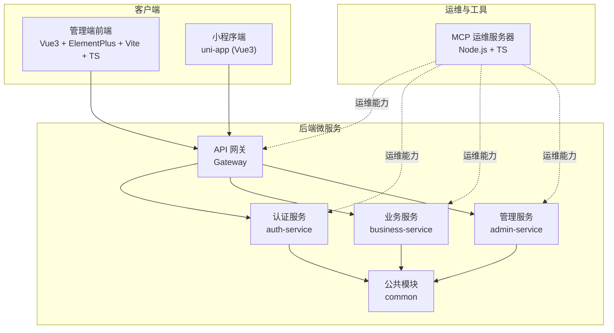
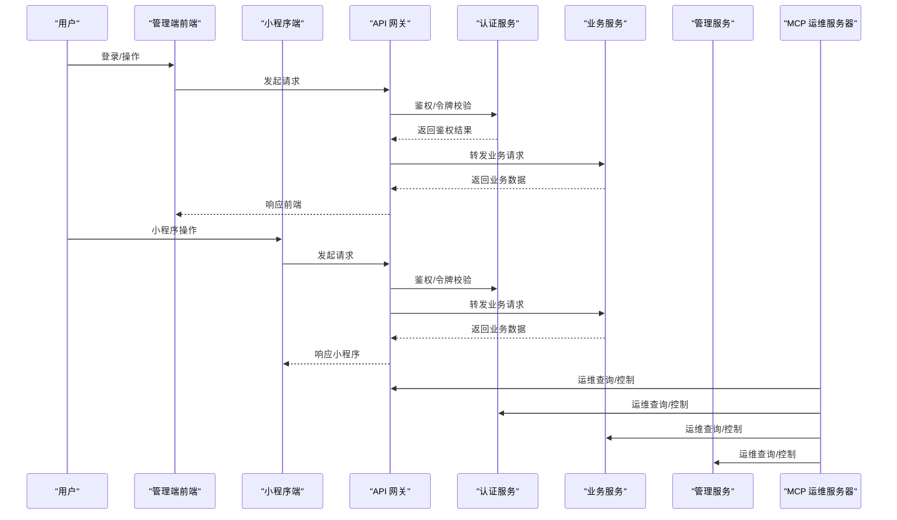
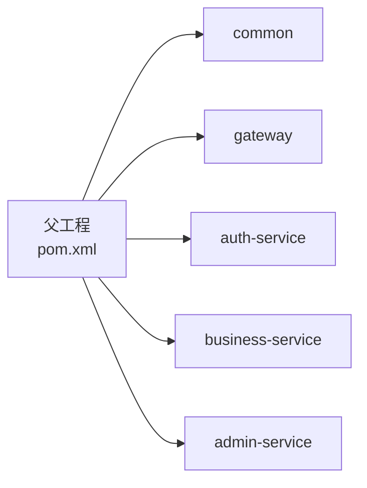
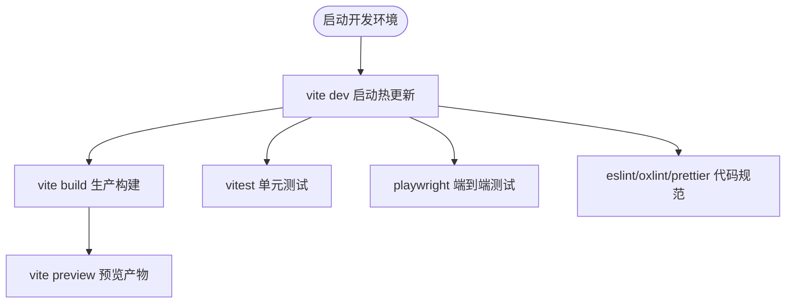
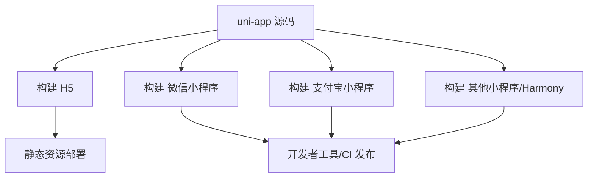
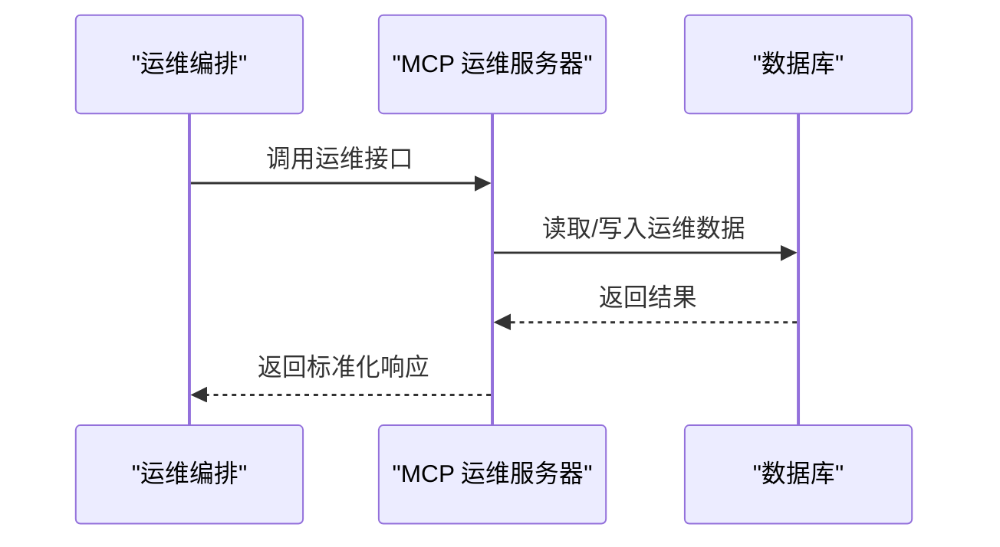
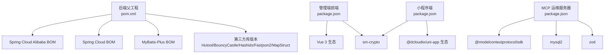

# 技术栈概览

<cite>
**本文引用的文件**   
- [class_times_record_back/pom.xml](file://class_times_record_back/pom.xml)
- [class_record_admin_front/package.json](file://class_record_admin_front/package.json)
- [class_times_record/package.json](file://class_times_record/package.json)
- [course_record_mcp_server/package.json](file://course_record_mcp_server/package.json)
</cite>

## 目录
1. [简介](#简介)
2. [项目结构](#项目结构)
3. [核心组件](#核心组件)
4. [架构总览](#架构总览)
5. [详细组件分析](#详细组件分析)
6. [依赖关系分析](#依赖关系分析)
7. [性能与扩展性](#性能与扩展性)
8. [故障排查指南](#故障排查指南)
9. [结论](#结论)
10. [附录：版本与兼容性](#附录版本与兼容性)

## 简介
本技术栈概览面向课时记录系统的四个主要模块，系统采用微服务化、前后端分离与多端覆盖的架构策略。后端基于 Spring Cloud Alibaba + Java 21 + Maven 多模块；管理端前端使用 Vue 3 + Element Plus + Vite 8 + TypeScript；微信小程序端基于 uni-app 框架；MCP 运维服务器采用 Node.js + TypeScript。整体设计强调可扩展性、可维护性与安全性（如国密算法 SM2/SM3），并通过统一的网关与服务治理提升稳定性与可观测性。

## 项目结构
仓库包含四大子工程：
- 后端微服务：class_times_record_back（Spring Boot + Spring Cloud Alibaba 多模块）
- 管理端前端：class_record_admin_front（Vue 3 + Element Plus + Vite + TypeScript）
- 小程序端：class_times_record（uni-app 多端构建）
- MCP 运维服务器：course_record_mcp_server（Node.js + TypeScript）

[本图为概念性架构图，不直接映射具体源码文件]

## 核心组件
- 后端微服务（Spring Cloud Alibaba + Java 21 + Maven 多模块）
  - 统一父工程集中管理依赖与编译插件，提供 common/gateway/auth-service/business-service/admin-service 等模块划分
  - 引入 Spring Cloud BOM 与 Spring Cloud Alibaba BOM，便于版本一致性
  - 集成 MyBatis-Plus、Fastjson2、MapStruct、Hutool、BouncyCastle、Hashids 等常用库
  - 通过注解处理器链（Lombok + MapStruct）提升开发效率
- 管理端前端（Vue 3 + Element Plus + Vite 8 + TypeScript）
  - 使用 Pinia 进行状态管理，Axios 发起 HTTP 请求，Element Plus 提供 UI 组件
  - 集成 sm-crypto 支持国密算法，满足安全合规需求
  - 构建与测试生态完善（Vitest、Playwright、ESLint/Oxlint、Prettier）
- 小程序端（uni-app 框架）
  - 基于 @dcloudio/uni-app 生态，支持 H5 与多个小程序平台（微信、支付宝、百度、QQ、头条、快手、京东、飞书、小红书、Harmony 等）
  - 使用 Vue 3 + Pinia + dayjs + sm-crypto，具备跨端一致体验
- MCP 运维服务器（Node.js + TypeScript）
  - 基于 @modelcontextprotocol/sdk 提供统一运维接口，结合 mysql2 与 zod 完成数据访问与校验
  - 支持多种运行模式（SSE/stdio），便于与外部编排系统集成

**章节来源**
- [class_times_record_back/pom.xml:1-162](file://class_times_record_back/pom.xml#L1-L162)
- [class_record_admin_front/package.json:1-63](file://class_record_admin_front/package.json#L1-L63)
- [class_times_record/package.json:1-82](file://class_times_record/package.json#L1-L82)
- [course_record_mcp_server/package.json:1-22](file://course_record_mcp_server/package.json#L1-L22)

## 架构总览
从调用链路看，客户端统一经 API 网关进入各微服务；认证服务负责鉴权与会话；业务与管理服务分别承载领域逻辑；公共模块沉淀通用能力；MCP 运维服务器对外暴露运维能力，辅助部署、配置与监控。

[本图为概念性流程图，不直接映射具体源码文件]

## 详细组件分析

### 后端微服务（Spring Cloud Alibaba + Java 21 + Maven 多模块）
- 技术要点
  - 父工程统一管理 Spring Boot、Spring Cloud、Spring Cloud Alibaba、MyBatis-Plus、Fastjson2、MapStruct、Hutool、BouncyCastle、Hashids 等依赖版本
  - 使用 maven-compiler-plugin 配置注解处理器链（Lombok + MapStruct），确保编译期代码生成
  - 多模块划分清晰：common（通用）、gateway（网关）、auth-service（认证）、business-service（业务）、admin-service（管理）
- 优势
  - 版本集中管控，降低依赖冲突风险
  - 注解处理器提升 DTO/VO 转换效率与可读性
  - 模块化边界明确，利于独立演进与灰度发布
- 关键路径参考
  - 依赖与版本定义：[class_times_record_back/pom.xml:30-103](file://class_times_record_back/pom.xml#L30-L103)
  - 编译器与插件配置：[class_times_record_back/pom.xml:114-160](file://class_times_record_back/pom.xml#L114-L160)

**图表来源**
- [class_times_record_back/pom.xml:22-28](file://class_times_record_back/pom.xml#L22-L28)

**章节来源**
- [class_times_record_back/pom.xml:1-162](file://class_times_record_back/pom.xml#L1-L162)

### 管理端前端（Vue 3 + Element Plus + Vite 8 + TypeScript）
- 技术要点
  - 运行时依赖：Vue 3、Vue Router、Pinia、Element Plus、Axios、sm-crypto、nprogress、vue3-slide-verify
  - 构建与质量：Vite 8、TypeScript、Vitest、Playwright、ESLint/Oxlint、Prettier、sass
  - 脚本命令：dev/build/preview/test/e2e/lint/format 等
- 优势
  - 现代化前端工程化体系，构建速度快、类型安全、测试完备
  - 集成 sm-crypto 满足国密算法需求，增强认证与数据传输安全
- 关键路径参考
  - 依赖与脚本定义：[class_record_admin_front/package.json:1-63](file://class_record_admin_front/package.json#L1-L63)

**章节来源**
- [class_record_admin_front/package.json:1-63](file://class_record_admin_front/package.json#L1-L63)

### 小程序端（uni-app 框架）
- 技术要点
  - 基于 @dcloudio/uni-app 生态，提供多端构建脚本（H5、mp-weixin、mp-alipay、mp-baidu、mp-qq、mp-toutiao、mp-kuaishou、mp-lark、mp-jd、mp-xhs、quickapp-webview、harmony 等）
  - 运行时依赖：Vue 3、Pinia、dayjs、sm-crypto、vue-i18n
  - 开发工具链：@dcloudio/vite-plugin-uni、typescript、vue-tsc、miniprogram-ci
- 优势
  - 一套代码多端发布，显著降低多端维护成本
  - 内置丰富 uni_modules 组件生态，快速搭建页面
  - 集成 sm-crypto 保障敏感数据安全
- 关键路径参考
  - 依赖与脚本定义：[class_times_record/package.json:1-82](file://class_times_record/package.json#L1-L82)

**章节来源**
- [class_times_record/package.json:1-82](file://class_times_record/package.json#L1-L82)

### MCP 运维服务器（Node.js + TypeScript）
- 技术要点
  - 基于 @modelcontextprotocol/sdk 提供统一运维接口
  - 使用 mysql2 连接数据库，zod 进行参数校验
  - 支持多种传输模式（SSE/stdio），便于与外部编排系统对接
- 优势
  - 轻量、易扩展，适合封装 Jenkins/Nacos/Sentinel/Docker 等运维能力
  - 强类型与校验提升稳定性与可维护性
- 关键路径参考
  - 依赖与脚本定义：[course_record_mcp_server/package.json:1-22](file://course_record_mcp_server/package.json#L1-22)

**章节来源**
- [course_record_mcp_server/package.json:1-22](file://course_record_mcp_server/package.json#L1-22)

## 依赖关系分析
- 后端
  - 父工程通过 dependencyManagement 统一导入 Spring Cloud BOM、Spring Cloud Alibaba BOM、MyBatis-Plus BOM 以及第三方库版本，保证全仓版本一致
  - 模块间通过 Maven 多模块组织，common 被各业务模块复用
- 前端与管理端
  - 管理端与小程序端均依赖 Vue 3 生态与 sm-crypto，保持安全能力一致
- MCP 运维服务器
  - 以 SDK 为中心，辅以 mysql2 与 zod，形成最小可用运维能力集

**图表来源**
- [class_times_record_back/pom.xml:48-103](file://class_times_record_back/pom.xml#L48-L103)
- [class_record_admin_front/package.json:19-30](file://class_record_admin_front/package.json#L19-L30)
- [class_times_record/package.json:42-66](file://class_times_record/package.json#L42-L66)
- [course_record_mcp_server/package.json:11-15](file://course_record_mcp_server/package.json#L11-15)

**章节来源**
- [class_times_record_back/pom.xml:48-103](file://class_times_record_back/pom.xml#L48-L103)
- [class_record_admin_front/package.json:19-30](file://class_record_admin_front/package.json#L19-L30)
- [class_times_record/package.json:42-66](file://class_times_record/package.json#L42-L66)
- [course_record_mcp_server/package.json:11-15](file://course_record_mcp_server/package.json#L11-15)

## 性能与扩展性
- 后端
  - 多模块拆分与网关前置，有利于水平扩展与隔离故障域
  - 注解处理器减少样板代码，提高开发与运行效率
- 前端
  - Vite 8 提供极快的冷/热启动与构建速度
  - 类型系统与测试套件保障重构与回归质量
- 小程序
  - uni-app 多端构建避免重复实现，缩短交付周期
- MCP
  - 轻量服务易于横向扩展，配合外部编排系统实现自动化运维

[本节为通用指导，不直接分析具体文件]

## 故障排查指南
- 后端
  - 检查父工程依赖版本是否冲突（BOM 导入顺序与版本对齐）
  - 确认注解处理器链（Lombok + MapStruct）在编译器中启用
- 前端
  - 若构建失败，核对 Node 引擎版本要求与包管理器锁文件一致性
  - 使用 Vitest/Playwright 定位功能问题，借助 ESLint/Oxlint/Prettier 修复风格问题
- 小程序
  - 多端构建时注意平台差异，优先在目标平台开发者工具中验证
  - 使用 miniprogram-ci 进行流水线构建与上传
- MCP
  - 校验输入参数（zod）与数据库连通性（mysql2），关注传输模式（SSE/stdio）配置

**章节来源**
- [class_times_record_back/pom.xml:114-160](file://class_times_record_back/pom.xml#L114-L160)
- [class_record_admin_front/package.json:6-18](file://class_record_admin_front/package.json#L6-L18)
- [class_times_record/package.json:4-40](file://class_times_record/package.json#L4-L40)
- [course_record_mcp_server/package.json:6-10](file://course_record_mcp_server/package.json#L6-L10)

## 结论
本项目以 Spring Cloud Alibaba 微服务为核心，结合现代前端工程化与跨端小程序方案，形成高内聚、低耦合、易扩展的技术体系。通过统一依赖管理与多端构建，显著提升研发效率与交付质量；同时引入 sm-crypto 等安全能力，满足合规与安全要求。MCP 运维服务器进一步补齐了自动化运维能力，使系统具备更强的可观测性与可维护性。

[本节为总结性内容，不直接分析具体文件]

## 附录：版本与兼容性
- 后端
  - Java 21、Spring Boot 4.0.4、Spring Cloud 2025.1.1、Spring Cloud Alibaba 2025.1.0.0
  - MyBatis-Plus 3.5.16、Fastjson2 2.0.60、MapStruct 1.5.5.Final、Hutool 5.8.40、BouncyCastle 1.84、Hashids 1.0.3
- 管理端前端
  - Vue 3.5.32、Element Plus 2.14.1、Vite 8.0.8、TypeScript ~6.0.0、Pinia 3.0.4、Axios 1.17.0、sm-crypto 0.4.0
  - Node 引擎要求：^20.19.0 || >=22.12.0
- 小程序端
  - @dcloudio/uni-app 3.0.0-alpha-5000820260508001、Vue 3.5.34、Pinia 3.0.4、sm-crypto 0.4.0、dayjs 1.11.20
  - 构建工具：vite 5.2.8、typescript ^5.3.3
- MCP 运维服务器
  - @modelcontextprotocol/sdk 1.29.0、mysql2 3.22.5、zod 3.25.0
  - typescript ^5.7.0、tsx ^4.19.0、@types/node ^22.0.0

**章节来源**
- [class_times_record_back/pom.xml:30-46](file://class_times_record_back/pom.xml#L30-L46)
- [class_record_admin_front/package.json:19-61](file://class_record_admin_front/package.json#L19-L61)
- [class_times_record/package.json:42-80](file://class_times_record/package.json#L42-L80)
- [course_record_mcp_server/package.json:11-20](file://course_record_mcp_server/package.json#L11-20)