# 核心功能特性

<cite>
**本文引用的文件**
- [class_record_admin_front/README.md](file://class_record_admin_front/README.md)
- [class_times_record/README.md](file://class_times_record/README.md)
</cite>

## 目录
1. [引言](#引言)
2. [项目结构](#项目结构)
3. [核心组件](#核心组件)
4. [架构总览](#架构总览)
5. [详细组件分析](#详细组件分析)
6. [依赖分析](#依赖分析)
7. [性能考虑](#性能考虑)
8. [故障排查指南](#故障排查指南)
9. [结论](#结论)
10. [附录](#附录)

## 引言
本章节面向课时记录系统的业务使用者与实施人员，系统化阐述七大核心功能模块：用户认证与权限管理、机构管理、教师管理、学生管理、课程管理、课时记录、系统管理。文档从业务价值、主要操作界面、与其他模块的关联关系出发，结合前后端入口与路由组织，给出关键业务流程图与用户操作路径，帮助读者快速理解整体业务闭环。

## 项目结构
本项目由三大部分组成：
- 管理后台前端（Vue 3 + Element Plus）：提供机构、教师、学生、课程、班级、排课、课时记录、系统管理等管理能力。
- 小程序前端（uni-app）：面向教师与家长，提供学员管理、班级管理、课程管理、课时扣费、排课、查看记录等能力。
- 后端微服务（Spring Cloud Alibaba）：通过网关统一鉴权与路由分发，支撑认证、菜单权限与各项业务能力。

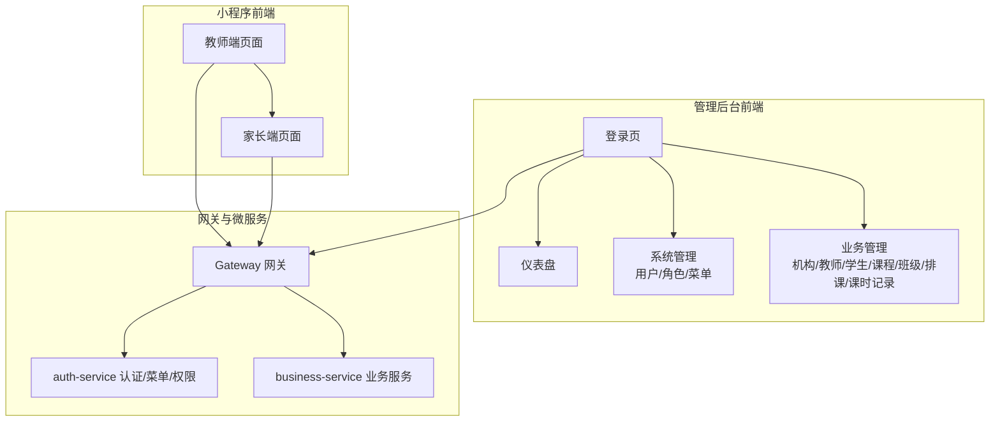

图示来源
- [class_record_admin_front/README.md:1-127](file://class_record_admin_front/README.md#L1-L127)
- [class_times_record/README.md:1-127](file://class_times_record/README.md#L1-L127)

章节来源
- [class_record_admin_front/README.md:1-127](file://class_record_admin_front/README.md#L1-L127)
- [class_times_record/README.md:1-127](file://class_times_record/README.md#L1-L127)

## 核心组件
本节聚焦七大核心模块的业务价值、主要操作界面与跨模块关联。

- 用户认证与权限管理
  - 业务价值：统一身份入口，保障多角色访问安全；基于菜单与按钮级权限控制，实现“按角色可见、按权限可用”。
  - 主要界面：登录页（滑块验证码）、个人中心、角色与菜单配置。
  - 关联关系：为所有业务模块提供鉴权上下文；菜单驱动前台导航与按钮显隐。

- 机构管理
  - 业务价值：承载培训机构主体信息、套餐订阅与租期控制，是数据隔离与计费的基础。
  - 主要界面：机构列表、启用/禁用、套餐与租期管理。
  - 关联关系：教师、学生、课程、班级、课时记录均归属特定机构。

- 教师管理
  - 业务价值：维护教师档案与账号，支持在教师与管理员身份间切换，便于教学与运营协同。
  - 主要界面：教师列表、新增/编辑、状态切换、机构管理员身份切换、密码重置。
  - 关联关系：与班级、课程、排课、课时记录强相关；可创建或管理其负责的教学数据。

- 学生管理
  - 业务价值：统一管理学员信息与家庭联系人绑定，支撑课时余额与通知触达。
  - 主要界面：学生列表、新增/编辑、按机构筛选、家长绑定。
  - 关联关系：与课程、班级、课时记录、家长端视图紧密联动。

- 课程管理
  - 业务价值：定义课程体系与类型（按次/按天），作为排课与扣课的依据。
  - 主要界面：课程列表、新增/编辑、类型选择。
  - 关联关系：被班级引用；参与排课与课时扣减。

- 班级管理
  - 业务价值：将课程、教师与学生聚合到具体教学单元，支撑排课与上课记录。
  - 主要界面：班级列表、新增/编辑、人数与上限展示。
  - 关联关系：关联课程与教师；承载排课与课时记录。

- 排课系统
  - 业务价值：以班级为单位进行时间规划，提升资源利用率与教学秩序。
  - 主要界面：按班级查看排课、编辑时间安排、调整排课。
  - 关联关系：基于班级与课程生成；影响课时记录与扣减。

- 课时记录
  - 业务价值：记录上课情况、执行课时扣减与请假处理，形成教学闭环与对账依据。
  - 主要界面：增课/消课/纯记录、变更数量追踪、请假管理、记录详情。
  - 关联关系：依赖学生、班级、课程、排课；影响家长端课时余额与通知。

- 系统管理
  - 业务价值：提供用户、角色、菜单与操作日志的统一治理，确保合规与可审计。
  - 主要界面：用户管理、角色管理、菜单管理、操作日志。
  - 关联关系：为全系统提供权限与审计基础。

章节来源
- [class_record_admin_front/README.md:1-127](file://class_record_admin_front/README.md#L1-L127)
- [class_times_record/README.md:1-127](file://class_times_record/README.md#L1-L127)

## 架构总览
系统采用前后端分离与微服务架构：小程序与管理后台通过 Nginx 反向代理至 Gateway，Gateway 根据路径前缀将请求分发至 auth-service 与 business-service。认证流程使用 JWT，并集成 SM2/SM3 国密算法进行签名与加密传输。

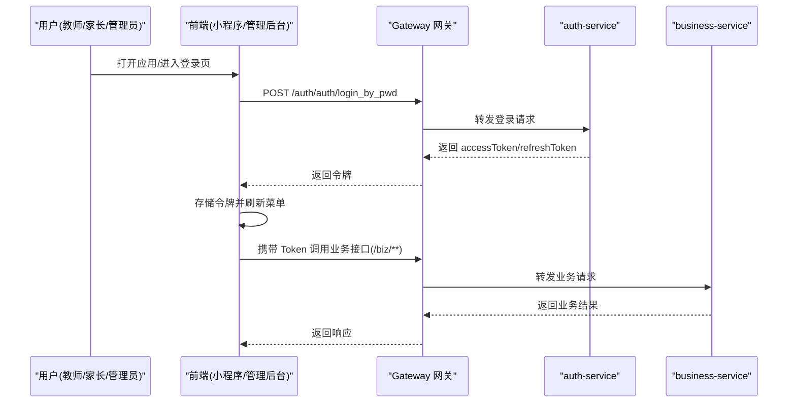

图示来源
- [class_times_record/README.md:1-127](file://class_times_record/README.md#L1-L127)

## 详细组件分析

### 用户认证与权限管理
- 业务价值
  - 统一身份认证与授权，支持多角色登录（管理员、教师、家长）。
  - 细粒度权限控制：菜单级与按钮级权限，动态渲染导航与操作入口。
- 主要操作界面
  - 登录页（含滑块验证）、个人中心、角色与菜单配置。
- 与其他模块的关联
  - 为所有业务模块提供鉴权上下文；菜单驱动前台导航与按钮显隐。
- 用户操作路径
  - 登录 → 获取菜单 → 进入对应模块 → 受权限控制的按钮可见/不可见。
- 流程图
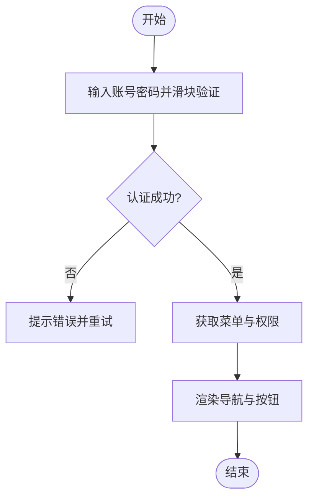

章节来源
- [class_record_admin_front/README.md:1-127](file://class_record_admin_front/README.md#L1-L127)
- [class_times_record/README.md:1-127](file://class_times_record/README.md#L1-L127)

### 机构管理
- 业务价值
  - 作为数据隔离与计费边界，支撑多机构独立运营。
- 主要操作界面
  - 机构列表、启用/禁用、套餐与租期管理。
- 与其他模块的关联
  - 教师、学生、课程、班级、课时记录均归属机构；租期到期控制影响服务可用性。
- 用户操作路径
  - 进入机构管理 → 新增/编辑机构 → 设置套餐与租期 → 启用/禁用。
- 流程图
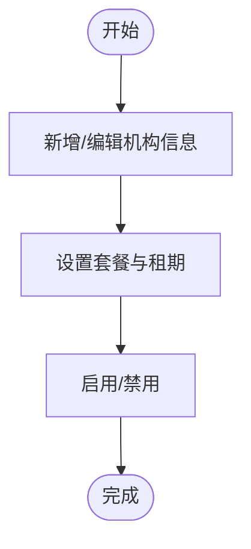

章节来源
- [class_record_admin_front/README.md:1-127](file://class_record_admin_front/README.md#L1-L127)

### 教师管理
- 业务价值
  - 维护教师档案与账号，支持在教师与管理员身份间切换，提高运营效率。
- 主要操作界面
  - 教师列表、新增/编辑、状态切换、机构管理员身份切换、密码重置。
- 与其他模块的关联
  - 与班级、课程、排课、课时记录强相关；管理员可批量管理教师数据。
- 用户操作路径
  - 教师管理 → 新增/编辑教师 → 分配机构管理员身份 → 密码重置。
- 流程图
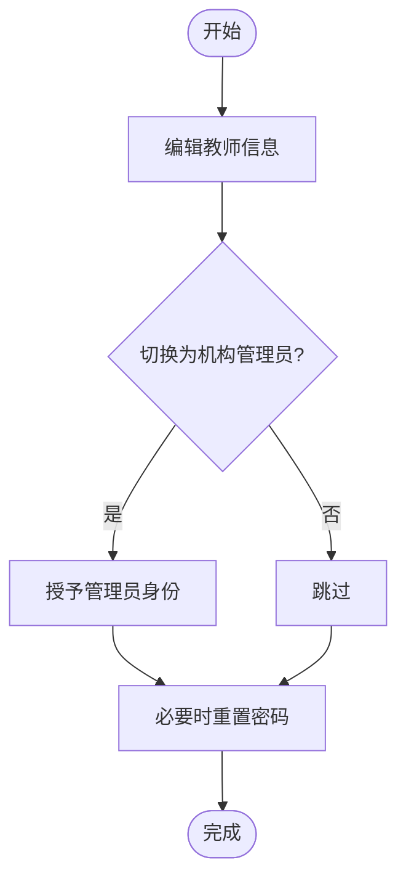

章节来源
- [class_record_admin_front/README.md:1-127](file://class_record_admin_front/README.md#L1-L127)

### 学生管理
- 业务价值
  - 统一管理学员信息与家庭联系人绑定，支撑课时余额与通知触达。
- 主要操作界面
  - 学生列表、新增/编辑、按机构筛选、家长绑定。
- 与其他模块的关联
  - 与课程、班级、课时记录、家长端视图紧密联动。
- 用户操作路径
  - 学生管理 → 新增/编辑学生 → 绑定家长 → 查看课时余额。
- 流程图
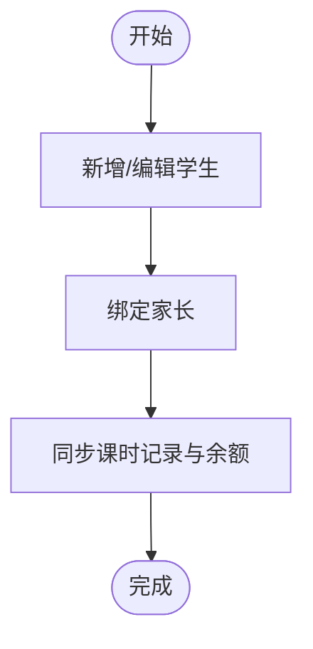

章节来源
- [class_record_admin_front/README.md:1-127](file://class_record_admin_front/README.md#L1-L127)
- [class_times_record/README.md:1-127](file://class_times_record/README.md#L1-L127)

### 课程管理
- 业务价值
  - 定义课程体系与类型（按次/按天），作为排课与扣课的依据。
- 主要操作界面
  - 课程列表、新增/编辑、类型选择。
- 与其他模块的关联
  - 被班级引用；参与排课与课时扣减。
- 用户操作路径
  - 课程管理 → 新增/编辑课程 → 选择类型（按次/按天）。
- 流程图
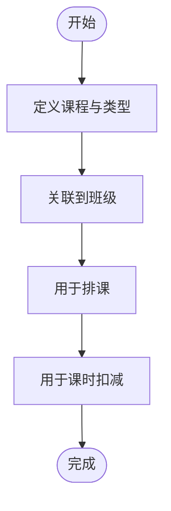

章节来源
- [class_record_admin_front/README.md:1-127](file://class_record_admin_front/README.md#L1-L127)

### 班级管理
- 业务价值
  - 将课程、教师与学生聚合到具体教学单元，支撑排课与上课记录。
- 主要操作界面
  - 班级列表、新增/编辑、人数与上限展示。
- 与其他模块的关联
  - 关联课程与教师；承载排课与课时记录。
- 用户操作路径
  - 班级管理 → 新增/编辑班级 → 设置人数与上限。
- 流程图
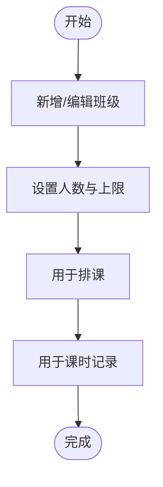

章节来源
- [class_record_admin_front/README.md:1-127](file://class_record_admin_front/README.md#L1-L127)

### 排课系统
- 业务价值
  - 以班级为单位进行时间规划，提升资源利用率与教学秩序。
- 主要操作界面
  - 按班级查看排课、编辑时间安排、调整排课。
- 与其他模块的关联
  - 基于班级与课程生成；影响课时记录与扣减。
- 用户操作路径
  - 排课管理 → 选择班级 → 编辑时间安排 → 保存并发布。
- 流程图
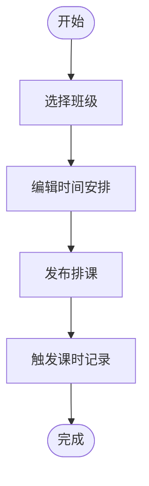

章节来源
- [class_record_admin_front/README.md:1-127](file://class_record_admin_front/README.md#L1-L127)

### 课时记录
- 业务价值
  - 记录上课情况、执行课时扣减与请假处理，形成教学闭环与对账依据。
- 主要操作界面
  - 增课/消课/纯记录、变更数量追踪、请假管理、记录详情。
- 与其他模块的关联
  - 依赖学生、班级、课程、排课；影响家长端课时余额与通知。
- 用户操作路径
  - 课时记录 → 选择学生/班级/课程 → 填写记录 → 提交扣减或请假。
- 流程图
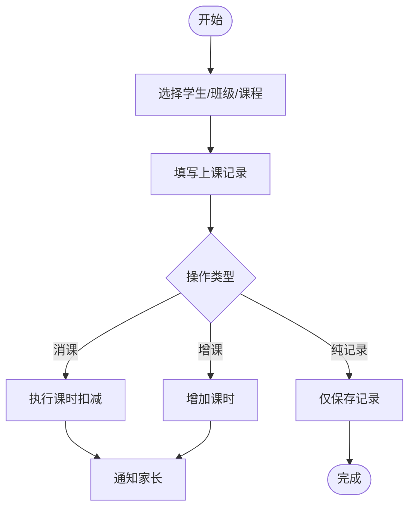

章节来源
- [class_record_admin_front/README.md:1-127](file://class_record_admin_front/README.md#L1-L127)
- [class_times_record/README.md:1-127](file://class_times_record/README.md#L1-L127)

### 系统管理
- 业务价值
  - 提供用户、角色、菜单与操作日志的统一治理，确保合规与可审计。
- 主要操作界面
  - 用户管理、角色管理、菜单管理、操作日志。
- 与其他模块的关联
  - 为全系统提供权限与审计基础。
- 用户操作路径
  - 系统管理 → 用户/角色/菜单配置 → 查看操作日志。
- 流程图
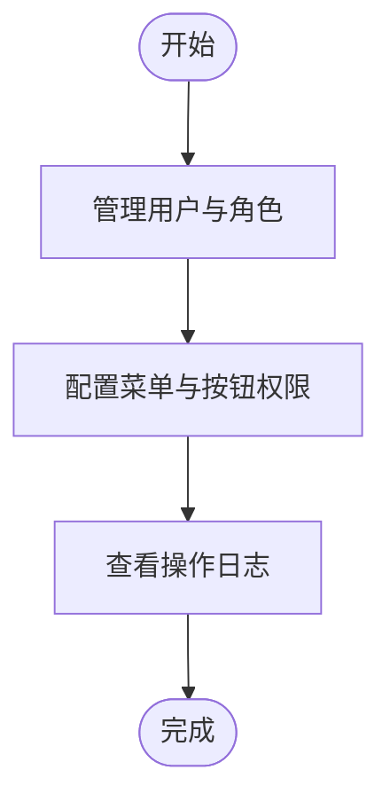

章节来源
- [class_record_admin_front/README.md:1-127](file://class_record_admin_front/README.md#L1-L127)

## 依赖分析
- 前端依赖
  - 管理后台前端：Vue 3、Element Plus、TypeScript、Pinia、Axios、Vite。
  - 小程序前端：uni-app、TypeScript、Pinia、SM2/SM3 加密。
- 网关与服务
  - Gateway 统一鉴权与路由分发；auth-service 负责认证与菜单权限；business-service 承载业务逻辑。
- 外部依赖
  - Nacos 注册与配置中心、MySQL 数据库、Nginx 反向代理。

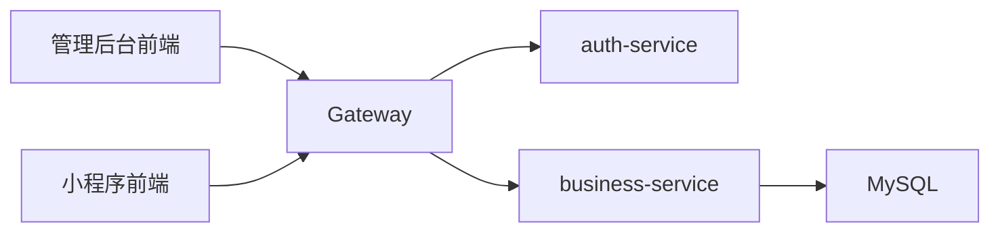

图示来源
- [class_record_admin_front/README.md:1-127](file://class_record_admin_front/README.md#L1-L127)
- [class_times_record/README.md:1-127](file://class_times_record/README.md#L1-L127)

章节来源
- [class_record_admin_front/README.md:1-127](file://class_record_admin_front/README.md#L1-L127)
- [class_times_record/README.md:1-127](file://class_times_record/README.md#L1-L127)

## 性能考虑
- 前端优化
  - 路由懒加载与分包策略（小程序）减少首屏体积。
  - 静态资源缓存与按需加载，提升页面响应速度。
- 网络与安全
  - 网关层集中鉴权与限流，避免重复校验。
  - 请求签名与密码加密（SM2/SM3）保障传输安全。
- 数据一致性
  - 课时扣减需保证事务性与幂等性，避免重复扣课。
  - 排课冲突检测与并发控制，防止超卖与时间重叠。

[本节为通用指导，不直接分析具体文件]

## 故障排查指南
- 登录失败
  - 检查滑块验证码是否通过、账号密码是否正确、网络连通性。
  - 确认 Gateway 与 auth-service 可达，JWT 签发正常。
- 权限异常
  - 核对当前角色的菜单与按钮权限配置；确认菜单树更新后已重新加载。
- 课时扣减异常
  - 检查学生课时余额、课程类型（按次/按天）、排课有效性。
  - 查看操作日志定位问题时间点与操作人。
- 小程序请求失败
  - 确认 baseUrl 与环境配置正确；检查 x-sign/x-timestamp/x-nonce 签名头。
  - 401 时自动刷新 Token 是否成功。

章节来源
- [class_record_admin_front/README.md:1-127](file://class_record_admin_front/README.md#L1-L127)
- [class_times_record/README.md:1-127](file://class_times_record/README.md#L1-L127)

## 结论
本系统围绕“机构—教师—学生—课程—班级—排课—课时记录”的主线构建，配合统一的认证与权限体系以及系统管理工具，形成完整的教学管理与对账闭环。通过清晰的模块划分与前后端协作，既满足管理端的精细化运营需求，也兼顾教师与家长端的便捷体验。

[本节为总结性内容，不直接分析具体文件]

## 附录
- 术语说明
  - 增课：为学员增加课时额度。
  - 消课：因上课而扣减课时额度。
  - 纯记录：仅记录上课情况，不涉及课时变动。
  - 请假：学员缺勤时的记录与处理。
- 参考入口
  - 管理后台：登录页、仪表盘、系统管理、业务管理各模块。
  - 小程序：教师端与家长端页面，涵盖学员、班级、课程、排课、课时记录等。

[本节为补充说明，不直接分析具体文件]