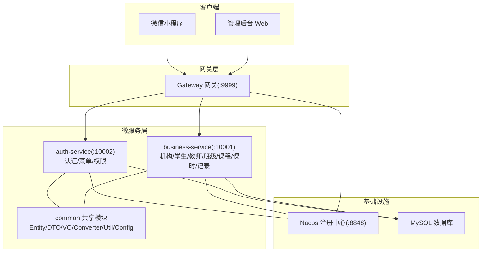
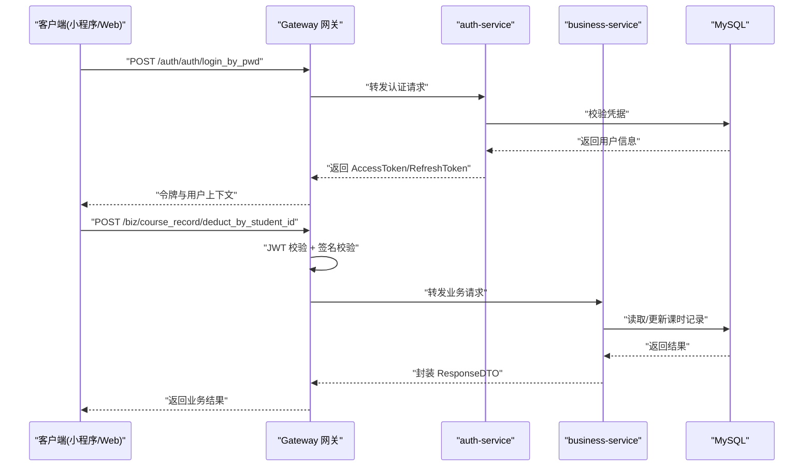
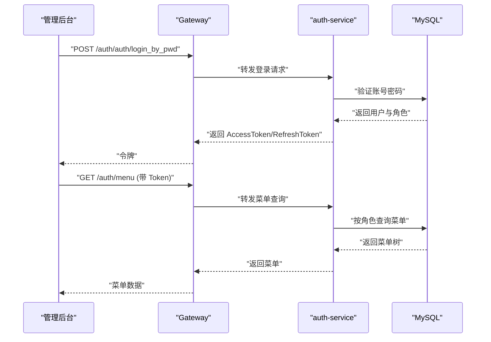
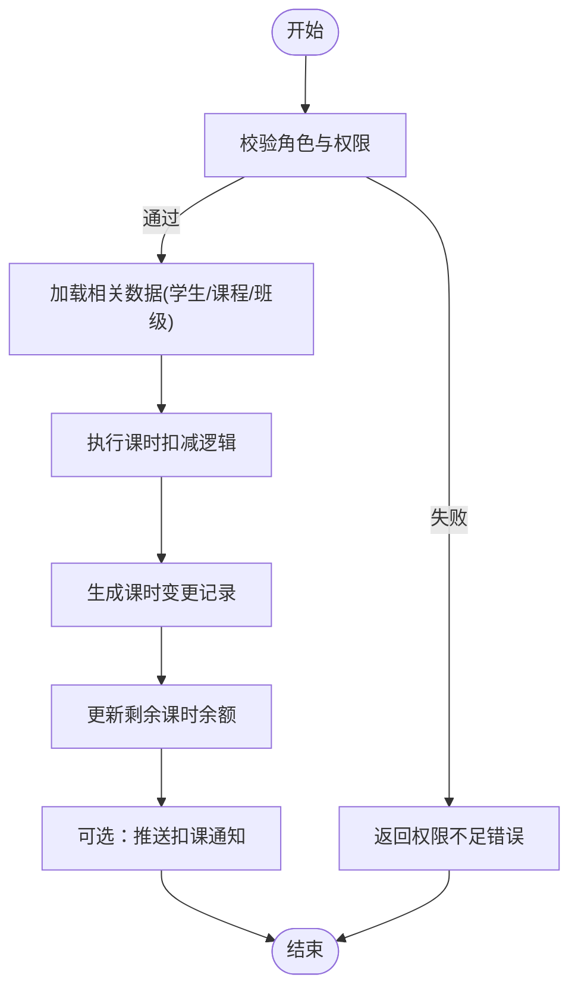
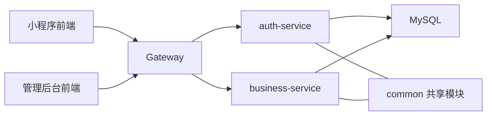

# 系统介绍与目标

<cite>
**本文引用的文件**   
- [class_times_record\README.md](file://class_times_record/README.md)
- [class_record_admin_front\README.md](file://class_record_admin_front/README.md)
- [class_times_record_back\docs\architecture.md](file://class_times_record_back/docs/architecture.md)
</cite>

## 目录
1. [引言](#引言)
2. [项目结构](#项目结构)
3. [核心组件](#核心组件)
4. [架构总览](#架构总览)
5. [详细组件分析](#详细组件分析)
6. [依赖关系分析](#依赖关系分析)
7. [性能与可用性](#性能与可用性)
8. [故障排查指南](#故障排查指南)
9. [结论](#结论)
10. [附录](#附录)

## 引言
本系统是一套面向教育培训机构的“课时记录管理系统”，旨在用数字化手段替代传统手工记录，解决效率低、易出错、数据不透明等痛点。系统围绕“机构—教师—学生—家长”四方角色展开，提供课程与班级编排、课时扣减与记录、权限与菜单管理、数据可视化等能力，帮助机构实现：
- 提高课时管理效率：从手工记账到在线一键操作，减少重复劳动与人为错误
- 实现数据可视化：仪表盘与统计报表直观呈现学生、教师、课程、班级等关键指标
- 支持多角色协作：管理员统筹全局，教师负责教学与排课，家长实时查看进度，学生可关注自身学习情况
- 优化运营管理流程：通过统一入口、统一鉴权、统一签名校验，保障数据安全与合规

该系统同时提供微信小程序端与管理后台，覆盖移动端便捷操作与PC端深度管理两大场景，满足培训机构日常运营、教师上课记录、家长查看课程进度等实际业务需求。

## 项目结构
仓库采用前后端分离与微服务架构，包含以下主要部分：
- 后端微服务（Spring Cloud Alibaba）
  - 网关服务：统一入口、路由分发、JWT 校验
  - 认证授权服务：登录注册、Token 签发与刷新、菜单与权限
  - 核心业务服务：机构、学生、教师、家长、班级、排课、课程、课程记录、课时记录
  - 共享模块：实体、DTO/VO、转换器、拦截器、工具类、异常处理等
- 前端应用
  - 微信小程序端（uni-app + Vue 3 + TypeScript）：面向教师与家长，提供学员管理、班级管理、课程管理、课时扣费、排课等功能
  - 管理后台（Vue 3 + Element Plus + TypeScript）：面向管理员，提供系统管理与业务管理功能

图表来源
- [class_times_record_back\docs\architecture.md:1-644](file://class_times_record_back/docs/architecture.md#L1-L644)
- [class_times_record\README.md:1-127](file://class_times_record/README.md#L1-L127)

章节来源
- [class_times_record\README.md:1-127](file://class_times_record/README.md#L1-L127)
- [class_record_admin_front\README.md:1-127](file://class_record_admin_front/README.md#L1-L127)
- [class_times_record_back\docs\architecture.md:1-644](file://class_times_record_back/docs/architecture.md#L1-L644)

## 核心组件
- 网关服务（Gateway）
  - 统一对外入口，按路径前缀将请求转发至认证或业务服务
  - 执行 JWT 校验、注入用户上下文、限流熔断
- 认证授权服务（auth-service）
  - 提供登录、注册、Token 刷新、菜单查询、权限记录绑定等能力
  - 基于 RBAC 的权限模型，支撑多角色访问控制
- 核心业务服务（business-service）
  - 覆盖机构、学生、教师、家长、班级、排课、课程、课程记录、课时记录等核心领域
  - 提供增删改查、批量操作、多维度查询、课时扣减等接口
- 共享模块（common）
  - 定义跨服务复用的实体、DTO/VO、转换器、拦截器、过滤器、工具类、配置与异常处理
- 小程序前端（uni-app）
  - 教师端：学员管理、班级管理、课程管理、课时扣费、排课管理、教师管理、机构信息管理、扣课记录查看
  - 家长端：查看孩子课程列表、课时余额与扣课记录、编辑学生信息、微信订阅通知
- 管理后台前端（Vue 3 + Element Plus）
  - 系统管理：用户、角色、菜单管理
  - 业务管理：仪表盘、机构、学生、教师、课程、班级、排课、课程记录、课时记录、小程序菜单

章节来源
- [class_times_record\README.md:1-127](file://class_times_record/README.md#L1-L127)
- [class_record_admin_front\README.md:1-127](file://class_record_admin_front/README.md#L1-L127)
- [class_times_record_back\docs\architecture.md:1-644](file://class_times_record_back/docs/architecture.md#L1-L644)

## 架构总览
系统采用响应式网关与微服务分层设计，结合 Nacos 服务发现与 Sentinel 流量治理，确保高可用与可扩展性。安全方面引入两级防护体系：网关层 JWT 校验与服务层拦截器链双重保障；通信安全使用 SM2/SM3 国密算法进行加密与签名校验，并支持防重放机制。

图表来源
- [class_times_record_back\docs\architecture.md:1-644](file://class_times_record_back/docs/architecture.md#L1-L644)

章节来源
- [class_times_record_back\docs\architecture.md:1-644](file://class_times_record_back/docs/architecture.md#L1-L644)

## 详细组件分析

### 认证与授权（auth-service）
- 职责边界
  - 提供登录、注册、Token 刷新、菜单查询、权限记录绑定等接口
  - 基于 RBAC 的角色-菜单权限模型，支撑不同角色的页面与按钮可见性
- 安全机制
  - 网关层 JwtAuthFilter 对公开路径放行，其他路径强制 Bearer Token 校验
  - 服务层拦截器链二次校验 JWT，注入用户上下文，支持 SM3 签名与防重放
- 典型调用流程
  - 登录成功后返回双 Token（AccessToken/RefreshToken），后续请求携带 AccessToken
  - 菜单按角色动态加载，控制前端导航与按钮权限

图表来源
- [class_times_record_back\docs\architecture.md:1-644](file://class_times_record_back/docs/architecture.md#L1-L644)

章节来源
- [class_times_record_back\docs\architecture.md:1-644](file://class_times_record_back/docs/architecture.md#L1-L644)

### 核心业务域（business-service）
- 职责边界
  - 机构、学生、教师、家长、班级、排课、课程、课程记录、课时记录等核心领域
  - 提供多维度查询、批量新增、课时扣减等接口
- 关键业务流程
  - 课时扣减：根据学生/课程/班级维度扣减课时，生成课时变更记录
  - 排课管理：维护班级上课时间表，支持调整与详情查看
  - 权限记录：课程记录与用户权限关联，控制家长/教师对特定记录的访问

图表来源
- [class_times_record_back\docs\architecture.md:1-644](file://class_times_record_back/docs/architecture.md#L1-L644)

章节来源
- [class_times_record_back\docs\architecture.md:1-644](file://class_times_record_back/docs/architecture.md#L1-L644)

### 小程序前端（uni-app）
- 教师端
  - 学员管理、班级管理、课程管理、课时扣费、排课管理、教师管理、机构信息管理、扣课记录查看
- 家长端
  - 查看孩子课程列表、课时余额与扣课记录、编辑学生信息、微信订阅通知
- 技术要点
  - uni-app + Vue 3 Composition API + TypeScript
  - 自动附加 SM3 签名头，支持 Token 静默刷新
  - 分包加载，提升首屏性能

章节来源
- [class_times_record\README.md:1-127](file://class_times_record/README.md#L1-L127)

### 管理后台前端（Vue 3 + Element Plus）
- 系统管理
  - 用户管理、角色管理、菜单管理
- 业务管理
  - 仪表盘、机构、学生、教师、课程、班级、排课、课程记录、课时记录、小程序菜单
- 技术要点
  - Vue 3 + Element Plus + TypeScript + Pinia + Axios
  - 开发模式 Vite 代理到网关，生产环境直连

章节来源
- [class_record_admin_front\README.md:1-127](file://class_record_admin_front/README.md#L1-L127)

## 依赖关系分析
- 服务间依赖
  - Gateway 依赖 Nacos 进行服务发现与负载均衡
  - auth-service 与 business-service 均依赖 MySQL 持久化
  - business-service 复用 common 中的实体、转换器、拦截器等通用能力
- 前端依赖
  - 小程序与管理后台均通过 Gateway 访问后端服务
  - 小程序使用 sm-crypto 进行 SM2/SM3 加密与签名
  - 管理后台在开发模式下通过 Vite 代理到本地网关

图表来源
- [class_times_record_back\docs\architecture.md:1-644](file://class_times_record_back/docs/architecture.md#L1-L644)
- [class_times_record\README.md:1-127](file://class_times_record/README.md#L1-L127)
- [class_record_admin_front\README.md:1-127](file://class_record_admin_front/README.md#L1-L127)

章节来源
- [class_times_record_back\docs\architecture.md:1-644](file://class_times_record_back/docs/architecture.md#L1-L644)
- [class_times_record\README.md:1-127](file://class_times_record/README.md#L1-L127)
- [class_record_admin_front\README.md:1-127](file://class_record_admin_front/README.md#L1-L127)

## 性能与可用性
- 虚拟线程：JDK 21 虚拟线程提升 I/O 密集型场景并发处理能力
- 限流与熔断：Sentinel 提供流量控制与降级策略，增强系统稳定性
- 主键策略：雪花算法分布式唯一 ID，趋势递增利于索引
- 逻辑删除：统一 isDeleted 字段，避免物理删除导致的数据丢失
- 统一异常处理：集中捕获参数校验、业务异常、运行时异常与数据库异常，返回标准化响应

章节来源
- [class_times_record_back\docs\architecture.md:1-644](file://class_times_record_back/docs/architecture.md#L1-L644)

## 故障排查指南
- 认证问题
  - 检查 Token 是否过期，确认 RefreshToken 刷新流程是否正常
  - 核对公开路径是否被误拦截，确认 JwtAuthFilter 放行规则
- 签名校验失败
  - 确认 x-sign、x-timestamp、x-nonce 是否正确生成与传递
  - 检查服务端盐值配置是否与客户端一致
- 权限不足
  - 确认当前用户角色是否具备对应菜单与按钮权限
  - 检查权限记录绑定是否生效
- 课时扣减异常
  - 核对学生/课程/班级是否存在且状态正常
  - 查看课时变更记录是否成功写入，余额是否更新

章节来源
- [class_times_record_back\docs\architecture.md:1-644](file://class_times_record_back/docs/architecture.md#L1-L644)

## 结论
本课时记录系统以微服务架构为基础，结合小程序与管理后台的双端形态，为教育培训机构提供了高效、安全、可视化的课时管理能力。通过统一的认证授权、严格的签名校验与完善的异常处理，系统在保障数据安全的同时显著提升了运营效率。未来可在中间表实体化、API 版本管理、配置中心迁移、链路追踪等方面持续演进，进一步提升系统的可维护性与可观测性。

## 附录
- 快速开始（小程序）
  - 安装依赖、运行开发模式、构建生产包
- 快速开始（管理后台）
  - 安装依赖、启动开发服务器、类型检查
- 部署建议
  - 先启动 Nacos，再依次启动 Gateway、auth-service、business-service
  - 生产环境建议使用 Docker 容器化部署

章节来源
- [class_times_record\README.md:1-127](file://class_times_record/README.md#L1-L127)
- [class_record_admin_front\README.md:1-127](file://class_record_admin_front/README.md#L1-L127)
- [class_times_record_back\docs\architecture.md:1-644](file://class_times_record_back/docs/architecture.md#L1-L644)