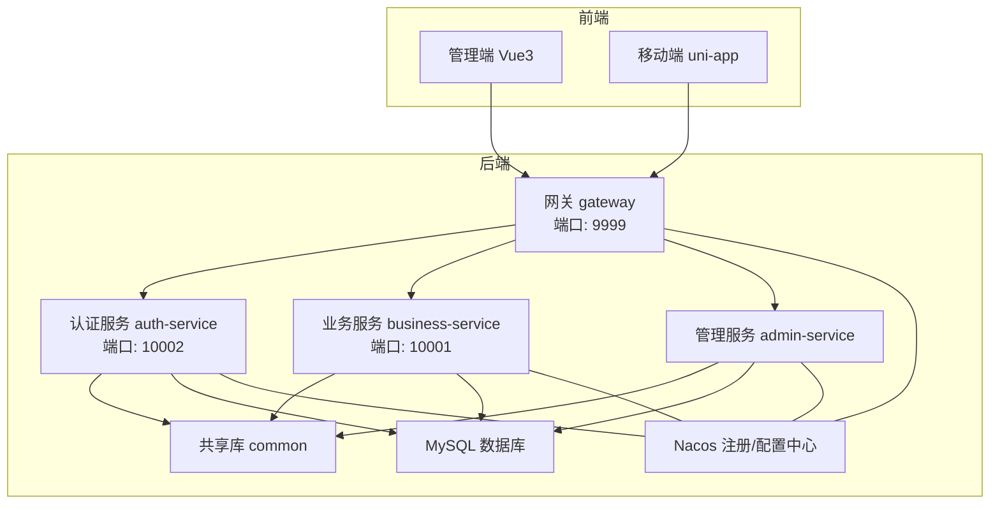
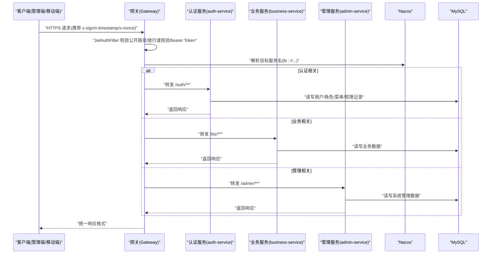
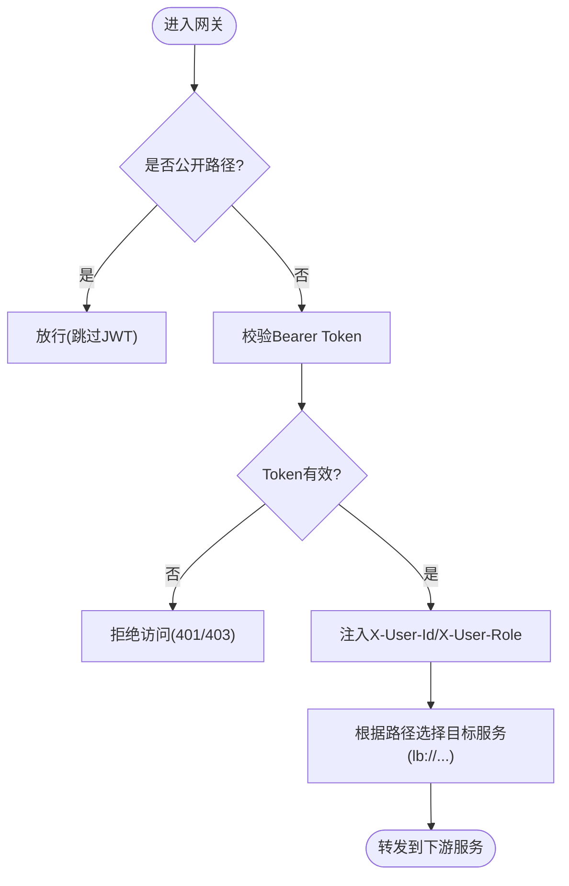
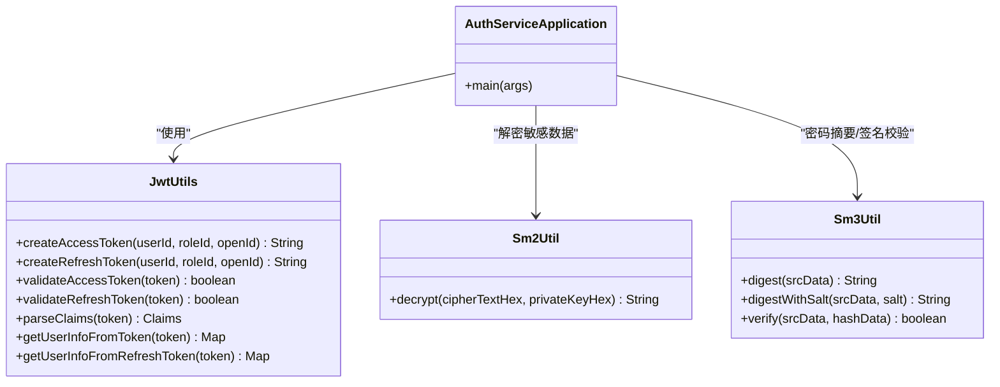
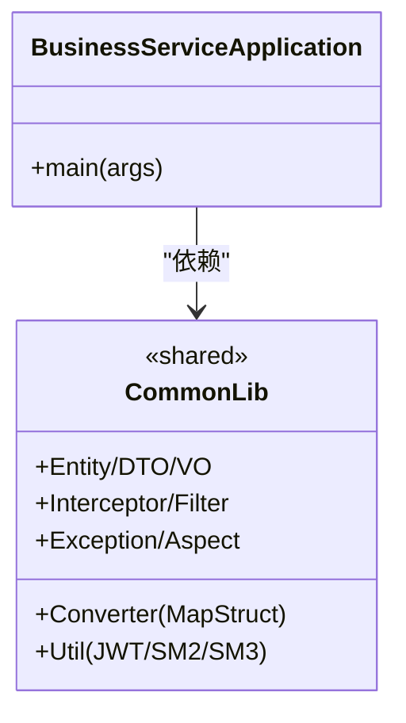
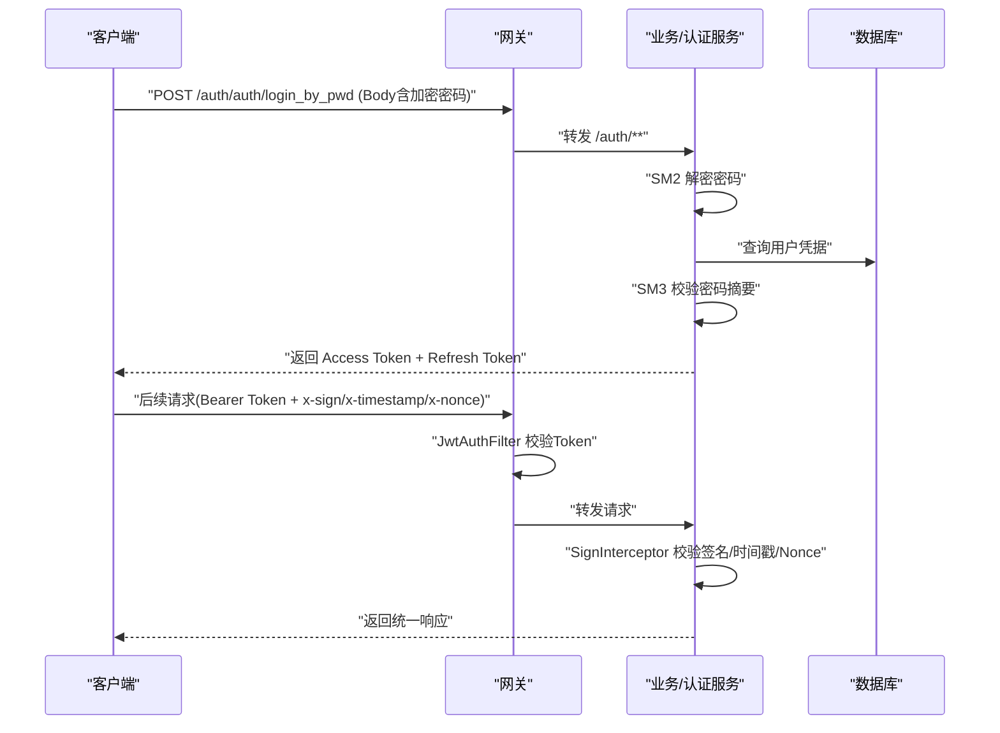
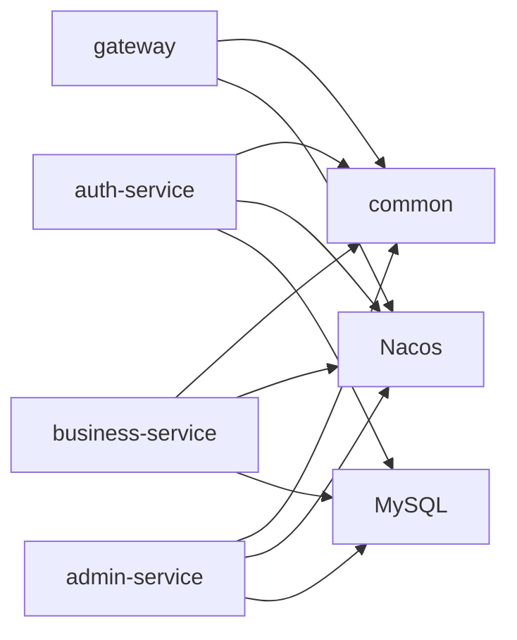
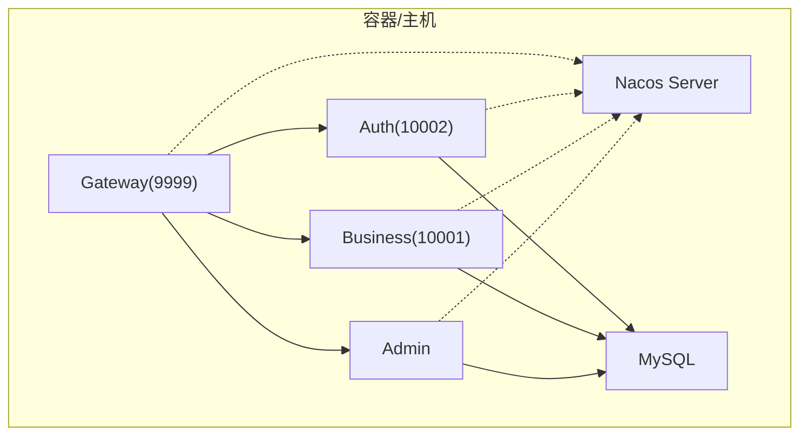

# 系统架构设计

<cite>
**本文引用的文件**   
- [pom.xml](file://class_times_record_back/pom.xml)
- [architecture.md](file://class_times_record_back/docs/architecture.md)
- [GatewayApplication.java](file://class_times_record_back/gateway/src/main/java/com/shiroko/gateway/GatewayApplication.java)
- [application.yml（网关）](file://class_times_record_back/gateway/src/main/resources/application.yml)
- [AuthServiceApplication.java](file://class_times_record_back/auth-service/src/main/java/com/shiroko/AuthServiceApplication.java)
- [application.yml（认证服务）](file://class_times_record_back/auth-service/src/main/resources/application.yml)
- [BusinessServiceApplication.java](file://class_times_record_back/business-service/src/main/java/com/shiroko/BusinessServiceApplication.java)
- [application.yml（业务服务）](file://class_times_record_back/business-service/src/main/resources/application.yml)
- [AdminServiceApplication.java](file://class_times_record_back/admin-service/src/main/java/com/shiroko/AdminServiceApplication.java)
- [application.yml（管理服务）](file://class_times_record_back/admin-service/src/main/resources/application.yml)
- [JwtAuthFilter.java](file://class_times_record_back/gateway/src/main/java/com/shiroko/gateway/filter/JwtAuthFilter.java)
- [JwtUtils.java](file://class_times_record_back/common/src/main/java/com/shiroko/util/JwtUtils.java)
- [Sm2Util.java](file://class_times_record_back/common/src/main/java/com/shiroko/util/Sm2Util.java)
- [Sm3Util.java](file://class_times_record_back/common/src/main/java/com/shiroko/util/Sm3Util.java)
</cite>

## 目录
1. [引言](#引言)
2. [项目结构](#项目结构)
3. [核心组件](#核心组件)
4. [架构总览](#架构总览)
5. [详细组件分析](#详细组件分析)
6. [依赖关系分析](#依赖关系分析)
7. [性能与一致性](#性能与一致性)
8. [部署与环境配置](#部署与环境配置)
9. [故障排查指南](#故障排查指南)
10. [结论](#结论)

## 引言
本设计文档面向“课时记录系统”的后端微服务架构，覆盖网关层、认证服务、业务服务与管理服务的职责划分；阐述服务间通信机制、数据一致性与负载均衡策略；说明前后端分离的 RESTful API 规范、JWT 令牌认证流程与国密安全传输机制；并提供系统架构图、请求处理流程图、数据流向图与服务依赖关系图。同时解释关键技术选型背景与权衡，如采用 Spring Cloud Alibaba、引入国密算法的原因等，并给出部署拓扑与环境配置要点，帮助开发者快速理解整体结构与运行原理。

## 项目结构
后端采用 Maven 多模块聚合工程，包含 common、gateway、auth-service、business-service、admin-service 五个模块；前端包含管理端（Vue3 + Vite）与移动端（uni-app）。后端统一使用 Spring Boot 4.0.4 与 JDK 21，结合 Spring Cloud Alibaba 实现注册发现、配置中心与流量治理。

图表来源
- [pom.xml:22-28](file://class_times_record_back/pom.xml#L22-L28)
- [architecture.md:47-57](file://class_times_record_back/docs/architecture.md#L47-L57)

章节来源
- [pom.xml:1-162](file://class_times_record_back/pom.xml#L1-L162)
- [architecture.md:1-90](file://class_times_record_back/docs/architecture.md#L1-L90)

## 核心组件
- 网关层（Gateway）：统一入口、路由分发、全局 JWT 校验、CORS、限流熔断（Sentinel）、请求体缓存与用户上下文注入。
- 认证服务（auth-service）：登录/注册、Token 签发与刷新、用户与角色权限、菜单与权限记录。
- 业务服务（business-service）：机构、学生、教师、家长、班级、排课、课程、课程记录、课时记录等核心业务。
- 管理服务（admin-service）：后台管理员、角色、菜单、操作日志、系统配置等系统管理能力。
- 共享库（common）：实体/DTO/VO、转换器、过滤器/拦截器、工具类（JWT/SM2/SM3）、异常处理、AOP 切面等。

章节来源
- [architecture.md:265-324](file://class_times_record_back/docs/architecture.md#L265-L324)

## 架构总览
系统采用前后端分离与微服务分层架构。外部客户端通过 HTTPS 访问网关，网关进行鉴权与路由后转发至对应服务；服务内部通过 Nacos 完成服务发现与负载均衡，调用本地或跨服务接口；数据持久化到 MySQL。安全方面采用两级防护：网关层 JWT 校验 + 服务层签名校验与上下文注入。

图表来源
- [GatewayApplication.java:8-16](file://class_times_record_back/gateway/src/main/java/com/shiroko/gateway/GatewayApplication.java#L8-L16)
- [application.yml（网关）:1-19](file://class_times_record_back/gateway/src/main/resources/application.yml#L1-L19)
- [AuthServiceApplication.java:10-20](file://class_times_record_back/auth-service/src/main/java/com/shiroko/AuthServiceApplication.java#L10-L20)
- [application.yml（认证服务）:1-24](file://class_times_record_back/auth-service/src/main/resources/application.yml#L1-L24)
- [BusinessServiceApplication.java:8-15](file://class_times_record_back/business-service/src/main/java/com/shiroko/BusinessServiceApplication.java#L8-L15)
- [application.yml（业务服务）:1-24](file://class_times_record_back/business-service/src/main/resources/application.yml#L1-L24)
- [AdminServiceApplication.java:10-20](file://class_times_record_back/admin-service/src/main/java/com/shiroko/AdminServiceApplication.java#L10-L20)
- [application.yml（管理服务）:1-23](file://class_times_record_back/admin-service/src/main/resources/application.yml#L1-L23)

## 详细组件分析

### 网关层（Gateway）
- 启动类排除数据源自动装配，仅作为无状态网关运行。
- 通过 Nacos 动态导入网关配置、公共 Sentinel 配置与日志配置。
- 全局过滤器 JwtAuthFilter 负责：
  - 公开路径放行（登录、注册、Swagger 等）
  - 非公开路径校验 Bearer Token，提取 userId/roleId 并注入请求头
  - 集成 Sentinel 限流与熔断
- 路由规则将 /auth/** 转发至 lb://auth-service，/biz/** 转发至 lb://business-service，支持 StripPrefix。

图表来源
- [JwtAuthFilter.java](file://class_times_record_back/gateway/src/main/java/com/shiroko/gateway/filter/JwtAuthFilter.java)
- [application.yml（网关）:1-19](file://class_times_record_back/gateway/src/main/resources/application.yml#L1-L19)
- [architecture.md:59-65](file://class_times_record_back/docs/architecture.md#L59-L65)

章节来源
- [GatewayApplication.java:8-16](file://class_times_record_back/gateway/src/main/java/com/shiroko/gateway/GatewayApplication.java#L8-L16)
- [application.yml（网关）:1-19](file://class_times_record_back/gateway/src/main/resources/application.yml#L1-L19)
- [architecture.md:94-147](file://class_times_record_back/docs/architecture.md#L94-L147)

### 认证服务（auth-service）
- 启用服务发现与 Feign 客户端，扫描 Mapper 包。
- 提供认证授权域能力：登录/注册、Token 签发与刷新、用户/角色/菜单/权限记录。
- 通过 Nacos 导入服务配置、公共数据库/Redis/Sentinel 配置与日志配置。
- 对外暴露 /auth/** 接口，由网关统一转发。

图表来源
- [AuthServiceApplication.java:10-20](file://class_times_record_back/auth-service/src/main/java/com/shiroko/AuthServiceApplication.java#L10-L20)
- [JwtUtils.java:27-212](file://class_times_record_back/common/src/main/java/com/shiroko/util/JwtUtils.java#L27-L212)
- [Sm2Util.java:19-61](file://class_times_record_back/common/src/main/java/com/shiroko/util/Sm2Util.java#L19-L61)
- [Sm3Util.java:18-85](file://class_times_record_back/common/src/main/java/com/shiroko/util/Sm3Util.java#L18-L85)

章节来源
- [AuthServiceApplication.java:10-20](file://class_times_record_back/auth-service/src/main/java/com/shiroko/AuthServiceApplication.java#L10-L20)
- [application.yml（认证服务）:1-24](file://class_times_record_back/auth-service/src/main/resources/application.yml#L1-L24)
- [JwtUtils.java:27-212](file://class_times_record_back/common/src/main/java/com/shiroko/util/JwtUtils.java#L27-L212)

### 业务服务（business-service）
- 启用服务发现，扫描 Mapper 包。
- 承载核心业务：机构、学生、教师、家长、班级、排课、课程、课程记录、课时记录等。
- 通过 Nacos 导入服务配置、公共数据库/Redis/Sentinel 配置与日志配置。
- 对外暴露 /biz/** 接口，由网关统一转发。

图表来源
- [BusinessServiceApplication.java:8-15](file://class_times_record_back/business-service/src/main/java/com/shiroko/BusinessServiceApplication.java#L8-L15)
- [application.yml（业务服务）:1-24](file://class_times_record_back/business-service/src/main/resources/application.yml#L1-L24)

章节来源
- [BusinessServiceApplication.java:8-15](file://class_times_record_back/business-service/src/main/java/com/shiroko/BusinessServiceApplication.java#L8-L15)
- [application.yml（业务服务）:1-24](file://class_times_record_back/business-service/src/main/resources/application.yml#L1-L24)
- [architecture.md:265-324](file://class_times_record_back/docs/architecture.md#L265-L324)

### 管理服务（admin-service）
- 启用服务发现与 Feign 客户端，扫描 Mapper 包。
- 提供系统管理能力：管理员、角色、菜单、操作日志、系统配置等。
- 通过 Nacos 导入服务配置、公共数据库/Redis/Sentinel 配置与日志配置。

章节来源
- [AdminServiceApplication.java:10-20](file://class_times_record_back/admin-service/src/main/java/com/shiroko/AdminServiceApplication.java#L10-L20)
- [application.yml（管理服务）:1-23](file://class_times_record_back/admin-service/src/main/resources/application.yml#L1-L23)

### 安全与认证流程（JWT + 国密）
- 两级防护体系：
  - Level 1：网关 JwtAuthFilter 对公开路径放行，其余路径校验 Bearer Token，注入用户上下文。
  - Level 2：服务层拦截器链（RequestCachingFilter、GatewayUserFilter、UserInterceptor、JwtInterceptor、SignInterceptor），二次校验 JWT 与 SM3 签名，防重放。
- 双 Token 机制：Access Token（短期）+ Refresh Token（长期），支持刷新接口。
- 国密安全传输：
  - SM2 非对称加密用于敏感数据传输（如密码等）。
  - SM3 哈希用于密码摘要与请求签名校验。
  - 请求头携带 x-sign、x-timestamp、x-nonce，服务端按字典序拼接参数并追加盐值计算 SM3 校验。

图表来源
- [JwtAuthFilter.java](file://class_times_record_back/gateway/src/main/java/com/shiroko/gateway/filter/JwtAuthFilter.java)
- [JwtUtils.java:27-212](file://class_times_record_back/common/src/main/java/com/shiroko/util/JwtUtils.java#L27-L212)
- [Sm2Util.java:19-61](file://class_times_record_back/common/src/main/java/com/shiroko/util/Sm2Util.java#L19-L61)
- [Sm3Util.java:18-85](file://class_times_record_back/common/src/main/java/com/shiroko/util/Sm3Util.java#L18-L85)
- [architecture.md:149-186](file://class_times_record_back/docs/architecture.md#L149-L186)

章节来源
- [architecture.md:94-186](file://class_times_record_back/docs/architecture.md#L94-L186)
- [JwtUtils.java:27-212](file://class_times_record_back/common/src/main/java/com/shiroko/util/JwtUtils.java#L27-L212)
- [Sm2Util.java:19-61](file://class_times_record_back/common/src/main/java/com/shiroko/util/Sm2Util.java#L19-L61)
- [Sm3Util.java:18-85](file://class_times_record_back/common/src/main/java/com/shiroko/util/Sm3Util.java#L18-L85)

## 依赖关系分析
- 模块依赖：
  - common 被 gateway、auth-service、business-service、admin-service 共同依赖。
  - gateway 不依赖数据源，仅依赖 Spring Cloud Gateway 与 Nacos。
  - 各业务服务依赖 common 提供的实体/DTO/VO、转换器、拦截器/过滤器、工具类等。
- 外部依赖：
  - Spring Cloud Alibaba（Nacos、Sentinel）
  - MyBatis-Plus（ORM）
  - MySQL（数据库）
  - jjwt（JWT）
  - Fastjson2（JSON）
  - MapStruct（对象映射）
  - Hutool（工具）
  - BC Prov（国密算法）

图表来源
- [pom.xml:22-28](file://class_times_record_back/pom.xml#L22-L28)
- [pom.xml:48-104](file://class_times_record_back/pom.xml#L48-L104)

章节来源
- [pom.xml:1-162](file://class_times_record_back/pom.xml#L1-L162)

## 性能与一致性
- 虚拟线程：JDK 21 虚拟线程提升 I/O 密集型场景并发能力，每个请求绑定轻量级线程，阻塞时自动挂起释放载体线程。
- 主键策略：MyBatis-Plus 雪花算法生成分布式唯一 ID，趋势递增利于索引。
- 逻辑删除：全局配置 isDeleted 字段，查询自动过滤已删除数据，删除转为更新。
- 限流与熔断：Sentinel 在网关与服务侧提供流量控制与降级保护。
- 数据一致性：
  - 单服务内事务：基于 MyBatis-Plus 与 Spring 事务管理。
  - 跨服务一致性：当前未引入 Seata，建议未来在关键链路（如扣课、权限变更）引入分布式事务或补偿机制。
- 负载均衡：网关通过 Nacos 的服务发现与 LoadBalancer 实现 lb:// 路由，具备横向扩展能力。

章节来源
- [architecture.md:234-263](file://class_times_record_back/docs/architecture.md#L234-L263)
- [architecture.md:59-65](file://class_times_record_back/docs/architecture.md#L59-L65)

## 部署与环境配置
- 启动顺序：先启动 Nacos，再启动各微服务（gateway、auth-service、business-service、admin-service）。
- Docker 部署：各服务提供 Dockerfile，基础镜像为 eclipse-temurin:21-jre-alpine，分别暴露 9999、10002、10001 端口。
- 环境配置：
  - 各服务 application.yml 通过 Nacos 动态导入服务专属配置与公共配置（数据库、Redis、Sentinel、日志）。
  - 关键配置项包括 server.port、spring.threads.virtual.enabled、crypto.sm2.private-key、jwt.secret、jwt.expiration、mybatis-plus 逻辑删除与主键策略等。

图表来源
- [architecture.md:581-606](file://class_times_record_back/docs/architecture.md#L581-L606)
- [application.yml（网关）:1-19](file://class_times_record_back/gateway/src/main/resources/application.yml#L1-L19)
- [application.yml（认证服务）:1-24](file://class_times_record_back/auth-service/src/main/resources/application.yml#L1-L24)
- [application.yml（业务服务）:1-24](file://class_times_record_back/business-service/src/main/resources/application.yml#L1-L24)
- [application.yml（管理服务）:1-23](file://class_times_record_back/admin-service/src/main/resources/application.yml#L1-L23)

章节来源
- [architecture.md:581-632](file://class_times_record_back/docs/architecture.md#L581-L632)

## 故障排查指南
- 网关鉴权失败：
  - 检查公开路径是否正确放行，非公开路径是否携带有效 Bearer Token。
  - 确认 JwtAuthFilter 是否成功注入 X-User-Id/X-User-Role。
- 签名校验失败：
  - 核对 x-sign、x-timestamp、x-nonce 是否齐全且时间戳在有效期内。
  - 确认参数排序与盐值拼接一致，SM3 计算结果匹配。
- Token 刷新问题：
  - 确认 Refresh Token 类型与过期时间，刷新接口是否可用。
- 国密解密失败：
  - 检查 SM2 私钥配置与前端加密模式（C1C3C2/C1C2C3）是否一致。
- 服务不可用：
  - 检查 Nacos 命名空间与分组配置，服务是否成功注册。
  - 查看 Sentinel 控制台是否有熔断/限流触发。

章节来源
- [architecture.md:94-186](file://class_times_record_back/docs/architecture.md#L94-L186)
- [JwtUtils.java:27-212](file://class_times_record_back/common/src/main/java/com/shiroko/util/JwtUtils.java#L27-L212)
- [Sm2Util.java:19-61](file://class_times_record_back/common/src/main/java/com/shiroko/util/Sm2Util.java#L19-L61)
- [Sm3Util.java:18-85](file://class_times_record_back/common/src/main/java/com/shiroko/util/Sm3Util.java#L18-L85)

## 结论
本系统以 Spring Cloud Alibaba 为核心构建微服务架构，通过网关统一入口与两级安全防护（JWT + 国密签名）保障安全性与可观测性；借助 Nacos 实现服务发现与配置管理，配合 Sentinel 提供流量治理；采用虚拟线程与雪花主键提升性能与可扩展性。建议在后续演进中完善中间表实体化、引入 Redis 防重放、API 版本管理与分布式链路追踪，并在关键链路引入分布式事务或补偿机制以提升数据一致性。