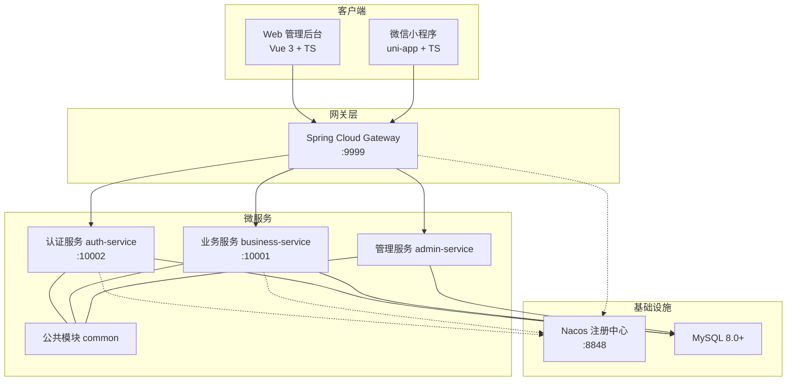
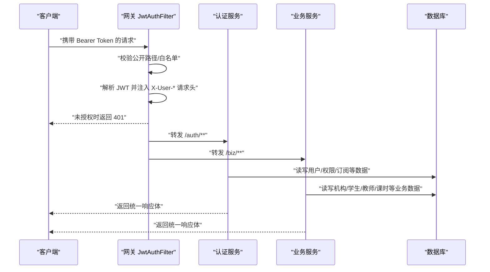
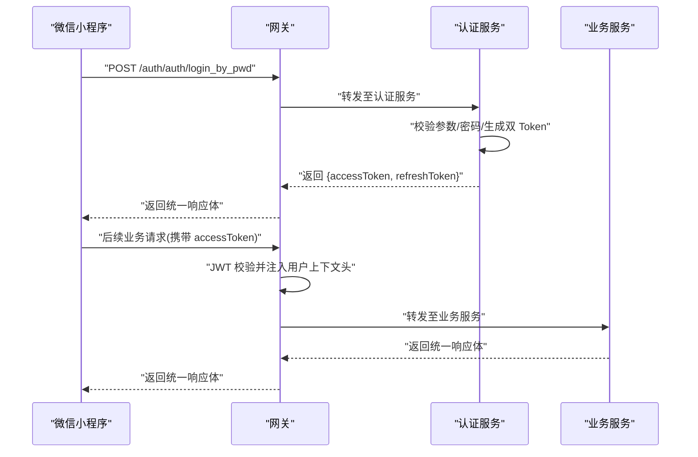
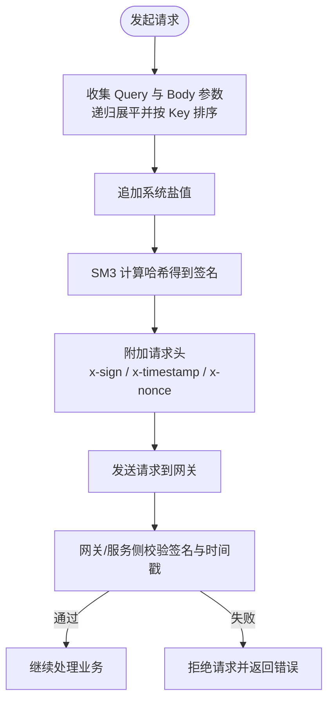
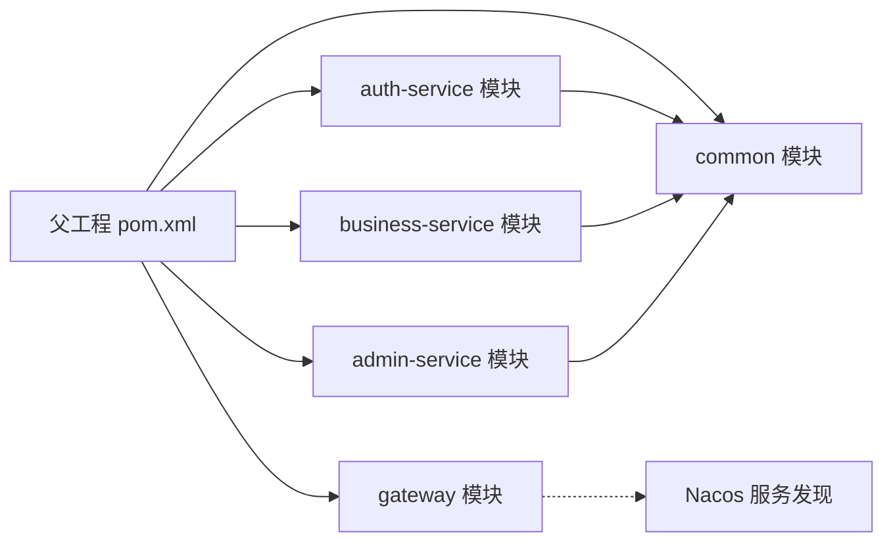

# 项目概述

<cite>
**本文引用的文件**
- [class_times_record_back/docs/architecture.md](file://class_times_record_back/docs/architecture.md)
- [class_times_record_back/pom.xml](file://class_times_record_back/pom.xml)
- [class_times_record_back/gateway/src/main/java/com/shiroko/gateway/filter/JwtAuthFilter.java](file://class_times_record_back/gateway/src/main/java/com/shiroko/gateway/filter/JwtAuthFilter.java)
- [class_times_record_back/auth-service/src/main/java/com/shiroko/controller/AuthController.java](file://class_times_record_back/auth-service/src/main/java/com/shiroko/controller/AuthController.java)
- [class_times_record_back/common/src/main/java/com/shiroko/util/Sm2Util.java](file://class_times_record_back/common/src/main/java/com/shiroko/util/Sm2Util.java)
- [class_record_admin_front/README.md](file://class_record_admin_front/README.md)
- [class_times_record/README.md](file://class_times_record/README.md)
</cite>

## 目录
1. [引言](#引言)
2. [项目结构](#项目结构)
3. [核心组件](#核心组件)
4. [架构总览](#架构总览)
5. [详细组件分析](#详细组件分析)
6. [依赖关系分析](#依赖关系分析)
7. [性能与扩展性](#性能与扩展性)
8. [故障排查指南](#故障排查指南)
9. [结论](#结论)
10. [附录](#附录)

## 引言
本项目为面向教育培训机构的课时管理系统，提供“Web管理后台 + 微信小程序”双端应用，覆盖管理员、教师、家长、学生等多角色场景。系统采用 Spring Cloud Alibaba 微服务架构，通过网关统一入口、认证授权与业务服务分离的设计，实现高内聚、低耦合的可扩展体系。安全方面引入国密算法（SM2/SM3）构建端到端的安全通道与请求签名校验，结合 JWT 双 Token 机制保障会话安全与无感刷新。

本概述旨在帮助初学者快速理解整体设计思路，同时为有经验的开发者提供技术决策背景与落地细节。

## 项目结构
仓库包含前后端多模块：
- 后端微服务：gateway、auth-service、business-service、admin-service、common
- Web 管理后台：class_record_admin_front（Vue 3 + Element Plus + TypeScript）
- 微信小程序前端：class_times_record（uni-app + TypeScript）
- 文档与配置：architecture.md、pom.xml 等



图表来源
- [class_times_record_back/docs/architecture.md:1-644](file://class_times_record_back/docs/architecture.md#L1-L644)
- [class_times_record_back/pom.xml:1-162](file://class_times_record_back/pom.xml#L1-L162)

章节来源
- [class_times_record_back/docs/architecture.md:1-644](file://class_times_record_back/docs/architecture.md#L1-L644)
- [class_times_record_back/pom.xml:1-162](file://class_times_record_back/pom.xml#L1-L162)

## 核心组件
- 网关（Gateway）
  - 统一入口、路由分发、JWT 校验、公开路径放行、注入用户上下文头
- 认证服务（auth-service）
  - 登录/注册、Token 签发与刷新、菜单与权限记录、微信绑定与订阅消息
- 业务服务（business-service）
  - 机构、学生、教师、班级、课程、排课、课程记录、课时记录等核心能力
- 管理服务（admin-service）
  - 系统管理（用户、角色、菜单、日志、配置）
- 公共模块（common）
  - 实体/DTO/VO、转换器、拦截器/过滤器、工具类、异常处理、AOP 切面等

章节来源
- [class_times_record_back/docs/architecture.md:265-324](file://class_times_record_back/docs/architecture.md#L265-L324)
- [class_times_record_back/docs/architecture.md:473-579](file://class_times_record_back/docs/architecture.md#L473-L579)

## 架构总览
系统采用两级防护与分层治理：
- 网关层进行全局鉴权与路由转发
- 服务层通过拦截器链完成二次校验、签名校验与上下文注入
- 数据持久化使用 MySQL，主键采用雪花算法，逻辑删除全局生效
- 支持虚拟线程提升 I/O 密集型场景吞吐



图表来源
- [class_times_record_back/gateway/src/main/java/com/shiroko/gateway/filter/JwtAuthFilter.java:1-101](file://class_times_record_back/gateway/src/main/java/com/shiroko/gateway/filter/JwtAuthFilter.java#L1-L101)
- [class_times_record_back/auth-service/src/main/java/com/shiroko/controller/AuthController.java:1-197](file://class_times_record_back/auth-service/src/main/java/com/shiroko/controller/AuthController.java#L1-L197)
- [class_times_record_back/docs/architecture.md:92-186](file://class_times_record_back/docs/architecture.md#L92-L186)

## 详细组件分析

### 网关与认证流程
- 全局过滤器在请求进入前执行，对公开路径放行，其余路径校验 Bearer Token，并将 userId、roleId、openId 注入到下游请求头
- 认证服务暴露登录、注册、刷新、绑定、订阅等接口，统一返回 ResponseDTO<T>
- 业务服务按领域划分控制器与服务，遵循 POST + @RequestBody 的接口风格



图表来源
- [class_times_record_back/gateway/src/main/java/com/shiroko/gateway/filter/JwtAuthFilter.java:28-94](file://class_times_record_back/gateway/src/main/java/com/shiroko/gateway/filter/JwtAuthFilter.java#L28-L94)
- [class_times_record_back/auth-service/src/main/java/com/shiroko/controller/AuthController.java:58-86](file://class_times_record_back/auth-service/src/main/java/com/shiroko/controller/AuthController.java#L58-L86)
- [class_times_record_back/docs/architecture.md:59-65](file://class_times_record_back/docs/architecture.md#L59-L65)

章节来源
- [class_times_record_back/gateway/src/main/java/com/shiroko/gateway/filter/JwtAuthFilter.java:1-101](file://class_times_record_back/gateway/src/main/java/com/shiroko/gateway/filter/JwtAuthFilter.java#L1-L101)
- [class_times_record_back/auth-service/src/main/java/com/shiroko/controller/AuthController.java:1-197](file://class_times_record_back/auth-service/src/main/java/com/shiroko/controller/AuthController.java#L1-L197)
- [class_times_record_back/docs/architecture.md:59-65](file://class_times_record_back/docs/architecture.md#L59-L65)

### 国密安全体系（SM2/SM3）
- SM2 非对称加密用于敏感数据传输（如密码），后端提供解密工具
- SM3 哈希用于请求签名校验与防重放，客户端附加 x-sign、x-timestamp、x-nonce 请求头
- 密钥管理通过配置文件注入，不同环境可独立配置



图表来源
- [class_times_record_back/docs/architecture.md:149-176](file://class_times_record_back/docs/architecture.md#L149-L176)
- [class_times_record_back/common/src/main/java/com/shiroko/util/Sm2Util.java:1-61](file://class_times_record_back/common/src/main/java/com/shiroko/util/Sm2Util.java#L1-L61)

章节来源
- [class_times_record_back/docs/architecture.md:149-176](file://class_times_record_back/docs/architecture.md#L149-L176)
- [class_times_record_back/common/src/main/java/com/shiroko/util/Sm2Util.java:1-61](file://class_times_record_back/common/src/main/java/com/shiroko/util/Sm2Util.java#L1-L61)

### 双端应用与角色能力
- Web 管理后台（Vue 3 + Element Plus + TS）
  - 系统管理：用户、角色、菜单、操作日志、系统配置
  - 业务管理：机构、学生、教师、课程、班级、排课、课程记录、课时记录、小程序菜单
- 微信小程序（uni-app + TS）
  - 教师端：学员管理、班级管理、课程管理、课时扣费、排课、教师管理、机构信息、扣课记录
  - 家长端：查看孩子课程、课时余额与扣课记录、编辑学生信息、订阅通知

章节来源
- [class_record_admin_front/README.md:1-127](file://class_record_admin_front/README.md#L1-L127)
- [class_times_record/README.md:1-127](file://class_times_record/README.md#L1-L127)

### 数据模型与关键约束
- 实体继承体系清晰，基础实体与领域实体分层明确
- 关键唯一约束保证业务一致性（如用户对同一课程记录的权限记录唯一、班级-学生关联唯一等）
- 主键策略采用雪花算法，趋势递增利于索引

```mermaid
erDiagram
USER ||--o{ TEACHER : "拥有"
USER ||--o{ PARENT : "拥有"
PARENT ||--o{ STUDENT : "关联"
CLASS ||--o{ STUDENT : "包含"
COURSE ||--o{ COURSE_RECORD : "被购买"
COURSE_RECORD ||--o{ RECORD : "产生课时变更"
TEACHER ||--o{ CLASS : "授课"
INSTITUTION ||--o{ TEACHER : "管理"
INSTITUTION ||--o{ STUDENT : "管理"
INSTITUTION ||--o{ COURSE : "管理"
```

图表来源
- [class_times_record_back/docs/architecture.md:328-421](file://class_times_record_back/docs/architecture.md#L328-L421)

章节来源
- [class_times_record_back/docs/architecture.md:328-421](file://class_times_record_back/docs/architecture.md#L328-L421)

## 依赖关系分析
- 模块聚合由父 POM 管理，统一版本与插件配置
- 各服务依赖 common 共享库，复用实体、转换器、拦截器、工具类等
- 网关依赖 Spring Cloud Gateway，服务间通过 Nacos 发现与负载均衡



图表来源
- [class_times_record_back/pom.xml:22-28](file://class_times_record_back/pom.xml#L22-L28)
- [class_times_record_back/pom.xml:48-104](file://class_times_record_back/pom.xml#L48-L104)

章节来源
- [class_times_record_back/pom.xml:1-162](file://class_times_record_back/pom.xml#L1-L162)

## 性能与扩展性
- 虚拟线程：JDK 21 虚拟线程降低 I/O 阻塞开销，适合数据库查询与外部 API 调用
- 限流熔断：Sentinel 提供流量控制与降级能力
- 逻辑删除与雪花主键：简化数据清理与分布式 ID 生成
- 统一响应与参数校验：减少异常分支与错误处理成本

章节来源
- [class_times_record_back/docs/architecture.md:234-263](file://class_times_record_back/docs/architecture.md#L234-L263)
- [class_times_record_back/docs/architecture.md:216-233](file://class_times_record_back/docs/architecture.md#L216-L233)

## 故障排查指南
- 认证失败
  - 检查网关是否放行公开路径；确认 Authorization 头格式与 Token 有效性
  - 关注网关过滤器抛出的未授权响应
- 签名校验失败
  - 核对 x-sign、x-timestamp、x-nonce 是否正确生成与传递
  - 确认服务端盐值与客户端一致，时间戳有效期满足要求
- 接口风格问题
  - 所有业务接口统一使用 POST + @RequestBody，避免 GET 导致签名或参数解析不一致
- 数据库异常
  - 统一异常处理器会捕获 SQL 异常并返回通用错误，需结合日志定位具体表与字段

章节来源
- [class_times_record_back/gateway/src/main/java/com/shiroko/gateway/filter/JwtAuthFilter.java:64-94](file://class_times_record_back/gateway/src/main/java/com/shiroko/gateway/filter/JwtAuthFilter.java#L64-L94)
- [class_times_record_back/docs/architecture.md:250-263](file://class_times_record_back/docs/architecture.md#L250-L263)

## 结论
本系统以微服务架构为核心，通过网关统一入口、认证与业务解耦、国密安全与双 Token 机制，构建了稳定、可扩展、安全的课时管理平台。前后端双端覆盖管理员、教师、家长、学生多角色，满足培训机构日常运营与管理需求。建议后续演进中完善中间表实体化、引入 Redis 防重放、API 版本管理与链路追踪，进一步提升可维护性与可观测性。

## 附录
- 部署顺序与端口说明详见架构文档
- 接口分组与示例路径参见 README 与架构文档

章节来源
- [class_times_record_back/docs/architecture.md:581-632](file://class_times_record_back/docs/architecture.md#L581-L632)
- [class_times_record/README.md:21-27](file://class_times_record/README.md#L21-L27)